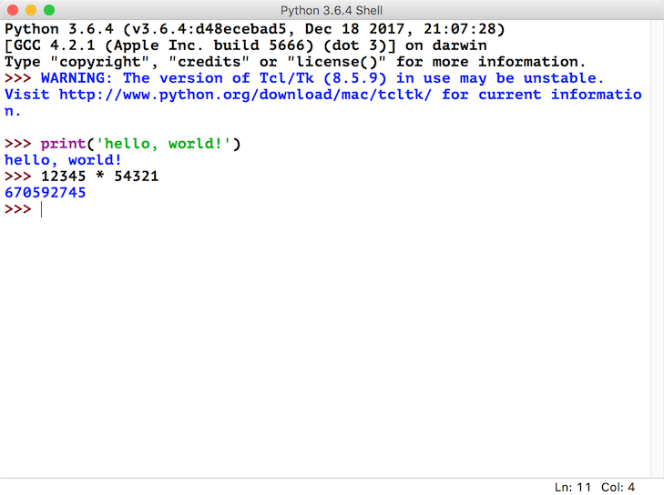

## 初識Python

### Python簡介

#### Python的歷史

1. 1989年聖誕節：Guido von Rossum開始寫Python語言的編譯器。
2. 1991年2月：第一個Python編譯器（同時也是解釋器）誕生，它是用C語言實現的（後面又出現了Java和C#實現的版本Jython和IronPython，以及PyPy、Brython、Pyston等其他實現），可以調用C語言的庫函數。在最早的版本中，Python已經提供了對“類”，“函數”，“異常處理”等構造塊的支持，同時提供了“列表”和“字典”等核心數據類型，同時支持以模塊為基礎來構造應用程序。
3. 1994年1月：Python 1.0正式發佈。
4. 2000年10月16日：Python 2.0發佈，增加了實現完整的[垃圾回收](https://zh.wikipedia.org/wiki/%E5%9E%83%E5%9C%BE%E5%9B%9E%E6%94%B6_(%E8%A8%88%E7%AE%97%E6%A9%9F%E7%A7%91%E5%AD%B8))，提供了對[Unicode](https://zh.wikipedia.org/wiki/Unicode)的支持。與此同時，Python的整個開發過程更加透明，社區對開發進度的影響逐漸擴大，生態圈開始慢慢形成。
5. 2008年12月3日：Python 3.0發佈，它並不完全兼容之前的Python代碼，不過因為目前還有不少公司在項目和運維中使用Python 2.x版本，所以Python 3.x的很多新特性後來也被移植到Python 2.6/2.7版本中。

目前我們使用的Python 3.7.x的版本是在2018年發佈的，Python的版本號分為三段，形如A.B.C。其中A表示大版本號，一般當整體重寫，或出現不向後兼容的改變時，增加A；B表示功能更新，出現新功能時增加B；C表示小的改動（例如：修復了某個Bug），只要有修改就增加C。如果對Python的歷史感興趣，可以閱讀名為[《Python簡史》](http://www.cnblogs.com/vamei/archive/2013/02/06/2892628.html)的博文。

#### Python的優缺點

Python的優點很多，簡單的可以總結為以下幾點。

1. 簡單和明確，做一件事只有一種方法。
2. 學習曲線低，跟其他很多語言相比，Python更容易上手。
3. 開放源代碼，擁有強大的社區和生態圈。
4. 解釋型語言，天生具有平臺可移植性。
5. 支持兩種主流的編程範式（面向對象編程和函數式編程）都提供了支持。
6. 可擴展性和可嵌入性，可以調用C/C++代碼，也可以在C/C++中調用Python。
7. 代碼規範程度高，可讀性強，適合有代碼潔癖和強迫症的人群。

Python的缺點主要集中在以下幾點。

1. 執行效率稍低，因此計算密集型任務可以由C/C++編寫。
2. 代碼無法加密，但是現在很多公司都不銷售賣軟件而是銷售服務，這個問題會被淡化。
3. 在開發時可以選擇的框架太多（如Web框架就有100多個），有選擇的地方就有錯誤。

#### Python的應用領域

目前Python在Web應用開發、雲基礎設施、DevOps、網絡爬蟲開發、數據分析挖掘、機器學習等領域都有著廣泛的應用，因此也產生了Web後端開發、數據接口開發、自動化運維、自動化測試、科學計算和可視化、數據分析、量化交易、機器人開發、圖像識別和處理等一系列的職位。

### 搭建編程環境

#### Windows環境

可以在[Python官方網站](https://www.python.org)下載到Python的Windows安裝程序（exe文件），需要注意的是如果在Windows 7環境下安裝Python 3.x，需要先安裝Service Pack 1補丁包（可以通過一些工具軟件自動安裝系統補丁的功能來安裝），安裝過程建議勾選“Add Python 3.x to PATH”（將Python 3.x添加到PATH環境變量）並選擇自定義安裝，在設置“Optional Features”界面最好將“pip”、“tcl/tk”、“Python test suite”等項全部勾選上。強烈建議選擇自定義的安裝路徑並保證路徑中沒有中文。安裝完成會看到“Setup was successful”的提示。如果稍後運行Python程序時，出現因為缺失一些動態鏈接庫文件而導致Python解釋器無法工作的問題，可以按照下面的方法加以解決。

如果系統顯示api-ms-win-crt\*.dll文件缺失，可以參照[《api-ms-win-crt\*.dll缺失原因分析和解決方法》](<https://zhuanlan.zhihu.com/p/32087135>)一文講解的方法進行處理或者直接在[微軟官網](https://www.microsoft.com/zh-cn/download/details.aspx?id=48145)下載Visual C++ Redistributable for Visual Studio 2015文件進行修復；如果是因為更新Windows的DirectX之後導致某些動態鏈接庫文件缺失問題，可以下載一個[DirectX修復工具](<https://dl.pconline.com.cn/download/360074-1.html>)進行修復。

#### Linux環境

Linux環境自帶了Python 2.x版本，但是如果要更新到3.x的版本，可以在[Python的官方網站](https://www.python.org)下載Python的源代碼並通過源代碼構建安裝的方式進行安裝，具體的步驟如下所示。

安裝依賴庫（因為沒有這些依賴庫可能在源代碼構件安裝時因為缺失底層依賴庫而失敗）。

```Shell
yum -y install wget gcc zlib-devel bzip2-devel openssl-devel ncurses-devel sqlite-devel readline-devel tk-devel gdbm-devel db4-devel libpcap-devel xz-devel libffi-devel
```

下載Python源代碼並解壓縮到指定目錄。

```Shell
wget https://www.python.org/ftp/python/3.7.3/Python-3.7.3.tgz
xz -d Python-3.7.3.tar.xz
tar -xvf Python-3.7.3.tar
```

切換至Python源代碼目錄並執行下面的命令進行配置和安裝。

```Shell
cd Python-3.7.3
./configure --prefix=/usr/local/python37 --enable-optimizations
make && make install
```

修改用戶主目錄下名為.bash_profile的文件，配置PATH環境變量並使其生效。

```Shell
cd ~
vim .bash_profile
```

```Shell
# ... 此處省略上面的代碼 ...

export PATH=$PATH:/usr/local/python37/bin

# ... 此處省略下面的代碼 ...
```

激活環境變量。

```Shell
source .bash_profile
```

#### macOS環境

macOS也自帶了Python 2.x版本，可以通過[Python的官方網站](https://www.python.org)提供的安裝文件（pkg文件）安裝Python 3.x的版本。默認安裝完成後，可以通過在終端執行python命令來啟動2.x版本的Python解釋器，可以通過執行python3命令來啟動3.x版本的Python解釋器。

### 從終端運行Python程序

#### 確認Python的版本

可以Windows的命令行提示符中鍵入下面的命令。

```Shell
python --version
```
或者是在Linux或macOS系統的終端中鍵入下面的命令。

```Shell
python3 --version
```

當然也可以先輸入python或python3進入交互式環境，再執行以下的代碼檢查Python的版本。

```Python
import sys

print(sys.version_info)
print(sys.version)
```

#### 編寫Python源代碼

可以用文本編輯工具（推薦使用[Sublime](<https://www.sublimetext.com/>)、[Atom](<https://atom.io/>)、[Visual Studio Code](<https://code.visualstudio.com/>)等高級文本編輯工具）編寫Python源代碼並用py作為後綴名保存該文件，代碼內容如下所示。

```Python
print('hello, world!')
```

#### 運行程序

切換到源代碼所在的目錄並執行下面的命令，看看屏幕上是否輸出了"hello, world!"。

```Shell
python hello.py
```

或

```Shell
python3 hello.py
```

### 代碼中的註釋

註釋是編程語言的一個重要組成部分，用於在源代碼中解釋代碼的作用從而增強程序的可讀性和可維護性，當然也可以將源代碼中不需要參與運行的代碼段通過註釋來去掉，這一點在調試程序的時候經常用到。註釋在隨源代碼進入預處理器或編譯時會被移除，不會在目標代碼中保留也不會影響程序的執行結果。

1. 單行註釋 - 以#和空格開頭的部分
2. 多行註釋 - 三個引號開頭，三個引號結尾

```Python
"""
第一個Python程序 - hello, world!
向偉大的Dennis M. Ritchie先生致敬

Version: 0.1
Author: 駱昊
"""

print('hello, world!')
# print("你好,世界！")
print('你好', '世界')
print('hello', 'world', sep=', ', end='!')
print('goodbye, world', end='!\n')
```

### 其他工具介紹

#### IDLE - 自帶的集成開發工具

IDLE是安裝Python環境時自帶的集成開發工具，如下圖所示。但是由於IDLE的用戶體驗並不是那麼好所以很少在實際開發中被採用。



#### IPython - 更好的交互式編程工具

IPython是一種基於Python的交互式解釋器。相較於原生的Python交互式環境，IPython提供了更為強大的編輯和交互功能。可以通過Python的包管理工具pip安裝IPython和Jupyter，具體的操作如下所示。

```Shell
pip install ipython
```

或

```Shell
pip3 install ipython
```

安裝成功後，可以通過下面的ipython命令啟動IPython，如下圖所示。


當然，我們也可以通過安裝Jupyter工具並運行名為notebook的程序在瀏覽器窗口中進行交互式代碼編寫操作。

```Shell
pip install jupyter
```

或

```Shell
pip3 intall jupyter
```

然後執行下面的命令：

```Shell
jupyter notebook
```


#### Sublime / Visual Studio Code - 高級文本編輯器


- 首先可以通過[官方網站](https://www.sublimetext.com/)下載安裝程序安裝Sublime 3或Sublime 2。

- 安裝包管理工具。
  1. 通過快捷鍵Ctrl+`或者在View菜單中選擇Show Console打開控制檯，輸入下面的代碼。

  - Sublime 3

  ```Python
  import  urllib.request,os;pf='Package Control.sublime-package';ipp=sublime.installed_packages_path();urllib.request.install_opener(urllib.request.build_opener(urllib.request.ProxyHandler()));open(os.path.join(ipp,pf),'wb').write(urllib.request.urlopen('http://sublime.wbond.net/'+pf.replace(' ','%20')).read())
  ```
  - Sublime 2

  ```Python
  import  urllib2,os;pf='Package Control.sublime-package';ipp=sublime.installed_packages_path();os.makedirs(ipp)ifnotos.path.exists(ipp)elseNone;urllib2.install_opener(urllib2.build_opener(urllib2.ProxyHandler()));open(os.path.join(ipp,pf),'wb').write(urllib2.urlopen('http://sublime.wbond.net/'+pf.replace(' ','%20')).read());print('Please restart Sublime Text to finish installation')
  ```
  2. 手動安裝瀏覽器輸入  https://sublime.wbond.net/Package%20Control.sublime-package 下載這個文件
  下載好以後，打開sublime text，選擇菜單Preferences->Browse Packages... 打開安裝目錄
  此時會進入到一個叫做Packages的目錄下，點擊進入上一層目錄Sublime Text3，在此目錄下有一個文件夾叫做Installed Packages，把剛才下載的文件放到這裡就可以了。然後重啟sublime text3，觀察Preferences菜單最下邊是否有Package Settings 和Package Control兩個選項，如果有，則代表安裝成功了。


- 安裝插件。通過Preference菜單的Package Control或快捷鍵Ctrl+Shift+P打開命令面板，在面板中輸入Install Package就可以找到安裝插件的工具，然後再查找需要的插件。我們推薦大家安裝以下幾個插件：

  - SublimeCodeIntel - 代碼自動補全工具插件。
  - Emmet - 前端開發代碼模板插件。
  - Git - 版本控制工具插件。
  - Python PEP8 Autoformat - PEP8規範自動格式化插件。
  - ConvertToUTF8 - 將本地編碼轉換為UTF-8。

> 說明：事實上Visual Studio Code可能是更好的選擇，它不用花錢並提供了更為完整和強大的功能，有興趣的讀者可以自行研究。

#### PyCharm - Python開發神器

PyCharm的安裝、配置和使用在[《玩轉PyCharm》](../玩轉PyCharm.md)進行了介紹，有興趣的讀者可以選擇閱讀。


### 練習

1. 在Python交互環境中查看下面的代碼結果，並試著將這些內容翻譯成中文。

    ```Python
    import this
    ```

    > 說明：當前鍵入上面的命令後會在交互式環境中看到如下所示的輸出，這段內容被稱為“Python之禪”，裡面講述的道理不僅僅適用於Python，也適用於其他編程語言。
    >

2. 學習使用turtle在屏幕上繪製圖形。

    > 說明：turtle是Python內置的一個非常有趣的模塊，特別適用於讓小朋友體會什麼是編程，它最早是Logo語言的一部分，Logo語言是Wally Feurzig和Seymour Papert在1966發明的編程語言.

    ```Python
    import turtle
    
    turtle.pensize(4)
    turtle.pencolor('red')
    turtle.forward(100)
    turtle.right(90)
    turtle.forward(100)
    turtle.right(90)
    turtle.forward(100)
    turtle.right(90)
    turtle.forward(100)
    turtle.mainloop()
    ```
