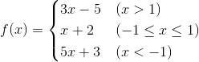

## 分支結構

### 應用場景

迄今為止，我們寫的Python代碼都是一條一條語句順序執行，這種代碼結構通常稱之為順序結構。然而僅有順序結構並不能解決所有的問題，比如我們設計一個遊戲，遊戲第一關的通關條件是玩家獲得1000分，那麼在完成本局遊戲後，我們要根據玩家得到分數來決定究竟是進入第二關，還是告訴玩家“Game Over”，這裡就會產生兩個分支，而且這兩個分支只有一個會被執行。類似的場景還有很多，我們將這種結構稱之為“分支結構”或“選擇結構”。給大家一分鐘的時間，你應該可以想到至少5個以上這樣的例子，趕緊試一試。

### if語句的使用

在Python中，要構造分支結構可以使用`if`、`elif`和`else`關鍵字。所謂**關鍵字**就是有特殊含義的單詞，像`if`和`else`就是專門用於構造分支結構的關鍵字，很顯然你不能夠使用它作為變量名（事實上，用作其他的標識符也是不可以）。下面的例子中演示瞭如何構造一個分支結構。

```Python
"""
用戶身份驗證

Version: 0.1
Author: 駱昊
"""

username = input('請輸入用戶名: ')
password = input('請輸入口令: ')
# 如果希望輸入口令時 終端中沒有回顯 可以使用getpass模塊的getpass函數
# import getpass
# password = getpass.getpass('請輸入口令: ')
if username == 'admin' and password == '123456':
    print('身份驗證成功!')
else:
    print('身份驗證失敗!')
```

唯一需要說明的是和C/C++、Java等語言不同，Python中沒有用花括號來構造代碼塊而是使用了縮進的方式來設置代碼的層次結構，如果`if`條件成立的情況下需要執行多條語句，只要保持多條語句具有相同的縮進就可以了，換句話說連續的代碼如果又保持了相同的縮進那麼它們屬於同一個代碼塊，相當於是一個執行的整體。

當然如果要構造出更多的分支，可以使用`if…elif…else…`結構，例如下面的分段函數求值。



```Python
"""
分段函數求值

        3x - 5  (x > 1)
f(x) =  x + 2   (-1 <= x <= 1)
        5x + 3  (x < -1)

Version: 0.1
Author: 駱昊
"""

x = float(input('x = '))
if x > 1:
    y = 3 * x - 5
elif x >= -1:
    y = x + 2
else:
    y = 5 * x + 3
print('f(%.2f) = %.2f' % (x, y))
```

當然根據實際開發的需要，分支結構是可以嵌套的，例如判斷是否通關以後還要根據你獲得的寶物或者道具的數量對你的表現給出等級（比如點亮兩顆或三顆星星），那麼我們就需要在`if`的內部構造出一個新的分支結構，同理`elif`和`else`中也可以再構造新的分支，我們稱之為嵌套的分支結構，也就是說上面的代碼也可以寫成下面的樣子。

```Python
"""
分段函數求值
		3x - 5	(x > 1)
f(x) =	x + 2	(-1 <= x <= 1)
		5x + 3	(x < -1)

Version: 0.1
Author: 駱昊
"""

x = float(input('x = '))
if x > 1:
    y = 3 * x - 5
else:
    if x >= -1:
        y = x + 2
    else:
        y = 5 * x + 3
print('f(%.2f) = %.2f' % (x, y))
```

> **說明：** 大家可以自己感受一下這兩種寫法到底是哪一種更好。在之前我們提到的Python之禪中有這麼一句話“Flat is better than nested.”，之所以提倡代碼“扁平化”是因為嵌套結構的嵌套層次多了之後會嚴重的影響代碼的可讀性，所以能使用扁平化的結構時就不要使用嵌套。

### 練習

#### 練習1：英制單位與公制單位互換

```Python
"""
英制單位英寸和公制單位釐米互換

Version: 0.1
Author: 駱昊
"""

value = float(input('請輸入長度: '))
unit = input('請輸入單位: ')
if unit == 'in' or unit == '英寸':
    print('%f英寸 = %f釐米' % (value, value * 2.54))
elif unit == 'cm' or unit == '釐米':
    print('%f釐米 = %f英寸' % (value, value / 2.54))
else:
    print('請輸入有效的單位')
```

#### 練習2：擲骰子決定做什麼

```Python
"""
擲骰子決定做什麼事情

Version: 0.1
Author: 駱昊
"""

from random import randint

face = randint(1, 6)
if face == 1:
    result = '唱首歌'
elif face == 2:
    result = '跳個舞'
elif face == 3:
    result = '學狗叫'
elif face == 4:
    result = '做俯臥撐'
elif face == 5:
    result = '念繞口令'
else:
    result = '講冷笑話'
print(result)
```
> **說明：** 上面的代碼中使用了random模塊的randint函數生成指定範圍的隨機數來模擬擲骰子。

#### 練習3：百分制成績轉等級制

```Python
"""
百分制成績轉等級製成績
90分以上    --> A
80分~89分    --> B
70分~79分	   --> C
60分~69分    --> D
60分以下    --> E

Version: 0.1
Author: 駱昊
"""

score = float(input('請輸入成績: '))
if score >= 90:
    grade = 'A'
elif score >= 80:
    grade = 'B'
elif score >= 70:
    grade = 'C'
elif score >= 60:
    grade = 'D'
else:
    grade = 'E'
print('對應的等級是:', grade)
```
#### 練習4：輸入三條邊長如果能構成三角形就計算周長和麵積

```Python
"""
判斷輸入的邊長能否構成三角形
如果能則計算出三角形的周長和麵積

Version: 0.1
Author: 駱昊
"""

import math

a = float(input('a = '))
b = float(input('b = '))
c = float(input('c = '))
if a + b > c and a + c > b and b + c > a:
    print('周長: %f' % (a + b + c))
    p = (a + b + c) / 2
    area = math.sqrt(p * (p - a) * (p - b) * (p - c))
    print('面積: %f' % (area))
else:
    print('不能構成三角形')
```
> **說明：** 上面的代碼中使用了`math`模塊的`sqrt`函數來計算平方根。用邊長計算三角形面積的公式叫做[海倫公式](https://zh.wikipedia.org/zh-hans/海倫公式)。

#### 練習5：個人所得稅計算器。

```Python
"""
輸入月收入和五險一金計算個人所得稅

Version: 0.1
Author: 駱昊
"""

salary = float(input('本月收入: '))
insurance = float(input('五險一金: '))
diff = salary - insurance - 3500
if diff <= 0:
    rate = 0
    deduction = 0
elif diff < 1500:
    rate = 0.03
    deduction = 0
elif diff < 4500:
    rate = 0.1
    deduction = 105
elif diff < 9000:
    rate = 0.2
    deduction = 555
elif diff < 35000:
    rate = 0.25
    deduction = 1005
elif diff < 55000:
    rate = 0.3
    deduction = 2755
elif diff < 80000:
    rate = 0.35
    deduction = 5505
else:
    rate = 0.45
    deduction = 13505
tax = abs(diff * rate - deduction)
print('個人所得稅: ￥%.2f元' % tax)
print('實際到手收入: ￥%.2f元' % (diff + 3500 - tax))
```
>**說明：** 上面的代碼中使用了Python內置的`abs()`函數取絕對值來處理`-0`的問題。
