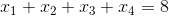
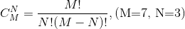

## 函數和模塊的使用

在講解本章節的內容之前，我們先來研究一道數學題，請說出下面的方程有多少組正整數解。



事實上，上面的問題等同於將8個蘋果分成四組每組至少一個蘋果有多少種方案。想到這一點問題的答案就呼之欲出了。



可以用Python的程序來計算出這個值，代碼如下所示。

```Python
"""
輸入M和N計算C(M,N)
"""

m = int(input('m = '))
n = int(input('n = '))
fm = 1
for num in range(1, m + 1):
    fm *= num
fn = 1
for num in range(1, n + 1):
    fn *= num
fmn = 1
for num in range(1, m - n + 1):
    fmn *= num
print(fm // fn // fmn)
```

### 函數的作用

不知道大家是否注意到，在上面的代碼中，我們做了3次求階乘，這樣的代碼實際上就是重複代碼。編程大師*Martin Fowler*先生曾經說過：“**代碼有很多種壞味道，重複是最壞的一種！**”，要寫出高質量的代碼首先要解決的就是重複代碼的問題。對於上面的代碼來說，我們可以將計算階乘的功能封裝到一個稱之為“函數”的功能模塊中，在需要計算階乘的地方，我們只需要“調用”這個“函數”就可以了。

### 定義函數

在Python中可以使用`def`關鍵字來定義函數，和變量一樣每個函數也有一個響亮的名字，而且命名規則跟變量的命名規則是一致的。在函數名後面的圓括號中可以放置傳遞給函數的參數，這一點和數學上的函數非常相似，程序中函數的參數就相當於是數學上說的函數的自變量，而函數執行完成後我們可以通過`return`關鍵字來返回一個值，這相當於數學上說的函數的因變量。

在瞭解瞭如何定義函數後，我們可以對上面的代碼進行重構，所謂重構就是在不影響代碼執行結果的前提下對代碼的結構進行調整，重構之後的代碼如下所示。

```Python
def factorial(num):
    """
    求階乘
    
    :param num: 非負整數
    :return: num的階乘
    """
    result = 1
    for n in range(1, num + 1):
        result *= n
    return result


m = int(input('m = '))
n = int(input('n = '))
# 當需要計算階乘的時候不用再寫循環求階乘而是直接調用已經定義好的函數
print(factorial(m) // factorial(n) // factorial(m - n))
```

> **說明：** Python的math模塊中其實已經有一個factorial函數了，事實上要計算階乘可以直接使用這個現成的函數而不用自己定義。下面例子中的某些函數其實Python中也是內置了，我們這裡是為了講解函數的定義和使用才把它們又實現了一遍，實際開發中不建議做這種低級的重複性的工作。


### 函數的參數

函數是絕大多數編程語言中都支持的一個代碼的“構建塊”，但是Python中的函數與其他語言中的函數還是有很多不太相同的地方，其中一個顯著的區別就是Python對函數參數的處理。在Python中，函數的參數可以有默認值，也支持使用可變參數，所以Python並不需要像其他語言一樣支持[函數的重載](https://zh.wikipedia.org/wiki/%E5%87%BD%E6%95%B0%E9%87%8D%E8%BD%BD)，因為我們在定義一個函數的時候可以讓它有多種不同的使用方式，下面是兩個小例子。

```Python
from random import randint


def roll_dice(n=2):
    """
    搖色子
    
    :param n: 色子的個數
    :return: n顆色子點數之和
    """
    total = 0
    for _ in range(n):
        total += randint(1, 6)
    return total


def add(a=0, b=0, c=0):
    return a + b + c


# 如果沒有指定參數那麼使用默認值搖兩顆色子
print(roll_dice())
# 搖三顆色子
print(roll_dice(3))
print(add())
print(add(1))
print(add(1, 2))
print(add(1, 2, 3))
# 傳遞參數時可以不按照設定的順序進行傳遞
print(add(c=50, a=100, b=200))
```

我們給上面兩個函數的參數都設定了默認值，這也就意味著如果在調用函數的時候如果沒有傳入對應參數的值時將使用該參數的默認值，所以在上面的代碼中我們可以用各種不同的方式去調用`add`函數，這跟其他很多語言中函數重載的效果是一致的。

其實上面的`add`函數還有更好的實現方案，因為我們可能會對0個或多個參數進行加法運算，而具體有多少個參數是由調用者來決定，我們作為函數的設計者對這一點是一無所知的，因此在不確定參數個數的時候，我們可以使用可變參數，代碼如下所示。

```Python
# 在參數名前面的*表示args是一個可變參數
# 即在調用add函數時可以傳入0個或多個參數
def add(*args):
    total = 0
    for val in args:
        total += val
    return total


print(add())
print(add(1))
print(add(1, 2))
print(add(1, 2, 3))
print(add(1, 3, 5, 7, 9))
```

### 用模塊管理函數

對於任何一種編程語言來說，給變量、函數這樣的標識符起名字都是一個讓人頭疼的問題，因為我們會遇到命名衝突這種尷尬的情況。最簡單的場景就是在同一個.py文件中定義了兩個同名函數，由於Python沒有函數重載的概念，那麼後面的定義會覆蓋之前的定義，也就意味著兩個函數同名函數實際上只有一個是存在的。

```Python
def foo():
    print('hello, world!')


def foo():
    print('goodbye, world!')


# 下面的代碼會輸出什麼呢？
foo()
```

當然上面的這種情況我們很容易就能避免，但是如果項目是由多人協作進行團隊開發的時候，團隊中可能有多個程序員都定義了名為`foo`的函數，那麼怎麼解決這種命名衝突呢？答案其實很簡單，Python中每個文件就代表了一個模塊（module），我們在不同的模塊中可以有同名的函數，在使用函數的時候我們通過`import`關鍵字導入指定的模塊就可以區分到底要使用的是哪個模塊中的`foo`函數，代碼如下所示。

module1.py

```Python
def foo():
    print('hello, world!')
```

module2.py

```Python
def foo():
    print('goodbye, world!')
```

test.py

```Python
from module1 import foo

# 輸出hello, world!
foo()

from module2 import foo

# 輸出goodbye, world!
foo()
```

也可以按照如下所示的方式來區分到底要使用哪一個`foo`函數。

test.py

```Python
import module1 as m1
import module2 as m2

m1.foo()
m2.foo()
```

但是如果將代碼寫成了下面的樣子，那麼程序中調用的是最後導入的那個`foo`，因為後導入的foo覆蓋了之前導入的`foo`。

test.py

```Python
from module1 import foo
from module2 import foo

# 輸出goodbye, world!
foo()
```

test.py

```Python
from module2 import foo
from module1 import foo

# 輸出hello, world!
foo()
```

需要說明的是，如果我們導入的模塊除了定義函數之外還中有可以執行代碼，那麼Python解釋器在導入這個模塊時就會執行這些代碼，事實上我們可能並不希望如此，因此如果我們在模塊中編寫了執行代碼，最好是將這些執行代碼放入如下所示的條件中，這樣的話除非直接運行該模塊，if條件下的這些代碼是不會執行的，因為只有直接執行的模塊的名字才是“\_\_main\_\_”。

module3.py

```Python
def foo():
    pass


def bar():
    pass


# __name__是Python中一個隱含的變量它代表了模塊的名字
# 只有被Python解釋器直接執行的模塊的名字才是__main__
if __name__ == '__main__':
    print('call foo()')
    foo()
    print('call bar()')
    bar()
```

test.py

```Python
import module3

# 導入module3時 不會執行模塊中if條件成立時的代碼 因為模塊的名字是module3而不是__main__
```

### 練習

#### 練習1：實現計算求最大公約數和最小公倍數的函數。

```Python
def gcd(x, y):
    (x, y) = (y, x) if x > y else (x, y)
    for factor in range(x, 0, -1):
        if x % factor == 0 and y % factor == 0:
            return factor


def lcm(x, y):
    return x * y // gcd(x, y)
```

#### 練習2：實現判斷一個數是不是迴文數的函數。

```Python
def is_palindrome(num):
    temp = num
    total = 0
    while temp > 0:
        total = total * 10 + temp % 10
        temp //= 10
    return total == num
```

#### 練習3：實現判斷一個數是不是素數的函數。

```Python
def is_prime(num):
    for factor in range(2, num):
        if num % factor == 0:
            return False
    return True if num != 1 else False
```

#### 練習4：寫一個程序判斷輸入的正整數是不是迴文素數。

```Python
if __name__ == '__main__':
    num = int(input('請輸入正整數: '))
    if is_palindrome(num) and is_prime(num):
        print('%d是迴文素數' % num)
```

通過上面的程序可以看出，當我們將代碼中重複出現的和相對獨立的功能抽取成函數後，我們可以組合使用這些函數來解決更為複雜的問題，這也是我們為什麼要定義和使用函數的一個非常重要的原因。

最後，我們來討論一下Python中有關變量作用域的問題。

```Python
def foo():
    b = 'hello'

    def bar():  # Python中可以在函數內部再定義函數
        c = True
        print(a)
        print(b)
        print(c)

    bar()
    # print(c)  # NameError: name 'c' is not defined


if __name__ == '__main__':
    a = 100
    # print(b)  # NameError: name 'b' is not defined
    foo()
```

上面的代碼能夠順利的執行並且打印出100和“hello”，但我們注意到了，在`bar`函數的內部並沒有定義`a`和`b`兩個變量，那麼`a`和`b`是從哪裡來的。我們在上面代碼的`if`分支中定義了一個變量`a`，這是一個全局變量（global variable），屬於全局作用域，因為它沒有定義在任何一個函數中。在上面的`foo`函數中我們定義了變量`b`，這是一個定義在函數中的局部變量（local variable），屬於局部作用域，在`foo`函數的外部並不能訪問到它；但對於`foo`函數內部的`bar`函數來說，變量`b`屬於嵌套作用域，在`bar`函數中我們是可以訪問到它的。`bar`函數中的變量`c`屬於局部作用域，在`bar`函數之外是無法訪問的。事實上，Python查找一個變量時會按照“局部作用域”、“嵌套作用域”、“全局作用域”和“內置作用域”的順序進行搜索，前三者我們在上面的代碼中已經看到了，所謂的“內置作用域”就是Python內置的那些隱含標識符`min`、`len`等都屬於內置作用域）。

再看看下面這段代碼，我們希望通過函數調用修改全局變量`a`的值，但實際上下面的代碼是做不到的。

```Python
def foo():
    a = 200
    print(a)  # 200


if __name__ == '__main__':
    a = 100
    foo()
    print(a)  # 100
```

在調用`foo`函數後，我們發現`a`的值仍然是100，這是因為當我們在函數`foo`中寫`a = 200`的時候，是重新定義了一個名字為`a`的局部變量，它跟全局作用域的`a`並不是同一個變量，因為局部作用域中有了自己的變量`a`，因此`foo`函數不再搜索全局作用域中的`a`。如果我們希望在`foo`函數中修改全局作用域中的`a`，代碼如下所示。

```Python
def foo():
    global a
    a = 200
    print(a)  # 200


if __name__ == '__main__':
    a = 100
    foo()
    print(a)  # 200
```

我們可以使用`global`關鍵字來指示`foo`函數中的變量`a`來自於全局作用域，如果全局作用域中沒有`a`，那麼下面一行的代碼就會定義變量`a`並將其置於全局作用域。同理，如果我們希望函數內部的函數能夠修改嵌套作用域中的變量，可以使用`nonlocal`關鍵字來指示變量來自於嵌套作用域，請大家自行試驗。

在實際開發中，我們應該儘量減少對全局變量的使用，因為全局變量的作用域和影響過於廣泛，可能會發生意料之外的修改和使用，除此之外全局變量比局部變量擁有更長的生命週期，可能導致對象佔用的內存長時間無法被[垃圾回收](https://zh.wikipedia.org/wiki/%E5%9E%83%E5%9C%BE%E5%9B%9E%E6%94%B6_(%E8%A8%88%E7%AE%97%E6%A9%9F%E7%A7%91%E5%AD%B8))。事實上，減少對全局變量的使用，也是降低代碼之間耦合度的一個重要舉措，同時也是對[迪米特法則](https://zh.wikipedia.org/zh-hans/%E5%BE%97%E5%A2%A8%E5%BF%92%E8%80%B3%E5%AE%9A%E5%BE%8B)的踐行。減少全局變量的使用就意味著我們應該儘量讓變量的作用域在函數的內部，但是如果我們希望將一個局部變量的生命週期延長，使其在函數調用結束後依然可以訪問，這時候就需要使用[閉包](https://zh.wikipedia.org/wiki/%E9%97%AD%E5%8C%85_(%E8%AE%A1%E7%AE%97%E6%9C%BA%E7%A7%91%E5%AD%A6))，這個我們在後續的內容中進行講解。

> **說明：** 很多人經常會將“閉包”一詞和[“匿名函數”](https://zh.wikipedia.org/wiki/%E5%8C%BF%E5%90%8D%E5%87%BD%E6%95%B0)混為一談，但實際上它們是不同的概念，如果想提前瞭解這個概念，推薦看看[維基百科](https://zh.wikipedia.org/wiki/)或者[知乎](https://www.zhihu.com/)上對這個概念的討論。

說了那麼多，其實結論很簡單，從現在開始我們可以將Python代碼按照下面的格式進行書寫，這一點點的改進其實就是在我們理解了函數和作用域的基礎上跨出的巨大的一步。

```Python
def main():
    # Todo: Add your code here
    pass


if __name__ == '__main__':
    main()
```
