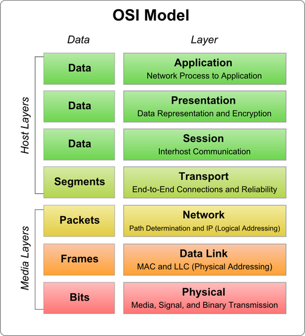

## 網絡編程入門

### 計算機網絡基礎

計算機網絡是獨立自主的計算機互聯而成的系統的總稱，組建計算機網絡最主要的目的是實現多臺計算機之間的通信和資源共享。今天計算機網絡中的設備和計算機網絡的用戶已經多得不可計數，而計算機網絡也可以稱得上是一個“複雜巨系統”，對於這樣的系統，我們不可能用一兩篇文章把它講清楚，有興趣的讀者可以自行閱讀Andrew S.Tanenbaum老師的經典之作《計算機網絡》或Kurose和Ross老師合著的《計算機網絡:自頂向下方法》來了解計算機網絡的相關知識。

#### 計算機網絡發展史

1. 1960s - 美國國防部ARPANET項目問世，奠定了分組交換網絡的基礎。

   

2. 1980s - 國際標準化組織（ISO）發佈OSI/RM，奠定了網絡技術標準化的基礎。

   

3. 1990s - 英國人[蒂姆·伯納斯-李](https://zh.wikipedia.org/wiki/%E6%8F%90%E5%A7%86%C2%B7%E6%9F%8F%E5%85%A7%E8%8C%B2-%E6%9D%8E)發明了圖形化的瀏覽器，瀏覽器的簡單易用性使得計算機網絡迅速被普及。

   在沒有瀏覽器的年代，上網是這樣的。

   

   有了瀏覽器以後，上網是這樣的。

   

#### TCP/IP模型

實現網絡通信的基礎是網絡通信協議，這些協議通常是由[互聯網工程任務組](https://zh.wikipedia.org/wiki/%E4%BA%92%E8%81%94%E7%BD%91%E5%B7%A5%E7%A8%8B%E4%BB%BB%E5%8A%A1%E7%BB%84) （IETF）制定的。所謂“協議”就是通信計算機雙方必須共同遵從的一組約定，例如怎樣建立連接、怎樣互相識別等，網絡協議的三要素是：語法、語義和時序。構成我們今天使用的Internet的基礎的是TCP/IP協議族，所謂協議族就是一系列的協議及其構成的通信模型，我們通常也把這套東西稱為TCP/IP模型。與國際標準化組織發佈的OSI/RM這個七層模型不同，TCP/IP是一個四層模型，也就是說，該模型將我們使用的網絡從邏輯上分解為四個層次，自底向上依次是：網絡接口層、網絡層、傳輸層和應用層，如下圖所示。


IP通常被翻譯為網際協議，它服務於網絡層，主要實現了尋址和路由的功能。接入網絡的每一臺主機都需要有自己的IP地址，IP地址就是主機在計算機網絡上的身份標識。當然由於IPv4地址的匱乏，我們平常在家裡、辦公室以及其他可以接入網絡的公共區域上網時獲得的IP地址並不是全球唯一的IP地址，而是一個[局域網（LAN）](https://zh.wikipedia.org/zh-hans/%E5%B1%80%E5%9F%9F%E7%BD%91)中的內部IP地址，通過[網絡地址轉換（NAT）服務](https://zh.wikipedia.org/wiki/%E7%BD%91%E7%BB%9C%E5%9C%B0%E5%9D%80%E8%BD%AC%E6%8D%A2)我們也可以實現對網絡的訪問。計算機網絡上有大量的被我們稱為“[路由器](https://zh.wikipedia.org/wiki/%E8%B7%AF%E7%94%B1%E5%99%A8)”的網絡中繼設備，它們會存儲轉發我們發送到網絡上的數據分組，讓從源頭髮出的數據最終能夠找到傳送到目的地通路，這項功能就是所謂的路由。

TCP全稱傳輸控制協議，它是基於IP提供的尋址和路由服務而建立起來的負責實現端到端可靠傳輸的協議，之所以將TCP稱為可靠的傳輸協議是因為TCP向調用者承諾了三件事情：

1. 數據不傳丟不傳錯（利用握手、校驗和重傳機制可以實現）。
2. 流量控制（通過滑動窗口匹配數據發送者和接收者之間的傳輸速度）。
3. 擁塞控制（通過RTT時間以及對滑動窗口的控制緩解網絡擁堵）。

#### 網絡應用模式

1. C/S模式和B/S模式。這裡的C指的是Client（客戶端），通常是一個需要安裝到某個宿主操作系統上的應用程序；而B指的是Browser（瀏覽器），它幾乎是所有圖形化操作系統都默認安裝了的一個應用軟件；通過C或B都可以實現對S（服務器）的訪問。關於二者的比較和討論在網絡上有一大堆的文章，在此我們就不再浪費筆墨了。
2. 去中心化的網絡應用模式。不管是B/S還是C/S都需要服務器的存在，服務器就是整個應用模式的中心，而去中心化的網絡應用通常沒有固定的服務器或者固定的客戶端，所有應用的使用者既可以作為資源的提供者也可以作為資源的訪問者。

### 基於HTTP協議的網絡資源訪問

#### HTTP（超文本傳輸協議）

HTTP是超文本傳輸協議（Hyper-Text Transfer Proctol）的簡稱，維基百科上對HTTP的解釋是：超文本傳輸協議是一種用於分佈式、協作式和超媒體信息系統的應用層協議，它是[萬維網](https://zh.wikipedia.org/wiki/%E5%85%A8%E7%90%83%E8%B3%87%E8%A8%8A%E7%B6%B2)數據通信的基礎，設計HTTP最初的目的是為了提供一種發佈和接收[HTML](https://zh.wikipedia.org/wiki/HTML)頁面的方法，通過HTTP或者[HTTPS](https://zh.wikipedia.org/wiki/%E8%B6%85%E6%96%87%E6%9C%AC%E4%BC%A0%E8%BE%93%E5%AE%89%E5%85%A8%E5%8D%8F%E8%AE%AE)（超文本傳輸安全協議）請求的資源由URI（[統一資源標識符](https://zh.wikipedia.org/wiki/%E7%B5%B1%E4%B8%80%E8%B3%87%E6%BA%90%E6%A8%99%E8%AD%98%E7%AC%A6)）來標識。關於HTTP的更多內容，我們推薦閱讀阮一峰老師的[《HTTP 協議入門》](http://www.ruanyifeng.com/blog/2016/08/http.html)，簡單的說，通過HTTP我們可以獲取網絡上的（基於字符的）資源，開發中經常會用到的網絡API（有的地方也稱之為網絡數據接口）就是基於HTTP來實現數據傳輸的。

#### JSON格式

**JSON**（**J**ava**S**cript **O**bject **N**otation）是一種輕量級的數據交換語言，該語言以易於讓人閱讀的文字（純文本）為基礎，用來傳輸由屬性值或者序列性的值組成的數據對象。儘管JSON是最初只是Javascript中一種創建對象的字面量語法，但它在當下更是一種獨立於語言的數據格式，很多編程語言都支持JSON格式數據的生成和解析，Python內置的json模塊也提供了這方面的功能。由於JSON是純文本，它和[XML](https://zh.wikipedia.org/wiki/XML)一樣都適用於異構系統之間的數據交換，而相較於XML，JSON顯得更加的輕便和優雅。下面是表達同樣信息的XML和JSON，而JSON的優勢是相當直觀的。

XML的例子：

```XML
<?xml version="1.0" encoding="UTF-8"?>
<message>
	<from>Alice</from>
	<to>Bob</to>
	<content>Will you marry me?</content>
</message>
```

JSON的例子：

```JSON
{
    "from": "Alice",
    "to": "Bob",
    "content": "Will you marry me?"
}
```

#### requests庫

requests是一個基於HTTP協議來使用網絡的第三庫，其[官方網站](http://cn.python-requests.org/zh_CN/latest/)有這樣的一句介紹它的話：“Requests是唯一的一個**非轉基因**的Python HTTP庫，人類可以安全享用。”簡單的說，使用requests庫可以非常方便的使用HTTP，避免安全缺陷、冗餘代碼以及“重複發明輪子”（行業黑話，通常用在軟件工程領域表示重新創造一個已有的或是早已被優化過的基本方法）。前面的文章中我們已經使用過這個庫，下面我們還是通過requests來實現一個訪問網絡數據接口並從中獲取美女圖片下載鏈接然後下載美女圖片到本地的例子程序，程序中使用了[天行數據](https://www.tianapi.com/)提供的網絡API。

我們可以先通過pip安裝requests及其依賴庫。

```Shell
pip install requests
```

如果使用PyCharm作為開發工具，可以直接在代碼中書寫`import requests`，然後通過代碼修復功能來自動下載安裝requests。

```Python
from time import time
from threading import Thread

import requests


# 繼承Thread類創建自定義的線程類
class DownloadHanlder(Thread):

    def __init__(self, url):
        super().__init__()
        self.url = url

    def run(self):
        filename = self.url[self.url.rfind('/') + 1:]
        resp = requests.get(self.url)
        with open('/Users/Hao/' + filename, 'wb') as f:
            f.write(resp.content)


def main():
    # 通過requests模塊的get函數獲取網絡資源
    # 下面的代碼中使用了天行數據接口提供的網絡API
    # 要使用該數據接口需要在天行數據的網站上註冊
    # 然後用自己的Key替換掉下面代碼的中APIKey即可
    resp = requests.get(
        'http://api.tianapi.com/meinv/?key=APIKey&num=10')
    # 將服務器返回的JSON格式的數據解析為字典
    data_model = resp.json()
    for mm_dict in data_model['newslist']:
        url = mm_dict['picUrl']
        # 通過多線程的方式實現圖片下載
        DownloadHanlder(url).start()


if __name__ == '__main__':
    main()
```

### 基於傳輸層協議的套接字編程

套接字這個詞對很多不瞭解網絡編程的人來說顯得非常晦澀和陌生，其實說得通俗點，套接字就是一套用[C語言](https://zh.wikipedia.org/wiki/C%E8%AF%AD%E8%A8%80)寫成的應用程序開發庫，主要用於實現進程間通信和網絡編程，在網絡應用開發中被廣泛使用。在Python中也可以基於套接字來使用傳輸層提供的傳輸服務，並基於此開發自己的網絡應用。實際開發中使用的套接字可以分為三類：流套接字（TCP套接字）、數據報套接字和原始套接字。

#### TCP套接字

所謂TCP套接字就是使用TCP協議提供的傳輸服務來實現網絡通信的編程接口。在Python中可以通過創建socket對象並指定type屬性為SOCK_STREAM來使用TCP套接字。由於一臺主機可能擁有多個IP地址，而且很有可能會配置多個不同的服務，所以作為服務器端的程序，需要在創建套接字對象後將其綁定到指定的IP地址和端口上。這裡的端口並不是物理設備而是對IP地址的擴展，用於區分不同的服務，例如我們通常將HTTP服務跟80端口綁定，而MySQL數據庫服務默認綁定在3306端口，這樣當服務器收到用戶請求時就可以根據端口號來確定到底用戶請求的是HTTP服務器還是數據庫服務器提供的服務。端口的取值範圍是0~65535，而1024以下的端口我們通常稱之為“著名端口”（留給像FTP、HTTP、SMTP等“著名服務”使用的端口，有的地方也稱之為“周知端口”），自定義的服務通常不使用這些端口，除非自定義的是HTTP或FTP這樣的著名服務。

下面的代碼實現了一個提供時間日期的服務器。

```Python
from socket import socket, SOCK_STREAM, AF_INET
from datetime import datetime


def main():
    # 1.創建套接字對象並指定使用哪種傳輸服務
    # family=AF_INET - IPv4地址
    # family=AF_INET6 - IPv6地址
    # type=SOCK_STREAM - TCP套接字
    # type=SOCK_DGRAM - UDP套接字
    # type=SOCK_RAW - 原始套接字
    server = socket(family=AF_INET, type=SOCK_STREAM)
    # 2.綁定IP地址和端口(端口用於區分不同的服務)
    # 同一時間在同一個端口上只能綁定一個服務否則報錯
    server.bind(('192.168.1.2', 6789))
    # 3.開啟監聽 - 監聽客戶端連接到服務器
    # 參數512可以理解為連接隊列的大小
    server.listen(512)
    print('服務器啟動開始監聽...')
    while True:
        # 4.通過循環接收客戶端的連接並作出相應的處理(提供服務)
        # accept方法是一個阻塞方法如果沒有客戶端連接到服務器代碼不會向下執行
        # accept方法返回一個元組其中的第一個元素是客戶端對象
        # 第二個元素是連接到服務器的客戶端的地址(由IP和端口兩部分構成)
        client, addr = server.accept()
        print(str(addr) + '連接到了服務器.')
        # 5.發送數據
        client.send(str(datetime.now()).encode('utf-8'))
        # 6.斷開連接
        client.close()


if __name__ == '__main__':
    main()
```

運行服務器程序後我們可以通過Windows系統的telnet來訪問該服務器，結果如下圖所示。

```Shell
telnet 192.168.1.2 6789
```


當然我們也可以通過Python的程序來實現TCP客戶端的功能，相較於實現服務器程序，實現客戶端程序就簡單多了，代碼如下所示。

```Python
from socket import socket


def main():
    # 1.創建套接字對象默認使用IPv4和TCP協議
    client = socket()
    # 2.連接到服務器(需要指定IP地址和端口)
    client.connect(('192.168.1.2', 6789))
    # 3.從服務器接收數據
    print(client.recv(1024).decode('utf-8'))
    client.close()


if __name__ == '__main__':
    main()
```

需要注意的是，上面的服務器並沒有使用多線程或者異步I/O的處理方式，這也就意味著當服務器與一個客戶端處於通信狀態時，其他的客戶端只能排隊等待。很顯然，這樣的服務器並不能滿足我們的需求，我們需要的服務器是能夠同時接納和處理多個用戶請求的。下面我們來設計一個使用多線程技術處理多個用戶請求的服務器，該服務器會向連接到服務器的客戶端發送一張圖片。

服務器端代碼：

```Python
from socket import socket, SOCK_STREAM, AF_INET
from base64 import b64encode
from json import dumps
from threading import Thread


def main():
    
    # 自定義線程類
    class FileTransferHandler(Thread):

        def __init__(self, cclient):
            super().__init__()
            self.cclient = cclient

        def run(self):
            my_dict = {}
            my_dict['filename'] = 'guido.jpg'
            # JSON是純文本不能攜帶二進制數據
            # 所以圖片的二進制數據要處理成base64編碼
            my_dict['filedata'] = data
            # 通過dumps函數將字典處理成JSON字符串
            json_str = dumps(my_dict)
            # 發送JSON字符串
            self.cclient.send(json_str.encode('utf-8'))
            self.cclient.close()

    # 1.創建套接字對象並指定使用哪種傳輸服務
    server = socket()
    # 2.綁定IP地址和端口(區分不同的服務)
    server.bind(('192.168.1.2', 5566))
    # 3.開啟監聽 - 監聽客戶端連接到服務器
    server.listen(512)
    print('服務器啟動開始監聽...')
    with open('guido.jpg', 'rb') as f:
        # 將二進制數據處理成base64再解碼成字符串
        data = b64encode(f.read()).decode('utf-8')
    while True:
        client, addr = server.accept()
        # 啟動一個線程來處理客戶端的請求
        FileTransferHandler(client).start()


if __name__ == '__main__':
    main()
```

客戶端代碼：

```Python
from socket import socket
from json import loads
from base64 import b64decode


def main():
    client = socket()
    client.connect(('192.168.1.2', 5566))
    # 定義一個保存二進制數據的對象
    in_data = bytes()
    # 由於不知道服務器發送的數據有多大每次接收1024字節
    data = client.recv(1024)
    while data:
        # 將收到的數據拼接起來
        in_data += data
        data = client.recv(1024)
    # 將收到的二進制數據解碼成JSON字符串並轉換成字典
    # loads函數的作用就是將JSON字符串轉成字典對象
    my_dict = loads(in_data.decode('utf-8'))
    filename = my_dict['filename']
    filedata = my_dict['filedata'].encode('utf-8')
    with open('/Users/Hao/' + filename, 'wb') as f:
        # 將base64格式的數據解碼成二進制數據並寫入文件
        f.write(b64decode(filedata))
    print('圖片已保存.')


if __name__ == '__main__':
    main()
```

在這個案例中，我們使用了JSON作為數據傳輸的格式（通過JSON格式對傳輸的數據進行了序列化和反序列化的操作），但是JSON並不能攜帶二進制數據，因此對圖片的二進制數據進行了Base64編碼的處理。Base64是一種用64個字符表示所有二進制數據的編碼方式，通過將二進制數據每6位一組的方式重新組織，剛好可以使用0~9的數字、大小寫字母以及“+”和“/”總共64個字符表示從`000000`到`111111`的64種狀態。[維基百科](https://zh.wikipedia.org/wiki/Base64)上有關於Base64編碼的詳細講解，不熟悉Base64的讀者可以自行閱讀。

> **說明：** 上面的代碼主要為了講解網絡編程的相關內容因此並沒有對異常狀況進行處理，請讀者自行添加異常處理代碼來增強程序的健壯性。

#### UDP套接字

傳輸層除了有可靠的傳輸協議TCP之外，還有一種非常輕便的傳輸協議叫做用戶數據報協議，簡稱UDP。TCP和UDP都是提供端到端傳輸服務的協議，二者的差別就如同打電話和發短信的區別，後者不對傳輸的可靠性和可達性做出任何承諾從而避免了TCP中握手和重傳的開銷，所以在強調性能和而不是數據完整性的場景中（例如傳輸網絡音視頻數據），UDP可能是更好的選擇。可能大家會注意到一個現象，就是在觀看網絡視頻時，有時會出現卡頓，有時會出現花屏，這無非就是部分數據傳丟或傳錯造成的。在Python中也可以使用UDP套接字來創建網絡應用，對此我們不進行贅述，有興趣的讀者可以自行研究。

### 網絡應用開發

#### 發送電子郵件

在即時通信軟件如此發達的今天，電子郵件仍然是互聯網上使用最為廣泛的應用之一，公司嚮應聘者發出錄用通知、網站向用戶發送一個激活賬號的鏈接、銀行向客戶推廣它們的理財產品等幾乎都是通過電子郵件來完成的，而這些任務應該都是由程序自動完成的。

就像我們可以用HTTP（超文本傳輸協議）來訪問一個網站一樣，發送郵件要使用SMTP（簡單郵件傳輸協議），SMTP也是一個建立在TCP（傳輸控制協議）提供的可靠數據傳輸服務的基礎上的應用級協議，它規定了郵件的發送者如何跟發送郵件的服務器進行通信的細節，而Python中的smtplib模塊將這些操作簡化成了幾個簡單的函數。

下面的代碼演示瞭如何在Python發送郵件。

```Python
from smtplib import SMTP
from email.header import Header
from email.mime.text import MIMEText


def main():
    # 請自行修改下面的郵件發送者和接收者
    sender = 'abcdefg@126.com'
    receivers = ['uvwxyz@qq.com', 'uvwxyz@126.com']
    message = MIMEText('用Python發送郵件的示例代碼.', 'plain', 'utf-8')
    message['From'] = Header('王大錘', 'utf-8')
    message['To'] = Header('駱昊', 'utf-8')
    message['Subject'] = Header('示例代碼實驗郵件', 'utf-8')
    smtper = SMTP('smtp.126.com')
    # 請自行修改下面的登錄口令
    smtper.login(sender, 'secretpass')
    smtper.sendmail(sender, receivers, message.as_string())
    print('郵件發送完成!')


if __name__ == '__main__':
    main()
```

如果要發送帶有附件的郵件，那麼可以按照下面的方式進行操作。

```Python
from smtplib import SMTP
from email.header import Header
from email.mime.text import MIMEText
from email.mime.image import MIMEImage
from email.mime.multipart import MIMEMultipart

import urllib


def main():
    # 創建一個帶附件的郵件消息對象
    message = MIMEMultipart()
    
    # 創建文本內容
    text_content = MIMEText('附件中有本月數據請查收', 'plain', 'utf-8')
    message['Subject'] = Header('本月數據', 'utf-8')
    # 將文本內容添加到郵件消息對象中
    message.attach(text_content)

    # 讀取文件並將文件作為附件添加到郵件消息對象中
    with open('/Users/Hao/Desktop/hello.txt', 'rb') as f:
        txt = MIMEText(f.read(), 'base64', 'utf-8')
        txt['Content-Type'] = 'text/plain'
        txt['Content-Disposition'] = 'attachment; filename=hello.txt'
        message.attach(txt)
    # 讀取文件並將文件作為附件添加到郵件消息對象中
    with open('/Users/Hao/Desktop/彙總數據.xlsx', 'rb') as f:
        xls = MIMEText(f.read(), 'base64', 'utf-8')
        xls['Content-Type'] = 'application/vnd.ms-excel'
        xls['Content-Disposition'] = 'attachment; filename=month-data.xlsx'
        message.attach(xls)
    
    # 創建SMTP對象
    smtper = SMTP('smtp.126.com')
    # 開啟安全連接
    # smtper.starttls()
    sender = 'abcdefg@126.com'
    receivers = ['uvwxyz@qq.com']
    # 登錄到SMTP服務器
    # 請注意此處不是使用密碼而是郵件客戶端授權碼進行登錄
    # 對此有疑問的讀者可以聯繫自己使用的郵件服務器客服
    smtper.login(sender, 'secretpass')
    # 發送郵件
    smtper.sendmail(sender, receivers, message.as_string())
    # 與郵件服務器斷開連接
    smtper.quit()
    print('發送完成!')


if __name__ == '__main__':
    main()
```

#### 發送短信

發送短信也是項目中常見的功能，網站的註冊碼、驗證碼、營銷信息基本上都是通過短信來發送給用戶的。在下面的代碼中我們使用了[互億無線](http://www.ihuyi.com/)短信平臺（該平臺為註冊用戶提供了50條免費短信以及常用開發語言發送短信的demo，可以登錄該網站並在用戶自服務頁面中對短信進行配置）提供的API接口實現了發送短信的服務，當然國內的短信平臺很多，讀者可以根據自己的需要進行選擇（通常會考慮費用預算、短信達到率、使用的難易程度等指標），如果需要在商業項目中使用短信服務建議購買短信平臺提供的套餐服務。

```Python
import urllib.parse
import http.client
import json


def main():
    host  = "106.ihuyi.com"
    sms_send_uri = "/webservice/sms.php?method=Submit"
    # 下面的參數需要填入自己註冊的賬號和對應的密碼
    params = urllib.parse.urlencode({'account': '你自己的賬號', 'password' : '你自己的密碼', 'content': '您的驗證碼是：147258。請不要把驗證碼洩露給其他人。', 'mobile': '接收者的手機號', 'format':'json' })
    print(params)
    headers = {'Content-type': 'application/x-www-form-urlencoded', 'Accept': 'text/plain'}
    conn = http.client.HTTPConnection(host, port=80, timeout=30)
    conn.request('POST', sms_send_uri, params, headers)
    response = conn.getresponse()
    response_str = response.read()
    jsonstr = response_str.decode('utf-8')
    print(json.loads(jsonstr))
    conn.close()


if __name__ == '__main__':
    main()
```