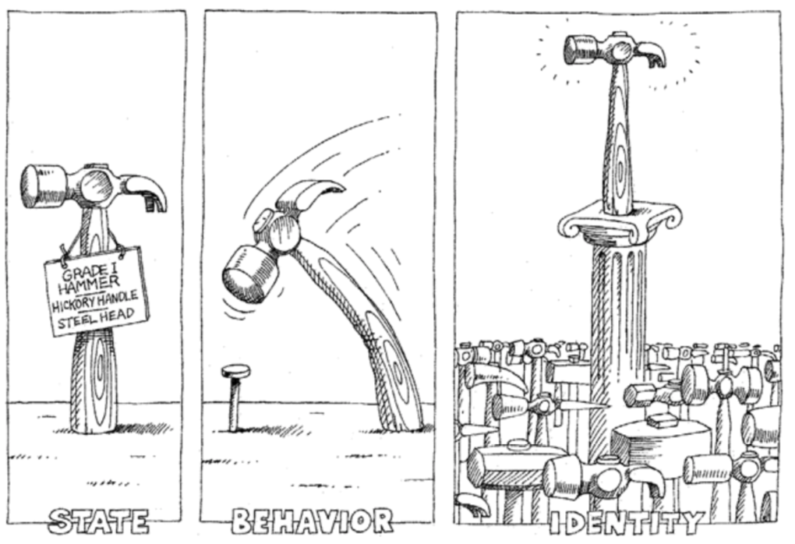

## 面向對象編程基礎

活在當下的程序員應該都聽過“面向對象編程”一詞，也經常有人問能不能用一句話解釋下什麼是“面向對象編程”，我們先來看看比較正式的說法。

“把一組數據結構和處理它們的方法組成對象（object），把相同行為的對象歸納為類（class），通過類的封裝（encapsulation）隱藏內部細節，通過繼承（inheritance）實現類的特化（specialization）和泛化（generalization），通過多態（polymorphism）實現基於對象類型的動態分派。”

這樣一說是不是更不明白了。所以我們還是看看更通俗易懂的說法，下面這段內容來自於[知乎](https://www.zhihu.com/)。


> **說明：** 以上的內容來自於網絡，不代表作者本人的觀點和看法，與作者本人立場無關，相關責任不由作者承擔。

之前我們說過“程序是指令的集合”，我們在程序中書寫的語句在執行時會變成一條或多條指令然後由CPU去執行。當然為了簡化程序的設計，我們引入了函數的概念，把相對獨立且經常重複使用的代碼放置到函數中，在需要使用這些功能的時候只要調用函數即可；如果一個函數的功能過於複雜和臃腫，我們又可以進一步將函數繼續切分為子函數來降低系統的複雜性。但是說了這麼多，不知道大家是否發現，所謂編程就是程序員按照計算機的工作方式控制計算機完成各種任務。但是，計算機的工作方式與正常人類的思維模式是不同的，如果編程就必須得拋棄人類正常的思維方式去迎合計算機，編程的樂趣就少了很多，“每個人都應該學習編程”這樣的豪言壯語就只能說說而已。當然，這些還不是最重要的，最重要的是當我們需要開發一個複雜的系統時，代碼的複雜性會讓開發和維護工作都變得舉步維艱，所以在上世紀60年代末期，“[軟件危機](https://zh.wikipedia.org/wiki/%E8%BD%AF%E4%BB%B6%E5%8D%B1%E6%9C%BA)”、“[軟件工程](https://zh.wikipedia.org/wiki/%E8%BD%AF%E4%BB%B6%E5%B7%A5%E7%A8%8B)”等一系列的概念開始在行業中出現。

當然，程序員圈子內的人都知道，現實中並沒有解決上面所說的這些問題的“[銀彈](https://zh.wikipedia.org/wiki/%E6%B2%A1%E6%9C%89%E9%93%B6%E5%BC%B9)”，真正讓軟件開發者看到希望的是上世紀70年代誕生的[Smalltalk](https://zh.wikipedia.org/wiki/Smalltalk)編程語言中引入的面向對象的編程思想（面向對象編程的雛形可以追溯到更早期的[Simula](https://zh.wikipedia.org/wiki/Simula)語言）。按照這種編程理念，程序中的數據和操作數據的函數是一個邏輯上的整體，我們稱之為“對象”，而我們解決問題的方式就是創建出需要的對象並向對象發出各種各樣的消息，多個對象的協同工作最終可以讓我們構造出複雜的系統來解決現實中的問題。

> **說明：** 當然面向對象也不是解決軟件開發中所有問題的最後的“銀彈”，所以今天的高級程序設計語言幾乎都提供了對多種編程範式的支持，Python也不例外。

### 類和對象

簡單的說，類是對象的藍圖和模板，而對象是類的實例。這個解釋雖然有點像用概念在解釋概念，但是從這句話我們至少可以看出，類是抽象的概念，而對象是具體的東西。在面向對象編程的世界中，一切皆為對象，對象都有屬性和行為，每個對象都是獨一無二的，而且對象一定屬於某個類（型）。當我們把一大堆擁有共同特徵的對象的靜態特徵（屬性）和動態特徵（行為）都抽取出來後，就可以定義出一個叫做“類”的東西。



### 定義類

在Python中可以使用`class`關鍵字定義類，然後在類中通過之前學習過的函數來定義方法，這樣就可以將對象的動態特徵描述出來，代碼如下所示。

```Python
class Student(object):

    # __init__是一個特殊方法用於在創建對象時進行初始化操作
    # 通過這個方法我們可以為學生對象綁定name和age兩個屬性
    def __init__(self, name, age):
        self.name = name
        self.age = age

    def study(self, course_name):
        print('%s正在學習%s.' % (self.name, course_name))

    # PEP 8要求標識符的名字用全小寫多個單詞用下劃線連接
    # 但是部分程序員和公司更傾向於使用駝峰命名法(駝峰標識)
    def watch_movie(self):
        if self.age < 18:
            print('%s只能觀看《熊出沒》.' % self.name)
        else:
            print('%s正在觀看島國愛情大電影.' % self.name)
```

> **說明：** 寫在類中的函數，我們通常稱之為（對象的）方法，這些方法就是對象可以接收的消息。

### 創建和使用對象

當我們定義好一個類之後，可以通過下面的方式來創建對象並給對象發消息。

```Python
def main():
    # 創建學生對象並指定姓名和年齡
    stu1 = Student('駱昊', 38)
    # 給對象發study消息
    stu1.study('Python程序設計')
    # 給對象發watch_av消息
    stu1.watch_movie()
    stu2 = Student('王大錘', 15)
    stu2.study('思想品德')
    stu2.watch_movie()


if __name__ == '__main__':
    main()
```

### 訪問可見性問題

對於上面的代碼，有C++、Java、C#等編程經驗的程序員可能會問，我們給`Student`對象綁定的`name`和`age`屬性到底具有怎樣的訪問權限（也稱為可見性）。因為在很多面向對象編程語言中，我們通常會將對象的屬性設置為私有的（private）或受保護的（protected），簡單的說就是不允許外界訪問，而對象的方法通常都是公開的（public），因為公開的方法就是對象能夠接受的消息。在Python中，屬性和方法的訪問權限只有兩種，也就是公開的和私有的，如果希望屬性是私有的，在給屬性命名時可以用兩個下劃線作為開頭，下面的代碼可以驗證這一點。

```Python
class Test:

    def __init__(self, foo):
        self.__foo = foo

    def __bar(self):
        print(self.__foo)
        print('__bar')


def main():
    test = Test('hello')
    # AttributeError: 'Test' object has no attribute '__bar'
    test.__bar()
    # AttributeError: 'Test' object has no attribute '__foo'
    print(test.__foo)


if __name__ == "__main__":
    main()
```

但是，Python並沒有從語法上嚴格保證私有屬性或方法的私密性，它只是給私有的屬性和方法換了一個名字來“妨礙”對它們的訪問，事實上如果你知道更換名字的規則仍然可以訪問到它們，下面的代碼就可以驗證這一點。之所以這樣設定，可以用這樣一句名言加以解釋，就是“We are all consenting adults here”。因為絕大多數程序員都認為開放比封閉要好，而且程序員要自己為自己的行為負責。

```Python
class Test:

    def __init__(self, foo):
        self.__foo = foo

    def __bar(self):
        print(self.__foo)
        print('__bar')


def main():
    test = Test('hello')
    test._Test__bar()
    print(test._Test__foo)


if __name__ == "__main__":
    main()
```

在實際開發中，我們並不建議將屬性設置為私有的，因為這會導致子類無法訪問（後面會講到）。所以大多數Python程序員會遵循一種命名慣例就是讓屬性名以單下劃線開頭來表示屬性是受保護的，本類之外的代碼在訪問這樣的屬性時應該要保持慎重。這種做法並不是語法上的規則，單下劃線開頭的屬性和方法外界仍然是可以訪問的，所以更多的時候它是一種暗示或隱喻，關於這一點可以看看我的[《Python - 那些年我們踩過的那些坑》](http://blog.csdn.net/jackfrued/article/details/79521404)文章中的講解。

### 面向對象的支柱

面向對象有三大支柱：封裝、繼承和多態。後面兩個概念在下一個章節中進行詳細的說明，這裡我們先說一下什麼是封裝。我自己對封裝的理解是“隱藏一切可以隱藏的實現細節，只向外界暴露（提供）簡單的編程接口”。我們在類中定義的方法其實就是把數據和對數據的操作封裝起來了，在我們創建了對象之後，只需要給對象發送一個消息（調用方法）就可以執行方法中的代碼，也就是說我們只需要知道方法的名字和傳入的參數（方法的外部視圖），而不需要知道方法內部的實現細節（方法的內部視圖）。

### 練習

#### 練習1：定義一個類描述數字時鐘

```Python
from time import sleep


class Clock(object):
    """數字時鐘"""

    def __init__(self, hour=0, minute=0, second=0):
        """初始化方法

        :param hour: 時
        :param minute: 分
        :param second: 秒
        """
        self._hour = hour
        self._minute = minute
        self._second = second

    def run(self):
        """走字"""
        self._second += 1
        if self._second == 60:
            self._second = 0
            self._minute += 1
            if self._minute == 60:
                self._minute = 0
                self._hour += 1
                if self._hour == 24:
                    self._hour = 0

    def show(self):
        """顯示時間"""
        return '%02d:%02d:%02d' % \
               (self._hour, self._minute, self._second)


def main():
    clock = Clock(23, 59, 58)
    while True:
        print(clock.show())
        sleep(1)
        clock.run()


if __name__ == '__main__':
    main()
```

#### 練習2：定義一個類描述平面上的點並提供移動點和計算到另一個點距離的方法。

```Python
from math import sqrt


class Point(object):

    def __init__(self, x=0, y=0):
        """初始化方法
        
        :param x: 橫座標
        :param y: 縱座標
        """
        self.x = x
        self.y = y

    def move_to(self, x, y):
        """移動到指定位置
        
        :param x: 新的橫座標
        "param y: 新的縱座標
        """
        self.x = x
        self.y = y

    def move_by(self, dx, dy):
        """移動指定的增量
        
        :param dx: 橫座標的增量
        "param dy: 縱座標的增量
        """
        self.x += dx
        self.y += dy

    def distance_to(self, other):
        """計算與另一個點的距離
        
        :param other: 另一個點
        """
        dx = self.x - other.x
        dy = self.y - other.y
        return sqrt(dx ** 2 + dy ** 2)

    def __str__(self):
        return '(%s, %s)' % (str(self.x), str(self.y))


def main():
    p1 = Point(3, 5)
    p2 = Point()
    print(p1)
    print(p2)
    p2.move_by(-1, 2)
    print(p2)
    print(p1.distance_to(p2))


if __name__ == '__main__':
    main()
```

> **說明：** 本章中的插圖來自於Grady Booch等著作的[《面向對象分析與設計》](https://item.jd.com/20476561918.html)一書，該書是講解面向對象編程的經典著作，有興趣的讀者可以購買和閱讀這本書來了解更多的面向對象的相關知識。