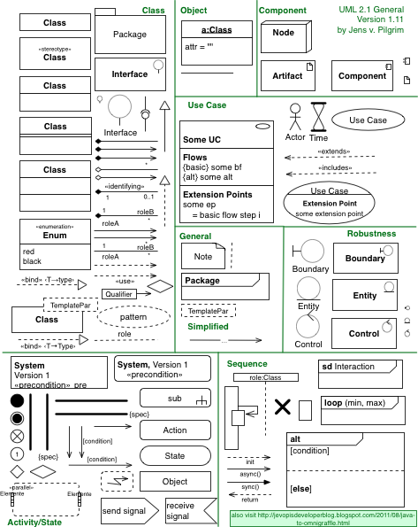

## 面向對象進階

在前面的章節我們已經瞭解了面向對象的入門知識，知道了如何定義類，如何創建對象以及如何給對象發消息。為了能夠更好的使用面向對象編程思想進行程序開發，我們還需要對Python中的面向對象編程進行更為深入的瞭解。

### @property裝飾器

之前我們討論過Python中屬性和方法訪問權限的問題，雖然我們不建議將屬性設置為私有的，但是如果直接將屬性暴露給外界也是有問題的，比如我們沒有辦法檢查賦給屬性的值是否有效。我們之前的建議是將屬性命名以單下劃線開頭，通過這種方式來暗示屬性是受保護的，不建議外界直接訪問，那麼如果想訪問屬性可以通過屬性的getter（訪問器）和setter（修改器）方法進行對應的操作。如果要做到這點，就可以考慮使用@property包裝器來包裝getter和setter方法，使得對屬性的訪問既安全又方便，代碼如下所示。

```Python
class Person(object):

    def __init__(self, name, age):
        self._name = name
        self._age = age

    # 訪問器 - getter方法
    @property
    def name(self):
        return self._name

    # 訪問器 - getter方法
    @property
    def age(self):
        return self._age

    # 修改器 - setter方法
    @age.setter
    def age(self, age):
        self._age = age

    def play(self):
        if self._age <= 16:
            print('%s正在玩飛行棋.' % self._name)
        else:
            print('%s正在玩鬥地主.' % self._name)


def main():
    person = Person('王大錘', 12)
    person.play()
    person.age = 22
    person.play()
    # person.name = '白元芳'  # AttributeError: can't set attribute


if __name__ == '__main__':
    main()
```

### \_\_slots\_\_魔法

我們講到這裡，不知道大家是否已經意識到，Python是一門[動態語言](https://zh.wikipedia.org/wiki/%E5%8A%A8%E6%80%81%E8%AF%AD%E8%A8%80)。通常，動態語言允許我們在程序運行時給對象綁定新的屬性或方法，當然也可以對已經綁定的屬性和方法進行解綁定。但是如果我們需要限定自定義類型的對象只能綁定某些屬性，可以通過在類中定義\_\_slots\_\_變量來進行限定。需要注意的是\_\_slots\_\_的限定只對當前類的對象生效，對子類並不起任何作用。

```Python
class Person(object):

    # 限定Person對象只能綁定_name, _age和_gender屬性
    __slots__ = ('_name', '_age', '_gender')

    def __init__(self, name, age):
        self._name = name
        self._age = age

    @property
    def name(self):
        return self._name

    @property
    def age(self):
        return self._age

    @age.setter
    def age(self, age):
        self._age = age

    def play(self):
        if self._age <= 16:
            print('%s正在玩飛行棋.' % self._name)
        else:
            print('%s正在玩鬥地主.' % self._name)


def main():
    person = Person('王大錘', 22)
    person.play()
    person._gender = '男'
    # AttributeError: 'Person' object has no attribute '_is_gay'
    # person._is_gay = True
```

### 靜態方法和類方法

之前，我們在類中定義的方法都是對象方法，也就是說這些方法都是發送給對象的消息。實際上，我們寫在類中的方法並不需要都是對象方法，例如我們定義一個“三角形”類，通過傳入三條邊長來構造三角形，並提供計算周長和麵積的方法，但是傳入的三條邊長未必能構造出三角形對象，因此我們可以先寫一個方法來驗證三條邊長是否可以構成三角形，這個方法很顯然就不是對象方法，因為在調用這個方法時三角形對象尚未創建出來（因為都不知道三條邊能不能構成三角形），所以這個方法是屬於三角形類而並不屬於三角形對象的。我們可以使用靜態方法來解決這類問題，代碼如下所示。

```Python
from math import sqrt


class Triangle(object):

    def __init__(self, a, b, c):
        self._a = a
        self._b = b
        self._c = c

    @staticmethod
    def is_valid(a, b, c):
        return a + b > c and b + c > a and a + c > b

    def perimeter(self):
        return self._a + self._b + self._c

    def area(self):
        half = self.perimeter() / 2
        return sqrt(half * (half - self._a) *
                    (half - self._b) * (half - self._c))


def main():
    a, b, c = 3, 4, 5
    # 靜態方法和類方法都是通過給類發消息來調用的
    if Triangle.is_valid(a, b, c):
        t = Triangle(a, b, c)
        print(t.perimeter())
        # 也可以通過給類發消息來調用對象方法但是要傳入接收消息的對象作為參數
        # print(Triangle.perimeter(t))
        print(t.area())
        # print(Triangle.area(t))
    else:
        print('無法構成三角形.')


if __name__ == '__main__':
    main()
```

和靜態方法比較類似，Python還可以在類中定義類方法，類方法的第一個參數約定名為cls，它代表的是當前類相關的信息的對象（類本身也是一個對象，有的地方也稱之為類的元數據對象），通過這個參數我們可以獲取和類相關的信息並且可以創建出類的對象，代碼如下所示。

```Python
from time import time, localtime, sleep


class Clock(object):
    """數字時鐘"""

    def __init__(self, hour=0, minute=0, second=0):
        self._hour = hour
        self._minute = minute
        self._second = second

    @classmethod
    def now(cls):
        ctime = localtime(time())
        return cls(ctime.tm_hour, ctime.tm_min, ctime.tm_sec)

    def run(self):
        """走字"""
        self._second += 1
        if self._second == 60:
            self._second = 0
            self._minute += 1
            if self._minute == 60:
                self._minute = 0
                self._hour += 1
                if self._hour == 24:
                    self._hour = 0

    def show(self):
        """顯示時間"""
        return '%02d:%02d:%02d' % \
               (self._hour, self._minute, self._second)


def main():
    # 通過類方法創建對象並獲取系統時間
    clock = Clock.now()
    while True:
        print(clock.show())
        sleep(1)
        clock.run()


if __name__ == '__main__':
    main()
```

### 類之間的關係

簡單的說，類和類之間的關係有三種：is-a、has-a和use-a關係。

- is-a關係也叫繼承或泛化，比如學生和人的關係、手機和電子產品的關係都屬於繼承關係。
- has-a關係通常稱之為關聯，比如部門和員工的關係，汽車和引擎的關係都屬於關聯關係；關聯關係如果是整體和部分的關聯，那麼我們稱之為聚合關係；如果整體進一步負責了部分的生命週期（整體和部分是不可分割的，同時同在也同時消亡），那麼這種就是最強的關聯關係，我們稱之為合成關係。
- use-a關係通常稱之為依賴，比如司機有一個駕駛的行為（方法），其中（的參數）使用到了汽車，那麼司機和汽車的關係就是依賴關係。

我們可以使用一種叫做[UML](https://zh.wikipedia.org/wiki/%E7%BB%9F%E4%B8%80%E5%BB%BA%E6%A8%A1%E8%AF%AD%E8%A8%80)（統一建模語言）的東西來進行面向對象建模，其中一項重要的工作就是把類和類之間的關係用標準化的圖形符號描述出來。關於UML我們在這裡不做詳細的介紹，有興趣的讀者可以自行閱讀[《UML面向對象設計基礎》](https://e.jd.com/30392949.html)一書。




利用類之間的這些關係，我們可以在已有類的基礎上來完成某些操作，也可以在已有類的基礎上創建新的類，這些都是實現代碼複用的重要手段。複用現有的代碼不僅可以減少開發的工作量，也有利於代碼的管理和維護，這是我們在日常工作中都會使用到的技術手段。

### 繼承和多態

剛才我們提到了，可以在已有類的基礎上創建新類，這其中的一種做法就是讓一個類從另一個類那裡將屬性和方法直接繼承下來，從而減少重複代碼的編寫。提供繼承信息的我們稱之為父類，也叫超類或基類；得到繼承信息的我們稱之為子類，也叫派生類或衍生類。子類除了繼承父類提供的屬性和方法，還可以定義自己特有的屬性和方法，所以子類比父類擁有的更多的能力，在實際開發中，我們經常會用子類對象去替換掉一個父類對象，這是面向對象編程中一個常見的行為，對應的原則稱之為[里氏替換原則](https://zh.wikipedia.org/wiki/%E9%87%8C%E6%B0%8F%E6%9B%BF%E6%8D%A2%E5%8E%9F%E5%88%99)。下面我們先看一個繼承的例子。

```Python
class Person(object):
    """人"""

    def __init__(self, name, age):
        self._name = name
        self._age = age

    @property
    def name(self):
        return self._name

    @property
    def age(self):
        return self._age

    @age.setter
    def age(self, age):
        self._age = age

    def play(self):
        print('%s正在愉快的玩耍.' % self._name)

    def watch_av(self):
        if self._age >= 18:
            print('%s正在觀看愛情動作片.' % self._name)
        else:
            print('%s只能觀看《熊出沒》.' % self._name)


class Student(Person):
    """學生"""

    def __init__(self, name, age, grade):
        super().__init__(name, age)
        self._grade = grade

    @property
    def grade(self):
        return self._grade

    @grade.setter
    def grade(self, grade):
        self._grade = grade

    def study(self, course):
        print('%s的%s正在學習%s.' % (self._grade, self._name, course))


class Teacher(Person):
    """老師"""

    def __init__(self, name, age, title):
        super().__init__(name, age)
        self._title = title

    @property
    def title(self):
        return self._title

    @title.setter
    def title(self, title):
        self._title = title

    def teach(self, course):
        print('%s%s正在講%s.' % (self._name, self._title, course))


def main():
    stu = Student('王大錘', 15, '初三')
    stu.study('數學')
    stu.watch_av()
    t = Teacher('駱昊', 38, '磚家')
    t.teach('Python程序設計')
    t.watch_av()


if __name__ == '__main__':
    main()
```

子類在繼承了父類的方法後，可以對父類已有的方法給出新的實現版本，這個動作稱之為方法重寫（override）。通過方法重寫我們可以讓父類的同一個行為在子類中擁有不同的實現版本，當我們調用這個經過子類重寫的方法時，不同的子類對象會表現出不同的行為，這個就是多態（poly-morphism）。

```Python
from abc import ABCMeta, abstractmethod


class Pet(object, metaclass=ABCMeta):
    """寵物"""

    def __init__(self, nickname):
        self._nickname = nickname

    @abstractmethod
    def make_voice(self):
        """發出聲音"""
        pass


class Dog(Pet):
    """狗"""

    def make_voice(self):
        print('%s: 汪汪汪...' % self._nickname)


class Cat(Pet):
    """貓"""

    def make_voice(self):
        print('%s: 喵...喵...' % self._nickname)


def main():
    pets = [Dog('旺財'), Cat('凱蒂'), Dog('大黃')]
    for pet in pets:
        pet.make_voice()


if __name__ == '__main__':
    main()
```

在上面的代碼中，我們將`Pet`類處理成了一個抽象類，所謂抽象類就是不能夠創建對象的類，這種類的存在就是專門為了讓其他類去繼承它。Python從語法層面並沒有像Java或C#那樣提供對抽象類的支持，但是我們可以通過`abc`模塊的`ABCMeta`元類和`abstractmethod`包裝器來達到抽象類的效果，如果一個類中存在抽象方法那麼這個類就不能夠實例化（創建對象）。上面的代碼中，`Dog`和`Cat`兩個子類分別對`Pet`類中的`make_voice`抽象方法進行了重寫並給出了不同的實現版本，當我們在`main`函數中調用該方法時，這個方法就表現出了多態行為（同樣的方法做了不同的事情）。

### 綜合案例

#### 案例1：奧特曼打小怪獸

```Python
from abc import ABCMeta, abstractmethod
from random import randint, randrange


class Fighter(object, metaclass=ABCMeta):
    """戰鬥者"""

    # 通過__slots__魔法限定對象可以綁定的成員變量
    __slots__ = ('_name', '_hp')

    def __init__(self, name, hp):
        """初始化方法

        :param name: 名字
        :param hp: 生命值
        """
        self._name = name
        self._hp = hp

    @property
    def name(self):
        return self._name

    @property
    def hp(self):
        return self._hp

    @hp.setter
    def hp(self, hp):
        self._hp = hp if hp >= 0 else 0

    @property
    def alive(self):
        return self._hp > 0

    @abstractmethod
    def attack(self, other):
        """攻擊

        :param other: 被攻擊的對象
        """
        pass


class Ultraman(Fighter):
    """奧特曼"""

    __slots__ = ('_name', '_hp', '_mp')

    def __init__(self, name, hp, mp):
        """初始化方法

        :param name: 名字
        :param hp: 生命值
        :param mp: 魔法值
        """
        super().__init__(name, hp)
        self._mp = mp

    def attack(self, other):
        other.hp -= randint(15, 25)

    def huge_attack(self, other):
        """究極必殺技(打掉對方至少50點或四分之三的血)

        :param other: 被攻擊的對象

        :return: 使用成功返回True否則返回False
        """
        if self._mp >= 50:
            self._mp -= 50
            injury = other.hp * 3 // 4
            injury = injury if injury >= 50 else 50
            other.hp -= injury
            return True
        else:
            self.attack(other)
            return False

    def magic_attack(self, others):
        """魔法攻擊

        :param others: 被攻擊的群體

        :return: 使用魔法成功返回True否則返回False
        """
        if self._mp >= 20:
            self._mp -= 20
            for temp in others:
                if temp.alive:
                    temp.hp -= randint(10, 15)
            return True
        else:
            return False

    def resume(self):
        """恢復魔法值"""
        incr_point = randint(1, 10)
        self._mp += incr_point
        return incr_point

    def __str__(self):
        return '~~~%s奧特曼~~~\n' % self._name + \
            '生命值: %d\n' % self._hp + \
            '魔法值: %d\n' % self._mp


class Monster(Fighter):
    """小怪獸"""

    __slots__ = ('_name', '_hp')

    def attack(self, other):
        other.hp -= randint(10, 20)

    def __str__(self):
        return '~~~%s小怪獸~~~\n' % self._name + \
            '生命值: %d\n' % self._hp


def is_any_alive(monsters):
    """判斷有沒有小怪獸是活著的"""
    for monster in monsters:
        if monster.alive > 0:
            return True
    return False


def select_alive_one(monsters):
    """選中一隻活著的小怪獸"""
    monsters_len = len(monsters)
    while True:
        index = randrange(monsters_len)
        monster = monsters[index]
        if monster.alive > 0:
            return monster


def display_info(ultraman, monsters):
    """顯示奧特曼和小怪獸的信息"""
    print(ultraman)
    for monster in monsters:
        print(monster, end='')


def main():
    u = Ultraman('駱昊', 1000, 120)
    m1 = Monster('狄仁傑', 250)
    m2 = Monster('白元芳', 500)
    m3 = Monster('王大錘', 750)
    ms = [m1, m2, m3]
    fight_round = 1
    while u.alive and is_any_alive(ms):
        print('========第%02d回合========' % fight_round)
        m = select_alive_one(ms)  # 選中一隻小怪獸
        skill = randint(1, 10)   # 通過隨機數選擇使用哪種技能
        if skill <= 6:  # 60%的概率使用普通攻擊
            print('%s使用普通攻擊打了%s.' % (u.name, m.name))
            u.attack(m)
            print('%s的魔法值恢復了%d點.' % (u.name, u.resume()))
        elif skill <= 9:  # 30%的概率使用魔法攻擊(可能因魔法值不足而失敗)
            if u.magic_attack(ms):
                print('%s使用了魔法攻擊.' % u.name)
            else:
                print('%s使用魔法失敗.' % u.name)
        else:  # 10%的概率使用究極必殺技(如果魔法值不足則使用普通攻擊)
            if u.huge_attack(m):
                print('%s使用究極必殺技虐了%s.' % (u.name, m.name))
            else:
                print('%s使用普通攻擊打了%s.' % (u.name, m.name))
                print('%s的魔法值恢復了%d點.' % (u.name, u.resume()))
        if m.alive > 0:  # 如果選中的小怪獸沒有死就回擊奧特曼
            print('%s回擊了%s.' % (m.name, u.name))
            m.attack(u)
        display_info(u, ms)  # 每個回合結束後顯示奧特曼和小怪獸的信息
        fight_round += 1
    print('\n========戰鬥結束!========\n')
    if u.alive > 0:
        print('%s奧特曼勝利!' % u.name)
    else:
        print('小怪獸勝利!')


if __name__ == '__main__':
    main()
```

#### 案例2：撲克遊戲

```Python
import random


class Card(object):
    """一張牌"""

    def __init__(self, suite, face):
        self._suite = suite
        self._face = face

    @property
    def face(self):
        return self._face

    @property
    def suite(self):
        return self._suite

    def __str__(self):
        if self._face == 1:
            face_str = 'A'
        elif self._face == 11:
            face_str = 'J'
        elif self._face == 12:
            face_str = 'Q'
        elif self._face == 13:
            face_str = 'K'
        else:
            face_str = str(self._face)
        return '%s%s' % (self._suite, face_str)
    
    def __repr__(self):
        return self.__str__()


class Poker(object):
    """一副牌"""

    def __init__(self):
        self._cards = [Card(suite, face) 
                       for suite in '♠♥♣♦'
                       for face in range(1, 14)]
        self._current = 0

    @property
    def cards(self):
        return self._cards

    def shuffle(self):
        """洗牌(隨機亂序)"""
        self._current = 0
        random.shuffle(self._cards)

    @property
    def next(self):
        """發牌"""
        card = self._cards[self._current]
        self._current += 1
        return card

    @property
    def has_next(self):
        """還有沒有牌"""
        return self._current < len(self._cards)


class Player(object):
    """玩家"""

    def __init__(self, name):
        self._name = name
        self._cards_on_hand = []

    @property
    def name(self):
        return self._name

    @property
    def cards_on_hand(self):
        return self._cards_on_hand

    def get(self, card):
        """摸牌"""
        self._cards_on_hand.append(card)

    def arrange(self, card_key):
        """玩家整理手上的牌"""
        self._cards_on_hand.sort(key=card_key)


# 排序規則-先根據花色再根據點數排序
def get_key(card):
    return (card.suite, card.face)


def main():
    p = Poker()
    p.shuffle()
    players = [Player('東邪'), Player('西毒'), Player('南帝'), Player('北丐')]
    for _ in range(13):
        for player in players:
            player.get(p.next)
    for player in players:
        print(player.name + ':', end=' ')
        player.arrange(get_key)
        print(player.cards_on_hand)


if __name__ == '__main__':
    main()
```

>**說明：** 大家可以自己嘗試在上面代碼的基礎上寫一個簡單的撲克遊戲，例如21點(Black Jack)，遊戲的規則可以自己在網上找一找。

#### 案例3：工資結算系統

```Python
"""
某公司有三種類型的員工 分別是部門經理、程序員和銷售員
需要設計一個工資結算系統 根據提供的員工信息來計算月薪
部門經理的月薪是每月固定15000元
程序員的月薪按本月工作時間計算 每小時150元
銷售員的月薪是1200元的底薪加上銷售額5%的提成
"""
from abc import ABCMeta, abstractmethod


class Employee(object, metaclass=ABCMeta):
    """員工"""

    def __init__(self, name):
        """
        初始化方法

        :param name: 姓名
        """
        self._name = name

    @property
    def name(self):
        return self._name

    @abstractmethod
    def get_salary(self):
        """
        獲得月薪

        :return: 月薪
        """
        pass


class Manager(Employee):
    """部門經理"""

    def get_salary(self):
        return 15000.0


class Programmer(Employee):
    """程序員"""

    def __init__(self, name, working_hour=0):
        super().__init__(name)
        self._working_hour = working_hour

    @property
    def working_hour(self):
        return self._working_hour

    @working_hour.setter
    def working_hour(self, working_hour):
        self._working_hour = working_hour if working_hour > 0 else 0

    def get_salary(self):
        return 150.0 * self._working_hour


class Salesman(Employee):
    """銷售員"""

    def __init__(self, name, sales=0):
        super().__init__(name)
        self._sales = sales

    @property
    def sales(self):
        return self._sales

    @sales.setter
    def sales(self, sales):
        self._sales = sales if sales > 0 else 0

    def get_salary(self):
        return 1200.0 + self._sales * 0.05


def main():
    emps = [
        Manager('劉備'), Programmer('諸葛亮'),
        Manager('曹操'), Salesman('荀彧'),
        Salesman('呂布'), Programmer('張遼'),
        Programmer('趙雲')
    ]
    for emp in emps:
        if isinstance(emp, Programmer):
            emp.working_hour = int(input('請輸入%s本月工作時間: ' % emp.name))
        elif isinstance(emp, Salesman):
            emp.sales = float(input('請輸入%s本月銷售額: ' % emp.name))
        # 同樣是接收get_salary這個消息但是不同的員工表現出了不同的行為(多態)
        print('%s本月工資為: ￥%s元' %
              (emp.name, emp.get_salary()))


if __name__ == '__main__':
    main()
```

