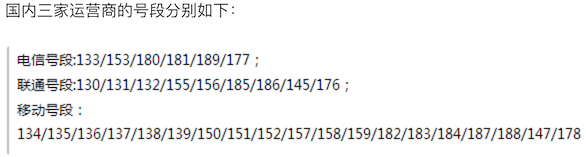

## 使用正則表達式

### 正則表達式相關知識

在編寫處理字符串的程序或網頁時，經常會有查找符合某些複雜規則的字符串的需要，正則表達式就是用於描述這些規則的工具，換句話說正則表達式是一種工具，它定義了字符串的匹配模式（如何檢查一個字符串是否有跟某種模式匹配的部分或者從一個字符串中將與模式匹配的部分提取出來或者替換掉）。如果你在Windows操作系統中使用過文件查找並且在指定文件名時使用過通配符（\*和?），那麼正則表達式也是與之類似的用來進行文本匹配的工具，只不過比起通配符正則表達式更強大，它能更精確地描述你的需求（當然你付出的代價是書寫一個正則表達式比打出一個通配符要複雜得多，要知道任何給你帶來好處的東西都是有代價的，就如同學習一門編程語言一樣），比如你可以編寫一個正則表達式，用來查找所有以0開頭，後面跟著2-3個數字，然後是一個連字號“-”，最後是7或8位數字的字符串（像028-12345678或0813-7654321），這不就是國內的座機號碼嗎。最初計算機是為了做數學運算而誕生的，處理的信息基本上都是數值，而今天我們在日常工作中處理的信息基本上都是文本數據，我們希望計算機能夠識別和處理符合某些模式的文本，正則表達式就顯得非常重要了。今天幾乎所有的編程語言都提供了對正則表達式操作的支持，Python通過標準庫中的re模塊來支持正則表達式操作。

我們可以考慮下面一個問題：我們從某個地方（可能是一個文本文件，也可能是網絡上的一則新聞）獲得了一個字符串，希望在字符串中找出手機號和座機號。當然我們可以設定手機號是11位的數字（注意並不是隨機的11位數字，因為你沒有見過“25012345678”這樣的手機號吧）而座機號跟上一段中描述的模式相同，如果不使用正則表達式要完成這個任務就會很麻煩。

關於正則表達式的相關知識，大家可以閱讀一篇非常有名的博客叫[《正則表達式30分鐘入門教程》](https://deerchao.net/tutorials/regex/regex.htm)，讀完這篇文章後你就可以看懂下面的表格，這是我們對正則表達式中的一些基本符號進行的扼要總結。

| 符號               | 解釋                                      | 示例             | 說明                                               |
| ------------------ | ----------------------------------------- | ---------------- | -------------------------------------------------- |
| .                  | 匹配任意字符                              | b.t              | 可以匹配bat / but / b#t / b1t等                    |
| \\w                | 匹配字母/數字/下劃線                      | b\\wt            | 可以匹配bat / b1t / b_t等<br>但不能匹配b#t         |
| \\s                | 匹配空白字符（包括\r、\n、\t等）          | love\\syou       | 可以匹配love you                                   |
| \\d                | 匹配數字                                  | \\d\\d           | 可以匹配01 / 23 / 99等                             |
| \\b                | 匹配單詞的邊界                            | \\bThe\\b        |                                                    |
| ^                  | 匹配字符串的開始                          | ^The             | 可以匹配The開頭的字符串                            |
| $                  | 匹配字符串的結束                          | .exe$            | 可以匹配.exe結尾的字符串                           |
| \\W                 | 匹配非字母/數字/下劃線                    | b\\Wt            | 可以匹配b#t / b@t等<br>但不能匹配but / b1t / b_t等 |
| \\S                 | 匹配非空白字符                            | love\\Syou       | 可以匹配love#you等<br>但不能匹配love you           |
| \\D                 | 匹配非數字                                | \\d\\D           | 可以匹配9a / 3# / 0F等                             |
| \\B                 | 匹配非單詞邊界                            | \\Bio\\B         |                                                    |
| []                 | 匹配來自字符集的任意單一字符              | [aeiou]          | 可以匹配任一元音字母字符                           |
| [^]                | 匹配不在字符集中的任意單一字符            | [^aeiou]         | 可以匹配任一非元音字母字符                         |
| *                  | 匹配0次或多次                             | \\w*             |                                                    |
| +                  | 匹配1次或多次                             | \\w+             |                                                    |
| ?                  | 匹配0次或1次                              | \\w?             |                                                    |
| {N}                | 匹配N次                                   | \\w{3}            |                                                    |
| {M,}               | 匹配至少M次                               | \\w{3,}           |                                                    |
| {M,N}              | 匹配至少M次至多N次                        | \\w{3,6}          |                                                    |
| \|                 | 分支                                      | foo\|bar         | 可以匹配foo或者bar                                 |
| (?#)               | 註釋                                      |                  |                                                    |
| (exp)              | 匹配exp並捕獲到自動命名的組中             |                  |                                                    |
| (?&nbsp;&lt;name&gt;exp) | 匹配exp並捕獲到名為name的組中             |                  |                                                    |
| (?:exp)            | 匹配exp但是不捕獲匹配的文本               |                  |                                                    |
| (?=exp)            | 匹配exp前面的位置                         | \\b\\w+(?=ing)     | 可以匹配I'm dancing中的danc                        |
| (?<=exp)           | 匹配exp後面的位置                         | (?<=\\bdanc)\\w+\\b | 可以匹配I love dancing and reading中的第一個ing    |
| (?!exp)            | 匹配後面不是exp的位置                     |                  |                                                    |
| (?<!exp)           | 匹配前面不是exp的位置                     |                  |                                                    |
| *?                 | 重複任意次，但儘可能少重複 | a.\*b<br>a.\*?b | 將正則表達式應用於aabab，前者會匹配整個字符串aabab，後者會匹配aab和ab兩個字符串 |
| +?                 | 重複1次或多次，但儘可能少重複 |                  |                                                    |
| ??                 | 重複0次或1次，但儘可能少重複 |                  |                                                    |
| {M,N}?             | 重複M到N次，但儘可能少重複 |                  |                                                    |
| {M,}?              | 重複M次以上，但儘可能少重複 |                  |                                                    |

> **說明：** 如果需要匹配的字符是正則表達式中的特殊字符，那麼可以使用\\進行轉義處理，例如想匹配小數點可以寫成\\.就可以了，因為直接寫.會匹配任意字符；同理，想匹配圓括號必須寫成\\(和\\)，否則圓括號被視為正則表達式中的分組。

### Python對正則表達式的支持

Python提供了re模塊來支持正則表達式相關操作，下面是re模塊中的核心函數。

| 函數                                         | 說明                                                         |
| -------------------------------------------- | ------------------------------------------------------------ |
| compile(pattern, flags=0)                    | 編譯正則表達式返回正則表達式對象                             |
| match(pattern, string, flags=0)              | 用正則表達式匹配字符串 成功返回匹配對象 否則返回None         |
| search(pattern, string, flags=0)             | 搜索字符串中第一次出現正則表達式的模式 成功返回匹配對象 否則返回None |
| split(pattern, string, maxsplit=0, flags=0)  | 用正則表達式指定的模式分隔符拆分字符串 返回列表              |
| sub(pattern, repl, string, count=0, flags=0) | 用指定的字符串替換原字符串中與正則表達式匹配的模式 可以用count指定替換的次數 |
| fullmatch(pattern, string, flags=0)          | match函數的完全匹配（從字符串開頭到結尾）版本                |
| findall(pattern, string, flags=0)            | 查找字符串所有與正則表達式匹配的模式 返回字符串的列表        |
| finditer(pattern, string, flags=0)           | 查找字符串所有與正則表達式匹配的模式 返回一個迭代器          |
| purge()                                      | 清除隱式編譯的正則表達式的緩存                               |
| re.I / re.IGNORECASE                         | 忽略大小寫匹配標記                                           |
| re.M / re.MULTILINE                          | 多行匹配標記                                                 |

> **說明：** 上面提到的re模塊中的這些函數，實際開發中也可以用正則表達式對象的方法替代對這些函數的使用，如果一個正則表達式需要重複的使用，那麼先通過compile函數編譯正則表達式並創建出正則表達式對象無疑是更為明智的選擇。

下面我們通過一系列的例子來告訴大家在Python中如何使用正則表達式。

#### 例子1：驗證輸入用戶名和QQ號是否有效並給出對應的提示信息。

```Python
"""
驗證輸入用戶名和QQ號是否有效並給出對應的提示信息

要求：用戶名必須由字母、數字或下劃線構成且長度在6~20個字符之間，QQ號是5~12的數字且首位不能為0
"""
import re


def main():
    username = input('請輸入用戶名: ')
    qq = input('請輸入QQ號: ')
    # match函數的第一個參數是正則表達式字符串或正則表達式對象
    # 第二個參數是要跟正則表達式做匹配的字符串對象
    m1 = re.match(r'^[0-9a-zA-Z_]{6,20}$', username)
    if not m1:
        print('請輸入有效的用戶名.')
    m2 = re.match(r'^[1-9]\d{4,11}$', qq)
    if not m2:
        print('請輸入有效的QQ號.')
    if m1 and m2:
        print('你輸入的信息是有效的!')


if __name__ == '__main__':
    main()
```

> **提示：** 上面在書寫正則表達式時使用了“原始字符串”的寫法（在字符串前面加上了r），所謂“原始字符串”就是字符串中的每個字符都是它原始的意義，說得更直接一點就是字符串中沒有所謂的轉義字符啦。因為正則表達式中有很多元字符和需要進行轉義的地方，如果不使用原始字符串就需要將反斜槓寫作\\\\，例如表示數字的\\d得書寫成\\\\d，這樣不僅寫起來不方便，閱讀的時候也會很吃力。

#### 例子2：從一段文字中提取出國內手機號碼。

下面這張圖是截止到2017年底，國內三家運營商推出的手機號段。



```Python
import re


def main():
    # 創建正則表達式對象 使用了前瞻和回顧來保證手機號前後不應該出現數字
    pattern = re.compile(r'(?<=\D)1[34578]\d{9}(?=\D)')
    sentence = '''
    重要的事情說8130123456789遍，我的手機號是13512346789這個靚號，
    不是15600998765，也是110或119，王大錘的手機號才是15600998765。
    '''
    # 查找所有匹配並保存到一個列表中
    mylist = re.findall(pattern, sentence)
    print(mylist)
    print('--------華麗的分隔線--------')
    # 通過迭代器取出匹配對象並獲得匹配的內容
    for temp in pattern.finditer(sentence):
        print(temp.group())
    print('--------華麗的分隔線--------')
    # 通過search函數指定搜索位置找出所有匹配
    m = pattern.search(sentence)
    while m:
        print(m.group())
        m = pattern.search(sentence, m.end())


if __name__ == '__main__':
    main()
```

> **說明：** 上面匹配國內手機號的正則表達式並不夠好，因為像14開頭的號碼只有145或147，而上面的正則表達式並沒有考慮這種情況，要匹配國內手機號，更好的正則表達式的寫法是：`(?<=\D)(1[38]\d{9}|14[57]\d{8}|15[0-35-9]\d{8}|17[678]\d{8})(?=\D)`，國內最近好像有19和16開頭的手機號了，但是這個暫時不在我們考慮之列。

#### 例子3：替換字符串中的不良內容

```Python
import re


def main():
    sentence = '你丫是傻叉嗎? 我操你大爺的. Fuck you.'
    purified = re.sub('[操肏艹]|fuck|shit|傻[比屄逼叉缺吊屌]|煞筆',
                      '*', sentence, flags=re.IGNORECASE)
    print(purified)  # 你丫是*嗎? 我*你大爺的. * you.


if __name__ == '__main__':
    main()
```

> **說明：** re模塊的正則表達式相關函數中都有一個flags參數，它代表了正則表達式的匹配標記，可以通過該標記來指定匹配時是否忽略大小寫、是否進行多行匹配、是否顯示調試信息等。如果需要為flags參數指定多個值，可以使用[按位或運算符](http://www.runoob.com/python/python-operators.html#ysf5)進行疊加，如`flags=re.I | re.M`。

#### 例子4：拆分長字符串

```Python
import re


def main():
    poem = '窗前明月光，疑是地上霜。舉頭望明月，低頭思故鄉。'
    sentence_list = re.split(r'[，。, .]', poem)
    while '' in sentence_list:
        sentence_list.remove('')
    print(sentence_list)  # ['窗前明月光', '疑是地上霜', '舉頭望明月', '低頭思故鄉']


if __name__ == '__main__':
    main()
```

### 後話

如果要從事爬蟲類應用的開發，那麼正則表達式一定是一個非常好的助手，因為它可以幫助我們迅速的從網頁代碼中發現某種我們指定的模式並提取出我們需要的信息，當然對於初學者來收，要編寫一個正確的適當的正則表達式可能並不是一件容易的事情（當然有些常用的正則表達式可以直接在網上找找），所以實際開發爬蟲應用的時候，有很多人會選擇[Beautiful Soup](https://www.crummy.com/software/BeautifulSoup/)或[Lxml](http://lxml.de/)來進行匹配和信息的提取，前者簡單方便但是性能較差，後者既好用性能也好，但是安裝稍嫌麻煩，這些內容我們會在後期的爬蟲專題中為大家介紹。