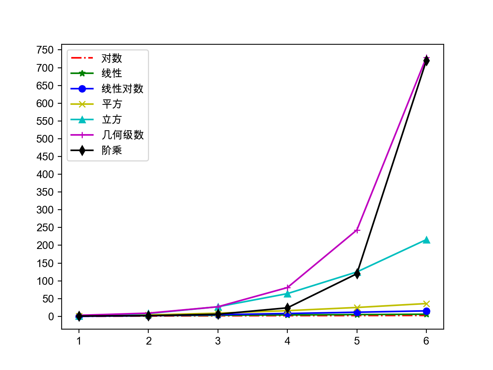

## Python語言進階

1. 數據結構和算法

   - 算法：解決問題的方法和步驟

   - 評價算法的好壞：漸近時間複雜度和漸近空間複雜度。

   - 漸近時間複雜度的大O標記：
     -  - 常量時間複雜度 - 布隆過濾器 / 哈希存儲
     -  - 對數時間複雜度 - 折半查找（二分查找）
     -  - 線性時間複雜度 - 順序查找 / 桶排序
     -  - 對數線性時間複雜度 - 高級排序算法（歸併排序、快速排序）
     -  - 平方時間複雜度 - 簡單排序算法（選擇排序、插入排序、冒泡排序）
     -  - 立方時間複雜度 - Floyd算法 / 矩陣乘法運算
     -  - 幾何級數時間複雜度 - 漢諾塔
     -  - 階乘時間複雜度 - 旅行經銷商問題 - NP

     

     

   - 排序算法（選擇、冒泡和歸併）和查找算法（順序和折半）

     ```Python
     def select_sort(origin_items, comp=lambda x, y: x < y):
         """簡單選擇排序"""
         items = origin_items[:]
         for i in range(len(items) - 1):
             min_index = i
             for j in range(i + 1, len(items)):
                 if comp(items[j], items[min_index]):
                     min_index = j
             items[i], items[min_index] = items[min_index], items[i]
         return items
     ```

     ```Python
     def bubble_sort(origin_items, comp=lambda x, y: x > y):
         """高質量冒泡排序(攪拌排序)"""
         items = origin_items[:]
         for i in range(len(items) - 1):
             swapped = False
             for j in range(i, len(items) - 1 - i):
                 if comp(items[j], items[j + 1]):
                     items[j], items[j + 1] = items[j + 1], items[j]
                     swapped = True
             if swapped:
                 swapped = False
                 for j in range(len(items) - 2 - i, i, -1):
                     if comp(items[j - 1], items[j]):
                         items[j], items[j - 1] = items[j - 1], items[j]
                         swapped = True
             if not swapped:
                 break
         return items
     ```

     ```Python
     def merge_sort(items, comp=lambda x, y: x <= y):
         """歸併排序(分治法)"""
         if len(items) < 2:
             return items[:]
         mid = len(items) // 2
         left = merge_sort(items[:mid], comp)
         right = merge_sort(items[mid:], comp)
         return merge(left, right, comp)
     
     
     def merge(items1, items2, comp):
         """合併(將兩個有序的列表合併成一個有序的列表)"""
         items = []
         index, index2 = 0, 0
         while index1 < len(items1) and index2 < len(items2):
             if comp(items1[index1], items2[index2]):
                 items.append(items1[index1])
                 index1 += 1
             else:
                 items.append(items2[index2])
                 index2 += 1
         items += items1[index1:]
         items += items2[index2:]
         return items
     ```

     ```Python
     def seq_search(items, key):
         """順序查找"""
         for index, item in enumerate(items):
             if item == key:
                 return index
         return -1
     ```

     ```Python
     def bin_search(items, key):
         """折半查找"""
         start, end = 0, len(items) - 1
         while start <= end:
             mid = (start + end) // 2
             if key > items[mid]:
                 start = mid + 1
             elif key < items[mid]:
                 end = mid - 1
             else:
                 return mid
         return -1
     ```

   - 使用生成式（推導式）語法

     ```Python
     prices = {
         'AAPL': 191.88,
         'GOOG': 1186.96,
         'IBM': 149.24,
         'ORCL': 48.44,
         'ACN': 166.89,
         'FB': 208.09,
         'SYMC': 21.29
     }
     # 用股票價格大於100元的股票構造一個新的字典
     prices2 = {key: value for key, value in prices.items() if value > 100}
     print(prices2)
     ```

     > 說明：生成式（推導式）可以用來生成列表、集合和字典。

   - 嵌套的列表

     ```Python
     names = ['關羽', '張飛', '趙雲', '馬超', '黃忠']
     courses = ['語文', '數學', '英語']
     # 錄入五個學生三門課程的成績
     # 錯誤 - 參考http://pythontutor.com/visualize.html#mode=edit
     # scores = [[None] * len(courses)] * len(names)
     scores = [[None] * len(courses) for _ in range(len(names))]
     for row, name in enumerate(names):
         for col, course in enumerate(courses):
             scores[row][col] = float(input(f'請輸入{name}的{course}成績: '))
             print(scores)
     ```

     [Python Tutor](http://pythontutor.com/) - VISUALIZE CODE AND GET LIVE HELP

   - heapq、itertools等的用法
     ```Python
     """
     從列表中找出最大的或最小的N個元素
     堆結構(大根堆/小根堆)
     """
     import heapq
     
     list1 = [34, 25, 12, 99, 87, 63, 58, 78, 88, 92]
     list2 = [
         {'name': 'IBM', 'shares': 100, 'price': 91.1},
         {'name': 'AAPL', 'shares': 50, 'price': 543.22},
         {'name': 'FB', 'shares': 200, 'price': 21.09},
         {'name': 'HPQ', 'shares': 35, 'price': 31.75},
         {'name': 'YHOO', 'shares': 45, 'price': 16.35},
         {'name': 'ACME', 'shares': 75, 'price': 115.65}
     ]
     print(heapq.nlargest(3, list1))
     print(heapq.nsmallest(3, list1))
     print(heapq.nlargest(2, list2, key=lambda x: x['price']))
     print(heapq.nlargest(2, list2, key=lambda x: x['shares']))
     ```

     ```Python
     """
     迭代工具 - 排列 / 組合 / 笛卡爾積
     """
     import itertools
     
     itertools.permutations('ABCD')
     itertools.combinations('ABCDE', 3)
     itertools.product('ABCD', '123')
     ```

   - collections模塊下的工具類

     ```Python
     """
     找出序列中出現次數最多的元素
     """
     from collections import Counter
     
     words = [
         'look', 'into', 'my', 'eyes', 'look', 'into', 'my', 'eyes',
         'the', 'eyes', 'the', 'eyes', 'the', 'eyes', 'not', 'around',
         'the', 'eyes', "don't", 'look', 'around', 'the', 'eyes',
         'look', 'into', 'my', 'eyes', "you're", 'under'
     ]
     counter = Counter(words)
     print(counter.most_common(3))
     ```

   - 常用算法：

     - 窮舉法 - 又稱為暴力破解法，對所有的可能性進行驗證，直到找到正確答案。
     - 貪婪法 - 在對問題求解時，總是做出在當前看來
     - 最好的選擇，不追求最優解，快速找到滿意解。
     - 分治法 - 把一個複雜的問題分成兩個或更多的相同或相似的子問題，再把子問題分成更小的子問題，直到可以直接求解的程度，最後將子問題的解進行合併得到原問題的解。
     - 回溯法 - 回溯法又稱為試探法，按選優條件向前搜索，當搜索到某一步發現原先選擇並不優或達不到目標時，就退回一步重新選擇。
     - 動態規劃 - 基本思想也是將待求解問題分解成若干個子問題，先求解並保存這些子問題的解，避免產生大量的重複運算。

     窮舉法例子：百錢百雞和五人分魚。

     ```Python
     # 公雞5元一隻 母雞3元一隻 小雞1元三隻
     # 用100元買100只雞 問公雞/母雞/小雞各多少隻
     for x in range(20):
         for y in range(33):
             z = 100 - x - y
             if 5 * x + 3 * y + z // 3 == 100 and z % 3 == 0:
                 print(x, y, z)
     
     # A、B、C、D、E五人在某天夜裡合夥捕魚 最後疲憊不堪各自睡覺
     # 第二天A第一個醒來 他將魚分為5份 扔掉多餘的1條 拿走自己的一份
     # B第二個醒來 也將魚分為5份 扔掉多餘的1條 拿走自己的一份
     # 然後C、D、E依次醒來也按同樣的方式分魚 問他們至少捕了多少條魚
     fish = 6
     while True:
         total = fish
         enough = True
         for _ in range(5):
             if (total - 1) % 5 == 0:
                 total = (total - 1) // 5 * 4
             else:
                 enough = False
                 break
         if enough:
             print(fish)
             break
         fish += 5
     ```

     貪婪法例子：假設小偷有一個揹包，最多能裝20公斤贓物，他闖入一戶人家，發現如下表所示的物品。很顯然，他不能把所有物品都裝進揹包，所以必須確定拿走哪些物品，留下哪些物品。

     |  名稱  | 價格（美元） | 重量（kg） |
     | :----: | :----------: | :--------: |
     |  電腦  |     200      |     20     |
     | 收音機 |      20      |     4      |
     |   鍾   |     175      |     10     |
     |  花瓶  |      50      |     2      |
     |   書   |      10      |     1      |
     |  油畫  |      90      |     9      |

     ```Python
     """
     貪婪法：在對問題求解時，總是做出在當前看來是最好的選擇，不追求最優解，快速找到滿意解。
     輸入：
     20 6
     電腦 200 20
     收音機 20 4
     鍾 175 10
     花瓶 50 2
     書 10 1
     油畫 90 9
     """
     class Thing(object):
         """物品"""
     
         def __init__(self, name, price, weight):
             self.name = name
             self.price = price
             self.weight = weight
     
         @property
         def value(self):
             """價格重量比"""
             return self.price / self.weight
     
     
     def input_thing():
         """輸入物品信息"""
         name_str, price_str, weight_str = input().split()
         return name_str, int(price_str), int(weight_str)
     
     
     def main():
         """主函數"""
         max_weight, num_of_things = map(int, input().split())
         all_things = []
         for _ in range(num_of_things):
             all_things.append(Thing(*input_thing()))
         all_things.sort(key=lambda x: x.value, reverse=True)
         total_weight = 0
         total_price = 0
         for thing in all_things:
             if total_weight + thing.weight <= max_weight:
                 print(f'小偷拿走了{thing.name}')
                 total_weight += thing.weight
                 total_price += thing.price
         print(f'總價值: {total_price}美元')
     
     
     if __name__ == '__main__':
         main()
     ```

     分治法例子：[快速排序](https://zh.wikipedia.org/zh/%E5%BF%AB%E9%80%9F%E6%8E%92%E5%BA%8F)。

     ```Python
     """
     快速排序 - 選擇樞軸對元素進行劃分，左邊都比樞軸小右邊都比樞軸大
     """
     def quick_sort(origin_items, comp=lambda x, y: x <= y):
         items = origin_items[:]
         _quick_sort(items, 0, len(items) - 1, comp)
         return items
     
     
     def _quick_sort(items, start, end, comp):
         if start < end:
             pos = _partition(items, start, end, comp)
             _quick_sort(items, start, pos - 1, comp)
             _quick_sort(items, pos + 1, end, comp)
     
     
     def _partition(items, start, end, comp):
         pivot = items[end]
         i = start - 1
         for j in range(start, end):
             if comp(items[j], pivot):
                 i += 1
                 items[i], items[j] = items[j], items[i]
         items[i + 1], items[end] = items[end], items[i + 1]
         return i + 1
     ```

     回溯法例子：[騎士巡邏](https://zh.wikipedia.org/zh/%E9%AA%91%E5%A3%AB%E5%B7%A1%E9%80%BB)。

     ```Python
     """
     遞歸回溯法：叫稱為試探法，按選優條件向前搜索，當搜索到某一步，發現原先選擇並不優或達不到目標時，就退回一步重新選擇，比較經典的問題包括騎士巡邏、八皇后和迷宮尋路等。
     """
     import sys
     import time
     
     SIZE = 5
     total = 0
     
     
     def print_board(board):
         for row in board:
             for col in row:
                 print(str(col).center(4), end='')
             print()
     
     
     def patrol(board, row, col, step=1):
         if row >= 0 and row < SIZE and \
             col >= 0 and col < SIZE and \
             board[row][col] == 0:
             board[row][col] = step
             if step == SIZE * SIZE:
                 global total
                 total += 1
                 print(f'第{total}種走法: ')
                 print_board(board)
             patrol(board, row - 2, col - 1, step + 1)
             patrol(board, row - 1, col - 2, step + 1)
             patrol(board, row + 1, col - 2, step + 1)
             patrol(board, row + 2, col - 1, step + 1)
             patrol(board, row + 2, col + 1, step + 1)
             patrol(board, row + 1, col + 2, step + 1)
             patrol(board, row - 1, col + 2, step + 1)
             patrol(board, row - 2, col + 1, step + 1)
             board[row][col] = 0
     
     
     def main():
         board = [[0] * SIZE for _ in range(SIZE)]
         patrol(board, SIZE - 1, SIZE - 1)
     
     
     if __name__ == '__main__':
         main()
     ```

     動態規劃例子1：[斐波拉切數列]()。（不使用動態規劃將會是幾何級數複雜度）

     ```Python
     """
     動態規劃 - 適用於有重疊子問題和最優子結構性質的問題
     使用動態規劃方法所耗時間往往遠少於樸素解法(用空間換取時間)
     """
     def fib(num, temp={}):
         """用遞歸計算Fibonacci數"""
         if num in (1, 2):
             return 1
         try:
             return temp[num]
         except KeyError:
             temp[num] = fib(num - 1) + fib(num - 2)
             return temp[num]
     ```

     動態規劃例子2：子列表元素之和的最大值。（使用動態規劃可以避免二重循環）

     > 說明：子列表指的是列表中索引（下標）連續的元素構成的列表；列表中的元素是int類型，可能包含正整數、0、負整數；程序輸入列表中的元素，輸出子列表元素求和的最大值，例如：
     >
     > 輸入：1 -2 3 5 -3 2
     >
     > 輸出：8
     >
     > 輸入：0 -2 3 5 -1 2
     >
     > 輸出：9
     >
     > 輸入：-9 -2 -3 -5 -3
     >
     > 輸出：-2

     ```Python
     def main():
         items = list(map(int, input().split()))
         size = len(items)
         overall, partial = {}, {}
         overall[size - 1] = partial[size - 1] = items[size - 1]
         for i in range(size - 2, -1, -1):
             partial[i] = max(items[i], partial[i + 1] + items[i])
             overall[i] = max(partial[i], overall[i + 1])
         print(overall[0])
     
     
     if __name__ == '__main__':
         main()
     ```

2. 函數的使用方式

   - 將函數視為“一等公民”

     - 函數可以賦值給變量
     - 函數可以作為函數的參數
     - 函數可以作為函數的返回值

   - 高階函數的用法（`filter`、`map`以及它們的替代品）

     ```Python
     items1 = list(map(lambda x: x ** 2, filter(lambda x: x % 2, range(1, 10))))
     items2 = [x ** 2 for x in range(1, 10) if x % 2]
     ```

   - 位置參數、可變參數、關鍵字參數、命名關鍵字參數

   - 參數的元信息（代碼可讀性問題）

   - 匿名函數和內聯函數的用法（`lambda`函數）

   - 閉包和作用域問題

     - Python搜索變量的LEGB順序（Local --> Embedded --> Global --> Built-in）

     - `global`和`nonlocal`關鍵字的作用

       `global`：聲明或定義全局變量（要麼直接使用現有的全局作用域的變量，要麼定義一個變量放到全局作用域）。

       `nonlocal`：聲明使用嵌套作用域的變量（嵌套作用域必須存在該變量，否則報錯）。

   - 裝飾器函數（使用裝飾器和取消裝飾器）

     例子：輸出函數執行時間的裝飾器。

     ```Python
     def record_time(func):
         """自定義裝飾函數的裝飾器"""
         
         @wraps(func)
         def wrapper(*args, **kwargs):
             start = time()
             result = func(*args, **kwargs)
             print(f'{func.__name__}: {time() - start}秒')
             return result
             
         return wrapper
     ```

     如果裝飾器不希望跟`print`函數耦合，可以編寫帶參數的裝飾器。

     ```Python
     from functools import wraps
     from time import time
     
     
     def record(output):
         """自定義帶參數的裝飾器"""
     	
     	def decorate(func):
     		
     		@wraps(func)
     		def wrapper(*args, **kwargs):
     			start = time()
     			result = func(*args, **kwargs)
     			output(func.__name__, time() - start)
     			return result
                 
     		return wrapper
     	
     	return decorate
     ```

     ```Python
     from functools import wraps
     from time import time
     
     
     class Record():
         """自定義裝飾器類(通過__call__魔術方法使得對象可以當成函數調用)"""
     
         def __init__(self, output):
             self.output = output
     
         def __call__(self, func):
     
             @wraps(func)
             def wrapper(*args, **kwargs):
                 start = time()
                 result = func(*args, **kwargs)
                 self.output(func.__name__, time() - start)
                 return result
     
             return wrapper
     ```

     > 說明：由於對帶裝飾功能的函數添加了@wraps裝飾器，可以通過`func.__wrapped__`方式獲得被裝飾之前的函數或類來取消裝飾器的作用。

     例子：用裝飾器來實現單例模式。

     ```Python
     from functools import wraps
     
     
     def singleton(cls):
         """裝飾類的裝飾器"""
         instances = {}
     
         @wraps(cls)
         def wrapper(*args, **kwargs):
             if cls not in instances:
                 instances[cls] = cls(*args, **kwargs)
             return instances[cls]
     
         return wrapper
     
     
     @singleton
     class President():
         """總統(單例類)"""
         pass
     ```

     > 說明：上面的代碼中用到了閉包（closure），不知道你是否已經意識到了。還沒有一個小問題就是，上面的代碼並沒有實現線程安全的單例，如果要實現線程安全的單例應該怎麼做呢？

     ```Python
     from functools import wraps
     from threading import Lock
     
     
     def singleton(cls):
         """線程安全的單例裝飾器"""
         instances = {}
         locker = Lock()
     
         @wraps(cls)
         def wrapper(*args, **kwargs):
             if cls not in instances:
                 with locker:
                     if cls not in instances:
                         instances[cls] = cls(*args, **kwargs)
             return instances[cls]
     
         return wrapper
     ```

3. 面向對象相關知識

   - 三大支柱：封裝、繼承、多態

     例子：工資結算系統。

     ```Python
     """
     月薪結算系統 - 部門經理每月15000 程序員每小時200 銷售員1800底薪加銷售額5%提成
     """
     from abc import ABCMeta, abstractmethod
     
     
     class Employee(metaclass=ABCMeta):
         """員工(抽象類)"""
     
         def __init__(self, name):
             self.name = name
     
         @abstractmethod
         def get_salary(self):
             """結算月薪(抽象方法)"""
             pass
     
     
     class Manager(Employee):
         """部門經理"""
     
         def get_salary(self):
             return 15000.0
     
     
     class Programmer(Employee):
         """程序員"""
     
         def __init__(self, name, working_hour=0):
             self.working_hour = working_hour
             super().__init__(name)
     
         def get_salary(self):
             return 200.0 * self.working_hour
     
     
     class Salesman(Employee):
         """銷售員"""
     
         def __init__(self, name, sales=0.0):
             self.sales = sales
             super().__init__(name)
     
         def get_salary(self):
             return 1800.0 + self.sales * 0.05
     
     
     class EmployeeFactory():
         """創建員工的工廠（工廠模式 - 通過工廠實現對象使用者和對象之間的解耦合）"""
     
         @staticmethod
         def create(emp_type, *args, **kwargs):
             """創建員工"""
             emp_type = emp_type.upper()
             emp = None
             if emp_type == 'M':
                 emp = Manager(*args, **kwargs)
             elif emp_type == 'P':
                 emp = Programmer(*args, **kwargs)
             elif emp_type == 'S':
                 emp = Salesman(*args, **kwargs)
             return emp
     
     
     def main():
         """主函數"""
         emps = [
             EmployeeFactory.create('M', '曹操'), 
             EmployeeFactory.create('P', '荀彧', 120),
             EmployeeFactory.create('P', '郭嘉', 85), 
             EmployeeFactory.create('S', '典韋', 123000),
         ]
         for emp in emps:
             print('%s: %.2f元' % (emp.name, emp.get_salary()))
     
     
     if __name__ == '__main__':
         main()
     ```

   - 類與類之間的關係

     - is-a關係：繼承
     - has-a關係：關聯 / 聚合 / 合成
     - use-a關係：依賴

     例子：撲克遊戲。

     ```Python
     """
     經驗：符號常量總是優於字面常量，枚舉類型是定義符號常量的最佳選擇
     """
     from enum import Enum, unique
     
     import random
     
     
     @unique
     class Suite(Enum):
         """花色"""
     
         SPADE, HEART, CLUB, DIAMOND = range(4)
     
         def __lt__(self, other):
             return self.value < other.value
     
     
     class Card():
         """牌"""
     
         def __init__(self, suite, face):
             """初始化方法"""
             self.suite = suite
             self.face = face
     
         def show(self):
             """顯示牌面"""
             suites = ['♠️', '♥️', '♣️', '♦️']
             faces = ['', 'A', '2', '3', '4', '5', '6', '7', '8', '9', '10', 'J', 'Q', 'K']
             return f'{suites[self.suite.value]} {faces[self.face]}'
     
         def __str__(self):
             return self.show()
     
         def __repr__(self):
             return self.show()
     
     
     class Poker():
         """撲克"""
     
         def __init__(self):
             self.index = 0
             self.cards = [Card(suite, face)
                           for suite in Suite
                           for face in range(1, 14)]
     
         def shuffle(self):
             """洗牌（隨機亂序）"""
             random.shuffle(self.cards)
             self.index = 0
     
         def deal(self):
             """發牌"""
             card = self.cards[self.index]
             self.index += 1
             return card
     
         @property
         def has_more(self):
             return self.index < len(self.cards)
     
     
     class Player():
         """玩家"""
     
         def __init__(self, name):
             self.name = name
             self.cards = []
     
         def get_one(self, card):
             """摸一張牌"""
             self.cards.append(card)
     
         def sort(self, comp=lambda card: (card.suite, card.face)):
             """整理手上的牌"""
             self.cards.sort(key=comp)
     
     
     def main():
         """主函數"""
         poker = Poker()
         poker.shuffle()
         players = [Player('東邪'), Player('西毒'), Player('南帝'), Player('北丐')]
         while poker.has_more:
             for player in players:
                     player.get_one(poker.deal())
         for player in players:
             player.sort()
             print(player.name, end=': ')
             print(player.cards)
     
     
     if __name__ == '__main__':
         main()
     ```

     > 說明：上面的代碼中使用了Emoji字符來表示撲克牌的四種花色，在某些不支持Emoji字符的系統上可能無法顯示。

   - 對象的複製（深複製/深拷貝/深度克隆和淺複製/淺拷貝/影子克隆）

   - 垃圾回收、循環引用和弱引用

     Python使用了自動化內存管理，這種管理機制以**引用計數**為基礎，同時也引入了**標記-清除**和**分代收集**兩種機制為輔的策略。

     ```C
     typedef struct_object {
         /* 引用計數 */
         int ob_refcnt;
         /* 對象指針 */
         struct_typeobject *ob_type;
     } PyObject;
     ```

     ```C
     /* 增加引用計數的宏定義 */
     #define Py_INCREF(op)   ((op)->ob_refcnt++)
     /* 減少引用計數的宏定義 */
     #define Py_DECREF(op) \ //減少計數
         if (--(op)->ob_refcnt != 0) \
             ; \
         else \
             __Py_Dealloc((PyObject *)(op))
     ```

     導致引用計數+1的情況：

     - 對象被創建，例如`a = 23`
     - 對象被引用，例如`b = a`
     - 對象被作為參數，傳入到一個函數中，例如`f(a)`
     - 對象作為一個元素，存儲在容器中，例如`list1 = [a, a]`

     導致引用計數-1的情況：

     - 對象的別名被顯式銷燬，例如`del a`
     - 對象的別名被賦予新的對象，例如`a = 24`
     - 一個對象離開它的作用域，例如f函數執行完畢時，f函數中的局部變量（全局變量不會）
     - 對象所在的容器被銷燬，或從容器中刪除對象

     引用計數可能會導致循環引用問題，而循環引用會導致內存洩露，如下面的代碼所示。為了解決這個問題，Python中引入了“標記-清除”和“分代收集”。在創建一個對象的時候，對象被放在第一代中，如果在第一代的垃圾檢查中對象存活了下來，該對象就會被放到第二代中，同理在第二代的垃圾檢查中對象存活下來，該對象就會被放到第三代中。

     ```Python
     # 循環引用會導致內存洩露 - Python除了引用技術還引入了標記清理和分代回收
     # 在Python 3.6以前如果重寫__del__魔術方法會導致循環引用處理失效
     # 如果不想造成循環引用可以使用弱引用
     list1 = []
     list2 = [] 
     list1.append(list2)
     list2.append(list1)
     ```

     以下情況會導致垃圾回收：

     - 調用`gc.collect()`
     - gc模塊的計數器達到閥值
     - 程序退出

     如果循環引用中兩個對象都定義了`__del__`方法，gc模塊不會銷燬這些不可達對象，因為gc模塊不知道應該先調用哪個對象的`__del__`方法，這個問題在Python 3.6中得到了解決。

     也可以通過`weakref`模塊構造弱引用的方式來解決循環引用的問題。

   - 魔法屬性和方法（請參考《Python魔法方法指南》）

     有幾個小問題請大家思考：

     - 自定義的對象能不能使用運算符做運算？
     - 自定義的對象能不能放到set中？能去重嗎？
     - 自定義的對象能不能作為dict的鍵？
     - 自定義的對象能不能使用上下文語法？

   - 混入（Mixin）

     例子：自定義字典限制只有在指定的key不存在時才能在字典中設置鍵值對。

     ```Python
     class SetOnceMappingMixin():
         """自定義混入類"""
         __slots__ = ()
     
         def __setitem__(self, key, value):
             if key in self:
                 raise KeyError(str(key) + ' already set')
             return super().__setitem__(key, value)
     
     
     class SetOnceDict(SetOnceMappingMixin, dict):
         """自定義字典"""
         pass
     
     
     my_dict= SetOnceDict()
     try:
         my_dict['username'] = 'jackfrued'
         my_dict['username'] = 'hellokitty'
     except KeyError:
         pass
     print(my_dict)
     ```

   - 元編程和元類

     例子：用元類實現單例模式。

     ```Python
     import threading
     
     
     class SingletonMeta(type):
         """自定義元類"""
     
         def __init__(cls, *args, **kwargs):
             cls.__instance = None
             cls.__lock = threading.Lock()
             super().__init__(*args, **kwargs)
     
         def __call__(cls, *args, **kwargs):
             if cls.__instance is None:
                 with cls.__lock:
                     if cls.__instance is None:
                         cls.__instance = super().__call__(*args, **kwargs)
             return cls.__instance
     
     
     class President(metaclass=SingletonMeta):
         """總統(單例類)"""
         pass
     ```

   - 面向對象設計原則

     - 單一職責原則 （**S**RP）- 一個類只做該做的事情（類的設計要高內聚）
     - 開閉原則 （**O**CP）- 軟件實體應該對擴展開發對修改關閉
     - 依賴倒轉原則（DIP）- 面向抽象編程（在弱類型語言中已經被弱化）
     - 里氏替換原則（**L**SP） - 任何時候可以用子類對象替換掉父類對象
     - 接口隔離原則（**I**SP）- 接口要小而專不要大而全（Python中沒有接口的概念）
     - 合成聚合複用原則（CARP） - 優先使用強關聯關係而不是繼承關係複用代碼
     - 最少知識原則（迪米特法則，Lo**D**）- 不要給沒有必然聯繫的對象發消息

     > 說明：上面加粗的字母放在一起稱為面向對象的**SOLID**原則。

   - GoF設計模式

     - 創建型模式：單例、工廠、建造者、原型
     - 結構型模式：適配器、門面（外觀）、代理
     - 行為型模式：迭代器、觀察者、狀態、策略

     例子：可插拔的哈希算法。

     ```Python
     class StreamHasher():
         """哈希摘要生成器(策略模式)"""
     
         def __init__(self, alg='md5', size=4096):
             self.size = size
             alg = alg.lower()
             self.hasher = getattr(__import__('hashlib'), alg.lower())()
     
         def __call__(self, stream):
             return self.to_digest(stream)
     
         def to_digest(self, stream):
             """生成十六進制形式的摘要"""
             for buf in iter(lambda: stream.read(self.size), b''):
                 self.hasher.update(buf)
             return self.hasher.hexdigest()
     
     def main():
         """主函數"""
         hasher1 = StreamHasher()
         with open('Python-3.7.1.tgz', 'rb') as stream:
             print(hasher1.to_digest(stream))
         hasher2 = StreamHasher('sha1')
         with open('Python-3.7.1.tgz', 'rb') as stream:
             print(hasher2(stream))
     
     
     if __name__ == '__main__':
         main()
     ```

4. 迭代器和生成器

   - 和迭代器相關的魔術方法（`__iter__`和`__next__`）

   - 兩種創建生成器的方式（生成器表達式和`yield`關鍵字）

     ```Python
     def fib(num):
         """生成器"""
         a, b = 0, 1
         for _ in range(num):
             a, b = b, a + b
             yield a
        
        
     class Fib(object):
         """迭代器"""
         
         def __init__(self, num):
             self.num = num
             self.a, self.b = 0, 1
             self.idx = 0
        
         def __iter__(self):
             return self
     
         def __next__(self):
             if self.idx < self.num:
                 self.a, self.b = self.b, self.a + self.b
                 self.idx += 1
                 return self.a
             raise StopIteration()
     ```

5. 併發編程

   Python中實現併發編程的三種方案：多線程、多進程和異步I/O。併發編程的好處在於可以提升程序的執行效率以及改善用戶體驗；壞處在於併發的程序不容易開發和調試，同時對其他程序來說它並不友好。

   - 多線程：Python中提供了Thread類並輔以Lock、Condition、Event、Semaphore和Barrier。Python中有GIL來防止多個線程同時執行本地字節碼，這個鎖對於CPython是必須的，因為CPython的內存管理並不是線程安全的，因為GIL的存在多線程並不能發揮CPU的多核特性。

     ```Python
     """
     面試題：進程和線程的區別和聯繫？
     進程 - 操作系統分配內存的基本單位 - 一個進程可以包含一個或多個線程
     線程 - 操作系統分配CPU的基本單位
     併發編程（concurrent programming）
     1. 提升執行性能 - 讓程序中沒有因果關係的部分可以併發的執行
     2. 改善用戶體驗 - 讓耗時間的操作不會造成程序的假死
     """
     import glob
     import os
     import threading
     
     from PIL import Image
     
     PREFIX = 'thumbnails'
     
     
     def generate_thumbnail(infile, size, format='PNG'):
         """生成指定圖片文件的縮略圖"""
     	file, ext = os.path.splitext(infile)
     	file = file[file.rfind('/') + 1:]
     	outfile = f'{PREFIX}/{file}_{size[0]}_{size[1]}.{ext}'
     	img = Image.open(infile)
     	img.thumbnail(size, Image.ANTIALIAS)
     	img.save(outfile, format)
     
     
     def main():
         """主函數"""
     	if not os.path.exists(PREFIX):
     		os.mkdir(PREFIX)
     	for infile in glob.glob('images/*.png'):
     		for size in (32, 64, 128):
                 # 創建並啟動線程
     			threading.Thread(
     				target=generate_thumbnail, 
     				args=(infile, (size, size))
     			).start()
     			
     
     if __name__ == '__main__':
     	main()
     ```

     多個線程競爭資源的情況

     ```Python
     """
     多線程程序如果沒有競爭資源處理起來通常也比較簡單
     當多個線程競爭臨界資源的時候如果缺乏必要的保護措施就會導致數據錯亂
     說明：臨界資源就是被多個線程競爭的資源
     """
     import time
     import threading
     
     from concurrent.futures import ThreadPoolExecutor
     
     
     class Account(object):
         """銀行賬戶"""
     
         def __init__(self):
             self.balance = 0.0
             self.lock = threading.Lock()
     
         def deposit(self, money):
             # 通過鎖保護臨界資源
             with self.lock:
                 new_balance = self.balance + money
                 time.sleep(0.001)
                 self.balance = new_balance
     
     
     class AddMoneyThread(threading.Thread):
         """自定義線程類"""
     
         def __init__(self, account, money):
             self.account = account
             self.money = money
             # 自定義線程的初始化方法中必須調用父類的初始化方法
             super().__init__()
     
         def run(self):
             # 線程啟動之後要執行的操作
             self.account.deposit(self.money)
     
     def main():
         """主函數"""
         account = Account()
         # 創建線程池
         pool = ThreadPoolExecutor(max_workers=10)
         futures = []
         for _ in range(100):
             # 創建線程的第1種方式
             # threading.Thread(
             #     target=account.deposit, args=(1, )
             # ).start()
             # 創建線程的第2種方式
             # AddMoneyThread(account, 1).start()
             # 創建線程的第3種方式
             # 調用線程池中的線程來執行特定的任務
             future = pool.submit(account.deposit, 1)
             futures.append(future)
         # 關閉線程池
         pool.shutdown()
         for future in futures:
             future.result()
         print(account.balance)
     
     
     if __name__ == '__main__':
         main()
     ```

     修改上面的程序，啟動5個線程向賬戶中存錢，5個線程從賬戶中取錢，取錢時如果餘額不足就暫停線程進行等待。為了達到上述目標，需要對存錢和取錢的線程進行調度，在餘額不足時取錢的線程暫停並釋放鎖，而存錢的線程將錢存入後要通知取錢的線程，使其從暫停狀態被喚醒。可以使用`threading`模塊的Condition來實現線程調度，該對象也是基於鎖來創建的，代碼如下所示：

     ```Python
     """
     多個線程競爭一個資源 - 保護臨界資源 - 鎖（Lock/RLock）
     多個線程競爭多個資源（線程數>資源數） - 信號量（Semaphore）
     多個線程的調度 - 暫停線程執行/喚醒等待中的線程 - Condition
     """
     from concurrent.futures import ThreadPoolExecutor
     from random import randint
     from time import sleep
     
     import threading
     
     
     class Account():
         """銀行賬戶"""
     
         def __init__(self, balance=0):
             self.balance = balance
             lock = threading.Lock()
             self.condition = threading.Condition(lock)
     
         def withdraw(self, money):
             """取錢"""
             with self.condition:
                 while money > self.balance:
                     self.condition.wait()
                 new_balance = self.balance - money
                 sleep(0.001)
                 self.balance = new_balance
     
         def deposit(self, money):
             """存錢"""
             with self.condition:
                 new_balance = self.balance + money
                 sleep(0.001)
                 self.balance = new_balance
                 self.condition.notify_all()
     
     
     def add_money(account):
         while True:
             money = randint(5, 10)
             account.deposit(money)
             print(threading.current_thread().name, 
                   ':', money, '====>', account.balance)
             sleep(0.5)
     
     
     def sub_money(account):
         while True:
             money = randint(10, 30)
             account.withdraw(money)
             print(threading.current_thread().name, 
                   ':', money, '<====', account.balance)
             sleep(1)
     
     
     def main():
         account = Account()
         with ThreadPoolExecutor(max_workers=10) as pool:
             for _ in range(5):
                 pool.submit(add_money, account)
                 pool.submit(sub_money, account)
     
     
     if __name__ == '__main__':
         main()
     ```

   - 多進程：多進程可以有效的解決GIL的問題，實現多進程主要的類是Process，其他輔助的類跟threading模塊中的類似，進程間共享數據可以使用管道、套接字等，在multiprocessing模塊中有一個Queue類，它基於管道和鎖機制提供了多個進程共享的隊列。下面是官方文檔上關於多進程和進程池的一個示例。

     ```Python
     """
     多進程和進程池的使用
     多線程因為GIL的存在不能夠發揮CPU的多核特性
     對於計算密集型任務應該考慮使用多進程
     time python3 example22.py
     real    0m11.512s
     user    0m39.319s
     sys     0m0.169s
     使用多進程後實際執行時間為11.512秒，而用戶時間39.319秒約為實際執行時間的4倍
     這就證明我們的程序通過多進程使用了CPU的多核特性，而且這臺計算機配置了4核的CPU
     """
     import concurrent.futures
     import math
     
     PRIMES = [
         1116281,
         1297337,
         104395303,
         472882027,
         533000389,
         817504243,
         982451653,
         112272535095293,
         112582705942171,
         112272535095293,
         115280095190773,
         115797848077099,
         1099726899285419
     ] * 5
     
     
     def is_prime(n):
         """判斷素數"""
         if n % 2 == 0:
             return False
     
         sqrt_n = int(math.floor(math.sqrt(n)))
         for i in range(3, sqrt_n + 1, 2):
             if n % i == 0:
                 return False
         return True
     
     
     def main():
         """主函數"""
         with concurrent.futures.ProcessPoolExecutor() as executor:
             for number, prime in zip(PRIMES, executor.map(is_prime, PRIMES)):
                 print('%d is prime: %s' % (number, prime))
     
     
     if __name__ == '__main__':
         main()
     ```

     > 說明：**多線程和多進程的比較**。
     >
     > 以下情況需要使用多線程：
     >
     > 1. 程序需要維護許多共享的狀態（尤其是可變狀態），Python中的列表、字典、集合都是線程安全的，所以使用線程而不是進程維護共享狀態的代價相對較小。
     > 2. 程序會花費大量時間在I/O操作上，沒有太多並行計算的需求且不需佔用太多的內存。
     >
     > 以下情況需要使用多進程：
     >
     > 1. 程序執行計算密集型任務（如：字節碼操作、數據處理、科學計算）。
     > 2. 程序的輸入可以並行的分成塊，並且可以將運算結果合併。
     > 3. 程序在內存使用方面沒有任何限制且不強依賴於I/O操作（如：讀寫文件、套接字等）。

   - 異步處理：從調度程序的任務隊列中挑選任務，該調度程序以交叉的形式執行這些任務，我們並不能保證任務將以某種順序去執行，因為執行順序取決於隊列中的一項任務是否願意將CPU處理時間讓位給另一項任務。異步任務通常通過多任務協作處理的方式來實現，由於執行時間和順序的不確定，因此需要通過回調式編程或者`future`對象來獲取任務執行的結果。Python 3通過`asyncio`模塊和`await`和`async`關鍵字（在Python 3.7中正式被列為關鍵字）來支持異步處理。

     ```Python
     """
     異步I/O - async / await
     """
     import asyncio
     
     
     def num_generator(m, n):
         """指定範圍的數字生成器"""
         yield from range(m, n + 1)
     
     
     async def prime_filter(m, n):
         """素數過濾器"""
         primes = []
         for i in num_generator(m, n):
             flag = True
             for j in range(2, int(i ** 0.5 + 1)):
                 if i % j == 0:
                     flag = False
                     break
             if flag:
                 print('Prime =>', i)
                 primes.append(i)
     
             await asyncio.sleep(0.001)
         return tuple(primes)
     
     
     async def square_mapper(m, n):
         """平方映射器"""
         squares = []
         for i in num_generator(m, n):
             print('Square =>', i * i)
             squares.append(i * i)
     
             await asyncio.sleep(0.001)
         return squares
     
     
     def main():
         """主函數"""
         loop = asyncio.get_event_loop()
         future = asyncio.gather(prime_filter(2, 100), square_mapper(1, 100))
         future.add_done_callback(lambda x: print(x.result()))
         loop.run_until_complete(future)
         loop.close()
     
     
     if __name__ == '__main__':
         main()
     ```

     > 說明：上面的代碼使用`get_event_loop`函數獲得系統默認的事件循環，通過`gather`函數可以獲得一個`future`對象，`future`對象的`add_done_callback`可以添加執行完成時的回調函數，`loop`對象的`run_until_complete`方法可以等待通過`future`對象獲得協程執行結果。

     Python中有一個名為`aiohttp`的三方庫，它提供了異步的HTTP客戶端和服務器，這個三方庫可以跟`asyncio`模塊一起工作，並提供了對`Future`對象的支持。Python 3.6中引入了async和await來定義異步執行的函數以及創建異步上下文，在Python 3.7中它們正式成為了關鍵字。下面的代碼異步的從5個URL中獲取頁面並通過正則表達式的命名捕獲組提取了網站的標題。

     ```Python
     import asyncio
     import re
     
     import aiohttp
     
     PATTERN = re.compile(r'\<title\>(?P<title>.*)\<\/title\>')
     
     
     async def fetch_page(session, url):
         async with session.get(url, ssl=False) as resp:
             return await resp.text()
     
     
     async def show_title(url):
         async with aiohttp.ClientSession() as session:
             html = await fetch_page(session, url)
             print(PATTERN.search(html).group('title'))
     
     
     def main():
         urls = ('https://www.python.org/',
                 'https://git-scm.com/',
                 'https://www.jd.com/',
                 'https://www.taobao.com/',
                 'https://www.douban.com/')
         loop = asyncio.get_event_loop()
         tasks = [show_title(url) for url in urls]
         loop.run_until_complete(asyncio.wait(tasks))
         loop.close()
     
     
     if __name__ == '__main__':
         main()
     ```

     > 說明：**異步I/O與多進程的比較**。
     >
     > 當程序不需要真正的併發性或並行性，而是更多的依賴於異步處理和回調時，asyncio就是一種很好的選擇。如果程序中有大量的等待與休眠時，也應該考慮asyncio，它很適合編寫沒有實時數據處理需求的Web應用服務器。

     Python還有很多用於處理並行任務的三方庫，例如：joblib、PyMP等。實際開發中，要提升系統的可擴展性和併發性通常有垂直擴展（增加單個節點的處理能力）和水平擴展（將單個節點變成多個節點）兩種做法。可以通過消息隊列來實現應用程序的解耦合，消息隊列相當於是多線程同步隊列的擴展版本，不同機器上的應用程序相當於就是線程，而共享的分佈式消息隊列就是原來程序中的Queue。消息隊列（面向消息的中間件）的最流行和最標準化的實現是AMQP（高級消息隊列協議），AMQP源於金融行業，提供了排隊、路由、可靠傳輸、安全等功能，最著名的實現包括：Apache的ActiveMQ、RabbitMQ等。

     要實現任務的異步化，可以使用名為Celery的三方庫。Celery是Python編寫的分佈式任務隊列，它使用分佈式消息進行工作，可以基於RabbitMQ或Redis來作為後端的消息代理。
