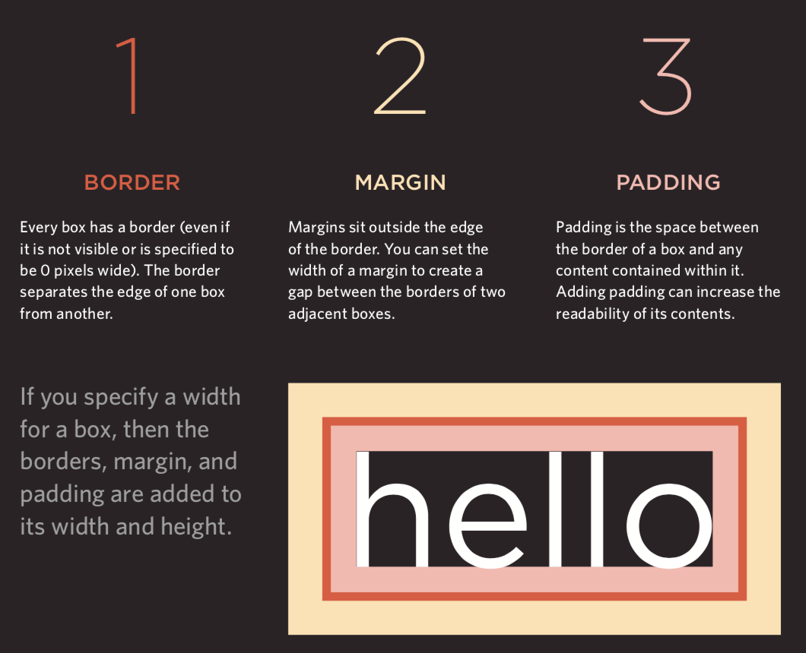
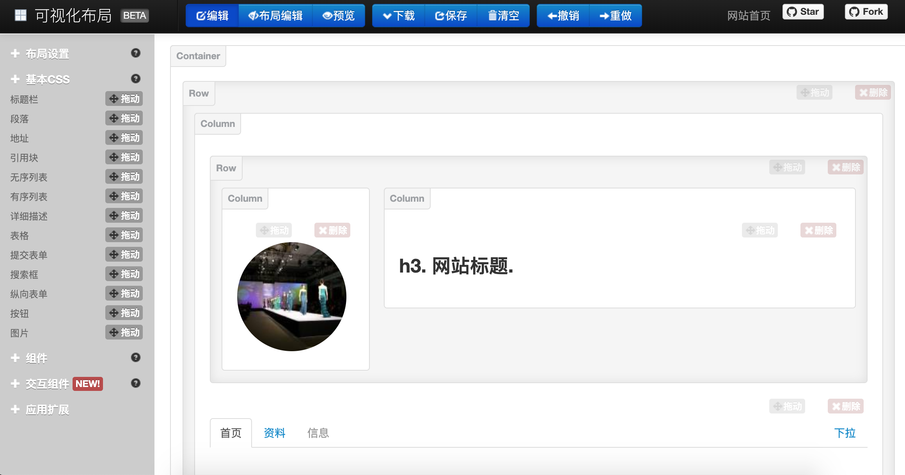

## Web前端概述

> 說明：本文使用的部分插圖來自*Jon Duckett*先生的*[HTML and CSS: Design and Build Websites](https://www.amazon.cn/dp/1118008189/ref=sr_1_5?__mk_zh_CN=%E4%BA%9A%E9%A9%AC%E9%80%8A%E7%BD%91%E7%AB%99&keywords=html+%26+css&qid=1554609325&s=gateway&sr=8-5)*一書，這是一本非常棒的前端入門書，有興趣的讀者可以在亞馬遜或者其他網站上找到該書的購買鏈接。

### HTML簡史

1. 1991年10月：一個非正式CERN（[歐洲核子研究中心](https://zh.wikipedia.org/wiki/%E6%AD%90%E6%B4%B2%E6%A0%B8%E5%AD%90%E7%A0%94%E7%A9%B6%E7%B5%84%E7%B9%94)）文件首次公開18個HTML標籤，這個文件的作者是物理學家[蒂姆·伯納斯-李](https://zh.wikipedia.org/wiki/%E8%92%82%E5%A7%86%C2%B7%E4%BC%AF%E7%BA%B3%E6%96%AF-%E6%9D%8E)，因此他是[萬維網](https://zh.wikipedia.org/wiki/%E4%B8%87%E7%BB%B4%E7%BD%91)的發明者，也是[萬維網聯盟](https://zh.wikipedia.org/wiki/%E4%B8%87%E7%BB%B4%E7%BD%91%E8%81%94%E7%9B%9F)的主席。
2. 1995年11月：HTML 2.0標準發佈（RFC 1866）。
3. 1997年1月：HTML 3.2作為[W3C](https://zh.wikipedia.org/wiki/W3C)推薦標準發佈。
4. 1997年12月：HTML 4.0作為W3C推薦標準發佈。
5.  1999年12月：HTML4.01作為W3C推薦標準發佈。
6. 2008年1月：HTML5由W3C作為工作草案發布。
7. 2011年5月：W3C將HTML5推進至“最終徵求”（Last Call）階段。
8. 2012年12月：W3C指定HTML5作為“候選推薦”階段。
9. 2014年10月：HTML5作為穩定W3C推薦標準發佈，這意味著HTML5的標準化已經完成。

#### HTML5新特性

1. 引入原生多媒體支持（audio和video標籤）
2. 引入可編程內容（canvas標籤）
3. 引入語義Web（article、aside、details、figure、footer、header、nav、section、summary等標籤）
4. 引入新的表單控件（日曆、郵箱、搜索、滑條等）
5. 引入對離線存儲更好的支持（localStorage和sessionStorage）
6. 引入對定位、拖放、WebSocket、後臺任務等的支持

### 使用標籤承載內容

####  結構

- head
  - title
  - meta
- body

#### 文本

- 標題和段落
  - h1 ~ h6
  - p
- 上標和下標
  - sup
  - sub
- 空白（白色空間摺疊）
- 折行和水平標尺
  - br
  - hr
- 語義化標籤
  - 加粗和強調 - strong
  - 引用 - blockquote
  - 縮寫詞和首字母縮寫詞 - abbr / acronym
  - 引文 - cite
  - 所有者聯繫信息 - address
  - 內容的修改 - ins / del

#### 列表（list）

 - 有序列表（ordered list）- ol / li
 - 無序列表（unordered list）- ul / li
 - 定義列表（definition list）- dl / dt / dd

#### 鏈接（anchor）

- 頁面鏈接
- 錨鏈接
- 功能鏈接

#### 圖像（image）

- 圖像存儲位置

  

- 圖像及其寬高

- 選擇正確的圖像格式
  - JPEG
  - GIF
  - PNG

- 矢量圖

- 語義化標籤 - figure / figcaption

#### 表格（table）

- 基本的表格結構 - table / tr / td
- 表格的標題 - caption
- 跨行和跨列 - rowspan屬性 / colspan屬性
- 長表格 - thead / tbody / tfoot

#### 表單（form）

- 重要屬性 - action / method
- 表單控件（input）- type屬性
  - 文本框 - text / 密碼框 - password / 數字框 - number
  - 郵箱 - email / 電話 - tel / 日期 - date / 滑條 - range / URL - url / 搜索 - search
  - 單選按鈕 - radio / 複選按鈕 - checkbox
  - 文件上傳 - file / 隱藏域（埋點）- hidden
  - 提交按鈕 - submit / 圖像按鈕 - image  / 重置按鈕 - reset
- 下拉列表 - select / option
- 文本域（多行文本）- textarea
- 組合表單元素 - fieldset / legend

#### 音視頻（audio / video）

- 視頻格式和播放器
- 視頻託管服務
- 添加視頻的準備工作
- video標籤和屬性 - autoplay / controls / loop / muted / preload / src
- audio標籤和屬性 - autoplay / controls / loop / muted / preload / src / width / height / poster

#### 其他

- 文檔類型

- 註釋

- 屬性
  - id
  - class

- 塊級元素 / 行級元素

- 內聯框架（internal frame）

- 字符實體（實體替換符）

  

### 使用CSS渲染頁面

#### 簡介

- CSS的作用

- CSS的工作原理

- 規則、屬性和值

  

- 常用選擇器

  

#### 顏色（color）

- 如何指定顏色
- 顏色術語和顏色對比
- 背景色

#### 文本（text / font）

- 文本的大小和字型(font-size / font-family)

  

  

- 粗細、樣式、拉伸和裝飾(font-weight / font-style / font-stretch / text-decoration)

  

- 行間距(line-height)、字母間距(letter-spacing)和單詞間距(word-spacing)

- 對齊(text-align)方式和縮進(text-ident)

- 鏈接樣式（:link / :visited / :active / :hover）

- CSS3新屬性
  - 陰影效果 - text-shadow
  - 首字母和首行文本(:first-letter / :first-line)
  - 響應用戶

#### 盒子（box model）

- 盒子大小的控制（width / height）

  

- 盒子的邊框、外邊距和內邊距（border /  margin / padding）

  

- 盒子的顯示和隱藏（display / visibility）

- CSS3新屬性
  - 邊框圖像（border-image）
  - 投影（border-shadow）
  - 圓角（border-radius）

#### 列表、表格和表單

- 列表的項目符號（list-style）
- 表格的邊框和背景（border-collapse）
- 表單控件的外觀
- 表單控件的對齊
- 瀏覽器的開發者工具

#### 圖像

- 控制圖像的大小（display: inline-block）
- 對齊圖像
- 背景圖像（background / background-image / background-repeat / background-position）

#### 佈局

- 控制元素的位置（position / z-index）
  - 普通流
  - 相對定位
  - 絕對定位
  - 固定定位
  - 浮動元素（float / clear）
- 網站佈局

  - HTML5佈局

    
- 適配屏幕尺寸
  - 固定寬度佈局
  - 流體佈局
  - 佈局網格

### 使用JavaScript控制行為

#### JavaScript基本語法

- 語句和註釋
- 變量和數據類型
  - 聲明和賦值
  - 簡單數據類型和複雜數據類型
  - 變量的命名規則
- 表達式和運算符
  - 賦值運算符
  - 算術運算符
  - 比較運算符
  - 邏輯運算符
- 分支結構
  - `if...else...`
  - `switch...cas...default...`
- 循環結構
  - `for`循環
  - `while`循環
  - `do...while`循環
- 數組
  - 創建數組
  - 操作數組中的元素
- 函數
  - 聲明函數
  - 調用函數
  - 參數和返回值
  - 匿名函數
  - 立即調用函數

#### 面向對象

 - 對象的概念
 - 創建對象的字面量語法
 - 訪問成員運算符
 - 創建對象的構造函數語法
    - `this`關鍵字
 - 添加和刪除屬性
    - `delete`關鍵字
 - 標準對象
    - `Number` / `String` / `Boolean` / `Symbol` / `Array` / `Function` 
    - `Date` / `Error` / `Math` / `RegEx` / `Object` / `Map` / `Set`
    - `JSON` / `Promise` / `Generator` / `Reflect` / `Proxy`

#### BOM

 - `window`對象的屬性和方法
 - `history`對象
    - `forward()` / `back()` / `go()`
 - `location`對象
 - `navigator`對象
 - `screen`對象

#### DOM

 - DOM樹
 - 訪問元素
    - `getElementById()` / `querySelector()`
    - `getElementsByClassName()` / `getElementsByTagName()` / `querySelectorAll()`
    - `parentNode` / `previousSibling` / `nextSibling` / `children` / `firstChild` / `lastChild`
- 操作元素
  - `nodeValue`
  - `innerHTML` / `textContent` / `createElement()` / `createTextNode()` / `appendChild()` / `insertBefore()` / `removeChild()`
  - `className` / `id` / `hasAttribute()` / `getAttribute()` / `setAttribute()` / `removeAttribute()`
- 事件處理
  - 事件類型
    - UI事件：`load` / `unload` / `error` / `resize` / `scroll`
    - 鍵盤事件：`keydown` / `keyup` / `keypress`
    - 鼠標事件：`click` / `dbclick` / `mousedown` / `mouseup` / `mousemove` / `mouseover` / `mouseout`
    - 焦點事件：`focus` / `blur`
    - 表單事件：`input` / `change` / `submit` / `reset` / `cut` / `copy` / `paste` / `select`
  - 事件綁定
    - HTML事件處理程序（不推薦使用，因為要做到標籤與代碼分離）
    - 傳統的DOM事件處理程序（只能附加一個回調函數）
    - 事件監聽器（舊的瀏覽器中不被支持）
  - 事件流：事件捕獲 / 事件冒泡
  - 事件對象（低版本IE中的window.event）
    - `target`（有些瀏覽器使用srcElement）
    - `type`
    - `cancelable`
    - `preventDefault()`
    - `stopPropagation()`（低版本IE中的cancelBubble）
  - 鼠標事件 - 事件發生的位置
    - 屏幕位置：`screenX`和`screenY`
    - 頁面位置：`pageX`和`pageY`
    - 客戶端位置：`clientX`和`clientY`
  - 鍵盤事件 - 哪個鍵被按下了
    - `keyCode`屬性（有些瀏覽器使用`which`）
    - `String.fromCharCode(event.keyCode)`
  - HTML5事件
    - `DOMContentLoaded`
    - `hashchange`
    - `beforeunload`

#### JavaScript API

- 客戶端存儲 - `localStorage`和`sessionStorage`

  ```JavaScript
  localStorage.colorSetting = '#a4509b';
  localStorage['colorSetting'] = '#a4509b';
  localStorage.setItem('colorSetting', '#a4509b');
  ```

- 獲取位置信息 - `geolocation`

  ```JavaScript
  navigator.geolocation.getCurrentPosition(function(pos) { 		  
      console.log(pos.coords.latitude)
      console.log(pos.coords.longitude)
  })
  ```

- 從服務器獲取數據 - Fetch API
- 繪製圖形 - `<canvas>`的API
- 音視頻 - `<audio>`和`<video>`的API

### 使用jQuery

#### jQuery概述

1. Write Less Do More（用更少的代碼來完成更多的工作）
2. 使用CSS選擇器來查找元素（更簡單更方便）
3. 使用jQuery方法來操作元素（解決瀏覽器兼容性問題、應用於所有元素並施加多個方法）

#### 引入jQuery

- 下載jQuery的開發版和壓縮版
- 從CDN加載jQuery

```HTML
<script src="https://cdn.bootcss.com/jquery/3.3.1/jquery.min.js"></script>
<script>
    window.jQuery || 
        document.write('<script src="js/jquery-3.3.1.min.js"></script>')
</script>
```

#### 查找元素

- 選擇器
  - \* / element / #id / .class / selector1, selector2
  - ancestor descendant / parent>child / previous+next / previous~siblings 
- 篩選器
  - 基本篩選器：:not(selector) / :first / :last / :even / :odd / :eq(index) / :gt(index) / :lt(index) / :animated / :focus
  - 內容篩選器：:contains('…') / :empty / :parent / :has(selector)
  - 可見性篩選器：:hidden / :visible
  - 子節點篩選器：:nth-child(expr) / :first-child / :last-child / :only-child
  - 屬性篩選器：[attribute] / [attribute='value'] / [attribute!='value'] / [attribute^='value'] / [attribute$='value'] / [attribute|='value'] / [attribute~='value']
- 表單：:input / :text / :password / :radio / :checkbox / :submit / :image / :reset / :button / :file / :selected / :enabled / :disabled / :checked

#### 執行操作

- 內容操作
  - 獲取/修改內容：`html()` / `text()` / `replaceWith()` / `remove()`
  - 獲取/設置元素：`before()` / `after()` / `prepend()` / `append()` / `remove()` / `clone()` / `unwrap()` / `detach()` / `empty()` / `add()`
  - 獲取/修改屬性：`attr()` / `removeAttr()` / `addClass()` / `removeClass()` / `css()`
  - 獲取/設置表單值：`val()`
- 查找操作
  - 查找方法：`find()` /  `parent()` / `children()` / `siblings()` / `next()` / `nextAll()` / `prev()` / `prevAll()`
  - 篩選器：`filter()` / `not()` / `has()` / `is()` / `contains()`
  - 索引編號：`eq()`
- 尺寸和位置
  - 尺寸相關：`height()` / `width()` / `innerHeight()` / `innerWidth()` / `outerWidth()` / `outerHeight()`
  - 位置相關：`offset()` / `position()` / `scrollLeft()` / `scrollTop()`
- 特效和動畫
  - 基本動畫：`show()` / `hide()` / `toggle()`
  - 消失出現：`fadeIn()` / `fadeOut()` / `fadeTo()` / `fadeToggle()`
  - 滑動效果：`slideDown()` / `slideUp()` / `slideToggle()`
  - 自定義：`delay()` / `stop()` / `animate()`
- 事件
  - 文檔加載：`ready()` / `load()`
  - 用戶交互：`on()` / `off()`

#### 鏈式操作

#### 檢測頁面是否可用

```HTML
<script>
    $(document).ready(function() {
        
    });
</script>
```

```HTML
<script>
    $(function() {
        
    });
</script>
```

#### jQuery插件

- jQuery Validation
- jQuery Treeview
- jQuery Autocomplete
- jQuery UI

#### 避免和其他庫的衝突

先引入其他庫再引入jQuery的情況。

```HTML
<script src="other.js"></script>
<script src="jquery.js"></script>
<script>
	jQuery.noConflict();
    jQuery(function() {
        jQuery('div').hide();
    });
</script>
```

先引入jQuery再引入其他庫的情況。

```HTML

<script src="jquery.js"></script>
<script src="other.js"></script>
<script>
    jQuery(function() {
        jQuery('div').hide();
    });
</script>
```

#### 使用Ajax

Ajax是一種在無需重新加載整個網頁的情況下，能夠更新部分網頁的技術。

- 原生的Ajax
- 基於jQuery的Ajax
  - 加載內容
  - 提交表單

### 前端框架

#### 漸進式框架 - [Vue.js](<https://cn.vuejs.org/>)

前後端分離開發（前端渲染）必選框架。

##### 快速上手

1. 引入Vue的JavaScript文件，我們仍然推薦從CDN服務器加載它。

   ```HTML
   <script src="https://cdn.jsdelivr.net/npm/vue"></script>
   ```

2. 數據綁定（聲明式渲染 ）。

   ```HTML
   <div id="app">
   	<h1>{{ product }}庫存信息</h1>
   </div>
   
   <script src="https://cdn.jsdelivr.net/npm/vue"></script>
   <script>
   	const app = new Vue({
   		el: '#app',
   		data: {
   			product: 'iPhone X'
   		}
   	});
   </script>
   ```

3. 條件與循環。

   ```HTML
   <div id="app">
   	<h1>庫存信息</h1>
       <hr>
   	<ul>
   		<li v-for="product in products">
   			{{ product.name }} - {{ product.quantity }}
   			<span v-if="product.quantity === 0">
   				已經售罄
   			</span>
   		</li>
   	</ul>
   </div>
   
   <script src="https://cdn.jsdelivr.net/npm/vue"></script>
   <script>
   	const app = new Vue({
   		el: '#app',
   		data: {
   			products: [
   				{"id": 1, "name": "iPhone X", "quantity": 20},
   				{"id": 2, "name": "華為 Mate20", "quantity": 0},
   				{"id": 3, "name": "小米 Mix3", "quantity": 50}
   			]
   		}
   	});
   </script>
   ```

4. 計算屬性。

   ```HTML
   <div id="app">
   	<h1>庫存信息</h1>
   	<hr>
   	<ul>
   		<li v-for="product in products">
   			{{ product.name }} - {{ product.quantity }}
   			<span v-if="product.quantity === 0">
   				已經售罄
   			</span>
   		</li>
   	</ul>
   	<h2>庫存總量：{{ totalQuantity }}臺</h2>
   </div>
   
   <script src="https://cdn.jsdelivr.net/npm/vue"></script>
   <script>
   	const app = new Vue({
   		el: '#app',
   		data: {
   			products: [
   				{"id": 1, "name": "iPhone X", "quantity": 20},
   				{"id": 2, "name": "華為 Mate20", "quantity": 0},
   				{"id": 3, "name": "小米 Mix3", "quantity": 50}
   			]
   		},
   		computed: {
   			totalQuantity() {
   				return this.products.reduce((sum, product) => {
   					return sum + product.quantity
   				}, 0);
   			}
   		}
   	});
   </script>
   ```

5. 處理事件。

   ```HTML
   <div id="app">
   	<h1>庫存信息</h1>
   	<hr>
   	<ul>
   		<li v-for="product in products">
   			{{ product.name }} - {{ product.quantity }}
   			<span v-if="product.quantity === 0">
   				已經售罄
   			</span>
   			<button @click="product.quantity += 1">
   				增加庫存
   			</button>
   		</li>
   	</ul>
   	<h2>庫存總量：{{ totalQuantity }}臺</h2>
   </div>
   
   <script src="https://cdn.jsdelivr.net/npm/vue"></script>
   <script>
   	const app = new Vue({
   		el: '#app',
   		data: {
   			products: [
   				{"id": 1, "name": "iPhone X", "quantity": 20},
   				{"id": 2, "name": "華為 Mate20", "quantity": 0},
   				{"id": 3, "name": "小米 Mix3", "quantity": 50}
   			]
   		},
   		computed: {
   			totalQuantity() {
   				return this.products.reduce((sum, product) => {
   					return sum + product.quantity
   				}, 0);
   			}
   		}
   	});
   </script>
   ```

6. 用戶輸入。

   ```HTML
   <div id="app">
   	<h1>庫存信息</h1>
   	<hr>
   	<ul>
   		<li v-for="product in products">
   			{{ product.name }} - 
   			<input type="number" v-model.number="product.quantity" min="0">
   			<span v-if="product.quantity === 0">
   				已經售罄
   			</span>
   			<button @click="product.quantity += 1">
   				增加庫存
   			</button>
   		</li>
   	</ul>
   	<h2>庫存總量：{{ totalQuantity }}臺</h2>
   </div>
   
   <script src="https://cdn.jsdelivr.net/npm/vue"></script>
   <script>
   	const app = new Vue({
   		el: '#app',
   		data: {
   			products: [
   				{"id": 1, "name": "iPhone X", "quantity": 20},
   				{"id": 2, "name": "華為 Mate20", "quantity": 0},
   				{"id": 3, "name": "小米 Mix3", "quantity": 50}
   			]
   		},
   		computed: {
   			totalQuantity() {
   				return this.products.reduce((sum, product) => {
   					return sum + product.quantity
   				}, 0);
   			}
   		}
   	});
   </script>
   ```

7. 通過網絡加載JSON數據。

   ```HTML
   <div id="app">
   	<h2>庫存信息</h2>
   	<ul>
   		<li v-for="product in products">
   			{{ product.name }} - {{ product.quantity }}
   			<span v-if="product.quantity === 0">
   				已經售罄
   			</span>
   		</li>
   	</ul>
   </div>
   
   <script src="https://cdn.jsdelivr.net/npm/vue"></script>
   <script>
   	const app = new Vue({
   		el: '#app',
   		data: {
   			products: []
   		}，
   		created() {
   			fetch('https://jackfrued.top/api/products')
   				.then(response => response.json())
   				.then(json => {
   					this.products = json
   				});
   		}
   	});
   </script>
   ```

##### 使用腳手架 - vue-cli

Vue為商業項目開發提供了非常便捷的腳手架工具vue-cli，通過工具可以省去手工配置開發環境、測試環境和運行環境的步驟，讓開發者只需要關注要解決的問題。

1. 安裝腳手架。
2. 創建項目。
3. 安裝依賴包。
4. 運行項目。


#### UI框架 - [Element](<http://element-cn.eleme.io/#/zh-CN>)

基於Vue 2.0的桌面端組件庫，用於構造用戶界面，支持響應式佈局。

1. 引入Element的CSS和JavaScript文件。

   ```HTML
   <!-- 引入樣式 -->
   <link rel="stylesheet" href="https://unpkg.com/element-ui/lib/theme-chalk/index.css">
   <!-- 引入組件庫 -->
   <script src="https://unpkg.com/element-ui/lib/index.js"></script>
   ```

2. 一個簡單的例子。

   ```HTML
   <!DOCTYPE html>
   <html>
   	<head>
   		<meta charset="UTF-8">
   		<link rel="stylesheet" href="https://unpkg.com/element-ui/lib/theme-chalk/index.css">
   	</head>
   	<body>
   		<div id="app">
   			<el-button @click="visible = true">點我</el-button>
   			<el-dialog :visible.sync="visible" title="Hello world">
   				<p>開始使用Element吧</p>
   			</el-dialog>
               </div>
   	</body>
   	<script src="https://unpkg.com/vue/dist/vue.js"></script>
   	<script src="https://unpkg.com/element-ui/lib/index.js"></script>
   	<script>
   		new Vue({
   			el: '#app',
   			data: {
   				visible: false,
   			}
   		})
   	</script>
   </html>
   ```

3. 使用組件。

   ```HTML
   <!DOCTYPE html>
   <html>
   	<head>
   		<meta charset="UTF-8">
   		<link rel="stylesheet" href="https://unpkg.com/element-ui/lib/theme-chalk/index.css">
   	</head>
   	<body>
   		<div id="app">
   			<el-table :data="tableData" stripe style="width: 100%">
   				<el-table-column prop="date" label="日期" width="180">
   				</el-table-column>
   				<el-table-column prop="name" label="姓名" width="180">
   				</el-table-column>
   				<el-table-column prop="address" label="地址">
   				</el-table-column>
   			</el-table>
   		</div>
   	</body>
   	<script src="https://unpkg.com/vue/dist/vue.js"></script>
   	<script src="https://unpkg.com/element-ui/lib/index.js"></script>
   	<script>
   		new Vue({
   			el: '#app',
   			data: {
   				tableData:  [
   					{
   						date: '2016-05-02',
   						name: '王一霸',
   						address: '上海市普陀區金沙江路 1518 弄'
   					}, 
   					{
   						date: '2016-05-04',
   						name: '劉二狗',
   						address: '上海市普陀區金沙江路 1517 弄'
   					}, 
   					{
   						date: '2016-05-01',
   						name: '楊三萌',
   						address: '上海市普陀區金沙江路 1519 弄'
   					}, 
   					{
   						date: '2016-05-03',
   						name: '陳四吹',
   						address: '上海市普陀區金沙江路 1516 弄'
   					}
   				]
   			}
   		})
   	</script>
   </html>
   ```


#### 報表框架 - [ECharts](<https://echarts.baidu.com>)

百度出品的開源可視化庫，常用於生成各種類型的報表。


#### 基於彈性盒子的CSS框架 - [Bulma](<https://bulma.io/>)

Bulma是一個基於Flexbox的現代化的CSS框架，其初衷就是移動優先（Mobile First），模塊化設計，可以輕鬆用來實現各種簡單或者複雜的內容佈局，即使不懂CSS的開發者也能夠使用它定製出漂亮的頁面。

```HTML
<!DOCTYPE html>
<html lang="en">
<head>
	<meta charset="UTF-8">
	<title>Bulma</title>
	<link href="https://cdn.bootcss.com/bulma/0.7.4/css/bulma.min.css" rel="stylesheet">
	<style type="text/css">
		div { margin-top: 10px; }
		.column { color: #fff; background-color: #063; margin: 10px 10px; text-align: center; }
	</style>
</head>
<body>
	<div class="columns">
		<div class="column">1</div>
		<div class="column">2</div>
		<div class="column">3</div>
		<div class="column">4</div>
	</div>
	<div>
		<a class="button is-primary">Primary</a>
		<a class="button is-link">Link</a>
		<a class="button is-info">Info</a>
		<a class="button is-success">Success</a>
		<a class="button is-warning">Warning</a>
		<a class="button is-danger">Danger</a>
	</div>
	<div>
		<progress class="progress is-danger is-medium" max="100">60%</progress>
	</div>
	<div>
		<table class="table is-hoverable">
			<tr>
				<th>One</th>
				<th>Two</th>
			</tr>
			<tr>
				<td>Three</td>
				<td>Four</td>
			</tr>
			<tr>
				<td>Five</td>
				<td>Six</td>
			</tr>
			<tr>
				<td>Seven</td>
				<td>Eight</td>
			</tr>
			<tr>
				<td>Nine</td>
				<td>Ten</td>
			</tr>
			<tr>
				<td>Eleven</td>
				<td>Twelve</td>
			</tr>
		</table>
	</div>
</body>
</html>
```

#### 響應式佈局框架 - [Bootstrap](<http://www.bootcss.com/>)

用於快速開發Web應用程序的前端框架，支持響應式佈局。

1. 特點
   - 支持主流的瀏覽器和移動設備
   - 容易上手
   - 響應式設計

2. 內容
   - 網格系統
   - 封裝的CSS
   - 現成的組件
   - JavaScript插件

3. 可視化

   