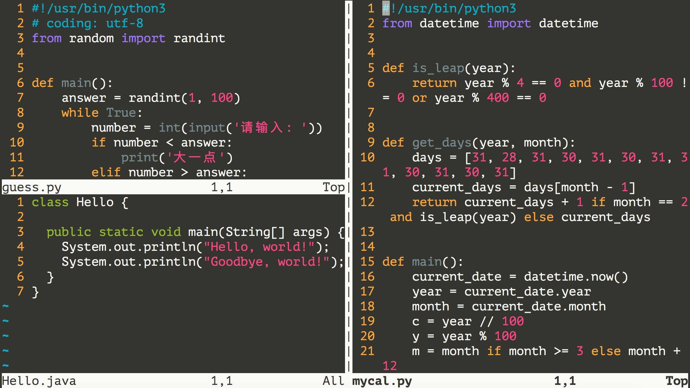

## 玩轉Linux操作系統

> 說明：本文中對Linux命令的講解都是基於名為CentOS的Linux發行版本，我自己使用的是阿里雲服務器，系統版本為CentOS Linux release 7.6.1810。不同的Linux發行版本在Shell命令和工具程序上會有一些差別，但是這些差別是很小的。

### 操作系統發展史

只有硬件沒有軟件的計算機系統被稱之為“裸機”，我們很難用“裸機”來完成計算機日常的工作（如存儲和運算），所以必須用特定的軟件來控制硬件的工作。最靠近計算機硬件的軟件是系統軟件，其中最為重要的就是“操作系統”。“操作系統”是控制和管理整個計算機硬件和軟件資源、實現資源分配和任務調配、為系統用戶以及其他軟件提供接口和環境的程序的集合。

#### 沒有操作系統（手工操作）

在計算機誕生之初沒有操作系統的年代，人們先把程序紙帶（或卡片）裝上計算機，然後啟動輸入機把程序送入計算機，接著通過控制檯開關啟動程序運行。當程序執行完畢，打印機輸出計算的結果，用戶卸下並取走紙帶（或卡片）。第二個用戶上機，重複同樣的步驟。在整個過程中用戶獨佔機器，CPU等待手工操作，資源利用率極低。

#### 批處理系統

首先啟動計算機上的一個監督程序，在監督程序的控制下，計算機能夠自動的、成批的處理一個或多個用戶的作業。完成一批作業後，監督程度又從輸入機讀取作業存入磁帶機。按照上面的步驟重複處理任務。監督程序不停的處理各個作業，實現了作業的自動轉接，減少了作業的建立時間和手工操作時間，提高了計算機資源的利用率。 批處理系統又可以分為單道批處理系統、多道批處理系統、聯機批處理系統、脫機批處理系統。

#### 分時系統和實時系統

分時系統是把處理器的運行時間分成很短的時間片，按時間片輪流把處理機分配給各聯機作業使用。 若某個作業在分配給它的時間片內不能完成其計算，則該作業暫時中斷，把處理機讓給另一作業使用，等待下一輪調度時再繼續其運行。由於計算機速度很快，作業運行輪轉得很快，給每個用戶的感覺是他獨佔了一臺計算機。而每個用戶可以通過自己的終端向系統發出各種操作控制命令，在充分的人機交互情況下，完成作業的運行。為了解決分時系統不能及時響應用戶指令的情況，又出現了能夠在在嚴格的時間範圍內完成事件處理，及時響應隨機外部事件的實時系統。

#### 通用操作系統

1. 1960s：IBM的System/360系列的機器有了統一的操作系統OS/360。

2. 1965年：AT&T的貝爾實驗室加入GE和MIT的合作計劃開始開發MULTICS。

3. 1969年：MULTICS項目失敗，Ken Tompson賦閒在家，為了玩“Space Travel”遊戲用匯編語言在當時已經被淘汰的PDP-7上開發了Unics。

   > 注：很難想象，Unix這麼偉大的系統，居然是一個賦閒在家的程序員（關鍵是老婆回孃家還帶上了孩子）在一臺被淘汰的設備上為了玩遊戲開發出來的。

4. 1970年~1971年：Ken Tompson和Dennis Ritchie用B語言在PDP-11上重寫了Unics，並在Brian Kernighan的建議下將其更名為Unix。

   

5. 1972年~1973年：Dennis Ritchie發明了C語言來取代可移植性較差的B語言，並開啟了用C語言重寫Unix的工作。

6. 1974年：Unix推出了里程碑意義的第5版，幾乎完全用C語言來實現。

7. 1979年：從Unix第7版開始，AT&T發佈新的使用條款，將Unix私有化。

8. 1987年：Andrew S. Tanenbaum教授為了能在課堂上為學生講解操作系統運作的細節，決定在不使用任何AT&T的源代碼前提下，自行開發與Unix兼容的操作系統以避免版權上的爭議，該系統被命名為Minix。

   

9. 1991年：Linus Torvalds就讀於芬蘭赫爾辛基大學期間，嘗試在Minix上做一些開發工作，但因為Minix只是作為教學用途的操作系統，功能並不強大，為了方便在學校的新聞組和郵件系統中讀寫和下載文件，Linus編寫了磁盤驅動程序和文件系統，這些東西形成了Linux系統內核的雛形。

   

下圖是Unix操作系統家族的圖譜。


### Linux概述

Linux是一個通用操作系統。一個操作系統要負責任務調度、內存分配、處理外圍設備I/O等操作。操作系統通常由內核（運行其他程序，管理像磁盤、打印機等硬件設備的核心程序）和系統程序（設備驅動、底層庫、shell、服務程序等）兩部分組成。

Linux內核是芬蘭人Linus Torvalds開發的，於1991年9月發佈。而Linux操作系統作為Internet時代的產物，它是由全世界許多開發者共同合作開發的，是一個自由的操作系統（注意自由和免費並不是同一個概念，想了解二者的差別可以[點擊這裡](https://www.debian.org/intro/free)）。

### Linux系統優點

1. 通用操作系統，不跟特定的硬件綁定。
2. 用C語言編寫，可移植性強，有內核編程接口。
3. 支持多用戶和多任務，支持安全的分層文件系統。
4. 大量的實用程序，完善的網絡功能以及強大的支持文檔。
5. 可靠的安全性和良好的穩定性，對開發者更友好。

### Linux系統發行版本

1. [Redhat](https://www.redhat.com/en)
2. [Ubuntu](https://www.ubuntu.com/)
3. [CentOS](https://www.centos.org/)
4. [Fedora](https://getfedora.org/)
5. [Debian](https://www.debian.org/)
6. [openSUSE](https://www.opensuse.org/)

### 基礎命令

Linux系統的命令通常都是如下所示的格式：

```Shell
命令名稱 [命名參數] [命令對象]
```

1. 獲取登錄信息 - **w** / **who** / **last**/ **lastb**。

   ```Shell
   [root ~]# w
    23:31:16 up 12:16,  2 users,  load average: 0.00, 0.01, 0.05
   USER     TTY      FROM             LOGIN@   IDLE   JCPU   PCPU WHAT
   root     pts/0    182.139.66.250   23:03    4.00s  0.02s  0.00s w
   jackfrue pts/1    182.139.66.250   23:26    3:56   0.00s  0.00s -bash
   [root ~]# who
   root     pts/0        2018-04-12 23:03 (182.139.66.250)
   jackfrued pts/1        2018-04-12 23:26 (182.139.66.250)
   [root ~]# who am i
   root     pts/0        2018-04-12 23:03 (182.139.66.250)
   [root ~]# who mom likes
   root     pts/0        2018-04-12 23:03 (182.139.66.250)
   [root ~]# last
   root     pts/0        117.136.63.184   Sun May 26 18:57   still logged in   
   reboot   system boot  3.10.0-957.10.1. Mon May 27 02:52 - 19:10  (-7:-42)   
   root     pts/4        117.136.63.184   Sun May 26 18:51 - crash  (08:01)    
   root     pts/4        117.136.63.184   Sun May 26 18:49 - 18:49  (00:00)    
   root     pts/3        117.136.63.183   Sun May 26 18:35 - crash  (08:17)    
   root     pts/2        117.136.63.183   Sun May 26 18:34 - crash  (08:17)    
   root     pts/0        117.136.63.183   Sun May 26 18:10 - crash  (08:42)    
   ```

2. 查看自己使用的Shell - **ps**。

   Shell也被稱為“殼”或“殼程序”，它是用戶與操作系統內核交流的翻譯官，簡單的說就是人與計算機交互的界面和接口。目前很多Linux系統默認的Shell都是bash（<u>B</u>ourne <u>A</u>gain <u>SH</u>ell），因為它可以使用tab鍵進行命令和路徑補全、可以保存歷史命令、可以方便的配置環境變量以及執行批處理操作。

   ```Shell
   [root@izwz97tbgo9lkabnat2lo8z ~]# ps
     PID TTY          TIME CMD
    3531 pts/0    00:00:00 bash
    3553 pts/0    00:00:00 ps
   ```

3. 查看命令的說明和位置 - **whatis** / **which** / **whereis**。

   ```Shell
   [root ~]# whatis ps
   ps (1)        - report a snapshot of the current processes.
   [root ~]# whatis python
   python (1)    - an interpreted, interactive, object-oriented programming language
   [root ~]# whereis ps
   ps: /usr/bin/ps /usr/share/man/man1/ps.1.gz
   [root ~]# whereis python
   python: /usr/bin/python /usr/bin/python2.7 /usr/lib/python2.7 /usr/lib64/python2.7 /etc/python /usr/include/python2.7 /usr/share/man/man1/python.1.gz
   [root ~]# which ps
   /usr/bin/ps
   [root ~]# which python
   /usr/bin/python
   ```

4. 清除屏幕上顯示的內容 - **clear**。

5. 查看幫助文檔 - **man** / **info** / **help** / **apropos**。
   ```Shell
   [root@izwz97tbgo9lkabnat2lo8z ~]# ps --help
   Usage:
    ps [options]
    Try 'ps --help <simple|list|output|threads|misc|all>'
     or 'ps --help <s|l|o|t|m|a>'
    for additional help text.
   For more details see ps(1).
   [root@izwz97tbgo9lkabnat2lo8z ~]# man ps
   PS(1)                                User Commands                                PS(1)
   NAME
          ps - report a snapshot of the current processes.
   SYNOPSIS
          ps [options]
   DESCRIPTION
   ...
   ```

6. 查看系統和主機名 - **uname** / **hostname**。

   ```Shell
   [root@izwz97tbgo9lkabnat2lo8z ~]# uname
   Linux
   [root@izwz97tbgo9lkabnat2lo8z ~]# hostname
   izwz97tbgo9lkabnat2lo8z
   [root@iZwz97tbgo9lkabnat2lo8Z ~]# cat /etc/centos-release
   CentOS Linux release 7.6.1810 (Core)
   ```

   > 說明：`cat`是連接文件內容並打印到標準輸出的命令，後面會講到該命令；`/etc`是Linux系統上的一個非常重要的目錄，它保存了很多的配置文件；`centos-release`是該目錄下的一個文件，因為我自己使用的Linux發行版本是CentOS 7.6，因此這裡會有一個這樣的文件。

7. 時間和日期 - **date** / **cal**。

   ```Shell
   [root@iZwz97tbgo9lkabnat2lo8Z ~]# date
   Wed Jun 20 12:53:19 CST 2018
   [root@iZwz97tbgo9lkabnat2lo8Z ~]# cal
         June 2018
   Su Mo Tu We Th Fr Sa
                   1  2
    3  4  5  6  7  8  9
   10 11 12 13 14 15 16
   17 18 19 20 21 22 23
   24 25 26 27 28 29 30
   [root@iZwz97tbgo9lkabnat2lo8Z ~]# cal 5 2017
         May 2017
   Su Mo Tu We Th Fr Sa
       1  2  3  4  5  6
    7  8  9 10 11 12 13
   14 15 16 17 18 19 20
   21 22 23 24 25 26 27
   28 29 30 31
   ```

8. 重啟和關機 - **reboot** / **shutdown**。

   ```Shell
   [root ~]# shutdown -h +5
   Shutdown scheduled for Sun 2019-05-26 19:34:27 CST, use 'shutdown -c' to cancel.
   [root ~]# 
   Broadcast message from root (Sun 2019-05-26 19:29:27 CST):
   
   The system is going down for power-off at Sun 2019-05-26 19:34:27 CST!
   [root ~]# shutdown -c
   
   Broadcast message from root (Sun 2019-05-26 19:30:22 CST):
   
   The system shutdown has been cancelled at Sun 2019-05-26 19:31:22 CST!
   [root ~]# shutdown -r 23:58
   Shutdown scheduled for Sun 2019-05-26 23:58:00 CST, use 'shutdown -c' to cancel.
   [root ~]# shutdown -c
   
   Broadcast message from root (Sun 2019-05-26 19:31:06 CST):
   
   The system shutdown has been cancelled at Sun 2019-05-26 19:32:06 CST!
   ```

   > 說明：在執行`shutdown`命令時會向登錄系統的用戶發出警告，可以在命令後面跟上警告消息來替換默認的警告消息，也可以在`-h`參數後通過`now`來表示立刻關機。

9. 退出登錄 -  **exit** / **logout**。

10. 查看歷史命令 - **history**。

  ```Shell
  [root@iZwz97tbgo9lkabnat2lo8Z ~]# history
  ...
  452  ls
  453  cd Python-3.6.5/
  454  clear
  455  history
  [root@iZwz97tbgo9lkabnat2lo8Z ~]# !454
  ```

  > 說明：查看到歷史命令之後，可以用`!歷史命令編號`來重新執行該命令；通過`history -c`可以清除歷史命令。

### 實用程序

#### 文件和文件夾操作

1. 創建/刪除空目錄 - **mkdir** / **rmdir**。

   ```Shell
   [root ~]# mkdir abc
   [root ~]# mkdir -p xyz/abc
   [root ~]# rmdir abc
   ```

2. 創建/刪除文件 - **touch** / **rm**。

   ```Shell
   [root ~]# touch readme.txt
   [root ~]# touch error.txt
   [root ~]# rm error.txt
   rm: remove regular empty file ‘error.txt’? y
   [root ~]# rm -rf xyz
   ```

   - `touch`命令用於創建空白文件或修改文件時間。在Linux系統中一個文件有三種時間：
     - 更改內容的時間 - mtime。
     - 更改權限的時間 - ctime。
     - 最後訪問時間 - atime。
   - `rm`的幾個重要參數：
     - `-i`：交互式刪除，每個刪除項都會進行詢問。
     - `-r`：刪除目錄並遞歸的刪除目錄中的文件和目錄。
     - `-f`：強制刪除，忽略不存在的文件，沒有任何提示。

3. 切換和查看當前工作目錄 - **cd** / **pwd**。

   > 說明：`cd`命令後面可以跟相對路徑（以當前路徑作為參照）或絕對路徑（以`/`開頭）來切換到指定的目錄，也可以用`cd ..`來返回上一級目錄。請大家想一想，如果要返回到上上一級目錄應該給`cd`命令加上什麼樣的參數呢？

4. 查看目錄內容 - **ls**。

   - `-l`：以長格式查看文件和目錄。
   - `-a`：顯示以點開頭的文件和目錄（隱藏文件）。
   - `-R`：遇到目錄要進行遞歸展開（繼續列出目錄下面的文件和目錄）。
   - `-d`：只列出目錄，不列出其他內容。
   - `-S` / `-t`：按大小/時間排序。

5. 查看文件內容 - **cat** / **tac** / **head** / **tail** / **more** / **less** / **rev** / **od**。

   ```Shell
   [root ~]# wget http://www.sohu.com/ -O sohu.html
   --2018-06-20 18:42:34--  http://www.sohu.com/
   Resolving www.sohu.com (www.sohu.com)... 14.18.240.6
   Connecting to www.sohu.com (www.sohu.com)|14.18.240.6|:80... connected.
   HTTP request sent, awaiting response... 200 OK
   Length: 212527 (208K) [text/html]
   Saving to: ‘sohu.html’
   100%[==================================================>] 212,527     --.-K/s   in 0.03s
   2018-06-20 18:42:34 (7.48 MB/s) - ‘sohu.html’ saved [212527/212527]
   [root ~]# cat sohu.html
   ...
   [root ~]# head -10 sohu.html
   <!DOCTYPE html>
   <html>
   <head>
   <title>搜狐</title>
   <meta name="Keywords" content="搜狐,門戶網站,新媒體,網絡媒體,新聞,財經,體育,娛樂,時尚,汽車,房產,科技,圖片,論壇,微博,博客,視頻,電影,電視劇"/>
   <meta name="Description" content="搜狐網為用戶提供24小時不間斷的最新資訊，及搜索、郵件等網絡服務。內容包括全球熱點事件、突發新聞、時事評論、熱播影視劇、體育賽事、行業動態、生活服務信息，以及論壇、博客、微博、我的搜狐等互動空間。" />
   <meta name="shenma-site-verification" content="1237e4d02a3d8d73e96cbd97b699e9c3_1504254750">
   <meta charset="utf-8"/>
   <meta http-equiv="X-UA-Compatible" content="IE=Edge,chrome=1"/>
   [root ~]# tail -2 sohu.html
   </body>
   </html>
   [root ~]# less sohu.html
   ...
   [root ~]# cat -n sohu.html | more
   ...
   ```

   > 說明：上面用到了一個名為`wget`的命令，它是一個網絡下載器程序，可以從指定的URL下載資源。

6. 拷貝/移動文件 - **cp** / **mv**。

   ```Shell
   [root ~]# mkdir backup
   [root ~]# cp sohu.html backup/
   [root ~]# cd backup
   [root backup]# ls
   sohu.html
   [root backup]# mv sohu.html sohu_index.html
   [root backup]# ls
   sohu_index.html
   ```

7. 文件重命名 - **rename**。

  ```Shell
  [root@iZwz97tbgo9lkabnat2lo8Z ~]# rename .htm .html *.htm
  ```

8. 查找文件和查找內容 - **find** / **grep**。

   ```Shell
   [root@iZwz97tbgo9lkabnat2lo8Z ~]# find / -name "*.html"
   /root/sohu.html
   /root/backup/sohu_index.html
   [root@izwz97tbgo9lkabnat2lo8z ~]# find . -atime 7 -type f -print
   [root@izwz97tbgo9lkabnat2lo8z ~]# find . -type f -size +2k
   [root@izwz97tbgo9lkabnat2lo8z ~]# find . -type f -name "*.swp" -delete
   [root@iZwz97tbgo9lkabnat2lo8Z ~]# grep "<script>" sohu.html -n
   20:<script>
   [root@iZwz97tbgo9lkabnat2lo8Z ~]# grep -E \<\/?script.*\> sohu.html -n
   20:<script>
   22:</script>
   24:<script src="//statics.itc.cn/web/v3/static/js/es5-shim-08e41cfc3e.min.js"></script>
   25:<script src="//statics.itc.cn/web/v3/static/js/es5-sham-1d5fa1124b.min.js"></script>
   26:<script src="//statics.itc.cn/web/v3/static/js/html5shiv-21fc8c2ba6.js"></script>
   29:<script type="text/javascript">
   52:</script>
   ...
   ```
   > 說明：`grep`在搜索字符串時可以使用正則表達式，如果需要使用正則表達式可以用`grep -E`或者直接使用`egrep`。

9. 創建鏈接和查看鏈接 - **ln** / **readlink**。

   ```Shell
   [root@iZwz97tbgo9lkabnat2lo8Z ~]# ls -l sohu.html
   -rw-r--r-- 1 root root 212131 Jun 20 19:15 sohu.html
   [root@iZwz97tbgo9lkabnat2lo8Z ~]# ln /root/sohu.html /root/backup/sohu_backup
   [root@iZwz97tbgo9lkabnat2lo8Z ~]# ls -l sohu.html
   -rw-r--r-- 2 root root 212131 Jun 20 19:15 sohu.html
   [root@iZwz97tbgo9lkabnat2lo8Z ~]# ln /root/sohu.html /root/backup/sohu_backup2
   [root@iZwz97tbgo9lkabnat2lo8Z ~]# ls -l sohu.html
   -rw-r--r-- 3 root root 212131 Jun 20 19:15 sohu.html
   [root@iZwz97tbgo9lkabnat2lo8Z ~]# ln -s /etc/centos-release sysinfo
   [root@iZwz97tbgo9lkabnat2lo8Z ~]# ls -l sysinfo
   lrwxrwxrwx 1 root root 19 Jun 20 19:21 sysinfo -> /etc/centos-release
   [root@iZwz97tbgo9lkabnat2lo8Z ~]# cat sysinfo
   CentOS Linux release 7.4.1708 (Core)
   [root@iZwz97tbgo9lkabnat2lo8Z ~]# cat /etc/centos-release
   CentOS Linux release 7.4.1708 (Core)
   ```

   > 說明：鏈接可以分為硬鏈接和軟鏈接（符號鏈接）。硬鏈接可以認為是一個指向文件數據的指針，就像Python中對象的引用計數，每添加一個硬鏈接，文件的對應鏈接數就增加1，只有當文件的鏈接數為0時，文件所對應的存儲空間才有可能被其他文件覆蓋。我們平常刪除文件時其實並沒有刪除硬盤上的數據，我們刪除的只是一個指針，或者說是數據的一條使用記錄，所以類似於“文件粉碎機”之類的軟件在“粉碎”文件時除了刪除文件指針，還會在文件對應的存儲區域填入數據來保證文件無法再恢復。軟鏈接類似於Windows系統下的快捷方式，當軟鏈接鏈接的文件被刪除時，軟鏈接也就失效了。

10. 壓縮/解壓縮和歸檔/解歸檔 - **gzip** / **gunzip** / **xz**。

  ```Shell
  [root@iZwz97tbgo9lkabnat2lo8Z ~]# wget http://download.redis.io/releases/redis-4.0.10.tar.gz
  --2018-06-20 19:29:59--  http://download.redis.io/releases/redis-4.0.10.tar.gz
  Resolving download.redis.io (download.redis.io)... 109.74.203.151
  Connecting to download.redis.io (download.redis.io)|109.74.203.151|:80... connected.
  HTTP request sent, awaiting response... 200 OK
  Length: 1738465 (1.7M) [application/x-gzip]
  Saving to: ‘redis-4.0.10.tar.gz’
  100%[==================================================>] 1,738,465   70.1KB/s   in 74s
  2018-06-20 19:31:14 (22.9 KB/s) - ‘redis-4.0.10.tar.gz’ saved [1738465/1738465]
  [root@iZwz97tbgo9lkabnat2lo8Z ~]# ls redis*
  redis-4.0.10.tar.gz
  [root@iZwz97tbgo9lkabnat2lo8Z ~]# gunzip redis-4.0.10.tar.gz
  [root@iZwz97tbgo9lkabnat2lo8Z ~]# ls redis*
  redis-4.0.10.tar
  ```

11. 歸檔和解歸檔 - **tar**。

   ```Shell
   [root@iZwz97tbgo9lkabnat2lo8Z ~]# tar -xvf redis-4.0.10.tar
   redis-4.0.10/
   redis-4.0.10/.gitignore
   redis-4.0.10/00-RELEASENOTES
   redis-4.0.10/BUGS
   redis-4.0.10/CONTRIBUTING
   redis-4.0.10/COPYING
   redis-4.0.10/INSTALL
   redis-4.0.10/MANIFESTO
   redis-4.0.10/Makefile
   redis-4.0.10/README.md
   redis-4.0.10/deps/
   redis-4.0.10/deps/Makefile
   redis-4.0.10/deps/README.md
   ...
   ```

   > 說明：歸檔（也稱為創建歸檔）和解歸檔都使用`tar`命令，通常創建歸檔需要`-cvf`三個參數，其中`c`表示創建（create），`v`表示顯示創建歸檔詳情（verbose），`f`表示指定歸檔的文件（file）；解歸檔需要加上`-xvf`參數，其中`x`表示抽取（extract），其他兩個參數跟創建歸檔相同。

12. 將標準輸入轉成命令行參數 - **xargs**。

   下面的命令會將查找當前路徑下的html文件，然後通過`xargs`將這些文件作為參數傳給`rm`命令，實現查找並刪除文件的操作。

   ```Shell
   [root@iZwz97tbgo9lkabnat2lo8Z ~]# find . -type f -name "*.html" | xargs rm -f
   ```

   下面的命令將a.txt文件中的多行內容變成一行輸出到b.txt文件中，其中`<`表示從a.txt中讀取輸入，`>`表示將命令的執行結果輸出到b.txt中。

   ```Shell
   [root@iZwz97tbgo9lkabnat2lo8Z ~]# xargs < a.txt > b.txt
   ```

   > 說明：這個命令就像上面演示的那樣常在管道（實現進程間通信的一種方式）和重定向（重新指定輸入輸出的位置）操作中用到，後面的內容中會講到管道操作和輸入輸出重定向操作。

13. 顯示文件或目錄 - **basename** / **dirname**。

14. 其他相關工具。 

   - **sort** - 對內容排序
   - **uniq** - 去掉相鄰重複內容
   - **tr** - 替換指定內容為新內容
   - **cut** / **paste** - 剪切/黏貼內容
   - **split** - 拆分文件
   - **file** - 判斷文件類型
   - **wc** - 統計文件行數、單詞數、字節數
   - **iconv** - 編碼轉換

   ```Shell
   [root ~]# cat foo.txt
   grape
   apple
   pitaya
   [root ~]# cat bar.txt
   100
   200
   300
   400
   [root ~]# paste foo.txt bar.txt
   grape   100
   apple   200
   pitaya  300
           400
   [root ~]# paste foo.txt bar.txt > hello.txt
   [root ~]# cut -b 4-8 hello.txt
   pe      10
   le      20
   aya     3
   0
   [root ~]# cat hello.txt | tr '\t' ','
   grape,100
   apple,200
   pitaya,300
   ,400
   [root ~]# split -l 100 sohu.html hello
   [root ~]# wget https://www.baidu.com/img/bd_logo1.png
   [root ~]# file bd_logo1.png
   bd_logo1.png: PNG image data, 540 x 258, 8-bit colormap, non-interlaced
   [root ~]# wc sohu.html
     2979   6355 212527 sohu.html
   [root ~]# wc -l sohu.html
   2979 sohu.html
   [root ~]# wget http://www.qq.com -O qq.html
   [root ~]# iconv -f gb2312 -t utf-8 qq.html
   ```

#### 管道和重定向

1. 管道的使用 - **\|**。

   例子：查找當前目錄下文件個數。

   ```Shell
   [root ~]# find ./ | wc -l
   6152
   ```

   例子：列出當前路徑下的文件和文件夾，給每一項加一個編號。

   ```Shell
   [root ~]# ls | cat -n
        1  dump.rdb
        2  mongodb-3.6.5
        3  Python-3.6.5
        4  redis-3.2.11
        5  redis.conf
   ```

   例子：查找record.log中包含AAA，但不包含BBB的記錄的總數

   ```Shell
   [root ~]# cat record.log | grep AAA | grep -v BBB | wc -l
   ```

2. 輸出重定向和錯誤重定向 - **\>** / **>>** / **2\>**。

   ```Shell
   [root ~]# cat readme.txt
   banana
   apple
   grape
   apple
   grape
   watermelon
   pear
   pitaya
   [root ~]# cat readme.txt | sort | uniq > result.txt
   [root ~]# cat result.txt
   apple
   banana
   grape
   pear
   pitaya
   watermelon
   ```

3. 輸入重定向 - **\<**。

   ```Shell
   [root ~]# echo 'hello, world!' > hello.txt
   [root ~]# wall < hello.txt
   [root ~]#
   Broadcast message from root (Wed Jun 20 19:43:05 2018):
   hello, world!
   [root ~]# echo 'I will show you some code.' >> hello.txt
   [root ~]# wall < hello.txt
   [root ~]#
   Broadcast message from root (Wed Jun 20 19:43:55 2018):
   hello, world!
   I will show you some code.
   ```

4. 多重定向 - **tee**。

   下面的命令除了在終端顯示命令`ls`的結果之外，還會追加輸出到`ls.txt`文件中。

   ```Shell
   [root ~]# ls | tee -a ls.txt
   ```

#### 別名

1. **alias**

   ```Shell
   [root ~]# alias ll='ls -l'
   [root ~]# alias frm='rm -rf'
   [root ~]# ll
   ...
   drwxr-xr-x  2 root       root   4096 Jun 20 12:52 abc
   ...
   [root ~]# frm abc
   ```

2. **unalias**

   ```Shell
   [root ~]# unalias frm
   [root ~]# frm sohu.html
   -bash: frm: command not found
   ```

#### 文本處理

1. 字符流編輯器 - **sed**。

   sed是操作、過濾和轉換文本內容的工具。假設有一個名為fruit.txt的文件，內容如下所示。

   ```Shell
   [root ~]# cat -n fruit.txt 
        1  banana
        2  grape
        3  apple
        4  watermelon
        5  orange
   ```

   接下來，我們在第2行後面添加一個pitaya。

   ```Shell
   [root ~]# sed '2a pitaya' fruit.txt 
   banana
   grape
   pitaya
   apple
   watermelon
   orange
   ```

   > 注意：剛才的命令和之前我們講過的很多命令一樣並沒有改變fruit.txt文件，而是將添加了新行的內容輸出到終端中，如果想保存到fruit.txt中，可以使用輸出重定向操作。

   在第2行前面插入一個waxberry。

   ```Shell
   [root ~]# sed '2i waxberry' fruit.txt
   banana
   waxberry
   grape
   apple
   watermelon
   orange
   ```

   刪除第3行。

   ```Shell
   [root ~]# sed '3d' fruit.txt
   banana
   grape
   watermelon
   orange
   ```

   刪除第2行到第4行。

   ```Shell
   [root ~]# sed '2,4d' fruit.txt
   banana
   orange
   ```

   將文本中的字符a替換為@。

   ```Shell
   [root ~]# sed 's#a#@#' fruit.txt 
   b@nana
   gr@pe
   @pple
   w@termelon
   or@nge
   ```

   將文本中的字符a替換為@，使用全局模式。

   ```Shell
   [root ~]# sed 's#a#@#g' fruit.txt 
   b@n@n@
   gr@pe
   @pple
   w@termelon
   or@nge
   ```

2. 模式匹配和處理語言 - **awk**。

   awk是一種編程語言，也是Linux系統中處理文本最為強大的工具，它的作者之一和現在的維護者就是之前提到過的Brian Kernighan（ken和dmr最親密的夥伴）。通過該命令可以從文本中提取出指定的列、用正則表達式從文本中取出我們想要的內容、顯示指定的行以及進行統計和運算，總之它非常強大。

   假設有一個名為fruit2.txt的文件，內容如下所示。

   ```Shell
   [root ~]# cat fruit2.txt 
   1       banana      120
   2       grape       500
   3       apple       1230
   4       watermelon  80
   5       orange      400
   ```

   顯示文件的第3行。

   ```Shell
   [root ~]# awk 'NR==3' fruit2.txt 
   3       apple       1230
   ```

   顯示文件的第2列。

   ```Shell
   [root ~]# awk '{print $2}' fruit2.txt 
   banana
   grape
   apple
   watermelon
   orange
   ```

   顯示文件的最後一列。

   ```Shell
   [root ~]# awk '{print $NF}' fruit2.txt 
   120
   500
   1230
   80
   400
   ```

   輸出末尾數字大於等於300的行。

   ```Shell
   [root ~]# awk '{if($3 >= 300) {print $0}}' fruit2.txt 
   2       grape       500
   3       apple       1230
   5       orange      400
   ```

   上面展示的只是awk命令的冰山一角，更多的內容留給讀者自己在實踐中去探索。

### 用戶管理

1. 創建和刪除用戶 - **useradd** / **userdel**。

   ```Shell
   [root home]# useradd hellokitty
   [root home]# userdel hellokitty
   ```

   - `-d` - 創建用戶時為用戶指定用戶主目錄
   - `-g` - 創建用戶時指定用戶所屬的用戶組

2. 創建和刪除用戶組 - **groupadd** / **groupdel**。

   > 說明：用戶組主要是為了方便對一個組裡面所有用戶的管理。

3. 修改密碼 - **passwd**。

   ```Shell
   [root ~]# passwd hellokitty
   New password: 
   Retype new password: 
   passwd: all authentication tokens updated successfully.
   ```

   > 說明：輸入密碼和確認密碼沒有回顯且必須一氣呵成的輸入完成（不能使用退格鍵），密碼和確認密碼需要一致。如果使用`passwd`命令時沒有指定命令作用的對象，則表示要修改當前用戶的密碼。如果想批量修改用戶密碼，可以使用`chpasswd`命令。

   - `-l` / `-u` - 鎖定/解鎖用戶。
   - `-d` - 清除用戶密碼。
   - `-e` - 設置密碼立即過期，用戶登錄時會強制要求修改密碼。
   - `-i` - 設置密碼過期多少天以後禁用該用戶。

4. 查看和修改密碼有效期 - **chage**。

   設置hellokitty用戶100天后必須修改密碼，過期前15天通知該用戶，過期後15天禁用該用戶。

   ```Shell
   chage -M 100 -W 15 -I 15 hellokitty
   ```

5. 切換用戶 - **su**。

   ```Shell
   [root ~]# su hellokitty
   [hellokitty root]$
   ```

6. 以管理員身份執行命令 - **sudo**。

   ```Shell
   [hellokitty ~]$ ls /root
   ls: cannot open directory /root: Permission denied
   [hellokitty ~]$ sudo ls /root
   [sudo] password for hellokitty:
   ```

   > **說明**：如果希望用戶能夠以管理員身份執行命令，用戶必須要出現在sudoers名單中，sudoers文件在 `/etc`目錄下，如果希望直接編輯該文件也可以使用下面的命令。

7. 編輯sudoers文件 - **visudo**。

   這裡使用的編輯器是vi，關於vi的知識在後面有講解。該文件的部分內容如下所示：

   ```
   ## Allow root to run any commands anywhere 
   root    ALL=(ALL)   ALL
   
   ## Allows members of the 'sys' group to run networking, software, 
   ## service management apps and more.
   # %sys ALL = NETWORKING, SOFTWARE, SERVICES, STORAGE, DELEGATING, PROCESSES, LOCATE, DRIVERS
   ## Allows people in group wheel to run all commands
   %wheel  ALL=(ALL)   ALL
   
   ## Same thing without a password
   # %wheel    ALL=(ALL)   NOPASSWD: ALL
   
   ## Allows members of the users group to mount and unmount the
   ## cdrom as root
   # %users  ALL=/sbin/mount /mnt/cdrom, /sbin/umount /mnt/cdrom
   
   ## Allows members of the users group to shutdown this system
   # %users  localhost=/sbin/shutdown -h now
   ```

8. 顯示用戶與用戶組的信息 - **id**。

9. 給其他用戶發消息 -**write** / **wall**。

   發送方：

   ```Shell
   [root ~]# write hellokitty
   Dinner is on me.
   Call me at 6pm.
   ```

   接收方：

   ```Shell
   [hellokitty ~]$ 
   Message from root on pts/0 at 17:41 ...
   Dinner is on me.
   Call me at 6pm.
   EOF
   ```

10. 查看/設置是否接收其他用戶發送的消息 - **mesg**。

   ```Shell
   [hellokitty ~]$ mesg
   is y
   [hellokitty ~]$ mesg n
   [hellokitty ~]$ mesg
   is n
   ```

### 文件系統

#### 文件和路徑

1. 命名規則：文件名的最大長度與文件系統類型有關，一般情況下，文件名不應該超過255個字符，雖然絕大多數的字符都可以用於文件名，但是最好使用英文大小寫字母、數字、下劃線、點這樣的符號。文件名中雖然可以使用空格，但應該儘可能避免使用空格，否則在輸入文件名時需要用將文件名放在雙引號中或者通過`\`對空格進行轉義。
2. 擴展名：在Linux系統下文件的擴展名是可選的，但是使用擴展名有助於對文件內容的理解。有些應用程序要通過擴展名來識別文件，但是更多的應用程序並不依賴文件的擴展名，就像`file`命令在識別文件時並不是依據擴展名來判定文件的類型。
3. 隱藏文件：以點開頭的文件在Linux系統中是隱藏文件（不可見文件）。

#### 目錄結構

1. /bin - 基本命令的二進制文件。
2. /boot - 引導加載程序的靜態文件。
3. /dev - 設備文件。
4. **/etc** - 配置文件。
5. /home - 普通用戶主目錄的父目錄。
6. /lib - 共享庫文件。
7. /lib64 - 共享64位庫文件。
8. /lost+found - 存放未鏈接文件。
9. /media - 自動識別設備的掛載目錄。
10. /mnt - 臨時掛載文件系統的掛載點。
11. /opt - 可選插件軟件包安裝位置。
12. /proc -  內核和進程信息。
13. **/root** - 超級管理員用戶主目錄。
14. /run - 存放系統運行時需要的東西。
15. /sbin - 超級用戶的二進制文件。
16. /sys - 設備的偽文件系統。
17. /tmp - 臨時文件夾。
18. **/usr** - 用戶應用目錄。
19. /var - 變量數據目錄。

#### 訪問權限

1. **chmod** - 改變文件模式比特。

   ```Shell
   [root ~]# ls -l
   ...
   -rw-r--r--  1 root       root 211878 Jun 19 16:06 sohu.html
   ...
   [root ~]# chmod g+w,o+w sohu.html
   [root ~]# ls -l
   ...
   -rw-rw-rw-  1 root       root 211878 Jun 19 16:06 sohu.html
   ...
   [root ~]# chmod 644 sohu.html
   [root ~]# ls -l
   ...
   -rw-r--r--  1 root       root 211878 Jun 19 16:06 sohu.html
   ...
   ```
   > 說明：通過上面的例子可以看出，用`chmod`改變文件模式比特有兩種方式：一種是字符設定法，另一種是數字設定法。除了`chmod`之外，可以通過`umask`來設定哪些權限將在新文件的默認權限中被刪除。

   長格式查看目錄或文件時顯示結果及其對應權限的數值如下表所示。

   

2. **chown** - 改變文件所有者。

    ```Shell
    [root ~]# ls -l
    ...
    -rw-r--r--  1 root root     54 Jun 20 10:06 readme.txt
    ...
    [root ~]# chown hellokitty readme.txt
    [root ~]# ls -l
    ...
    -rw-r--r--  1 hellokitty root     54 Jun 20 10:06 readme.txt
    ...
    ```

3. **chgrp** - 改變用戶組。

#### 磁盤管理

1. 列出文件系統的磁盤使用狀況 - **df**。

   ```Shell
   [root ~]# df -h
   Filesystem      Size  Used Avail Use% Mounted on
   /dev/vda1        40G  5.0G   33G  14% /
   devtmpfs        486M     0  486M   0% /dev
   tmpfs           497M     0  497M   0% /dev/shm
   tmpfs           497M  356K  496M   1% /run
   tmpfs           497M     0  497M   0% /sys/fs/cgroup
   tmpfs           100M     0  100M   0% /run/user/0
   ```

2. 磁盤分區表操作 - **fdisk**。

   ```Shell
   [root ~]# fdisk -l
   Disk /dev/vda: 42.9 GB, 42949672960 bytes, 83886080 sectors
   Units = sectors of 1 * 512 = 512 bytes
   Sector size (logical/physical): 512 bytes / 512 bytes
   I/O size (minimum/optimal): 512 bytes / 512 bytes
   Disk label type: dos
   Disk identifier: 0x000a42f4
      Device Boot      Start         End      Blocks   Id  System
   /dev/vda1   *        2048    83884031    41940992   83  Linux
   Disk /dev/vdb: 21.5 GB, 21474836480 bytes, 41943040 sectors
   Units = sectors of 1 * 512 = 512 bytes
   Sector size (logical/physical): 512 bytes / 512 bytes
   I/O size (minimum/optimal): 512 bytes / 512 bytes
   ```

3. 磁盤分區工具 - **parted**。

4. 格式化文件系統 - **mkfs**。

   ```Shell
   [root ~]# mkfs -t ext4 -v /dev/sdb
   ```

   - `-t` - 指定文件系統的類型。
   - `-c` - 創建文件系統時檢查磁盤損壞情況。
   - `-v` - 顯示詳細信息。

5. 文件系統檢查 - **fsck**。

6. 轉換或拷貝文件 - **dd**。

7. 掛載/卸載 - **mount** / **umount**。

8. 創建/激活/關閉交換分區 - **mkswap** / **swapon** / **swapoff**。

> 說明：執行上面這些命令會帶有一定的風險，如果不清楚這些命令的用法，最好不用隨意使用，在使用的過程中，最好對照參考資料進行操作，並在操作前確認是否要這麼做。

### 編輯器 - vim

1. 啟動vim。可以通過`vi`或`vim`命令來啟動vim，啟動時可以指定文件名來打開一個文件，如果沒有指定文件名，也可以在保存的時候指定文件名。

   ```Shell
   [root ~]# vim guess.py
   ```

2. 命令模式、編輯模式和末行模式：啟動vim進入的是命令模式（也稱為Normal模式），在命令模式下輸入英文字母`i`會進入編輯模式（Insert模式），屏幕下方出現`-- INSERT --`提示；在編輯模式下按下`Esc`會回到命令模式，此時如果輸入英文`:`會進入末行模式，在末行模式下輸入`q!`可以在不保存當前工作的情況下強行退出vim；在命令模式下輸入`v`會進入可視模式（Visual模式），可以用光標選擇一個區域再完成對應的操作。

3. 保存和退出vim：在命令模式下輸入`:` 進入末行模式，輸入`wq`可以實現保存退出；如果想放棄編輯的內容輸入`q!`強行退出，這一點剛才已經提到過了；在命令模式下也可以直接輸入`ZZ`實現保存退出。如果只想保存文件不退出，那麼可以在末行模式下輸入`w`；可以在`w`後面輸入空格再指定要保存的文件名。

4. 光標操作。

   - 在命令模式下可以通過`h`、`j`、`k`、`l`來控制光標向左、下、上、右的方向移動，可以在字母前輸入數字來表示移動的距離，例如：`10h`表示向左移動10個字符。
   - 在命令模式下可以通過`Ctrl+y`和`Ctrl+e`來實現向上、向下滾動一行文本的操作，可以通過`Ctrl+f`和`Ctrl+b`來實現向前和向後翻頁的操作。
   - 在命令模式下可以通過輸入英文字母`G`將光標移到文件的末尾，可以通過`gg`將光標移到文件的開始，也可以通過在`G`前輸入數字來將光標移動到指定的行。

5. 文本操作。

   - 刪除：在命令模式下可以用`dd`來刪除整行；可以在`dd`前加數字來指定刪除的行數；可以用`d$`來實現刪除從光標處刪到行尾的操作，也可以通過`d0`來實現從光標處刪到行首的操作；如果想刪除一個單詞，可以使用`dw`；如果要刪除全文，可以在輸入`:%d`（其中`:`用來從命令模式進入末行模式）。
   - 複製和粘貼：在命令模式下可以用`yy`來複制整行；可以在`yy`前加數字來指定複製的行數；可以通過`p`將複製的內容粘貼到光標所在的地方。
   - 撤銷和恢復：在命令模式下輸入`u`可以撤銷之前的操作；通過`Ctrl+r`可以恢復被撤銷的操作。
   - 對內容進行排序：在命令模式下輸入`%!sort`。

6. 查找和替換。

   - 查找操作需要輸入`/`進入末行模式並提供正則表達式來匹配與之對應的內容，例如：`/doc.*\.`，輸入`n`來向前搜索，也可以輸入`N`來向後搜索。
   - 替換操作需要輸入`:`進入末行模式並指定搜索的範圍、正則表達式以及替換後的內容和匹配選項，例如：`:1,$s/doc.*/hello/gice`，其中：
     - `g` - global：全局匹配。
     - `i` - ignore case：忽略大小寫匹配。
     - `c` - confirm：替換時需要確認。
     - `e` - error：忽略錯誤。

7. 參數設定：在輸入`:`進入末行模式後可以對vim進行設定。

   - 設置Tab鍵的空格數：`set ts=4`

   - 設置顯示/不顯示行號：`set nu` / `set nonu`

   - 設置啟用/關閉高亮語法：`syntax on` / `syntax off`

   - 設置顯示標尺（光標所在的行和列）： `set ruler`

   - 設置啟用/關閉搜索結果高亮：`set hls` / `set nohls`

     > 說明：如果希望上面的這些設定在每次啟動vim時都能自動生效，需要將這些設定寫到用戶主目錄下的.vimrc文件中。

8. 高級技巧

   - 比較多個文件。

     ```Shell
     [root ~]# vim -d foo.txt bar.txt
     ```
     

   - 打開多個文件。

     ```Shell
     [root ~]# vim foo.txt bar.txt hello.txt
     ```

     啟動vim後只有一個窗口顯示的是foo.txt，可以在末行模式中輸入`ls`查看到打開的三個文件，也可以在末行模式中輸入`b <num>`來顯示另一個文件，例如可以用`:b 2`將bar.txt顯示出來，可以用`:b 3`將hello.txt顯示出來。

   - 拆分和切換窗口。

     可以在末行模式中輸入`sp`或`vs`來實現對窗口的水平或垂直拆分，這樣我們就可以同時打開多個編輯窗口，通過按兩次`Ctrl+w`就可以實現編輯窗口的切換，在一個窗口中執行退出操作只會關閉對應的窗口，其他的窗口繼續保留。

     

   - 映射快捷鍵：在vim下可以將一些常用操作映射為快捷鍵來提升工作效率。
     - 例子1：在命令模式下輸入`F4`執行從第一行開始刪除10000行代碼的操作。

       `:map <F4> gg10000dd`。

       例子2：在編輯模式下輸入`__main`直接補全為`if __name__ == '__main__':`。

       `:inoremap __main if __name__ == '__main__':`

     > 說明：上面例子2的`inoremap`中的`i`表示映射的鍵在編輯模式使用， `nore`表示不要遞歸，這一點非常重要，否則如果鍵對應的內容中又出現鍵本身，就會引發遞歸（相當於進入了死循環）。如果希望映射的快捷鍵每次啟動vim時都能生效，需要將映射寫到用戶主目錄下的.vimrc文件中。

   - 錄製宏。

     - 在命令模式下輸入`qa`開始錄製宏（其中`a`是寄存器的名字，也可以是其他英文字母或0-9的數字）。

     - 執行你的操作（光標操作、編輯操作等），這些操作都會被錄製下來。

     - 如果錄製的操作已經完成了，按`q`結束錄製。

     - 通過`@a`（`a`是剛才使用的寄存器的名字）播放宏，如果要多次執行宏可以在前面加數字，例如`100@a`表示將宏播放100次。

     - 可以試一試下面的例子來體驗錄製宏的操作，該例子來源於[Harttle Land網站](https://harttle.land/tags.html#Vim)，該網站上提供了很多關於vim的使用技巧，有興趣的可以瞭解一下。

       

### 軟件安裝和配置

#### 使用包管理工具

1. **yum** - Yellowdog Updater Modified。
   - `yum search`：搜索軟件包，例如`yum search nginx`。
   - `yum list installed`：列出已經安裝的軟件包，例如`yum list installed | grep zlib`。
   - `yum install`：安裝軟件包，例如`yum install nginx`。
   - `yum remove`：刪除軟件包，例如`yum remove nginx`。
   - `yum update`：更新軟件包，例如`yum update`可以更新所有軟件包，而`yum update tar`只會更新tar。
   - `yum check-update`：檢查有哪些可以更新的軟件包。
   - `yum info`：顯示軟件包的相關信息，例如`yum info nginx`。
2. **rpm** - Redhat Package Manager。
   - 安裝軟件包：`rpm -ivh <packagename>.rpm`。
   - 移除軟件包：`rpm -e <packagename>`。
   - 查詢軟件包：`rpm -qa`，例如可以用`rpm -qa | grep mysql`來檢查是否安裝了MySQL相關的軟件包。

下面以Nginx為例，演示如何使用yum安裝軟件。

```Shell
[root ~]# yum -y install nginx
...
Installed:
  nginx.x86_64 1:1.12.2-2.el7
Dependency Installed:
  nginx-all-modules.noarch 1:1.12.2-2.el7
  nginx-mod-http-geoip.x86_64 1:1.12.2-2.el7
  nginx-mod-http-image-filter.x86_64 1:1.12.2-2.el7
  nginx-mod-http-perl.x86_64 1:1.12.2-2.el7
  nginx-mod-http-xslt-filter.x86_64 1:1.12.2-2.el7
  nginx-mod-mail.x86_64 1:1.12.2-2.el7
  nginx-mod-stream.x86_64 1:1.12.2-2.el7
Complete!
[root ~]# yum info nginx
Loaded plugins: fastestmirror
Loading mirror speeds from cached hostfile
Installed Packages
Name        : nginx
Arch        : x86_64
Epoch       : 1
Version     : 1.12.2
Release     : 2.el7
Size        : 1.5 M
Repo        : installed
From repo   : epel
Summary     : A high performance web server and reverse proxy server
URL         : http://nginx.org/
License     : BSD
Description : Nginx is a web server and a reverse proxy server for HTTP, SMTP, POP3 and
            : IMAP protocols, with a strong focus on high concurrency, performance and low
            : memory usage.
[root ~]# nginx -v
nginx version: nginx/1.12.2
```

移除Nginx。

```Shell
[root ~]# yum -y remove nginx
```

下面以MySQL為例，演示如何使用rpm安裝軟件。要安裝MySQL需要先到[MySQL官方網站](https://www.mysql.com/)下載對應的[RPM文件](https://dev.mysql.com/downloads/mysql/)，當然要選擇和你使用的Linux系統對應的版本。MySQL現在是Oracle公司旗下的產品，在MySQL被收購後，MySQL的作者重新制作了一個MySQL的分支MariaDB，可以通過yum進行安裝。

```Shell
[root mysql]# ls
mysql-community-client-5.7.22-1.el7.x86_64.rpm
mysql-community-common-5.7.22-1.el7.x86_64.rpm
mysql-community-libs-5.7.22-1.el7.x86_64.rpm
mysql-community-server-5.7.22-1.el7.x86_64.rpm
[root mysql]# yum -y remove mariadb-libs
[root mysql]# yum -y install libaio
[root mysql]#rpm -ivh mysql-community-common-5.7.26-1.el7.x86_64.rpm
...
[root mysql]#rpm -ivh mysql-community-libs-5.7.26-1.el7.x86_64.rpm
...
[root mysql]#rpm -ivh mysql-community-client-5.7.26-1.el7.x86_64.rpm
...
[root mysql]#rpm -ivh mysql-community-server-5.7.26-1.el7.x86_64.rpm
...
```

> 說明：由於MySQL和[MariaDB](https://mariadb.org/)的底層依賴庫是有衝突的，所以上面我們首先用`yum`移除了名為mariadb-libs的依賴庫並安裝了名為libaio支持異步I/O操作的依賴庫。關於MySQL和MariaDB之間的關係，可以閱讀[維基百科](https://zh.wikipedia.org/wiki/MariaDB)上關於MariaDB的介紹。

移除安裝的MySQL。

```Shell
[root ~]# rpm -qa | grep mysql | xargs rpm -e
```

#### 下載解壓配置環境變量

下面以安裝MongoDB為例，演示這類軟件應該如何安裝。

```Shell
[root ~]# wget https://fastdl.mongodb.org/linux/mongodb-linux-x86_64-rhel70-3.6.5.tgz
--2018-06-21 18:32:53--  https://fastdl.mongodb.org/linux/mongodb-linux-x86_64-rhel70-3.6.5.tgz
Resolving fastdl.mongodb.org (fastdl.mongodb.org)... 52.85.83.16, 52.85.83.228, 52.85.83.186, ...
Connecting to fastdl.mongodb.org (fastdl.mongodb.org)|52.85.83.16|:443... connected.
HTTP request sent, awaiting response... 200 OK
Length: 100564462 (96M) [application/x-gzip]
Saving to: ‘mongodb-linux-x86_64-rhel70-3.6.5.tgz’
100%[==================================================>] 100,564,462  630KB/s   in 2m 9s
2018-06-21 18:35:04 (760 KB/s) - ‘mongodb-linux-x86_64-rhel70-3.6.5.tgz’ saved [100564462/100564462]
[root ~]# gunzip mongodb-linux-x86_64-rhel70-3.6.5.tgz
[root ~]# tar -xvf mongodb-linux-x86_64-rhel70-3.6.5.tar
mongodb-linux-x86_64-rhel70-3.6.5/README
mongodb-linux-x86_64-rhel70-3.6.5/THIRD-PARTY-NOTICES
mongodb-linux-x86_64-rhel70-3.6.5/MPL-2
mongodb-linux-x86_64-rhel70-3.6.5/GNU-AGPL-3.0
mongodb-linux-x86_64-rhel70-3.6.5/bin/mongodump
mongodb-linux-x86_64-rhel70-3.6.5/bin/mongorestore
mongodb-linux-x86_64-rhel70-3.6.5/bin/mongoexport
mongodb-linux-x86_64-rhel70-3.6.5/bin/mongoimport
mongodb-linux-x86_64-rhel70-3.6.5/bin/mongostat
mongodb-linux-x86_64-rhel70-3.6.5/bin/mongotop
mongodb-linux-x86_64-rhel70-3.6.5/bin/bsondump
mongodb-linux-x86_64-rhel70-3.6.5/bin/mongofiles
mongodb-linux-x86_64-rhel70-3.6.5/bin/mongoreplay
mongodb-linux-x86_64-rhel70-3.6.5/bin/mongoperf
mongodb-linux-x86_64-rhel70-3.6.5/bin/mongod
mongodb-linux-x86_64-rhel70-3.6.5/bin/mongos
mongodb-linux-x86_64-rhel70-3.6.5/bin/mongo
mongodb-linux-x86_64-rhel70-3.6.5/bin/install_compass
[root ~]# vim .bash_profile
...
PATH=$PATH:$HOME/bin:$HOME/mongodb-linux-x86_64-rhel70-3.6.5/bin
export PATH
...
[root ~]# source .bash_profile
[root ~]# mongod --version
db version v3.6.5
git version: a20ecd3e3a174162052ff99913bc2ca9a839d618
OpenSSL version: OpenSSL 1.0.1e-fips 11 Feb 2013
allocator: tcmalloc
modules: none
build environment:
    distmod: rhel70
    distarch: x86_64
    target_arch: x86_64
[root ~]# mongo --version
MongoDB shell version v3.6.5
git version: a20ecd3e3a174162052ff99913bc2ca9a839d618
OpenSSL version: OpenSSL 1.0.1e-fips 11 Feb 2013
allocator: tcmalloc
modules: none
build environment:
    distmod: rhel70
    distarch: x86_64
    target_arch: x86_64
```

> 說明：當然也可以通過yum來安裝MongoDB，具體可以參照[官方網站](https://docs.mongodb.com/master/administration/install-on-linux/)上給出的說明。

#### 源代碼構建安裝

1. 安裝Python 3.6。

   ```Shell
   [root ~]# yum install gcc
   [root ~]# wget https://www.python.org/ftp/python/3.6.5/Python-3.6.5.tgz
   [root ~]# gunzip Python-3.6.5.tgz
   [root ~]# tar -xvf Python-3.6.5.tar
   [root ~]# cd Python-3.6.5
   [root ~]# ./configure --prefix=/usr/local/python36 --enable-optimizations
   [root ~]# yum -y install zlib-devel bzip2-devel openssl-devel ncurses-devel sqlite-devel readline-devel tk-devel gdbm-devel db4-devel libpcap-devel xz-devel
   [root ~]# make && make install
   ...
   [root ~]# ln -s /usr/local/python36/bin/python3.6 /usr/bin/python3
   [root ~]# python3 --version
   Python 3.6.5
   [root ~]# python3 -m pip install -U pip
   [root ~]# pip3 --version
   ```

   > 說明：上面在安裝好Python之後還需要註冊PATH環境變量，將Python安裝路徑下bin文件夾的絕對路徑註冊到PATH環境變量中。註冊環境變量可以修改用戶主目錄下的.bash_profile或者/etc目錄下的profile文件，二者的區別在於前者相當於是用戶環境變量，而後者相當於是系統環境變量。

2. 安裝Redis-3.2.12。

   ```Shell
   [root ~]# wget http://download.redis.io/releases/redis-3.2.12.tar.gz
   [root ~]# gunzip redis-3.2.12.tar.gz
   [root ~]# tar -xvf redis-3.2.12.tar
   [root ~]# cd redis-3.2.12
   [root ~]# make && make install
   [root ~]# redis-server --version
   Redis server v=3.2.12 sha=00000000:0 malloc=jemalloc-4.0.3 bits=64 build=5bc5cd3c03d6ceb6
   [root ~]# redis-cli --version
   redis-cli 3.2.12
   ```

### 配置服務

我們可以Linux系統下安裝和配置各種服務，也就是說我們可以把Linux系統打造成數據庫服務器、Web服務器、緩存服務器、文件服務器、消息隊列服務器等等。Linux下的大多數服務都被設置為守護進程（駐留在系統後臺運行，但不會因為服務還在運行而導致Linux無法停止運行），所以我們安裝的服務通常名字後面都有一個字母`d`，它是英文單詞`daemon`的縮寫，例如：防火牆服務叫firewalld，我們之前安裝的MySQL服務叫mysqld，Apache服務器叫httpd等。在安裝好服務之後，可以使用`systemctl`命令或`service`命令來完成對服務的啟動、停止等操作，具體操作如下所示。

1. 啟動防火牆服務。

   ```Shell
   [root ~]# systemctl start firewalld
   ```

2. 終止防火牆服務。

   ```Shell
   [root ~]# systemctl stop firewalld
   ```

3. 重啟防火牆服務。

   ```Shell
   [root ~]# systemctl restart firewalld
   ```

4. 查看防火牆服務狀態。

    ```Shell
    [root ~]# systemctl status firewalld
    ```

5. 設置/禁用防火牆服務開機自啟。

   ```Shell
   [root ~]# systemctl enable firewalld
   Created symlink from /etc/systemd/system/dbus-org.fedoraproject.FirewallD1.service to /usr/lib/systemd/system/firewalld.service.
   Created symlink from /etc/systemd/system/multi-user.target.wants/firewalld.service to /usr/lib/systemd/system/firewalld.service.
   [root ~]# systemctl disable firewalld
   Removed symlink /etc/systemd/system/multi-user.target.wants/firewalld.service.
   Removed symlink /etc/systemd/system/dbus-org.fedoraproject.FirewallD1.service.
   ```

### 計劃任務

1. 在指定的時間執行命令

   - **at** - 將任務排隊，在指定的時間執行。
   - **atq** - 查看待執行的任務隊列。
   - **atrm** - 從隊列中刪除待執行的任務。

   指定3天以後下午5點要執行的任務。

   ```Shell
   [root ~]# at 5pm+3days
   at> rm -f /root/*.html
   at> <EOT>
   job 9 at Wed Jun  5 17:00:00 2019
   ```

   查看待執行的任務隊列。

   ```Shell
   [root ~]# atq
   9       Wed Jun  5 17:00:00 2019 a root
   ```

   從隊列中刪除指定的任務。

   ```Shell
   [root ~]$ atrm 9
   ```

2. 計劃任務表 - **crontab**。

   ```Shell
   [root ~]# crontab -e
   * * * * * echo "hello, world!" >> /root/hello.txt
   59 23 * * * rm -f /root/*.log
   ```
   > 說明：輸入`crontab -e`命令會打開vim來編輯Cron表達式並指定觸發的任務，上面我們定製了兩個計劃任務，一個是每分鐘向/root目錄下的hello.txt中追加輸出`hello, world!`；另一個是每天23時59分執行刪除/root目錄下以log為後綴名的文件。如果不知道Cron表達式如何書寫，可以參照/etc/crontab文件中的提示（下面會講到）或者用搜索引擎找一下“Cron表達式在線生成器”來生成Cron表達式。

   和crontab相關的文件在`/etc`目錄下，通過修改`/etc`目錄下的crontab文件也能夠定製計劃任務。

   ```Shell
   [root ~]# cd /etc
   [root etc]# ls -l | grep cron
   -rw-------.  1 root root      541 Aug  3  2017 anacrontab
   drwxr-xr-x.  2 root root     4096 Mar 27 11:56 cron.d
   drwxr-xr-x.  2 root root     4096 Mar 27 11:51 cron.daily
   -rw-------.  1 root root        0 Aug  3  2017 cron.deny
   drwxr-xr-x.  2 root root     4096 Mar 27 11:50 cron.hourly
   drwxr-xr-x.  2 root root     4096 Jun 10  2014 cron.monthly
   -rw-r--r--   1 root root      493 Jun 23 15:09 crontab
   drwxr-xr-x.  2 root root     4096 Jun 10  2014 cron.weekly
   [root etc]# vim crontab
     1 SHELL=/bin/bash
     2 PATH=/sbin:/bin:/usr/sbin:/usr/bin
     3 MAILTO=root
     4
     5 # For details see man 4 crontabs
     6
     7 # Example of job definition:
     8 # .---------------- minute (0 - 59)
     9 # |  .------------- hour (0 - 23)
    10 # |  |  .---------- day of month (1 - 31)
    11 # |  |  |  .------- month (1 - 12) OR jan,feb,mar,apr ...
    12 # |  |  |  |  .---- day of week (0 - 6) (Sunday=0 or 7) OR sun,mon,tue,wed,thu,fri,sat
    13 # |  |  |  |  |
    14 # *  *  *  *  * user-name  command to be executed
   ```


### 網絡訪問和管理

1. 安全遠程連接 - **ssh**。

    ```Shell
    [root ~]$ ssh root@120.77.222.217
    The authenticity of host '120.77.222.217 (120.77.222.217)' can't be established.
    ECDSA key fingerprint is SHA256:BhUhykv+FvnIL03I9cLRpWpaCxI91m9n7zBWrcXRa8w.
    ECDSA key fingerprint is MD5:cc:85:e9:f0:d7:07:1a:26:41:92:77:6b:7f:a0:92:65.
    Are you sure you want to continue connecting (yes/no)? yes
    Warning: Permanently added '120.77.222.217' (ECDSA) to the list of known hosts.
    root@120.77.222.217's password: 
    ```

2. 通過網絡獲取資源 - **wget**。

   - -b 後臺下載模式
   - -O 下載到指定的目錄
   - -r 遞歸下載

3. 發送和接收郵件 - **mail**。

4. 網絡配置工具（舊） - **ifconfig**。

   ```Shell
   [root ~]# ifconfig eth0
   eth0: flags=4163<UP,BROADCAST,RUNNING,MULTICAST>  mtu 1500
           inet 172.18.61.250  netmask 255.255.240.0  broadcast 172.18.63.255
           ether 00:16:3e:02:b6:46  txqueuelen 1000  (Ethernet)
           RX packets 1067841  bytes 1296732947 (1.2 GiB)
           RX errors 0  dropped 0  overruns 0  frame 0
           TX packets 409912  bytes 43569163 (41.5 MiB)
           TX errors 0  dropped 0 overruns 0  carrier 0  collisions 
   ```

5. 網絡配置工具（新） - **ip**。

   ```Shell
   [root ~]# ip address
   1: lo: <LOOPBACK,UP,LOWER_UP> mtu 65536 qdisc noqueue state UNKNOWN qlen 1
       link/loopback 00:00:00:00:00:00 brd 00:00:00:00:00:00
       inet 127.0.0.1/8 scope host lo
          valid_lft forever preferred_lft forever
   2: eth0: <BROADCAST,MULTICAST,UP,LOWER_UP> mtu 1500 qdisc pfifo_fast state UP qlen 1000
       link/ether 00:16:3e:02:b6:46 brd ff:ff:ff:ff:ff:ff
       inet 172.18.61.250/20 brd 172.18.63.255 scope global eth0
          valid_lft forever preferred_lft forever
   ```

6. 網絡可達性檢查 - **ping**。

   ```Shell
   [root ~]# ping www.baidu.com -c 3
   PING www.a.shifen.com (220.181.111.188) 56(84) bytes of data.
   64 bytes from 220.181.111.188 (220.181.111.188): icmp_seq=1 ttl=51 time=36.3 ms
   64 bytes from 220.181.111.188 (220.181.111.188): icmp_seq=2 ttl=51 time=36.4 ms
   64 bytes from 220.181.111.188 (220.181.111.188): icmp_seq=3 ttl=51 time=36.4 ms
   --- www.a.shifen.com ping statistics ---
   3 packets transmitted, 3 received, 0% packet loss, time 2002ms
   rtt min/avg/max/mdev = 36.392/36.406/36.427/0.156 ms
   ```

7. 顯示或管理路由表 - **route**。

8. 查看網絡服務和端口 - **netstat** / **ss**。

   ```Shell
   [root ~]# netstat -nap | grep nginx
   ```

9. 網絡監聽抓包 - **tcpdump**。

10. 安全文件拷貝 - **scp**。

  ```Shell
  [root ~]# scp root@1.2.3.4:/root/guido.jpg hellokitty@4.3.2.1:/home/hellokitty/pic.jpg
  ```

11. 文件同步工具 - **rsync**。

    > 說明：使用`rsync`可以實現文件的自動同步，這個對於文件服務器來說相當重要。關於這個命令的用法，我們在後面講項目部署的時候為大家詳細說明。

12. 安全文件傳輸 - **sftp**。

    ```Shell
    [root ~]# sftp root@1.2.3.4
    root@1.2.3.4's password:
    Connected to 1.2.3.4.
    sftp>
    ```

    - `help`：顯示幫助信息。

    - `ls`/`lls`：顯示遠端/本地目錄列表。

    - `cd`/`lcd`：切換遠端/本地路徑。

    - `mkdir`/`lmkdir`：創建遠端/本地目錄。

    - `pwd`/`lpwd`：顯示遠端/本地當前工作目錄。

    - `get`：下載文件。

    - `put`：上傳文件。

    - `rm`：刪除遠端文件。

    - `bye`/`exit`/`quit`：退出sftp。

### 進程管理

1. 查看進程 - **ps**。

   ```Shell
   [root ~]# ps -ef
   UID        PID  PPID  C STIME TTY          TIME CMD
   root         1     0  0 Jun23 ?        00:00:05 /usr/lib/systemd/systemd --switched-root --system --deserialize 21
   root         2     0  0 Jun23 ?        00:00:00 [kthreadd]
   ...
   [root ~]# ps -ef | grep mysqld
   root      4943  4581  0 22:45 pts/0    00:00:00 grep --color=auto mysqld
   mysql    25257     1  0 Jun25 ?        00:00:39 /usr/sbin/mysqld --daemonize --pid-file=/var/run/mysqld/mysqld.pid
   ```

2. 顯示進程狀態樹 - **pstree**。

    ```Shell
    [root ~]# pstree
    systemd─┬─AliYunDun───18*[{AliYunDun}]
            ├─AliYunDunUpdate───3*[{AliYunDunUpdate}]
            ├─2*[agetty]
            ├─aliyun-service───2*[{aliyun-service}]
            ├─atd
            ├─auditd───{auditd}
            ├─dbus-daemon
            ├─dhclient
            ├─irqbalance
            ├─lvmetad
            ├─mysqld───28*[{mysqld}]
            ├─nginx───2*[nginx]
            ├─ntpd
            ├─polkitd───6*[{polkitd}]
            ├─rsyslogd───2*[{rsyslogd}]
            ├─sshd───sshd───bash───pstree
            ├─systemd-journal
            ├─systemd-logind
            ├─systemd-udevd
            └─tuned───4*[{tuned}]
    ```

3. 查找與指定條件匹配的進程 - **pgrep**。

   ```Shell
   [root ~]$ pgrep mysqld
   3584
   ```

4. 通過進程號終止進程 - **kill**。

   ```Shell
   [root ~]$ kill -l
    1) SIGHUP       2) SIGINT       3) SIGQUIT      4) SIGILL       5) SIGTRAP
    6) SIGABRT      7) SIGBUS       8) SIGFPE       9) SIGKILL     10) SIGUSR1
   11) SIGSEGV     12) SIGUSR2     13) SIGPIPE     14) SIGALRM     15) SIGTERM
   16) SIGSTKFLT   17) SIGCHLD     18) SIGCONT     19) SIGSTOP     20) SIGTSTP
   21) SIGTTIN     22) SIGTTOU     23) SIGURG      24) SIGXCPU     25) SIGXFSZ
   26) SIGVTALRM   27) SIGPROF     28) SIGWINCH    29) SIGIO       30) SIGPWR
   31) SIGSYS      34) SIGRTMIN    35) SIGRTMIN+1  36) SIGRTMIN+2  37) SIGRTMIN+3
   38) SIGRTMIN+4  39) SIGRTMIN+5  40) SIGRTMIN+6  41) SIGRTMIN+7  42) SIGRTMIN+8
   43) SIGRTMIN+9  44) SIGRTMIN+10 45) SIGRTMIN+11 46) SIGRTMIN+12 47) SIGRTMIN+13
   48) SIGRTMIN+14 49) SIGRTMIN+15 50) SIGRTMAX-14 51) SIGRTMAX-13 52) SIGRTMAX-12
   53) SIGRTMAX-11 54) SIGRTMAX-10 55) SIGRTMAX-9  56) SIGRTMAX-8  57) SIGRTMAX-7
   58) SIGRTMAX-6  59) SIGRTMAX-5  60) SIGRTMAX-4  61) SIGRTMAX-3  62) SIGRTMAX-2
   63) SIGRTMAX-1  64) SIGRTMAX
   [root ~]# kill 1234
   [root ~]# kill -9 1234
   ```

   例子：用一條命令強制終止正在運行的Redis進程。

    ```Shell
   ps -ef | grep redis | grep -v grep | awk '{print $2}' | xargs kill
    ```

5. 通過進程名終止進程 - **killall** / **pkill**。

    結束名為mysqld的進程。

    ```Shell
    [root ~]# pkill mysqld
    ```

    結束hellokitty用戶的所有進程。

    ```Shell
    [root ~]# pkill -u hellokitty
    ```

    > 說明：這樣的操作會讓hellokitty用戶和服務器斷開連接。

6. 將進程置於後臺運行。

   - `Ctrl+Z` - 快捷鍵，用於停止進程並置於後臺。
   - `&` - 將進程置於後臺運行。

   ```Shell
   [root ~]# mongod &
   [root ~]# redis-server
   ...
   ^Z
   [4]+  Stopped                 redis-server
   ```

7. 查詢後臺進程 - **jobs**。

   ```Shell
   [root ~]# jobs
   [2]   Running                 mongod &
   [3]-  Stopped                 cat
   [4]+  Stopped                 redis-server
   ```

8. 讓進程在後臺繼續運行 - **bg**。

   ```Shell
   [root ~]# bg %4
   [4]+ redis-server &
   [root ~]# jobs
   [2]   Running                 mongod &
   [3]+  Stopped                 cat
   [4]-  Running                 redis-server &
   ```

9. 將後臺進程置於前臺 - **fg**。

    ```Shell
    [root ~]# fg %4
    redis-server
    ```

    > 說明：置於前臺的進程可以使用`Ctrl+C`來終止它。

10. 調整程序/進程運行時優先級 - **nice** / **renice**。

11. 用戶登出後進程繼續工作 - **nohup**。

     ```Shell
     [root ~]# nohup ping www.baidu.com > result.txt &
     ```

12. 跟蹤進程系統調用情況 - **strace**。

     ```Shell
     [root ~]# pgrep mysqld
     8803
     [root ~]# strace -c -p 8803
     strace: Process 8803 attached
     ^Cstrace: Process 8803 detached
     % time     seconds  usecs/call     calls    errors syscall
     ------ ----------- ----------- --------- --------- ----------------
      99.18    0.005719        5719         1           restart_syscall
       0.49    0.000028          28         1           mprotect
       0.24    0.000014          14         1           clone
       0.05    0.000003           3         1           mmap
       0.03    0.000002           2         1           accept
     ------ ----------- ----------- --------- --------- ----------------
     100.00    0.005766                     5           total
     ```

     > 說明：這個命令的用法和參數都比較複雜，建議大家在真正用到這個命令的時候再根據實際需要進行了解。

13. 查看當前運行級別 - **runlevel**。

     ```Shell
     [root ~]# runlevel
     N 3
     ```

14. 實時監控進程佔用資源狀況 - **top**。

     ```Shell
     [root ~]# top
     top - 23:04:23 up 3 days, 14:10,  1 user,  load average: 0.00, 0.01, 0.05
     Tasks:  65 total,   1 running,  64 sleeping,   0 stopped,   0 zombie
     %Cpu(s):  0.3 us,  0.3 sy,  0.0 ni, 99.3 id,  0.0 wa,  0.0 hi,  0.0 si,  0.0 st
     KiB Mem :  1016168 total,   191060 free,   324700 used,   500408 buff/cache
     KiB Swap:        0 total,        0 free,        0 used.   530944 avail Mem
     ...
     ```

     - `-c` - 顯示進程的整個路徑。
     - `-d` - 指定兩次刷屏之間的間隔時間（秒為單位）。
     - `-i` - 不顯示閒置進程或殭屍進程。
     - `-p` - 顯示指定進程的信息。

### 系統診斷

1. 系統啟動異常診斷 - **dmesg**。

2. 查看系統活動信息 - **sar**。

   ```Shell
   [root ~]# sar -u -r 5 10
   Linux 3.10.0-957.10.1.el7.x86_64 (izwz97tbgo9lkabnat2lo8z)      06/02/2019      _x86_64_        (2 CPU)
   
   06:48:30 PM     CPU     %user     %nice   %system   %iowait    %steal     %idle
   06:48:35 PM     all      0.10      0.00      0.10      0.00      0.00     99.80
   
   06:48:30 PM kbmemfree kbmemused  %memused kbbuffers  kbcached  kbcommit   %commit  kbactive   kbinact   kbdirty
   06:48:35 PM   1772012   2108392     54.33    102816   1634528    784940     20.23    793328   1164704         0
   ```

   - `-A` - 顯示所有設備（CPU、內存、磁盤）的運行狀況。
   - `-u` - 顯示所有CPU的負載情況。
   - `-d` - 顯示所有磁盤的使用情況。
   - `-r` - 顯示內存的使用情況。
   - `-n` - 顯示網絡運行狀態。

3. 查看內存使用情況 - **free**。

   ```Shell
   [root ~]# free
                 total        used        free      shared  buff/cache   available
   Mem:        1016168      323924      190452         356      501792      531800
   Swap:             0           0           0
   ```

4. 虛擬內存統計 - **vmstat**。

   ```Shell
   [root ~]# vmstat
   procs -----------memory---------- ---swap-- -----io---- -system-- ------cpu-----
    r  b   swpd   free   buff  cache   si   so    bi    bo   in   cs us sy id wa st
    2  0      0 204020  79036 667532    0    0     5    18  101   58  1  0 99  0  0
   ```

5. CPU信息統計 - **mpstat**。

   ```Shell
   [root ~]# mpstat
   Linux 3.10.0-957.5.1.el7.x86_64 (iZ8vba0s66jjlfmo601w4xZ)       05/30/2019      _x86_64_        (1 CPU)
   
   01:51:54 AM  CPU    %usr   %nice    %sys %iowait    %irq   %soft  %steal  %guest  %gnice   %idle
   01:51:54 AM  all    0.71    0.00    0.17    0.04    0.00    0.00    0.00    0.00    0.00   99.07
   ```

6. 查看進程使用內存狀況 - **pmap**。

   ```Shell
   [root ~]# ps
     PID TTY          TIME CMD
    4581 pts/0    00:00:00 bash
    5664 pts/0    00:00:00 ps
   [root ~]# pmap 4581
   4581:   -bash
   0000000000400000    884K r-x-- bash
   00000000006dc000      4K r---- bash
   00000000006dd000     36K rw--- bash
   00000000006e6000     24K rw---   [ anon ]
   0000000001de0000    400K rw---   [ anon ]
   00007f82fe805000     48K r-x-- libnss_files-2.17.so
   00007f82fe811000   2044K ----- libnss_files-2.17.so
   ...
   ```

7. 報告設備CPU和I/O統計信息 - **iostat**。

   ```Shell
   [root ~]# iostat
   Linux 3.10.0-693.11.1.el7.x86_64 (iZwz97tbgo9lkabnat2lo8Z)      06/26/2018      _x86_64_       (1 CPU)
   avg-cpu:  %user   %nice %system %iowait  %steal   %idle
              0.79    0.00    0.20    0.04    0.00   98.97
   Device:            tps    kB_read/s    kB_wrtn/s    kB_read    kB_wrtn
   vda               0.85         6.78        21.32    2106565    6623024
   vdb               0.00         0.01         0.00       2088          0
   ```

8. 顯示所有PCI設備 - **lspci**。

   ```Shell
   [root ~]# lspci
   00:00.0 Host bridge: Intel Corporation 440FX - 82441FX PMC [Natoma] (rev 02)
   00:01.0 ISA bridge: Intel Corporation 82371SB PIIX3 ISA [Natoma/Triton II]
   00:01.1 IDE interface: Intel Corporation 82371SB PIIX3 IDE [Natoma/Triton II]
   00:01.2 USB controller: Intel Corporation 82371SB PIIX3 USB [Natoma/Triton II] (rev 01)
   00:01.3 Bridge: Intel Corporation 82371AB/EB/MB PIIX4 ACPI (rev 03)
   00:02.0 VGA compatible controller: Cirrus Logic GD 5446
   00:03.0 Ethernet controller: Red Hat, Inc. Virtio network device
   00:04.0 Communication controller: Red Hat, Inc. Virtio console
   00:05.0 SCSI storage controller: Red Hat, Inc. Virtio block device
   00:06.0 SCSI storage controller: Red Hat, Inc. Virtio block device
   00:07.0 Unclassified device [00ff]: Red Hat, Inc. Virtio memory balloon
   ```

9. 顯示進程間通信設施的狀態 - **ipcs**。

   ```Shell
   [root ~]# ipcs
   
   ------ Message Queues --------
   key        msqid      owner      perms      used-bytes   messages    
   
   ------ Shared Memory Segments --------
   key        shmid      owner      perms      bytes      nattch     status      
   
   ------ Semaphore Arrays --------
   key        semid      owner      perms      nsems
   ```

### Shell編程

之前我們提到過，Shell是一個連接用戶和操作系統的應用程序，它提供了人機交互的界面（接口），用戶通過這個界面訪問操作系統內核的服務。Shell腳本是一種為Shell編寫的腳本程序，我們可以通過Shell腳本來進行系統管理，同時也可以通過它進行文件操作。總之，編寫Shell腳本對於使用Linux系統的人來說，應該是一項標配技能。

互聯網上有大量關於Shell腳本的相關知識，我不打算再此對Shell腳本做一個全面系統的講解，我們通過下面的代碼來感性的認識下Shell腳本就行了。

例子1：輸入兩個整數m和n，計算從m到n的整數求和的結果。

```Shell
#!/usr/bin/bash
printf 'm = '
read m
printf 'n = '
read n
a=$m
sum=0
while [ $a -le $n ]
do
    sum=$[ sum + a ]
    a=$[ a + 1 ]
done
echo '結果: '$sum
```

例子2：自動創建文件夾和指定數量的文件。

```Shell
#!/usr/bin/bash
printf '輸入文件名: '
read file
printf '輸入文件數量(<1000): '
read num
if [ $num -ge 1000 ]
then
    echo '文件數量不能超過1000'
else
    if [ -e $dir -a -d $dir ]
    then
        rm -rf $dir
    else
        if [ -e $dir -a -f $dir ]
        then
            rm -f $dir
        fi
    fi
    mkdir -p $dir
    index=1
    while [ $index -le $num ]
    do
        if [ $index -lt 10 ]
        then
            pre='00'
        elif [ $index -lt 100 ]
        then
            pre='0'
        else
            pre=''
        fi
        touch $dir'/'$file'_'$pre$index
        index=$[ index + 1 ]
    done
fi
```

例子3：自動安裝指定版本的Redis。

```Shell
#!/usr/bin/bash
install_redis() {
    if ! which redis-server > /dev/null
    then
        cd /root
        wget $1$2'.tar.gz' >> install.log
        gunzip /root/$2'.tar.gz'
        tar -xf /root/$2'.tar'
        cd /root/$2
        make >> install.log
        make install >> install.log
        echo '安裝完成'
    else
        echo '已經安裝過Redis'
    fi
}

install_redis 'http://download.redis.io/releases/' $1
```

### 相關資源

1. Linux命令行常用快捷鍵

   | 快捷鍵     | 功能說明                                     |
   | ---------- | -------------------------------------------- |
   | tab        | 自動補全命令或路徑                           |
   | Ctrl+a     | 將光標移動到命令行行首                       |
   | Ctrl+e     | 將光標移動到命令行行尾                       |
   | Ctrl+f     | 將光標向右移動一個字符                       |
   | Ctrl+b     | 將光標向左移動一個字符                       |
   | Ctrl+k     | 剪切從光標到行尾的字符                       |
   | Ctrl+u     | 剪切從光標到行首的字符                       |
   | Ctrl+w     | 剪切光標前面的一個單詞                       |
   | Ctrl+y     | 複製剪切命名剪切的內容                       |
   | Ctrl+c     | 中斷正在執行的任務                           |
   | Ctrl+h     | 刪除光標前面的一個字符                       |
   | Ctrl+d     | 退出當前命令行                               |
   | Ctrl+r     | 搜索歷史命令                                 |
   | Ctrl+g     | 退出歷史命令搜索                             |
   | Ctrl+l     | 清除屏幕上所有內容在屏幕的最上方開啟一個新行 |
   | Ctrl+s     | 鎖定終端使之暫時無法輸入內容                 |
   | Ctrl+q     | 退出終端鎖定                                 |
   | Ctrl+z     | 將正在終端執行的任務停下來放到後臺           |
   | !!         | 執行上一條命令                               |
   | !數字      | 執行數字對應的歷史命令                       |
   | !字母      | 執行最近的以字母打頭的命令                   |
   | !$ / Esc+. | 獲得上一條命令最後一個參數                   |
   | Esc+b      | 移動到當前單詞的開頭                         |
   | Esc+f      | 移動到當前單詞的結尾                         |

2. man查閱命令手冊的內容說明

   | 手冊中的標題 | 功能說明                                                     |
   | ------------ | ------------------------------------------------------------ |
   | NAME         | 命令的說明和介紹                                             |
   | SYNOPSIS     | 使用該命令的基本語法                                         |
   | DESCRIPTION  | 使用該命令的詳細描述，各個參數的作用，有時候這些信息會出現在OPTIONS中 |
   | OPTIONS      | 命令相關參數選項的說明                                       |
   | EXAMPLES     | 使用該命令的參考例子                                         |
   | EXIT STATUS  | 命令結束的退出狀態碼，通常0表示成功執行                      |
   | SEE ALSO     | 和命令相關的其他命令或信息                                   |
   | BUGS         | 和命令相關的缺陷的描述                                       |
   | AUTHOR       | 該命令的作者介紹                                             |
