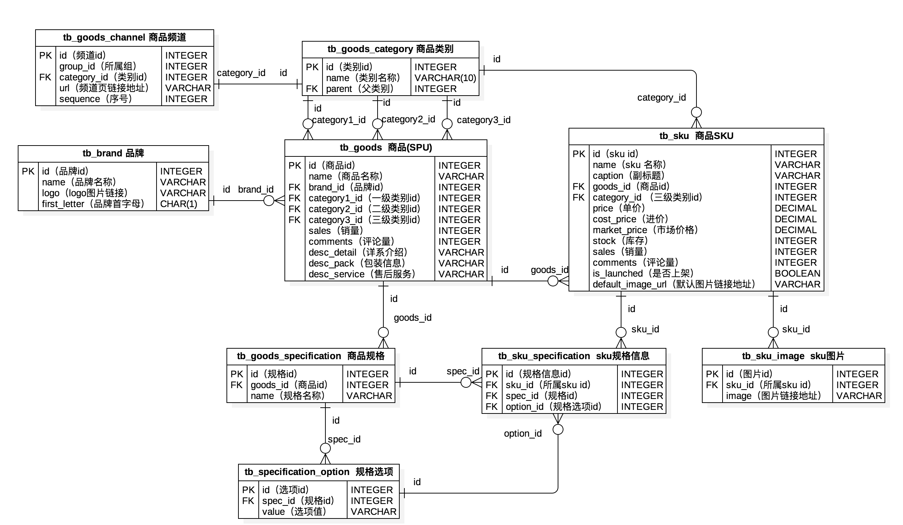

## 關係數據庫入門

### 關係數據庫概述

1. 數據持久化 - 將數據保存到能夠長久保存數據的存儲介質中，在掉電的情況下數據也不會丟失。

2. 數據庫發展史 - 網狀數據庫、層次數據庫、關係數據庫、NoSQL數據庫。

   > 1970年，IBM的研究員E.F.Codd在*Communication of the ACM*上發表了名為*A Relational Model of Data for Large Shared Data Banks*的論文，提出了關係模型的概念，奠定了關係模型的理論基礎。後來Codd又陸續發表多篇文章，論述了範式理論和衡量關係系統的12條標準，用數學理論奠定了關係數據庫的基礎。

3. 關係數據庫特點。

   - 理論基礎：集合論和關係代數。

   - 具體表象：用二維表（有行和列）組織數據。

   - 編程語言：結構化查詢語言（SQL）。

4. ER模型（實體關係模型）和概念模型圖。

   **ER模型**，全稱為**實體關係模型**（Entity-Relationship Model），由美籍華裔計算機科學家陳品山先生提出，是概念數據模型的高層描述方式，如下圖所示。

   

   - 實體 - 矩形框
   - 屬性 - 橢圓框
   - 關係 - 菱形框
   - 重數 - 1:1（一對一） / 1:N（一對多） / M:N（多對多）

   實際項目開發中，我們可以利用數據庫建模工具（如：PowerDesigner）來繪製概念數據模型（其本質就是ER模型），然後再設置好目標數據庫系統，將概念模型轉換成物理模型，最終生成創建二維表的SQL（很多工具都可以根據我們設計的物理模型圖以及設定的目標數據庫來導出SQL或直接生成數據表）。

   

5. 關係數據庫產品。
   - [Oracle](https://www.oracle.com/index.html) - 目前世界上使用最為廣泛的數據庫管理系統，作為一個通用的數據庫系統，它具有完整的數據管理功能；作為一個關係數據庫，它是一個完備關係的產品；作為分佈式數據庫，它實現了分佈式處理的功能。在Oracle最新的12c版本中，還引入了多承租方架構，使用該架構可輕鬆部署和管理數據庫雲。
   - [DB2](https://www.ibm.com/analytics/us/en/db2/) - IBM公司開發的、主要運行於Unix（包括IBM自家的[AIX](https://zh.wikipedia.org/wiki/AIX)）、Linux、以及Windows服務器版等系統的關係數據庫產品。DB2歷史悠久且被認為是最早使用SQL的數據庫產品，它擁有較為強大的商業智能功能。
   - [SQL Server](https://www.microsoft.com/en-us/sql-server/) - 由Microsoft開發和推廣的關係型數據庫產品，最初適用於中小企業的數據管理，但是近年來它的應用範圍有所擴展，部分大企業甚至是跨國公司也開始基於它來構建自己的數據管理系統。
   - [MySQL](https://www.mysql.com/) - MySQL是開放源代碼的，任何人都可以在GPL（General Public License）的許可下下載並根據個性化的需要對其進行修改。MySQL因為其速度、可靠性和適應性而備受關注。
   - [PostgreSQL]() - 在BSD許可證下發行的開放源代碼的關係數據庫產品。

### MySQL簡介

MySQL最早是由瑞典的MySQL AB公司開發的一個開放源碼的關係數據庫管理系統，該公司於2008年被昇陽微系統公司（Sun Microsystems）收購。在2009年，甲骨文公司（Oracle）收購昇陽微系統公司，因此在這之後MySQL成為了Oracle旗下產品。

MySQL在過去由於性能高、成本低、可靠性好，已經成為最流行的開源數據庫，因此被廣泛地應用於中小型網站開發。隨著MySQL的不斷成熟，它也逐漸被應用於更多大規模網站和應用，比如維基百科、谷歌（Google）、臉書（Facebook）、淘寶網等網站都使用了MySQL來提供數據持久化服務。

甲骨文公司收購後昇陽微系統公司，大幅調漲MySQL商業版的售價，且甲骨文公司不再支持另一個自由軟件項目[OpenSolaris](https://zh.wikipedia.org/wiki/OpenSolaris)的發展，因此導致自由軟件社區對於Oracle是否還會持續支持MySQL社區版（MySQL的各個發行版本中唯一免費的版本）有所擔憂，MySQL的創始人麥克爾·維德紐斯以MySQL為基礎，成立分支計劃[MariaDB](https://zh.wikipedia.org/wiki/MariaDB)（以他女兒的名字命名的數據庫）。有許多原來使用MySQL數據庫的公司（例如：維基百科）已經陸續完成了從MySQL數據庫到MariaDB數據庫的遷移。

1. 安裝和配置

   > **說明**：下面的安裝和配置都是以CentOS Linux環境為例，如果需要在其他系統下安裝MySQL，讀者可以自行在網絡上查找對應的安裝教程）。

   - 剛才說過，MySQL有一個分支版本名叫MariaDB，該數據庫旨在繼續保持MySQL數據庫在[GNU GPL](https://zh.wikipedia.org/wiki/GNU%E9%80%9A%E7%94%A8%E5%85%AC%E5%85%B1%E8%AE%B8%E5%8F%AF%E8%AF%81)下開源。如果要使用MariaDB作為MySQL的替代品，可以使用下面的命令進行安裝。

     ```Shell
     yum install mariadb mariadb-server
     ```

   - 如果要安裝官方版本的MySQL，可以在[MySQL官方網站](<https://www.mysql.com/>)下載安裝文件。首先在下載頁面中選擇平臺和版本，然後找到對應的下載鏈接。下面以MySQL 5.7.26版本和Red Hat Enterprise Linux為例，直接下載包含所有安裝文件的歸檔文件，解歸檔之後通過包管理工具進行安裝。

     ```Shell
     wget https://dev.mysql.com/get/Downloads/MySQL-5.7/mysql-5.7.26-1.el7.x86_64.rpm-bundle.tar
     tar -xvf mysql-5.7.26-1.el7.x86_64.rpm-bundle.tar
     ```

     如果系統上有MariaDB相關的文件，需要先移除MariaDB相關的文件。

     ```Shell
     yum list installed | grep mariadb | awk '{print $1}' | xargs yum erase -y
     ```

     接下來可以按照如下所示的順序用RPM（Redhat Package Manager）工具安裝MySQL。

     ```Shell
     rpm -ivh mysql-community-common-5.7.26-1.el7.x86_64.rpm
     rpm -ivh mysql-community-libs-5.7.26-1.el7.x86_64.rpm
     rpm -ivh mysql-community-client-5.7.26-1.el7.x86_64.rpm
     rpm -ivh mysql-community-server-5.7.26-1.el7.x86_64.rpm
     ```

     可以使用下面的命令查看已經安裝的MySQL相關的包。

     ```Shell
     rpm -qa | grep mysql
     ```

   - 配置MySQL。

     MySQL的配置文件在`/etc`目錄下，名為`my.cnf`，默認的配置文件內容如下所示。如果對這個文件不理解並沒有關係，什麼時候用到這個配置文件什麼時候再瞭解它就行了。

     ```Shell
     cat /etc/my.cnf
     ```

     ```INI
     # For advice on how to change settings please see
     # http://dev.mysql.com/doc/refman/5.7/en/server-configuration-defaults.html
     
     [mysqld]
     #
     # Remove leading # and set to the amount of RAM for the most important data
     # cache in MySQL. Start at 70% of total RAM for dedicated server, else 10%.
     # innodb_buffer_pool_size = 128M
     #
     # Remove leading # to turn on a very important data integrity option: logging
     # changes to the binary log between backups.
     # log_bin
     #
     # Remove leading # to set options mainly useful for reporting servers.
     # The server defaults are faster for transactions and fast SELECTs.
     # Adjust sizes as needed, experiment to find the optimal values.
     # join_buffer_size = 128M
     # sort_buffer_size = 2M
     # read_rnd_buffer_size = 2M
     datadir=/var/lib/mysql
     socket=/var/lib/mysql/mysql.sock
     
     # Disabling symbolic-links is recommended to prevent assorted security risks
     symbolic-links=0
     
     log-error=/var/log/mysqld.log
     pid-file=/var/run/mysqld/mysqld.pid
     ```

   - 啟動MySQL服務。

     可以使用下面的命令來啟動MySQL。

     ```Shell
     service mysqld start
     ```

     在CentOS 7中，更推薦使用下面的命令來啟動MySQL。

     ```Shell
     systemctl start mysqld
     ```

     啟動MySQL成功後，可以通過下面的命令來檢查網絡端口使用情況，MySQL默認使用3306端口。

     ```Shell
     netstat -ntlp | grep mysql
     ```

     也可以使用下面的命令查找是否有名為mysqld的進程。

     ```Shell
     pgrep mysqld
     ```

   - 使用MySQL客戶端工具連接服務器。

     命令行工具：

     ```Shell
     mysql -u root -p
     ```

     > 說明：啟動客戶端時，`-u`參數用來指定用戶名，MySQL默認的超級管理賬號為`root`；`-p`表示要輸入密碼（用戶口令）；如果連接的是其他主機而非本機，可以用`-h`來指定連接主機的主機名或IP地址。

     如果是首次安裝MySQL，可以使用下面的命令來找到默認的初始密碼。

     ```Shell
     cat /var/log/mysqld.log | grep password
     ```

     上面的命令會查看MySQL的日誌帶有password的行，在顯示的結果中`root@localhost:`後面的部分就是默認設置的初始密碼。

     修改超級管理員（root）的訪問口令為`123456`。

     ```SQL
     set global validate_password_policy=0;
     set global validate_password_length=6;
     alter user 'root'@'localhost' identified by '123456';
     ```

     > 說明：MySQL較新的版本默認不允許使用弱口令作為用戶口令，所以我們通過上面的前兩條命令修改了驗證用戶口令的策略和口令的長度。事實上我們不應該使用弱口令，因為存在用戶口令被暴力破解的風險。近年來，攻擊數據庫竊取數據和劫持數據庫勒索比特幣的事件屢見不鮮，要避免這些潛在的風險，最為重要的一點是不要讓數據庫服務器暴露在公網上（最好的做法是將數據庫置於內網，至少要做到不向公網開放數據庫服務器的訪問端口），另外要保管好`root`賬號的口令，應用系統需要訪問數據庫時，通常不使用`root`賬號進行訪問，而是創建其他擁有適當權限的賬號來訪問。

     再次使用客戶端工具連接MySQL服務器時，就可以使用新設置的口令了。在實際開發中，為了方便用戶操作，可以選擇圖形化的客戶端工具來連接MySQL服務器，包括：

     - MySQL Workbench（官方提供的工具）
     - Navicat for MySQL（界面簡單優雅，功能直觀強大）
     - SQLyog for MySQL（強大的MySQL數據庫管理員工具）

2. 常用命令。

   - 查看服務器版本。

     ```SQL
     select version();
     ```

   - 查看所有數據庫。

     ```SQL
     show databases;
     ```

   - 切換到指定數據庫。

     ```SQL
     use mysql;
     ```

   - 查看數據庫下所有表。

     ```Shell
     show tables;
     ```

   - 獲取幫助。

     ```SQL
     ? contents;
     ? functions;
     ? numeric functions;
     ? round;
     
     ? data types;
     ? longblob;
     ```

### SQL詳解

#### 基本操作

我們通常可以將SQL分為三類：DDL（數據定義語言）、DML（數據操作語言）和DCL（數據控制語言）。DDL主要用於創建（create）、刪除（drop）、修改（alter）數據庫中的對象，比如創建、刪除和修改二維表；DML主要負責插入數據（insert）、刪除數據（delete）、更新數據（update）和查詢（select）；DCL通常用於授予權限（grant）和召回權限（revoke）。

> 說明：SQL是不區分大小寫的語言，為了書寫方便，下面的SQL都使用了小寫字母來書寫。

1. DDL（數據定義語言）

   ```SQL
   -- 如果存在名為school的數據庫就刪除它
   drop database if exists school;
   
   -- 創建名為school的數據庫並設置默認的字符集和排序方式
   create database school default charset utf8 collate utf8_bin;
   
   -- 切換到school數據庫上下文環境
   use school;
   
   -- 創建學院表
   create table tb_college
   (
   collid		int auto_increment comment '編號',
   collname	varchar(50) not null comment '名稱',
   collmaster	varchar(20) not null comment '院長',
   primary key (collid)
   );
   
   -- 創建學生表
   create table tb_student
   (
   stuid		int not null comment '學號',
   stuname		varchar(20) not null comment '姓名',
   stusex		boolean default 1 comment '性別',
   stubirth	date not null comment '出生日期',
   stuaddr		varchar(255) default '' comment '籍貫',
   collid		int not null comment '所屬學院',
   primary key (stuid),
   foreign key (collid) references tb_college (collid)
   );
   
   -- 創建教師表
   create table tb_teacher
   (
   teaid		int not null comment '工號',
   teaname		varchar(20) not null comment '姓名',
   teatitle	varchar(10) default '助教' comment '職稱',
   collid		int not null comment '所屬學院',
   primary key (teaid),
   foreign key (collid) references tb_college (collid)
   );
   
   -- 創建課程表
   create table tb_course
   (
   couid		int not null comment '編號',
   couname		varchar(50) not null comment '名稱',
   coucredit	int not null comment '學分',
   teaid		int not null comment '授課老師',
   primary key (couid),
   foreign key (teaid) references tb_teacher (teaid)
   );
   
   -- 創建選課記錄表
   create table tb_record
   (
   recid		int auto_increment comment '選課記錄編號',
   sid			int not null comment '選課學生',
   cid			int not null comment '所選課程',
   seldate		datetime default now() comment '選課時間日期',
   score		decimal(4,1) comment '考試成績',
   primary key (recid),
   foreign key (sid) references tb_student (stuid),
   foreign key (cid) references tb_course (couid),
   unique (sid, cid)
   );
   ```

   上面的DDL有幾個地方需要強調一下：

   - 創建數據庫時，我們通過`default charset utf8`指定了數據庫默認使用的字符集，我們推薦使用該字符集，因為utf8能夠支持國際化編碼。如果將來數據庫中用到的字符可能包括類似於Emoji這樣的圖片字符，也可以將默認字符集設定為utf8mb4（最大4字節的utf-8編碼）。查看MySQL支持的字符集可以執行下面的語句。

     ```SQL
     show character set;
     ```

     ```
     +----------+---------------------------------+---------------------+--------+
     | Charset  | Description                     | Default collation   | Maxlen |
     +----------+---------------------------------+---------------------+--------+
     | big5     | Big5 Traditional Chinese        | big5_chinese_ci     |      2 |
     | dec8     | DEC West European               | dec8_swedish_ci     |      1 |
     | cp850    | DOS West European               | cp850_general_ci    |      1 |
     | hp8      | HP West European                | hp8_english_ci      |      1 |
     | koi8r    | KOI8-R Relcom Russian           | koi8r_general_ci    |      1 |
     | latin1   | cp1252 West European            | latin1_swedish_ci   |      1 |
     | latin2   | ISO 8859-2 Central European     | latin2_general_ci   |      1 |
     | swe7     | 7bit Swedish                    | swe7_swedish_ci     |      1 |
     | ascii    | US ASCII                        | ascii_general_ci    |      1 |
     | ujis     | EUC-JP Japanese                 | ujis_japanese_ci    |      3 |
     | sjis     | Shift-JIS Japanese              | sjis_japanese_ci    |      2 |
     | hebrew   | ISO 8859-8 Hebrew               | hebrew_general_ci   |      1 |
     | tis620   | TIS620 Thai                     | tis620_thai_ci      |      1 |
     | euckr    | EUC-KR Korean                   | euckr_korean_ci     |      2 |
     | koi8u    | KOI8-U Ukrainian                | koi8u_general_ci    |      1 |
     | gb2312   | GB2312 Simplified Chinese       | gb2312_chinese_ci   |      2 |
     | greek    | ISO 8859-7 Greek                | greek_general_ci    |      1 |
     | cp1250   | Windows Central European        | cp1250_general_ci   |      1 |
     | gbk      | GBK Simplified Chinese          | gbk_chinese_ci      |      2 |
     | latin5   | ISO 8859-9 Turkish              | latin5_turkish_ci   |      1 |
     | armscii8 | ARMSCII-8 Armenian              | armscii8_general_ci |      1 |
     | utf8     | UTF-8 Unicode                   | utf8_general_ci     |      3 |
     | ucs2     | UCS-2 Unicode                   | ucs2_general_ci     |      2 |
     | cp866    | DOS Russian                     | cp866_general_ci    |      1 |
     | keybcs2  | DOS Kamenicky Czech-Slovak      | keybcs2_general_ci  |      1 |
     | macce    | Mac Central European            | macce_general_ci    |      1 |
     | macroman | Mac West European               | macroman_general_ci |      1 |
     | cp852    | DOS Central European            | cp852_general_ci    |      1 |
     | latin7   | ISO 8859-13 Baltic              | latin7_general_ci   |      1 |
     | utf8mb4  | UTF-8 Unicode                   | utf8mb4_general_ci  |      4 |
     | cp1251   | Windows Cyrillic                | cp1251_general_ci   |      1 |
     | utf16    | UTF-16 Unicode                  | utf16_general_ci    |      4 |
     | utf16le  | UTF-16LE Unicode                | utf16le_general_ci  |      4 |
     | cp1256   | Windows Arabic                  | cp1256_general_ci   |      1 |
     | cp1257   | Windows Baltic                  | cp1257_general_ci   |      1 |
     | utf32    | UTF-32 Unicode                  | utf32_general_ci    |      4 |
     | binary   | Binary pseudo charset           | binary              |      1 |
     | geostd8  | GEOSTD8 Georgian                | geostd8_general_ci  |      1 |
     | cp932    | SJIS for Windows Japanese       | cp932_japanese_ci   |      2 |
     | eucjpms  | UJIS for Windows Japanese       | eucjpms_japanese_ci |      3 |
     | gb18030  | China National Standard GB18030 | gb18030_chinese_ci  |      4 |
     +----------+---------------------------------+---------------------+--------+
     41 rows in set (0.00 sec)
     ```

     如果要設置MySQL服務啟動時默認使用的字符集，可以修改MySQL的配置並添加以下內容

     ```INI
     [mysqld]
     character-set-server=utf8
     ```

   - 在創建表的時候，我們可以在右圓括號的後面通過`engine=XXX`來指定表的存儲引擎，MySQL支持多種存儲引擎，可以通過`show engines`命令進行查看。MySQL 5.5以後的版本默認使用的存儲引擎是InnoDB，它正好也就是我們推薦大家使用的存儲引擎（因為InnoDB更適合互聯網應用對高併發、性能以及事務支持等方面的需求）。

     ```SQL
     show engines\G
     ```

     ```
     *************************** 1. row ***************************
           Engine: InnoDB
          Support: DEFAULT
          Comment: Supports transactions, row-level locking, and foreign keys
     Transactions: YES
               XA: YES
       Savepoints: YES
     *************************** 2. row ***************************
           Engine: MRG_MYISAM
          Support: YES
          Comment: Collection of identical MyISAM tables
     Transactions: NO
               XA: NO
       Savepoints: NO
     *************************** 3. row ***************************
           Engine: MEMORY
          Support: YES
          Comment: Hash based, stored in memory, useful for temporary tables
     Transactions: NO
               XA: NO
       Savepoints: NO
     *************************** 4. row ***************************
           Engine: BLACKHOLE
          Support: YES
          Comment: /dev/null storage engine (anything you write to it disappears)
     Transactions: NO
               XA: NO
       Savepoints: NO
     *************************** 5. row ***************************
           Engine: MyISAM
          Support: YES
          Comment: MyISAM storage engine
     Transactions: NO
               XA: NO
       Savepoints: NO
     *************************** 6. row ***************************
           Engine: CSV
          Support: YES
          Comment: CSV storage engine
     Transactions: NO
               XA: NO
       Savepoints: NO
     *************************** 7. row ***************************
           Engine: ARCHIVE
          Support: YES
          Comment: Archive storage engine
     Transactions: NO
               XA: NO
       Savepoints: NO
     *************************** 8. row ***************************
           Engine: PERFORMANCE_SCHEMA
          Support: YES
          Comment: Performance Schema
     Transactions: NO
               XA: NO
       Savepoints: NO
     *************************** 9. row ***************************
           Engine: FEDERATED
          Support: NO
          Comment: Federated MySQL storage engine
     Transactions: NULL
               XA: NULL
       Savepoints: NULL
     9 rows in set (0.00 sec)
     ```

     下面的表格對MySQL幾種常用的數據引擎進行了簡單的對比。

     | 特性         | InnoDB       | MRG_MYISAM | MEMORY | MyISAM |
     | ------------ | ------------ | ---------- | ------ | ------ |
     | 存儲限制     | 有           | 沒有       | 有     | 有     |
     | 事務         | 支持         |            |        |        |
     | 鎖機制       | 行鎖         | 表鎖       | 表鎖   | 表鎖   |
     | B樹索引      | 支持         | 支持       | 支持   | 支持   |
     | 哈希索引     |              |            | 支持   |        |
     | 全文檢索     | 支持（5.6+） |            |        | 支持   |
     | 集群索引     | 支持         |            |        |        |
     | 數據緩存     | 支持         |            | 支持   |        |
     | 索引緩存     | 支持         | 支持       | 支持   | 支持   |
     | 數據可壓縮   |              |            |        | 支持   |
     | 內存使用     | 高           | 低         | 中     | 低     |
     | 存儲空間使用 | 高           | 低         |        | 低     |
     | 批量插入性能 | 低           | 高         | 高     | 高     |
     | 是否支持外鍵 | 支持         |            |        |        |

     通過上面的比較我們可以瞭解到，InnoDB是唯一能夠支持外鍵、事務以及行鎖的存儲引擎，所以我們之前說它更適合互聯網應用，而且它也是較新的MySQL版本中默認使用的存儲引擎。

   - 在定義表結構為每個字段選擇數據類型時，如果不清楚哪個數據類型更合適，可以通過MySQL的幫助系統來了解每種數據類型的特性、數據的長度和精度等相關信息。

     ```SQL
     ? data types
     ```

     ```
     You asked for help about help category: "Data Types"
     For more information, type 'help <item>', where <item> is one of the following
     topics:
        AUTO_INCREMENT
        BIGINT
        BINARY
        BIT
        BLOB
        BLOB DATA TYPE
        BOOLEAN
        CHAR
        CHAR BYTE
        DATE
        DATETIME
        DEC
        DECIMAL
        DOUBLE
        DOUBLE PRECISION
        ENUM
        FLOAT
        INT
        INTEGER
        LONGBLOB
        LONGTEXT
        MEDIUMBLOB
        MEDIUMINT
        MEDIUMTEXT
        SET DATA TYPE
        SMALLINT
        TEXT
        TIME
        TIMESTAMP
        TINYBLOB
        TINYINT
        TINYTEXT
        VARBINARY
        VARCHAR
        YEAR DATA TYPE
     ```

     ```SQL
     ? varchar
     ```

     ```
     Name: 'VARCHAR'
     Description:
     [NATIONAL] VARCHAR(M) [CHARACTER SET charset_name] [COLLATE
     collation_name]
     
     A variable-length string. M represents the maximum column length in
     characters. The range of M is 0 to 65,535. The effective maximum length
     of a VARCHAR is subject to the maximum row size (65,535 bytes, which is
     shared among all columns) and the character set used. For example, utf8
     characters can require up to three bytes per character, so a VARCHAR
     column that uses the utf8 character set can be declared to be a maximum
     of 21,844 characters. See
     http://dev.mysql.com/doc/refman/5.7/en/column-count-limit.html.
     
     MySQL stores VARCHAR values as a 1-byte or 2-byte length prefix plus
     data. The length prefix indicates the number of bytes in the value. A
     VARCHAR column uses one length byte if values require no more than 255
     bytes, two length bytes if values may require more than 255 bytes.
     
     *Note*:
     
     MySQL follows the standard SQL specification, and does not remove
     trailing spaces from VARCHAR values.
     
     VARCHAR is shorthand for CHARACTER VARYING. NATIONAL VARCHAR is the
     standard SQL way to define that a VARCHAR column should use some
     predefined character set. MySQL uses utf8 as this predefined character
     set. http://dev.mysql.com/doc/refman/5.7/en/charset-national.html.
     NVARCHAR is shorthand for NATIONAL VARCHAR.
     
     URL: http://dev.mysql.com/doc/refman/5.7/en/string-type-overview.html
     ```

     在數據類型的選擇上，保存字符串數據通常都使用VARCHAR和CHAR兩種類型，前者通常稱為變長字符串，而後者通常稱為定長字符串；對於InnoDB存儲引擎，行存儲格式沒有區分固定長度和可變長度列，因此VARCHAR類型好CHAR類型沒有本質區別，後者不一定比前者性能更好。如果要保存的很大字符串，可以使用TEXT類型；如果要保存很大的字節串，可以使用BLOB（二進制大對象）類型。在MySQL中，TEXT和BLOB又分別包括TEXT、MEDIUMTEXT、LONGTEXT和BLOB、MEDIUMBLOB、LONGBLOB三種不同的類型，它們主要的區別在於存儲數據的最大大小不同。保存浮點數可以用FLOAT或DOUBLE類型，而保存定點數應該使用DECIMAL類型。如果要保存時間日期，DATETIME類型優於TIMESTAMP類型，因為前者能表示的時間日期範圍更大。

2. DML

   ```SQL
   -- 插入學院數據
   insert into tb_college (collname, collmaster) values 
   ('計算機學院', '左冷禪'),
   ('外國語學院', '嶽不群'),
   ('經濟管理學院', '風清揚');
   
   -- 插入學生數據
   insert into tb_student (stuid, stuname, stusex, stubirth, stuaddr, collid) values
   (1001, '楊逍', 1, '1990-3-4', '四川成都', 1),
   (1002, '任我行', 1, '1992-2-2', '湖南長沙', 1),
   (1033, '王語嫣', 0, '1989-12-3', '四川成都', 1),
   (1572, '嶽不群', 1, '1993-7-19', '陝西咸陽', 1),
   (1378, '紀嫣然', 0, '1995-8-12', '四川綿陽', 1),
   (1954, '林平之', 1, '1994-9-20', '福建莆田', 1),
   (2035, '東方不敗', 1, '1988-6-30', null, 2),
   (3011, '林震南', 1, '1985-12-12', '福建莆田', 3),
   (3755, '項少龍', 1, '1993-1-25', null, 3),
   (3923, '楊不悔', 0, '1985-4-17', '四川成都', 3),
   (4040, '隔壁老王', 1, '1989-1-1', '四川成都', 2);
   
   -- 刪除學生數據
   delete from tb_student where stuid=4040;
   
   -- 更新學生數據
   update tb_student set stuname='楊過', stuaddr='湖南長沙' where stuid=1001;
   
   -- 插入老師數據
   insert into tb_teacher (teaid, teaname, teatitle, collid) values 
   (1122, '張三丰', '教授', 1),
   (1133, '宋遠橋', '副教授', 1),
   (1144, '楊逍', '副教授', 1),
   (2255, '範遙', '副教授', 2),
   (3366, '韋一笑', '講師', 3);
   
   -- 插入課程數據
   insert into tb_course (couid, couname, coucredit, teaid) values 
   (1111, 'Python程序設計', 3, 1122),
   (2222, 'Web前端開發', 2, 1122),
   (3333, '操作系統', 4, 1122),
   (4444, '計算機網絡', 2, 1133),
   (5555, '編譯原理', 4, 1144),
   (6666, '算法和數據結構', 3, 1144),
   (7777, '經貿法語', 3, 2255),
   (8888, '成本會計', 2, 3366),
   (9999, '審計學', 3, 3366);
   
   -- 插入選課數據
   insert into tb_record (sid, cid, seldate, score) values 
   (1001, 1111, '2017-09-01', 95),
   (1001, 2222, '2017-09-01', 87.5),
   (1001, 3333, '2017-09-01', 100),
   (1001, 4444, '2018-09-03', null),
   (1001, 6666, '2017-09-02', 100),
   (1002, 1111, '2017-09-03', 65),
   (1002, 5555, '2017-09-01', 42),
   (1033, 1111, '2017-09-03', 92.5),
   (1033, 4444, '2017-09-01', 78),
   (1033, 5555, '2017-09-01', 82.5),
   (1572, 1111, '2017-09-02', 78),
   (1378, 1111, '2017-09-05', 82),
   (1378, 7777, '2017-09-02', 65.5),
   (2035, 7777, '2018-09-03', 88),
   (2035, 9999, default, null),
   (3755, 1111, default, null),
   (3755, 8888, default, null),
   (3755, 9999, '2017-09-01', 92);
   ```

   ```SQL
   -- 查詢所有學生信息
   select * from tb_student;
   
   -- 查詢所有課程名稱及學分(投影和別名)
   select couname, coucredit from tb_course;
   select couname as 課程名稱, coucredit as 學分 from tb_course;
   
   -- 查詢所有學生的姓名和性別(條件運算)
   select stuname as 姓名, case stusex when 1 then '男' else '女' end as 性別 from tb_student;
   select stuname as 姓名, if(stusex, '男', '女') as 性別 from tb_student;
   
   -- 查詢所有女學生的姓名和出生日期(篩選)
   select stuname, stubirth from tb_student where stusex=0;
   
   -- 查詢所有80後學生的姓名、性別和出生日期(篩選)
   select stuname, stusex, stubirth from tb_student where stubirth>='1980-1-1' and stubirth<='1989-12-31';
   select stuname, stusex, stubirth from tb_student where stubirth between '1980-1-1' and '1989-12-31';
   
   -- 查詢姓"楊"的學生姓名和性別(模糊)
   select stuname, stusex from tb_student where stuname like '楊%';
   
   -- 查詢姓"楊"名字兩個字的學生姓名和性別(模糊)
   select stuname, stusex from tb_student where stuname like '楊_';
   
   -- 查詢姓"楊"名字三個字的學生姓名和性別(模糊)
   select stuname, stusex from tb_student where stuname like '楊__';
   
   -- 查詢名字中有"不"字或"嫣"字的學生的姓名(模糊)
   select stuname, stusex from tb_student where stuname like '%不%' or stuname like '%嫣%';
   
   -- 查詢沒有錄入家庭住址的學生姓名(空值)
   select stuname from tb_student where stuaddr is null;
   
   -- 查詢錄入了家庭住址的學生姓名(空值)
   select stuname from tb_student where stuaddr is not null;
   
   -- 查詢學生選課的所有日期(去重)
   select distinct seldate from tb_record;
   
   -- 查詢學生的家庭住址(去重)
   select distinct stuaddr from tb_student where stuaddr is not null;
   
   -- 查詢男學生的姓名和生日按年齡從大到小排列(排序)
   select stuname as 姓名, datediff(curdate(), stubirth) div 365 as 年齡 from tb_student where stusex=1 order by 年齡 desc;
   
   -- 查詢年齡最大的學生的出生日期(聚合函數)
   select min(stubirth) from tb_student;
   
   -- 查詢年齡最小的學生的出生日期(聚合函數)
   select max(stubirth) from tb_student;
   
   -- 查詢男女學生的人數(分組和聚合函數)
   select stusex, count(*) from tb_student group by stusex;
   
   -- 查詢課程編號為1111的課程的平均成績(篩選和聚合函數)
   select avg(score) from tb_record where cid=1111;
   
   -- 查詢學號為1001的學生所有課程的平均分(篩選和聚合函數)
   select avg(score) from tb_record where sid=1001;
   
   -- 查詢每個學生的學號和平均成績(分組和聚合函數)
   select sid as 學號, avg(score) as 平均分 from tb_record group by sid;
   
   -- 查詢平均成績大於等於90分的學生的學號和平均成績
   -- 分組以前的篩選使用where子句 / 分組以後的篩選使用having子句
   select sid as 學號, avg(score) as 平均分 from tb_record group by sid having 平均分>=90;
   
   -- 查詢年齡最大的學生的姓名(子查詢/嵌套的查詢)
   select stuname from tb_student where stubirth=( select min(stubirth) from tb_student );
   
   -- 查詢年齡最大的學生姓名和年齡(子查詢+運算)
   select stuname as 姓名, datediff(curdate(), stubirth) div 365 as 年齡 from tb_student where stubirth=( select min(stubirth) from tb_student );
   
   -- 查詢選了兩門以上的課程的學生姓名(子查詢/分組條件/集合運算)
   select stuname from tb_student where stuid in ( select stuid from tb_record group by stuid having count(stuid)>2 );
   
   -- 查詢學生姓名、課程名稱以及成績(連接查詢)
   select stuname, couname, score from tb_student t1, tb_course t2, tb_record t3 where stuid=sid and couid=cid and score is not null;
   
   -- 查詢學生姓名、課程名稱以及成績按成績從高到低查詢第11-15條記錄(內連接+分頁)
   select stuname, couname, score from tb_student inner join tb_record on stuid=sid inner join tb_course on couid=cid where score is not null order by score desc limit 5 offset 10;
   
   select stuname, couname, score from tb_student inner join tb_record on stuid=sid inner join tb_course on couid=cid where score is not null order by score desc limit 10, 5;
   
   -- 查詢選課學生的姓名和平均成績(子查詢和連接查詢)
   select stuname, avgmark from tb_student, ( select sid, avg(score) as avgmark from tb_record group by sid ) temp where stuid=sid;
   
   select stuname, avgmark from tb_student inner join ( select sid, avg(score) as avgmark from tb_record group by sid ) temp on stuid=sid;
   
   -- 查詢每個學生的姓名和選課數量(左外連接和子查詢)
   select stuname, ifnull(total, 0) from tb_student left outer join ( select sid, count(sid) as total from tb_record group by sid ) temp on stuid=sid;
   ```

   上面的DML有幾個地方需要加以說明：

   1. MySQL中支持多種類型的運算符，包括：算術運算符（+、-、*、/、%）、比較運算符（=、<>、<=>、<、<=、>、>=、BETWEEN...AND...、IN、IS NULL、IS NOT NULL、LIKE、RLIKE、REGEXP）、邏輯運算符（NOT、AND、OR、XOR）和位運算符（&、|、^、~、>>、<<），我們可以在DML中使用這些運算符處理數據。

   2. 在查詢數據時，可以在SELECT語句及其子句（如WHERE子句、ORDER BY子句、HAVING子句等）中使用函數，這些函數包括字符串函數、數值函數、時間日期函數、流程函數等，如下面的表格所示。

      常用字符串函數。

      | 函數                    | 功能                                                  |
      | ----------------------- | ----------------------------------------------------- |
      | CONCAT                  | 將多個字符串連接成一個字符串                          |
      | FORMAT                  | 將數值格式化成字符串並指定保留幾位小數                |
      | FROM_BASE64 / TO_BASE64 | BASE64解碼/編碼                                       |
      | BIN / OCT / HEX         | 將數值轉換成二進制/八進制/十六進制字符串              |
      | LOCATE                  | 在字符串中查找一個子串的位置                          |
      | LEFT / RIGHT            | 返回一個字符串左邊/右邊指定長度的字符                 |
      | LENGTH / CHAR_LENGTH    | 返回字符串的長度以字節/字符為單位                     |
      | LOWER / UPPER           | 返回字符串的小寫/大寫形式                             |
      | LPAD / RPAD             | 如果字符串的長度不足，在字符串左邊/右邊填充指定的字符 |
      | LTRIM / RTRIM           | 去掉字符串前面/後面的空格                             |
      | ORD / CHAR              | 返回字符對應的編碼/返回編碼對應的字符                 |
      | STRCMP                  | 比較字符串，返回-1、0、1分別表示小於、等於、大於      |
      | SUBSTRING               | 返回字符串指定範圍的子串                              |

      常用數值函數。

      | 函數                                       | 功能                               |
      | ------------------------------------------ | ---------------------------------- |
      | ABS                                        | 返回一個數的絕度值                 |
      | CEILING / FLOOR                            | 返回一個數上取整/下取整的結果      |
      | CONV                                       | 將一個數從一種進制轉換成另一種進制 |
      | CRC32                                      | 計算循環冗餘校驗碼                 |
      | EXP / LOG / LOG2 / LOG10                   | 計算指數/對數                      |
      | POW                                        | 求冪                               |
      | RAND                                       | 返回[0,1)範圍的隨機數              |
      | ROUND                                      | 返回一個數四捨五入後的結果         |
      | SQRT                                       | 返回一個數的平方根                 |
      | TRUNCATE                                   | 截斷一個數到指定的精度             |
      | SIN / COS / TAN / COT / ASIN / ACOS / ATAN | 三角函數                           |

      常用時間日期函數。

      | 函數                    | 功能                                  |
      | ----------------------- | ------------------------------------- |
      | CURDATE / CURTIME / NOW | 獲取當前日期/時間/日期和時間          |
      | ADDDATE / SUBDATE       | 將兩個日期表達式相加/相減並返回結果   |
      | DATE / TIME             | 從字符串中獲取日期/時間               |
      | YEAR / MONTH / DAY      | 從日期中獲取年/月/日                  |
      | HOUR / MINUTE / SECOND  | 從時間中獲取時/分/秒                  |
      | DATEDIFF / TIMEDIFF     | 返回兩個時間日期表達式相差多少天/小時 |
      | MAKEDATE / MAKETIME     | 製造一個日期/時間                     |

      常用流程函數。

      | 函數   | 功能                                             |
      | ------ | ------------------------------------------------ |
      | IF     | 根據條件是否成立返回不同的值                     |
      | IFNULL | 如果為NULL則返回指定的值否則就返回本身           |
      | NULLIF | 兩個表達式相等就返回NULL否則返回第一個表達式的值 |

      其他常用函數。

      | 函數                   | 功能                          |
      | ---------------------- | ----------------------------- |
      | MD5 / SHA1 / SHA2      | 返回字符串對應的哈希摘要      |
      | CHARSET / COLLATION    | 返回字符集/校對規則           |
      | USER / CURRENT_USER    | 返回當前用戶                  |
      | DATABASE               | 返回當前數據庫名              |
      | VERSION                | 返回當前數據庫版本            |
      | FOUND_ROWS / ROW_COUNT | 返回查詢到的行數/受影響的行數 |
      | LAST_INSERT_ID         | 返回最後一個自增主鍵的值      |
      | UUID / UUID_SHORT      | 返回全局唯一標識符            |

3. DCL

   ```SQL
   -- 創建可以遠程登錄的root賬號併為其指定口令
   create user 'root'@'%' identified by '123456';
   
   -- 為遠程登錄的root賬號授權操作所有數據庫所有對象的所有權限並允許其將權限再次賦予其他用戶
   grant all privileges on *.* to 'root'@'%' with grant option;
   
   -- 創建名為hellokitty的用戶併為其指定口令
   create user 'hellokitty'@'%' identified by '123123';
   
   -- 將對school數據庫所有對象的所有操作權限授予hellokitty
   grant all privileges on school.* to 'hellokitty'@'%';
   
   -- 召回hellokitty對school數據庫所有對象的insert/delete/update權限
   revoke insert, delete, update on school.* from 'hellokitty'@'%';
   ```

   > 說明：創建一個可以允許任意主機登錄並且具有超級管理員權限的用戶在現實中並不是一個明智的決定，因為一旦該賬號的口令洩露或者被破解，數據庫將會面臨災難級的風險。

#### 索引

索引是關係型數據庫中用來提升查詢性能最為重要的手段。關係型數據庫中的索引就像一本書的目錄，我們可以想象一下，如果要從一本書中找出某個知識點，但是這本書沒有目錄，這將是意見多麼可怕的事情（我們估計得一篇一篇的翻下去，才能確定這個知識點到底在什麼位置）。創建索引雖然會帶來存儲空間上的開銷，就像一本書的目錄會佔用一部分的篇幅一樣，但是在犧牲空間後換來的查詢時間的減少也是非常顯著的。

MySQL中，所有數據類型的列都可以被索引，常用的存儲引擎InnoDB和MyISAM能支持每個表創建16個索引。InnoDB和MyISAM使用的索引其底層算法是B-tree（B樹），B-tree是一種自平衡的樹，類似於平衡二叉排序樹，能夠保持數據有序。這種數據結構能夠讓查找數據、順序訪問、插入數據及刪除的操作都在對數時間內完成。

接下來我們通過一個簡單的例子來說明索引的意義，比如我們要根據學生的姓名來查找學生，這個場景在實際開發中應該經常遇到，就跟通過商品名稱查找商品道理是一樣的。我們可以使用MySQL的`explain`關鍵字來查看SQL的執行計劃。

```SQL
explain select * from tb_student where stuname='林震南'\G
```

```
*************************** 1. row ***************************
           id: 1
  select_type: SIMPLE
        table: tb_student
   partitions: NULL
         type: ALL
possible_keys: NULL
          key: NULL
      key_len: NULL
          ref: NULL
         rows: 11
     filtered: 10.00
        Extra: Using where
1 row in set, 1 warning (0.00 sec)
```

在上面的SQL執行計劃中，有幾項值得我們關注：

1. type：MySQL在表中找到滿足條件的行的方式，也稱為訪問類型，包括：ALL（全表掃描）、index（索引全掃描）、range（索引範圍掃描）、ref（非唯一索引掃描）、eq_ref（唯一索引掃描）、const/system、NULL。在所有的訪問類型中，很顯然ALL是性能最差的，它代表了全表掃描是指要掃描表中的每一行才能找到匹配的行。
2. possible_keys：MySQL可以選擇的索引，但是**有可能不會使用**。
3. key：MySQL真正使用的索引。
4. rows：執行查詢需要掃描的行數，這是一個**預估值**。

從上面的執行計劃可以看出，當我們通過學生名字查詢學生時實際上是進行了全表掃描，不言而喻這個查詢性能肯定是非常糟糕的，尤其是在表中的行很多的時候。如果我們需要經常通過學生姓名來查詢學生，那麼就應該在學生姓名對應的列上創建索引，通過索引來加速查詢。

```SQL
create index idx_student_name on tb_student(stuname);
```

再次查看剛才的SQL對應的執行計劃。

```SQL
explain select * from tb_student where stuname='林震南'\G
```

```
*************************** 1. row ***************************
           id: 1
  select_type: SIMPLE
        table: tb_student
   partitions: NULL
         type: ref
possible_keys: idx_student_name
          key: idx_student_name
      key_len: 62
          ref: const
         rows: 1
     filtered: 100.00
        Extra: NULL
1 row in set, 1 warning (0.00 sec)
```

可以注意到，在對學生姓名創建索引後，剛才的查詢已經不是全表掃描而是基於索引的查詢，而且掃描的行只有唯一的一行，這顯然大大的提升了查詢的性能。MySQL中還允許創建前綴索引，即對索引字段的前N個字符創建索引，這樣的話可以減少索引佔用的空間（但節省了空間很有可能會浪費時間，**時間和空間是不可調和的矛盾**），如下所示。

```SQL
create index idx_student_name_1 on tb_student(stuname(1));
```

上面的索引相當於是根據學生姓名的第一個字來創建的索引，我們再看看SQL執行計劃。

```SQL
explain select * from tb_student where stuname='林震南'\G
```

```
*************************** 1. row ***************************
           id: 1
  select_type: SIMPLE
        table: tb_student
   partitions: NULL
         type: ref
possible_keys: idx_student_name
          key: idx_student_name
      key_len: 5
          ref: const
         rows: 2
     filtered: 100.00
        Extra: Using where
1 row in set, 1 warning (0.00 sec)
```

不知道大家是否注意到，這一次掃描的行變成了2行，因為學生表中有兩個姓“林”的學生，我們只用姓名的第一個字作為索引的話，在查詢時通過索引就會找到這兩行。

如果要刪除索引，可以使用下面的SQL。

```SQL
alter table tb_student drop index idx_student_name;
```

或者

```SQL
drop index idx_student_name on tb_student;
```

我們簡單的為大家總結一下索引的設計原則：

1. **最適合**索引的列是出現在**WHERE子句**和連接子句中的列。
2. 索引列的基數越大（取值多重複值少），索引的效果就越好。
3. 使用**前綴索引**可以減少索引佔用的空間，內存中可以緩存更多的索引。
4. **索引不是越多越好**，雖然索引加速了讀操作（查詢），但是寫操作（增、刪、改）都會變得更慢，因為數據的變化會導致索引的更新，就如同書籍章節的增刪需要更新目錄一樣。
5. 使用InnoDB存儲引擎時，表的普通索引都會保存主鍵的值，所以**主鍵要儘可能選擇較短的數據類型**，這樣可以有效的減少索引佔用的空間，利用提升索引的緩存效果。

最後，還有一點需要說明，InnoDB使用的B-tree索引，數值類型的列除了等值判斷時索引會生效之外，使用>、<、>=、<=、BETWEEN...AND... 、<>時，索引仍然生效；對於字符串類型的列，如果使用不以通配符開頭的模糊查詢，索引也是起作用的，但是其他的情況會導致索引失效，這就意味著很有可能會做全表查詢。


#### 視圖

視圖是關係型數據庫中將一組查詢指令構成的結果集組合成可查詢的數據表的對象。簡單的說，視圖就是虛擬的表，但與數據表不同的是，數據表是一種實體結構，而視圖是一種虛擬結構，你也可以將視圖理解為保存在數據庫中被賦予名字的SQL語句。

使用視圖可以獲得以下好處：

1. 可以將實體數據表隱藏起來，讓外部程序無法得知實際的數據結構，讓訪問者可以使用表的組成部分而不是整個表，降低數據庫被攻擊的風險。
2. 在大多數的情況下視圖是隻讀的（更新視圖的操作通常都有諸多的限制），外部程序無法直接透過視圖修改數據。
3. 重用SQL語句，將高度複雜的查詢包裝在視圖表中，直接訪問該視圖即可取出需要的數據；也可以將視圖視為數據表進行連接查詢。
4. 視圖可以返回與實體數據表不同格式的數據，

創建視圖。

```SQL
create view vw_score 
as 
	select sid, round(avg(score), 1) as avgscore from tb_record group by sid;

create view vw_student_score 
as 
	select stuname, avgscore 
		from tb_student, vw_score  
		where stuid=sid;
```

> **提示**：因為視圖不包含數據，所以每次使用視圖時，都必須執行查詢以獲得數據，如果你使用了連接查詢、嵌套查詢創建了較為複雜的視圖，你可能會發現查詢性能下降得很厲害。因此，在使用複雜的視圖前，應該進行測試以確保其性能能夠滿足應用的需求。

使用視圖。

```SQL
select stuname, avgscore from vw_student_score order by avgscore desc;
```

```
+--------------+----------+
| stuname      | avgscore |
+--------------+----------+
| 楊過         |     95.6 |
| 任我行       |     53.5 |
| 王語嫣       |     84.3 |
| 紀嫣然       |     73.8 |
| 嶽不群       |     78.0 |
| 東方不敗     |     88.0 |
| 項少龍       |     92.0 |
+--------------+----------+
```

既然視圖是一張虛擬的表，那麼視圖的中的數據可以更新嗎？視圖的可更新性要視具體情況而定，以下類型的視圖是不能更新的：

1. 使用了聚合函數（SUM、MIN、MAX、AVG、COUNT等）、DISTINCT、GROUP BY、HAVING、UNION或者UNION ALL的視圖。
2. SELECT中包含了子查詢的視圖。
3. FROM子句中包含了一個不能更新的視圖的視圖。
4. WHERE子句的子查詢引用了FROM子句中的表的視圖。

刪除視圖。

```SQL
drop view vw_student_score;
```

> **說明**：如果希望更新視圖，可以先用上面的命令刪除視圖，也可以通過`create or replace view`來更新視圖。

視圖的規則和限制。

1. 視圖可以嵌套，可以利用從其他視圖中檢索的數據來構造一個新的視圖。視圖也可以和表一起使用。
2. 創建視圖時可以使用`order by`子句，但如果從視圖中檢索數據時也使用了`order by`，那麼該視圖中原先的`order by`會被覆蓋。
3. 視圖無法使用索引，也不會激發觸發器（實際開發中因為性能等各方面的考慮，通常不建議使用觸發器，所以我們也不對這個概念進行介紹）的執行。

#### 存儲過程

存儲過程是事先編譯好存儲在數據庫中的一組SQL的集合，調用存儲過程可以簡化應用程序開發人員的工作，減少與數據庫服務器之間的通信，對於提升數據操作的性能也是有幫助的。其實迄今為止，我們使用的SQL語句都是針對一個或多個表的單條語句，但在實際開發中經常會遇到某個操作需要多條SQL語句才能完成的情況。例如，電商網站在受理用戶訂單時，需要做以下一系列的處理。 

1. 通過查詢來核對庫存中是否有對應的物品以及庫存是否充足。
2. 如果庫存有物品，需要鎖定庫存以確保這些物品不再賣給別人， 並且要減少可用的物品數量以反映正確的庫存量。
3. 如果庫存不足，可能需要進一步與供應商進行交互或者至少產生一條系統提示消息。 
4. 不管受理訂單是否成功，都需要產生流水記錄，而且需要給對應的用戶產生一條通知信息。 

我們可以通過存儲過程將複雜的操作封裝起來，這樣不僅有助於保證數據的一致性，而且將來如果業務發生了變動，只需要調整和修改存儲過程即可。對於調用存儲過程的用戶來說，存儲過程並沒有暴露數據表的細節，而且執行存儲過程比一條條的執行一組SQL要快得多。

下面的存儲過程實現了查詢某門課程的最高分、最低分和平均分。

```SQL
delimiter $$

create procedure sp_get_score(courseId int, 
                              out maxScore decimal(4,1), 
                              out minScore decimal(4,1),
                              out avgScore decimal(4,1))
begin
	select max(score) into maxScore from tb_record where cid=courseId;
	select min(score) into minScore from tb_record where cid=courseId;
	select avg(score) into avgScore from tb_record where cid=courseId;
end $$

delimiter ;
```

> 說明：在定義存儲過程時，因為可能需要書寫多條SQL，而分隔這些SQL需要使用分號作為分隔符，如果這個時候，仍然用分號表示整段代碼結束，那麼定義存儲過程的SQL就會出現錯誤，所以上面我們用`delimiter $$`將整段代碼結束的標記定義為`$$`，那麼代碼中的分號將不再表示整段代碼的結束，需要馬上執行，整段代碼在遇到`end $$`時才輸入完成並執行。在定義完存儲過程後，通過`delimiter ;`將結束符重新改回成分號。

上面定義的存儲過程有四個參數，其中第一個參數是輸入參數，代表課程的編號，後面的參數都是輸出參數，因為存儲過程不能定義返回值，只能通過輸出參數將執行結果帶出，定義輸出參數的關鍵字是`out`，默認情況下參數都是輸入參數。

調用存儲過程。

```SQL
call sp_get_score(1111, @a, @b, @c);
```

獲取輸出參數的值。

```SQL
select @a as 最高分, @b as 最低分, @c as 平均分;
```

刪除存儲過程。

```SQL
drop procedure sp_get_score;
```

在存儲過程中，我們可以定義變量、條件，可以使用分支和循環語句，可以通過遊標操作查詢結果，還可以使用事件調度器，這些內容我們暫時不在此處進行介紹。雖然我們說了很多存儲過程的好處，但是在實際開發中，如果過度的使用存儲過程，將大量複雜的運算放到存儲過程中，也會導致佔用數據庫服務器的CPU資源，造成數據庫服務器承受巨大的壓力。為此，我們一般會將複雜的運算和處理交給應用服務器，因為很容易部署多臺應用服務器來分攤這些壓力。

###  幾個重要的概念

#### 範式理論 - 設計二維表的指導思想

1. 第一範式：數據表的每個列的值域都是由原子值組成的，不能夠再分割。
2. 第二範式：數據表裡的所有數據都要和該數據表的鍵（主鍵與候選鍵）有完全依賴關係。
3. 第三範式：所有非鍵屬性都只和候選鍵有相關性，也就是說非鍵屬性之間應該是獨立無關的。

#### 數據完整性

1. 實體完整性 - 每個實體都是獨一無二的

   - 主鍵（primary key） / 唯一約束 / 唯一索引（unique）
2. 引用完整性（參照完整性）- 關係中不允許引用不存在的實體

   - 外鍵（foreign key）
3. 域完整性 - 數據是有效的
   - 數據類型及長度

   - 非空約束（not null）

   - 默認值約束（default）

   - 檢查約束（check）

     > 說明：在MySQL數據庫中，檢查約束並不起作用。

#### 數據一致性

1. 事務：一系列對數據庫進行讀/寫的操作，這些操作要麼全都成功，要麼全都失敗。

2. 事務的ACID特性
   - 原子性：事務作為一個整體被執行，包含在其中的對數據庫的操作要麼全部被執行，要麼都不執行
   - 一致性：事務應確保數據庫的狀態從一個一致狀態轉變為另一個一致狀態
   - 隔離性：多個事務併發執行時，一個事務的執行不應影響其他事務的執行
   - 持久性：已被提交的事務對數據庫的修改應該永久保存在數據庫中

3. MySQL中的事務操作

   - 開啟事務環境

     ```SQL
     start transaction
     ```

     或

     ```SQL
     begin
     ```

   - 提交事務

     ```SQL
     commit
     ```

   - 回滾事務

     ```SQL
     rollback
     ```

### 其他內容

大家應該能夠想到，關於MySQL的知識肯定遠遠不止上面列出的這些，比如MySQL的性能優化、管理和維護MySQL的相關工具、MySQL數據的備份和恢復、監控MySQL、部署高可用架構等問題我們在這裡都沒有進行討論。當然，這些內容也都是跟項目開發密切相關的，我們就留到後續的章節中再續點進行講解。

### Python數據庫編程

我們用如下所示的數據庫來演示在Python中如何訪問MySQL數據庫。

```SQL
drop database if exists hrs;
create database hrs default charset utf8;

use hrs;

drop table if exists tb_emp;
drop table if exists tb_dept;

create table tb_dept
(
dno   int not null comment '編號',
dname varchar(10) not null comment '名稱',
dloc  varchar(20) not null comment '所在地',
primary key (dno)
);

insert into tb_dept values 
	(10, '會計部', '北京'),
	(20, '研發部', '成都'),
	(30, '銷售部', '重慶'),
	(40, '運維部', '深圳');

create table tb_emp
(
eno   int not null comment '員工編號',
ename varchar(20) not null comment '員工姓名',
job   varchar(20) not null comment '員工職位',
mgr   int comment '主管編號',
sal   int not null comment '員工月薪',
comm  int comment '每月補貼',
dno   int comment '所在部門編號',
primary key (eno)
);

alter table tb_emp add constraint fk_emp_dno foreign key (dno) references tb_dept (dno);

insert into tb_emp values 
	(7800, '張三丰', '總裁', null, 9000, 1200, 20),
	(2056, '喬峰', '分析師', 7800, 5000, 1500, 20),
	(3088, '李莫愁', '設計師', 2056, 3500, 800, 20),
	(3211, '張無忌', '程序員', 2056, 3200, null, 20),
	(3233, '丘處機', '程序員', 2056, 3400, null, 20),
	(3251, '張翠山', '程序員', 2056, 4000, null, 20),
	(5566, '宋遠橋', '會計師', 7800, 4000, 1000, 10),
	(5234, '郭靖', '出納', 5566, 2000, null, 10),
	(3344, '黃蓉', '銷售主管', 7800, 3000, 800, 30),
	(1359, '胡一刀', '銷售員', 3344, 1800, 200, 30),
	(4466, '苗人鳳', '銷售員', 3344, 2500, null, 30),
	(3244, '歐陽鋒', '程序員', 3088, 3200, null, 20),
	(3577, '楊過', '會計', 5566, 2200, null, 10),
	(3588, '朱九真', '會計', 5566, 2500, null, 10);
```

在Python 3中，我們通常使用純Python的三方庫PyMySQL來訪問MySQL數據庫，它應該是目前Python操作MySQL數據庫最好的選擇。

1. 安裝PyMySQL。

   ```Shell
   pip install pymysql
   ```

2. 添加一個部門。

   ```Python
   import pymysql
   
   
   def main():
       no = int(input('編號: '))
       name = input('名字: ')
       loc = input('所在地: ')
       # 1. 創建數據庫連接對象
       con = pymysql.connect(host='localhost', port=3306,
                             database='hrs', charset='utf8',
                             user='root', password='123456')
       try:
           # 2. 通過連接對象獲取遊標
           with con.cursor() as cursor:
               # 3. 通過遊標執行SQL並獲得執行結果
               result = cursor.execute(
                   'insert into tb_dept values (%s, %s, %s)',
                   (no, name, loc)
               )
           if result == 1:
               print('添加成功!')
           # 4. 操作成功提交事務
           con.commit()
       finally:
           # 5. 關閉連接釋放資源
           con.close()
   
   
   if __name__ == '__main__':
       main()
   ```

3. 刪除一個部門。

   ```Python
   import pymysql
   
   
   def main():
       no = int(input('編號: '))
       con = pymysql.connect(host='localhost', port=3306,
                             database='hrs', charset='utf8',
                             user='root', password='123456',
                             autocommit=True)
       try:
           with con.cursor() as cursor:
               result = cursor.execute(
                   'delete from tb_dept where dno=%s',
                   (no, )
               )
           if result == 1:
               print('刪除成功!')
       finally:
           con.close()
   
   
   if __name__ == '__main__':
       main()
   ```

   > 說明：如果不希望每次SQL操作之後手動提交或回滾事務，可以像上面的代碼那樣，在創建連接的時候多加一個名為`autocommit`的參數並將它的值設置為`True`，表示每次執行SQL之後自動提交。如果程序中不需要使用事務環境也不希望手動的提交或回滾就可以這麼做。

4. 更新一個部門。

   ```Python
   import pymysql
   
   
   def main():
       no = int(input('編號: '))
       name = input('名字: ')
       loc = input('所在地: ')
       con = pymysql.connect(host='localhost', port=3306,
                             database='hrs', charset='utf8',
                             user='root', password='123456',
                             autocommit=True)
       try:
           with con.cursor() as cursor:
               result = cursor.execute(
                   'update tb_dept set dname=%s, dloc=%s where dno=%s',
                   (name, loc, no)
               )
           if result == 1:
               print('更新成功!')
       finally:
           con.close()
   
   
   if __name__ == '__main__':
       main()
   ```

5. 查詢所有部門。

   ```Python
   import pymysql
   from pymysql.cursors import DictCursor
   
   
   def main():
       con = pymysql.connect(host='localhost', port=3306,
                             database='hrs', charset='utf8',
                             user='root', password='123456')
       try:
           with con.cursor(cursor=DictCursor) as cursor:
               cursor.execute('select dno as no, dname as name, dloc as loc from tb_dept')
               results = cursor.fetchall()
               print(results)
               print('編號\t名稱\t\t所在地')
               for dept in results:
                   print(dept['no'], end='\t')
                   print(dept['name'], end='\t')
                   print(dept['loc'])
       finally:
           con.close()
   
   
   if __name__ == '__main__':
       main()
   ```

6. 分頁查詢員工信息。

   ```Python
   import pymysql
   from pymysql.cursors import DictCursor
   
   
   class Emp(object):
   
       def __init__(self, no, name, job, sal):
           self.no = no
           self.name = name
           self.job = job
           self.sal = sal
   
       def __str__(self):
           return f'\n編號：{self.no}\n姓名：{self.name}\n職位：{self.job}\n月薪：{self.sal}\n'
   
   
   def main():
       page = int(input('頁碼: '))
       size = int(input('大小: '))
       con = pymysql.connect(host='localhost', port=3306,
                             database='hrs', charset='utf8',
                             user='root', password='123456')
       try:
           with con.cursor() as cursor:
               cursor.execute(
                   'select eno as no, ename as name, job, sal from tb_emp limit %s,%s',
                   ((page - 1) * size, size)
               )
               for emp_tuple in cursor.fetchall():
                   emp = Emp(*emp_tuple)
                   print(emp)
       finally:
           con.close()
   
   
   if __name__ == '__main__':
       main()
   ```
