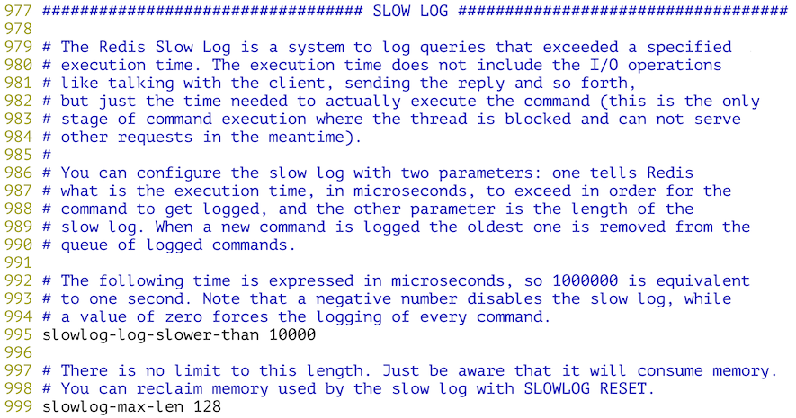

## NoSQL入門

### NoSQL概述

如今，大多數的計算機系統（包括服務器、PC、移動設備等）都會產生龐大的數據量。其實，早在2012年的時候，全世界每天產生的數據量就達到了2.5EB（艾字節，$$1EB\approx10^{18}B$$）。這些數據有很大一部分是由關係型數據庫來存儲和管理的。 早在1970年，E.F.Codd發表了論述關係型數據庫的著名論文“*A relational model of data for large shared data banks*”，這篇文章奠定了關係型數據庫的基礎並在接下來的數十年時間內產生了深遠的影響。實踐證明，關係型數據庫是實現數據持久化最為重要的方式，它也是大多數應用在選擇持久化方案時的首選技術。

NoSQL是一項全新的數據庫革命性運動，雖然它的歷史可以追溯到1998年，但是NoSQL真正深入人心並得到廣泛的應用是在進入大數據時候以後，業界普遍認為NoSQL是更適合大數據存儲的技術方案，這才使得NoSQL的發展達到了前所未有的高度。2012年《紐約時報》的一篇專欄中寫到，大數據時代已經降臨，在商業、經濟及其他領域中，決策將不再基於經驗和直覺而是基於數據和分析而作出。事實上，在天文學、氣象學、基因組學、生物學、社會學、互聯網搜索引擎、金融、醫療、社交網絡、電子商務等諸多領域，由於數據過於密集和龐大，在數據的分析和處理上也遇到了前所未有的限制和阻礙，這一切都使得對大數據處理技術的研究被提升到了新的高度，也使得各種NoSQL的技術方案進入到了公眾的視野。

NoSQL數據庫按照其存儲類型可以大致分為以下幾類：

| 類型       | 部分代表                            | 特點                                                         |
| ---------- | ----------------------------------- | ------------------------------------------------------------ |
| 列族數據庫 | HBase<br>Cassandra<br>Hypertable    | 顧名思義是按列存儲數據的。最大的特點是方便存儲結構化和半結構化數據，方便做數據壓縮，對針對某一列或者某幾列的查詢有非常大的I/O優勢，適合於批量數據處理和即時查詢。 |
| 文檔數據庫 | MongoDB<br>CouchDB<br>ElasticSearch | 文檔數據庫一般用類JSON格式存儲數據，存儲的內容是文檔型的。這樣也就有機會對某些字段建立索引，實現關係數據庫的某些功能，但不提供對參照完整性和分佈事務的支持。 |
| KV數據庫   | DynamoDB<br>Redis<br>LevelDB        | 可以通過key快速查詢到其value，有基於內存和基於磁盤兩種實現方案。 |
| 圖數據庫   | Neo4J<br>FlockDB<br>JanusGraph      | 使用圖結構進行語義查詢的數據庫，它使用節點、邊和屬性來表示和存儲數據。圖數據庫從設計上，就可以簡單快速的檢索難以在關係系統中建模的複雜層次結構。 |
| 對象數據庫 | db4o<br>Versant                     | 通過類似面嚮對象語言的語法操作數據庫，通過對象的方式存取數據。 |

> 說明：想了解更多的NoSQL數據庫，可以訪問<http://nosql-database.org/>。

### Redis概述

Redis是一種基於鍵值對的NoSQL數據庫，它提供了對多種數據類型（字符串、哈希、列表、集合、有序集合、位圖等）的支持，能夠滿足很多應用場景的需求。Redis將數據放在內存中，因此讀寫性能是非常驚人的。與此同時，Redis也提供了持久化機制，能夠將內存中的數據保存到硬盤上，在發生意外狀況時數據也不會丟掉。此外，Redis還支持鍵過期、地理信息運算、發佈訂閱、事務、管道、Lua腳本擴展等功能，總而言之，Redis的功能和性能都非常強大，如果項目中要實現高速緩存和消息隊列這樣的服務，直接交給Redis就可以了。目前，國內外很多著名的企業和商業項目都使用了Redis，包括：Twitter、Github、StackOverflow、新浪微博、百度、優酷土豆、美團、小米、唯品會等。


#### Redis簡介

2008年，一個名為Salvatore Sanfilippo的程序員為他開發的LLOOGG項目定製了專屬的數據庫（因為之前他無論怎樣優化MySQL，系統性能已經無法再提升了），這項工作的成果就是Redis的初始版本。後來他將Redis的代碼放到了全球最大的代碼託管平臺[Github](<https://github.com/antirez/redis>)，從那以後，Redis引發了大量開發者的好評和關注，繼而有數百人蔘與了Redis的開發和維護，這使得Redis的功能越來越強大和性能越來越好。

Redis是REmote DIctionary Server的縮寫，它是一個用ANSI C編寫的高性能的key-value存儲系統，與其他的key-value存儲系統相比，Redis有以下一些特點（也是優點）：

- Redis的讀寫性能極高，並且有豐富的特性（發佈/訂閱、事務、通知等）。
- Redis支持數據的持久化（RDB和AOF兩種方式），可以將內存中的數據保存在磁盤中，重啟的時候可以再次加載進行使用。
- Redis支持多種數據類型，包括：string、hash、list、set，zset、bitmap、hyperloglog等。
- Redis支持主從複製（實現讀寫分析）以及哨兵模式（監控master是否宕機並自動調整配置）。
- Redis支持分佈式集群，可以很容易的通過水平擴展來提升系統的整體性能。
- Redis基於TCP提供的可靠傳輸服務進行通信，很多編程語言都提供了Redis客戶端支持。

#### Redis的應用場景

1. 高速緩存  - 將不常變化但又經常被訪問的熱點數據放到Redis數據庫中，可以大大降低關係型數據庫的壓力，從而提升系統的響應性能。
2. 排行榜 - 很多網站都有排行榜功能，利用Redis中的列表和有序集合可以非常方便的構造各種排行榜系統。
3. 商品秒殺/投票點贊 - Redis提供了對計數操作的支持，網站上常見的秒殺、點贊等功能都可以利用Redis的計數器通過+1或-1的操作來實現，從而避免了使用關係型數據的`update`操作。
4. 分佈式鎖 - 利用Redis可以跨多臺服務器實現分佈式鎖（類似於線程鎖，但是能夠被多臺機器上的多個線程或進程共享）的功能，用於實現一個阻塞式操作。
5. 消息隊列 - 消息隊列和高速緩存一樣，是一個大型網站不可缺少的基礎服務，可以實現業務解耦和非實時業務削峰等特性，這些我們都會在後面的項目中為大家展示。

#### Redis的安裝和配置

可以使用Linux系統的包管理工具（如yum）來安裝Redis，也可以通過在Redis的[官方網站](https://redis.io/)下載Redis的源代碼，解壓縮解歸檔之後通過make工具對源代碼進行構建並安裝，在更新這篇文檔時，Redis官方提供的最新穩定版本是[Redis 5.0.4](http://download.redis.io/releases/redis-5.0.4.tar.gz)。

```Shell
wget http://download.redis.io/releases/redis-5.0.4.tar.gz
gunzip redis-5.0.4.tar.gz
tar -xvf redis-5.0.4.tar
cd redis-5.0.4
make && make install
```

在redis源代碼目錄下有一個名為redis.conf的配置文件，我們可以先查看一下該文件。

```Shell
vim redis.conf
```

配置將Redis服務綁定到指定的IP地址和端口。


配置底層有多少個數據庫。


配置Redis的持久化機制 - RDB。


配置Redis的持久化機制 - AOF。


配置訪問Redis服務器的驗證口令。


配置Redis的主從複製，通過主從複製可以實現讀寫分離。


配置慢查詢。



上面這些內容就是Redis的基本配置，如果你對上面的內容感到困惑也沒有關係，先把Redis用起來再回頭去推敲這些內容就行了。如果想找一些參考書，[《Redis開發與運維》](https://item.jd.com/12121730.html)是一本不錯的入門讀物，而[《Redis實戰》](https://item.jd.com/11791607.html)是不錯的進階讀物。

#### Redis的服務器和客戶端

接下來啟動Redis服務器，下面的方式將以默認的配置啟動Redis服務。

```Shell
redis-server
```

如果希望修改Redis的配置（如端口、認證口令、持久化方式等），可以通過下面兩種方式。

方式一：通過參數指定認證口令和AOF持久化方式。

```Shell
redis-server --requirepass 1qaz2wsx --appendonly yes
```

方式二：通過指定的配置文件來修改Redis的配置。

```Shell
redis-server /root/redis-5.0.4/redis.conf
```

下面我們使用第一種方式來啟動Redis並將其置於後臺運行，將Redis產生的輸出重定向到名為redis.log的文件中。

```Shell
redis-server --requirepass 1qaz2wsx > redis.log &
```

可以通過ps或者netstat來檢查Redis服務器是否啟動成功。

```Shell
ps -ef | grep redis-server
netstat -nap | grep redis-server
```

接下來，我們嘗試用Redis客戶端去連接服務器。

```Shell
redis-cli
127.0.0.1:6379> auth 1qaz2wsx
OK
127.0.0.1:6379> ping
PONG
127.0.0.1:6379>
```

Redis有著非常豐富的數據類型，也有很多的命令來操作這些數據，具體的內容可以查看[Redis命令參考](http://redisdoc.com/)，在這個網站上，除了Redis的命令參考，還有Redis的詳細文檔，其中包括了通知、事務、主從複製、持久化、哨兵、集群等內容。


> 說明：上面的插圖來自付磊和張益軍先生編著的《Redis開發與運維》一書。

```Shell
127.0.0.1:6379> set username admin
OK
127.0.0.1:6379> get username
"admin"
127.0.0.1:6379> set password "123456" ex 300
OK
127.0.0.1:6379> get password
"123456"
127.0.0.1:6379> ttl username
(integer) -1
127.0.0.1:6379> ttl password
(integer) 286
127.0.0.1:6379> hset stu1 name hao
(integer) 0
127.0.0.1:6379> hset stu1 age 38
(integer) 1
127.0.0.1:6379> hset stu1 gender male
(integer) 1
127.0.0.1:6379> hgetall stu1
1) "name"
2) "hao"
3) "age"
4) "38"
5) "gender"
6) "male"
127.0.0.1:6379> hvals stu1
1) "hao"
2) "38"
3) "male"
127.0.0.1:6379> hmset stu2 name wang age 18 gender female tel 13566778899
OK
127.0.0.1:6379> hgetall stu2
1) "name"
2) "wang"
3) "age"
4) "18"
5) "gender"
6) "female"
7) "tel"
8) "13566778899"
127.0.0.1:6379> lpush nums 1 2 3 4 5
(integer) 5
127.0.0.1:6379> lrange nums 0 -1
1) "5"
2) "4"
3) "3"
4) "2"
5) "1"
127.0.0.1:6379> lpop nums
"5"
127.0.0.1:6379> lpop nums
"4"
127.0.0.1:6379> rpop nums
"1"
127.0.0.1:6379> rpop nums
"2"
127.0.0.1:6379> sadd fruits apple banana orange apple grape grape
(integer) 4
127.0.0.1:6379> scard fruits
(integer) 4
127.0.0.1:6379> smembers fruits
1) "grape"
2) "orange"
3) "banana"
4) "apple"
127.0.0.1:6379> sismember fruits apple
(integer) 1
127.0.0.1:6379> sismember fruits durian
(integer) 0
127.0.0.1:6379> sadd nums1 1 2 3 4 5
(integer) 5
127.0.0.1:6379> sadd nums2 2 4 6 8
(integer) 4
127.0.0.1:6379> sinter nums1 nums2
1) "2"
2) "4"
127.0.0.1:6379> sunion nums1 nums2
1) "1"
2) "2"
3) "3"
4) "4"
5) "5"
6) "6"
7) "8"
127.0.0.1:6379> sdiff nums1 nums2
1) "1"
2) "3"
3) "5"
127.0.0.1:6379> zadd topsinger 5234 zhangxy 1978 chenyx 2235 zhoujl 3520 xuezq
(integer) 4
127.0.0.1:6379> zrange topsinger 0 -1 withscores
1) "chenyx"
2) "1978"
3) "zhoujl"
4) "2235"
5) "xuezq"
6) "3520"
7) "zhangxy"
8) "5234"
127.0.0.1:6379> zrevrange topsinger 0 -1
1) "zhangxy"
2) "xuezq"
3) "zhoujl"
4) "chenyx"
127.0.0.1:6379> geoadd pois 116.39738549206541 39.90862689286386 tiananmen 116.27172936413572 39.99
135172904494 yiheyuan 117.27766503308104 40.65332064313784 gubeishuizhen
(integer) 3
127.0.0.1:6379> geodist pois tiananmen gubeishuizhen km
"111.5333"
127.0.0.1:6379> geodist pois tiananmen yiheyuan km
"14.1230"
127.0.0.1:6379> georadius pois 116.86499108288572 40.40149669363615 50 km withdist
1) 1) "gubeishuizhen"
   2) "44.7408"
```

#### 在Python程序中使用Redis

可以使用pip安裝redis模塊。redis模塊的核心是名為Redis的類，該類的對象代表一個Redis客戶端，通過該客戶端可以向Redis服務器發送命令並獲取執行的結果。上面我們在Redis客戶端中使用的命令基本上就是Redis對象可以接收的消息，所以如果瞭解了Redis的命令就可以在Python中玩轉Redis。

```Shell
pip3 install redis
python3
```

```Python
>>> import redis
>>> client = redis.Redis(host='1.2.3.4', port=6379, password='1qaz2wsx')
>>> client.set('username', 'admin')
True
>>> client.hset('student', 'name', 'hao')
1
>>> client.hset('student', 'age', 38)
1
>>> client.keys('*')
[b'username', b'student']
>>> client.get('username')
b'admin'
>>> client.hgetall('student')
{b'name': b'hao', b'age': b'38'}
```

### MongoDB概述

#### MongoDB簡介

MongoDB是2009年問世的一個面向文檔的數據庫管理系統，由C++語言編寫，旨在為Web應用提供可擴展的高性能數據存儲解決方案。雖然在劃分類別的時候後，MongoDB被認為是NoSQL的產品，但是它更像一個介於關係數據庫和非關係數據庫之間的產品，在非關係數據庫中它功能最豐富，最像關係數據庫。

MongoDB將數據存儲為一個文檔，一個文檔由一系列的“鍵值對”組成，其文檔類似於JSON對象，但是MongoDB對JSON進行了二進制處理（能夠更快的定位key和value），因此其文檔的存儲格式稱為BSON。關於JSON和BSON的差別大家可以看看MongoDB官方網站的文章[《JSON and BSON》](https://www.mongodb.com/json-and-bson)。

目前，MongoDB已經提供了對Windows、MacOS、Linux、Solaris等多個平臺的支持，而且也提供了多種開發語言的驅動程序，Python當然是其中之一。

#### MongoDB的安裝和配置

可以從MongoDB的[官方下載鏈接](https://www.mongodb.com/download-center#community)下載MongoDB，官方為Windows系統提供了一個Installer程序，而Linux和MacOS則提供了壓縮文件。下面簡單說一下Linux系統如何安裝和配置MongoDB。

```Shell
wget https://fastdl.mongodb.org/linux/mongodb-linux-x86_64-amazon-3.6.5.tgz
gunzip mongodb-linux-x86_64-amazon-3.6.5.tgz
mkdir mongodb-3.6.5
tar -xvf mongodb-linux-x86_64-amazon-3.6.5.tar --strip-components 1 -C mongodb-3.6.5/
export PATH=$PATH:~/mongodb-3.6.5/bin
mkdir -p /data/db
mongod --bind_ip 172.18.61.250

2018-06-03T18:03:28.232+0800 I CONTROL  [initandlisten] MongoDB starting : pid=1163 port=27017 dbpath=/data/db 64-bit host=iZwz97tbgo9lkabnat2lo8Z
2018-06-03T18:03:28.232+0800 I CONTROL  [initandlisten] db version v3.6.5
2018-06-03T18:03:28.232+0800 I CONTROL  [initandlisten] git version: a20ecd3e3a174162052ff99913bc2ca9a839d618
2018-06-03T18:03:28.232+0800 I CONTROL  [initandlisten] OpenSSL version: OpenSSL 1.0.0-fips29 Mar 2010
...
2018-06-03T18:03:28.945+0800 I NETWORK  [initandlisten] waiting for connections on port 27017
```

> 說明：上面的操作中，export命令是設置PATH環境變量，這樣可以在任意路徑下執行mongod來啟動MongoDB服務器。MongoDB默認保存數據的路徑是/data/db目錄，為此要提前創建該目錄。此外，在使用mongod啟動MongoDB服務器時，--bind_ip參數用來將服務綁定到指定的IP地址，也可以用--port參數來指定端口，默認端口為27017。

#### MongoDB基本概念

我們通過與關係型數據庫進行對照的方式來說明MongoDB中的一些概念。

| SQL         | MongoDB     | 解釋（SQL/MongoDB）    |
| ----------- | ----------- | ---------------------- |
| database    | database    | 數據庫/數據庫          |
| table       | collection  | 二維表/集合            |
| row         | document    | 記錄（行）/文檔        |
| column      | field       | 字段（列）/域          |
| index       | index       | 索引/索引              |
| table joins | ---         | 表連接/嵌套文檔        |
| primary key | primary key | 主鍵/主鍵（`_id`字段） |

#### 通過Shell操作MongoDB

啟動服務器後可以使用交互式環境跟服務器通信，如下所示。

```shell
mongo --host 172.18.61.250

MongoDB shell version v3.6.5
connecting to: mongodb://172.18.61.250:27017/
```

1. 查看、創建和刪除數據庫。

   ```JavaScript
   > // 顯示所有數據庫
   > show dbs
   admin   0.000GB
   config  0.000GB
   local   0.000GB
   > // 創建並切換到school數據庫
   > use school
   switched to db school
   > // 刪除當前數據庫
   > db.dropDatabase()
   { "ok" : 1 }
   >
   ```

2. 創建、刪除和查看集合。

   ```JavaScript
   > // 創建並切換到school數據庫
   > use school
   switched to db school
   > // 創建colleges集合
   > db.createCollection('colleges')
   { "ok" : 1 }
   > // 創建students集合
   > db.createCollection('students')
   { "ok" : 1 }
   > // 查看所有集合
   > show collections
   colleges
   students
   > // 刪除colleges集合
   > db.colleges.drop()
   true
   > 
   ```

   > 說明：在MongoDB中插入文檔時如果集合不存在會自動創建集合，所以也可以按照下面的方式通過創建文檔來創建集合。

3. 文檔的CRUD操作。

   ```JavaScript
   > // 向students集合插入文檔
   > db.students.insert({stuid: 1001, name: '駱昊', age: 38})
   WriteResult({ "nInserted" : 1 })
   > // 向students集合插入文檔
   > db.students.save({stuid: 1002, name: '王大錘', tel: '13012345678', gender: '男'})
   WriteResult({ "nInserted" : 1 })
   > // 查看所有文檔
   > db.students.find()
   { "_id" : ObjectId("5b13c72e006ad854460ee70b"), "stuid" : 1001, "name" : "駱昊", "age" : 38 }
   { "_id" : ObjectId("5b13c790006ad854460ee70c"), "stuid" : 1002, "name" : "王大錘", "tel" : "13012345678", "gender" : "男" }
   > // 更新stuid為1001的文檔
   > db.students.update({stuid: 1001}, {'$set': {tel: '13566778899', gender: '男'}})
   WriteResult({ "nMatched" : 1, "nUpserted" : 0, "nModified" : 1 })
   > // 插入或更新stuid為1003的文檔
   > db.students.update({stuid: 1003}, {'$set': {name: '白元芳', tel: '13022223333', gender: '男'}},  upsert=true)
   WriteResult({
           "nMatched" : 0,
           "nUpserted" : 1,
           "nModified" : 0,
           "_id" : ObjectId("5b13c92dd185894d7283efab")
   })
   > // 查詢所有文檔
   > db.students.find().pretty()
   {
           "_id" : ObjectId("5b13c72e006ad854460ee70b"),
           "stuid" : 1001,
           "name" : "駱昊",
           "age" : 38,
           "gender" : "男",
           "tel" : "13566778899"
   }
   {
           "_id" : ObjectId("5b13c790006ad854460ee70c"),
           "stuid" : 1002,
           "name" : "王大錘",
           "tel" : "13012345678",
           "gender" : "男"
   }
   {
           "_id" : ObjectId("5b13c92dd185894d7283efab"),
           "stuid" : 1003,
           "gender" : "男",
           "name" : "白元芳",
           "tel" : "13022223333"
   }
   > // 查詢stuid大於1001的文檔
   > db.students.find({stuid: {'$gt': 1001}}).pretty()
   {
           "_id" : ObjectId("5b13c790006ad854460ee70c"),
           "stuid" : 1002,
           "name" : "王大錘",
           "tel" : "13012345678",
           "gender" : "男"
   }
   {
           "_id" : ObjectId("5b13c92dd185894d7283efab"),
           "stuid" : 1003,
           "gender" : "男",
           "name" : "白元芳",
           "tel" : "13022223333"
   }
   > // 查詢stuid大於1001的文檔只顯示name和tel字段
   > db.students.find({stuid: {'$gt': 1001}}, {_id: 0, name: 1, tel: 1}).pretty()
   { "name" : "王大錘", "tel" : "13012345678" }
   { "name" : "白元芳", "tel" : "13022223333" }
   > // 查詢name為“駱昊”或者tel為“13022223333”的文檔
   > db.students.find({'$or': [{name: '駱昊'}, {tel: '13022223333'}]}, {_id: 0, name: 1, tel: 1}).pretty()
   { "name" : "駱昊", "tel" : "13566778899" }
   { "name" : "白元芳", "tel" : "13022223333" }
   > // 查詢學生文檔跳過第1條文檔只查1條文檔
   > db.students.find().skip(1).limit(1).pretty()
   {
           "_id" : ObjectId("5b13c790006ad854460ee70c"),
           "stuid" : 1002,
           "name" : "王大錘",
           "tel" : "13012345678",
           "gender" : "男"
   }
   > // 對查詢結果進行排序(1表示升序，-1表示降序)
   > db.students.find({}, {_id: 0, stuid: 1, name: 1}).sort({stuid: -1})
   { "stuid" : 1003, "name" : "白元芳" }
   { "stuid" : 1002, "name" : "王大錘" }
   { "stuid" : 1001, "name" : "駱昊" }
   > // 在指定的一個或多個字段上創建索引
   > db.students.ensureIndex({name: 1})
   {
           "createdCollectionAutomatically" : false,
           "numIndexesBefore" : 1,
           "numIndexesAfter" : 2,
           "ok" : 1
   }
   > 
   ```

使用MongoDB可以非常方便的配置數據複製，通過冗餘數據來實現數據的高可用以及災難恢復，也可以通過數據分片來應對數據量迅速增長的需求。關於MongoDB更多的操作可以查閱[官方文檔](https://mongodb-documentation.readthedocs.io/en/latest/) ，同時推薦大家閱讀Kristina Chodorow寫的[《MongoDB權威指南》](http://www.ituring.com.cn/book/1172)。

#### 在Python程序中操作MongoDB

可以通過pip安裝pymongo來實現對MongoDB的操作。

```Shell
pip3 install pymongo
python3
```

```Python
>>> from pymongo import MongoClient
>>> client = MongoClient('mongodb://127.0.0.1:27017') 
>>> db = client.school
>>> for student in db.students.find():
...     print('學號:', student['stuid'])
...     print('姓名:', student['name'])
...     print('電話:', student['tel'])
... 
學號: 1001.0
姓名: 駱昊
電話: 13566778899
學號: 1002.0
姓名: 王大錘
電話: 13012345678
學號: 1003.0
姓名: 白元芳
電話: 13022223333
>>> db.students.find().count()
3
>>> db.students.remove()
{'n': 3, 'ok': 1.0}
>>> db.students.find().count()
0
>>> coll = db.students
>>> from pymongo import ASCENDING
>>> coll.create_index([('name', ASCENDING)], unique=True)
'name_1'
>>> coll.insert_one({'stuid': int(1001), 'name': '駱昊', 'gender': True})
<pymongo.results.InsertOneResult object at 0x1050cc6c8>
>>> coll.insert_many([{'stuid': int(1002), 'name': '王大錘', 'gender': False}, {'stuid': int(1003), 'name': '白元芳', 'gender': True}])
<pymongo.results.InsertManyResult object at 0x1050cc8c8>
>>> for student in coll.find({'gender': True}):
...     print('學號:', student['stuid'])
...     print('姓名:', student['name'])
...     print('性別:', '男' if student['gender'] else '女')
... 
學號: 1001
姓名: 駱昊
性別: 男
學號: 1003
姓名: 白元芳
性別: 男
>>> 
```

關於PyMongo更多的知識可以通過它的[官方文檔](https://api.mongodb.com/python/current/tutorial.html)進行了解，也可以使用[MongoEngine](<https://pypi.org/project/mongoengine/>)這樣的庫來簡化Python程序對MongoDB的操作，除此之外，還有以異步I/O方式訪問MongoDB的三方庫[motor](<https://pypi.org/project/motor/>)都是不錯的選擇。