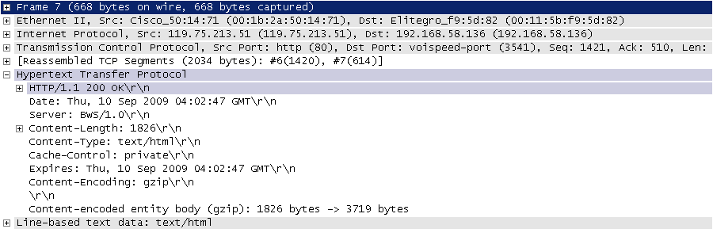
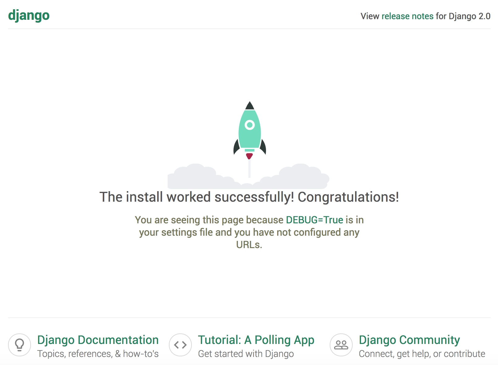

## 快速上手

Web開發的早期階段，開發者需要手動編寫每個頁面，例如一個新聞門戶網站，每天都要修改它的HTML頁面，隨著網站規模和體量的增大，這種方式就變得極度糟糕。為了解決這個問題，開發人員想到了用外部程序來為Web服務器生成動態內容，也就是說HTML頁面以及頁面中的動態內容不再通過手動編寫而是通過程序自動生成。最早的時候，這項技術被稱為CGI（公共網關接口），當然隨著時間的推移，CGI暴露出的問題也越來越多，例如大量重複的樣板代碼，總體性能較為低下等，因此在時代呼喚新英雄的背景下，PHP、ASP、JSP這類Web應用開發技術在上世紀90年代中後期如雨後春筍般湧現。通常我們說的Web應用是指通過瀏覽器來訪問網絡資源的應用程序，因為瀏覽器的普及性以及易用性，Web應用使用起來方便簡單，免除了安裝和更新應用程序帶來的麻煩，而且也不用關心用戶到底用的是什麼操作系統，甚至不用區分是PC端還是移動端。

### Web應用機制和術語

下圖向我們展示了Web應用的工作流程，其中涉及到的術語如下表所示。


> 說明：相信有經驗的讀者會發現，這張圖中其實還少了很多東西，例如反向代理服務器、數據庫服務器、防火牆等，而且圖中的每個節點在實際項目部署時可能是一組節點組成的集群。當然，如果你對這些沒有什麼概念也不要緊，繼續下去就行了，後面會給大家一一講解的。

| 術語          | 解釋                                                         |
| ------------- | ------------------------------------------------------------ |
| **URL/URI**   | 統一資源定位符/統一資源標識符，網絡資源的唯一標識            |
| **域名**      | 與Web服務器地址對應的一個易於記憶的字符串名字                |
| **DNS**       | 域名解析服務，可以將域名轉換成對應的IP地址                   |
| **IP地址**    | 網絡上的主機的身份標識，通過IP地址可以區分不同的主機         |
| **HTTP**      | 超文本傳輸協議，構建在TCP之上的應用級協議，萬維網數據通信的基礎 |
| **反向代理**  | 代理客戶端向服務器發出請求，然後將服務器返回的資源返回給客戶端 |
| **Web服務器** | 接受HTTP請求，然後返回HTML文件、純文本文件、圖像等資源給請求者 |
| **Nginx**     | 高性能的Web服務器，也可以用作[反向代理](https://zh.wikipedia.org/wiki/%E5%8F%8D%E5%90%91%E4%BB%A3%E7%90%86)，[負載均衡](https://zh.wikipedia.org/wiki/%E8%B4%9F%E8%BD%BD%E5%9D%87%E8%A1%A1) 和 [HTTP緩存](https://zh.wikipedia.org/wiki/HTTP%E7%BC%93%E5%AD%98) |

#### HTTP協議

這裡我們稍微費一些筆墨來談談上面提到的HTTP。HTTP（超文本傳輸協議）是構建於TCP（傳輸控制協議）之上應用級協議，它利用了TCP提供的可靠的傳輸服務實現了Web應用中的數據交換。按照維基百科上的介紹，設計HTTP最初的目的是為了提供一種發佈和接收[HTML](https://zh.wikipedia.org/wiki/HTML)頁面的方法，也就是說這個協議是瀏覽器和Web服務器之間傳輸的數據的載體。關於這個協議的詳細信息以及目前的發展狀況，大家可以閱讀阮一峰老師的[《HTTP 協議入門》](http://www.ruanyifeng.com/blog/2016/08/http.html)、[《互聯網協議入門》](http://www.ruanyifeng.com/blog/2012/05/internet_protocol_suite_part_i.html)系列以及[《圖解HTTPS協議》](http://www.ruanyifeng.com/blog/2014/09/illustration-ssl.html)進行了解。下圖是我在四川省網絡通信技術重點實驗室學習和工作期間使用開源協議分析工具Ethereal（抓包工具WireShark的前身）截取的訪問百度首頁時的HTTP請求和響應的報文（協議數據），由於Ethereal截取的是經過網絡適配器的數據，因此可以清晰的看到從物理鏈路層到應用層的協議數據。

HTTP請求（請求行+請求頭+空行+[消息體]）：


HTTP響應（響應行+響應頭+空行+消息體）：



>  說明：這兩張圖是在2009年9月10日截取的，但願這兩張如同泛黃的照片般的截圖能幫助你瞭解HTTP到底是什麼樣子的。

### Django概述

Python的Web框架有上百個，比它的關鍵字還要多。所謂Web框架，就是用於開發Web服務器端應用的基礎設施（通常指封裝好的模塊和一系列的工具）。事實上，即便沒有Web框架，我們仍然可以通過socket或[CGI](https://zh.wikipedia.org/wiki/%E9%80%9A%E7%94%A8%E7%BD%91%E5%85%B3%E6%8E%A5%E5%8F%A3)來開發Web服務器端應用，但是這樣做的成本和代價在實際開發中通常是不能接受的。通過Web框架，我們可以化繁為簡，同時降低創建、更新、擴展應用程序的工作量。Python的Web框架中比較有名的有：Flask、Django、Tornado、Sanic、Pyramid、Bottle、Web2py、web.py等。

在基於Python的Web框架中，Django是所有重量級選手中最有代表性的一位，開發者可以基於Django快速的開發可靠的Web應用程序，因為它減少了Web開發中不必要的開銷，對常用的設計和開發模式進行了封裝，並對MVC架構提供了支持（MTV）。許多成功的網站和App都是基於Django框架構建的，國內比較有代表性的網站包括：知乎、豆瓣網、果殼網、搜狐閃電郵箱、101圍棋網、海報時尚網、背書吧、堆糖、手機搜狐網、咕咚、愛福窩、果庫等。


Django誕生於2003年，它是一個在真正的應用中成長起來的項目，由勞倫斯出版集團旗下在線新聞網站的內容管理系統（CMS）研發團隊編寫（主要是Adrian Holovaty和Simon Willison），以比利時的吉普賽爵士吉他手Django Reinhardt來命名，在2005年夏天作為開源框架發佈。使用Django能用很短的時間構建出功能完備的網站，因為它代替程序員完成了所有乏味和重複的勞動，剩下真正有意義的核心業務給程序員，這一點就是對DRY（Don't Repeat Yourself）理念的最好踐行。

### 快速上手

#### 準備工作

1. 檢查Python環境：Django 1.11需要Python 2.7或Python 3.4以上的版本；Django 2.0需要Python 3.4以上的版本；Django 2.1需要Python 3.5以上的版本。

   > 說明：我自己平時使用macOS做開發，macOS和Linux平臺使用的命令跟Windows平臺有較大的區別，這一點在之前也有過類似的說明，如果使用Windows平臺做開發，替換一下對應的命令即可。

   ```Shell
   $ python3 --version
   ```

   ```Shell
   $ python3
   >>> import sys
   >>> sys.version
   >>> sys.version_info
   ```

2. 創建項目文件夾並切換到該目錄，例如我們要實例一個OA（辦公自動化）項目。

   ```Shell
   $ mkdir oa
   $ cd oa
   ```

3. 創建並激活虛擬環境。

   ```Shell
   $ python3 -m venv venv
   $ source venv/bin/activate
   ```
   > 說明：上面使用了Python自帶的venv模塊完成了虛擬環境的創建，當然也可以使用virtualenv或pipenv這樣的工具。要激活虛擬環境，在Windows環境下可以通過"venv/Scripts/activate"執行批處理文件來實現。

4. 更新包管理工具pip。

   ```Shell
   (venv)$ pip install -U pip
   ```

   或

   ```Shell
   (venv)$ python -m pip install -U pip
   ```
   > 注意：請注意終端提示符發生的變化，前面的`(venv)`說明我們已經進入虛擬環境，而虛擬環境下的python和pip已經是Python 3的解釋器和包管理工具了。

5. 安裝Django。

   ```Shell
   (venv)$ pip install django
   ```

   或指定版本號來安裝對應的Django的版本。

   ```Shell
   (venv)$ pip install django==2.1.8
   ```

6. 檢查Django的版本。

   ```Shell
   (venv)$ python -m django --version
   (venv)$ django-admin --version
   ```

   或

   ```Shell
   (venv)$ python
   >>> import django
   >>> django.get_version()
   ```
   當然，也可以通過pip來查看安裝的依賴庫及其版本，如：

   ```Shell
   (venv)$ pip freeze
   (venv)$ pip list
   ```

   下圖展示了Django版本和Python版本的對應關係，如果在安裝時沒有指定版本號，將自動選擇最新的版本（在寫作這段內容時，Django最新的版本是2.2）。

   | Django版本 | Python版本              |
   | ---------- | ----------------------- |
   | 1.8        | 2.7、3.2、3.3、3.4、3.5 |
   | 1.9、1.10  | 2.7、3.4、3.5           |
   | 1.11       | 2.7、3.4、3.5、3.6、3.7 |
   | 2.0        | 3.4、3.5、3.6、3.7      |
   | 2.1、2.2   | 3.5、3.6、3.7           |

7. 使用`django-admin`創建項目，項目命名為oa。

   ```Shell
   (venv)$ django-admin startproject oa .
   ```

   > 注意：上面的命令最後的那個點，它表示在當前路徑下創建項目。

   執行上面的命令後看看生成的文件和文件夾，它們的作用如下所示：

   - `manage.py`： 一個讓你可以管理Django項目的工具程序。
   - `oa/__init__.py`：一個空文件，告訴Python解釋器這個目錄應該被視為一個Python的包。
   - `oa/settings.py`：Django項目的配置文件。
   - `oa/urls.py`：Django項目的URL聲明（URL映射），就像是你的網站的“目錄”。
   - `oa/wsgi.py`：項目運行在WSGI兼容Web服務器上的接口文件。

   > 說明：WSGI全稱是Web服務器網關接口，維基百科上給出的解釋是“為Python語言定義的[Web服務器](https://zh.wikipedia.org/wiki/%E7%B6%B2%E9%A0%81%E4%BC%BA%E6%9C%8D%E5%99%A8)和[Web應用程序](https://zh.wikipedia.org/wiki/%E7%BD%91%E7%BB%9C%E5%BA%94%E7%94%A8%E7%A8%8B%E5%BA%8F)或框架之間的一種簡單而通用的接口”。

8. 啟動服務器運行項目。

   ```Shell
   (venv)$ python manage.py runserver
   ```

   在瀏覽器中輸入<http://127.0.0.1:8000>訪問我們的服務器，效果如下圖所示。

   


   > 說明1：剛剛啟動的是Django自帶的用於開發和測試的服務器，它是一個用純Python編寫的輕量級Web服務器，但它並不是真正意義上的生產級別的服務器，千萬不要將這個服務器用於和生產環境相關的任何地方。

   > 說明2：用於開發的服務器在需要的情況下會對每一次的訪問請求重新載入一遍Python代碼。所以你不需要為了讓修改的代碼生效而頻繁的重新啟動服務器。然而，一些動作，比如添加新文件，將不會觸發自動重新加載，這時你得自己手動重啟服務器。

   > 說明3：可以通過`python manage.py help`命令查看可用命令列表；在啟動服務器時，也可以通過`python manage.py runserver 1.2.3.4:5678`來指定將服務器運行於哪個IP地址和端口。

   > 說明4：可以通過Ctrl+C來終止服務器的運行。

9. 接下來我們修改項目的配置文件settings.py，Django是一個支持國際化和本地化的框架，因此剛才我們看到的默認首頁也是支持國際化的，我們將默認語言修改為中文，時區設置為東八區。

   ```Shell
   (venv)$ vim oa/settings.py
   ```

   ```Python
   # 此處省略上面的內容
   
   # 設置語言代碼
   LANGUAGE_CODE = 'zh-hans'
   # 設置時區
   TIME_ZONE = 'Asia/Chongqing'
   
   # 此處省略下面的內容
   ```

10. 刷新剛才的頁面。

  

#### 動態頁面

1. 創建名為hrs（人力資源系統）的應用，一個Django項目可以包含一個或多個應用。

   ```Shell
   (venv)$ python manage.py startapp hrs
   ```

   執行上面的命令會在當前路徑下創建hrs目錄，其目錄結構如下所示：

   - `__init__.py`：一個空文件，告訴Python解釋器這個目錄應該被視為一個Python的包。
   - `admin.py`：可以用來註冊模型，用於在Django的管理界面管理模型。
   -  `apps.py`：當前應用的配置文件。
   - `migrations`：存放與模型有關的數據庫遷移信息。
     - `__init__.py`：一個空文件，告訴Python解釋器這個目錄應該被視為一個Python的包。
   - `models.py`：存放應用的數據模型，即實體類及其之間的關係（MVC/MTV中的M）。
   - `tests.py`：包含測試應用各項功能的測試類和測試函數。
   - `views.py`：處理請求並返回響應的函數（MVC中的C，MTV中的V）。

2. 修改應用目錄下的視圖文件views.py。

   ```Shell
   (venv)$ vim hrs/views.py
   ```

   ```Python
   from django.http import HttpResponse
   
   
   def index(request):
       return HttpResponse('<h1>Hello, Django!</h1>')
   ```

3. 在應用目錄創建一個urls.py文件並映射URL。

   ```Shell
   (venv)$ touch hrs/urls.py
   (venv)$ vim hrs/urls.py
   ```

   ```Python
   from django.urls import path
   
   from hrs import views
   
   urlpatterns = [
       path('', views.index, name='index'),
   ]
   ```
   > 說明：上面使用的`path`函數是Django 2.x中新添加的函數，除此之外還可以使用支持正則表達式的URL映射函數`re_path`函數；Django 1.x中是用名為`url`函數來設定URL映射。

4. 修改項目目錄下的urls.py文件，對應用中設定的URL進行合併。

   ```Shell
   (venv) $ vim oa/urls.py
   ```

   ```Python
   from django.contrib import admin
   from django.urls import path, include
   
   urlpatterns = [
       path('admin/', admin.site.urls),
       path('hrs/', include('hrs.urls')),
   ]
   ```

   > 說明：上面的代碼通過`include`函數將hrs應用中配置URL的文件包含到項目的URL配置中，並映射到`hrs/`路徑下。

5. 重新運行項目，並打開瀏覽器中訪問<http://localhost:8000/hrs>。

   ```Shell
   (venv)$ python manage.py runserver
   ```

6. 修改views.py生成動態內容。

   ```Shell
   (venv)$ vim hrs/views.py
   ```

   ```Python
   from io import StringIO
   
   from django.http import HttpResponse
   
   depts_list = [
       {'no': 10, 'name': '財務部', 'location': '北京'},
       {'no': 20, 'name': '研發部', 'location': '成都'},
       {'no': 30, 'name': '銷售部', 'location': '上海'},
   ]
   
   
   def index(request):
       output = StringIO()
       output.write('<html>\n')
       output.write('<head>\n')
       output.write('\t<meta charset="utf-8">\n')
       output.write('\t<title>首頁</title>')
       output.write('</head>\n')
       output.write('<body>\n')
       output.write('\t<h1>部門信息</h1>\n')
       output.write('\t<hr>\n')
       output.write('\t<table>\n')
       output.write('\t\t<tr>\n')
       output.write('\t\t\t<th width=120>部門編號</th>\n')
       output.write('\t\t\t<th width=180>部門名稱</th>\n')
       output.write('\t\t\t<th width=180>所在地</th>\n')
       output.write('\t\t</tr>\n')
       for dept in depts_list:
           output.write('\t\t<tr>\n')
           output.write(f'\t\t\t<td align=center>{dept["no"]}</td>\n')
           output.write(f'\t\t\t<td align=center>{dept["name"]}</td>\n')
           output.write(f'\t\t\t<td align=center>{dept["location"]}</td>\n')
           output.write('\t\t</tr>\n')
       output.write('\t</table>\n')
       output.write('</body>\n')
       output.write('</html>\n')
       return HttpResponse(output.getvalue())
   ```

7. 刷新頁面查看程序的運行結果。

    

#### 使用視圖模板

上面通過拼接HTML代碼的方式生成動態視圖的做法在實際開發中是無能接受的，這一點大家一定能夠想到。為了解決這個問題，我們可以提前準備一個模板頁，所謂模板頁就是一個帶佔位符的HTML頁面，當我們將程序中獲得的數據替換掉頁面中的佔位符時，一個動態頁面就產生了。

我們可以用Django框架中template模塊的Template類創建模板對象，通過模板對象的render方法實現對模板的渲染，在Django框架中還有一個名為`render`的便捷函數可以來完成渲染模板的操作。所謂的渲染就是用數據替換掉模板頁中的佔位符，當然這裡的渲染稱為後端渲染，即在服務器端完成頁面的渲染再輸出到瀏覽器中，這種做法的主要壞處是當併發訪問量較大時，服務器會承受較大的負擔，所以今天有很多的Web應用都使用了前端渲染，即服務器只提供所需的數據（通常是JSON格式），在瀏覽器中通過JavaScript獲取這些數據並渲染到頁面上，這個我們在後面的內容中會講到。

1. 先回到manage.py文件所在的目錄創建名為templates文件夾。

   ```Shell
   (venv)$ mkdir templates
   ```

2. 創建模板頁index.html。

   ```Shell
   (venv)$ touch templates/index.html
   (venv)$ vim templates/index.html
   ```
   ```HTML
   <!DOCTYPE html>
   <html lang="en">
   <head>
   	<meta charset="UTF-8">
   	<title>首頁</title>
   </head>
   <body>
   	<h1>部門信息</h1>
   	<hr>
   	<table>
   	    <tr>
               <th>部門編號</th>
               <th>部門名稱</th>
               <th>所在地</th>
           </tr>
           
           <tr>
               <td>{{ dept.no }}</td>
               <td>{{ dept.name }}</td>
               <td>{{ dept.location }}</td>
           <tr>
           
       </table>
   </body>
   </html>
   ```
   在上面的模板頁中我們使用了`{{ greeting }}`這樣的模板佔位符語法，也使用了``這樣的模板指令，這些都是Django模板語言（DTL）的一部分。如果對此不熟悉並不要緊，我們會在後續的內容中進一步的講解，而且我們剛才也說到了，渲染頁面還有更好的選擇就是使用前端渲染，當然這是後話。

3. 回到應用目錄，修改views.py文件。

   ```Shell
   (venv)$ vim hrs/views.py
   ```

   ```Python
   from django.shortcuts import render
   
   depts_list = [
       {'no': 10, 'name': '財務部', 'location': '北京'},
       {'no': 20, 'name': '研發部', 'location': '成都'},
       {'no': 30, 'name': '銷售部', 'location': '上海'},
   ]
   
   
   def index(request):
       return render(request, 'index.html', {'depts_list': depts_list})
   ```

   > 說明：Django框架通過shortcuts模塊的便捷函數`render`簡化了渲染模板的操作，有了這個函數，就不用先創建`Template`對象再去調用`render`方法。。

   到此為止，我們還沒有辦法讓views.py中的`render`函數找到模板文件index.html，為此我們需要修改settings.py文件，配置模板文件所在的路徑。

4. 切換到項目目錄修改settings.py文件。

   ```Shell
   (venv)$ vim oa/settings.py
   ```

   ```Python
   # 此處省略上面的內容
   
   TEMPLATES = [
       {
           'BACKEND': 'django.template.backends.django.DjangoTemplates',
           'DIRS': [os.path.join(BASE_DIR, 'templates')],
           'APP_DIRS': True,
           'OPTIONS': {
               'context_processors': [
                   'django.template.context_processors.debug',
                   'django.template.context_processors.request',
                   'django.contrib.auth.context_processors.auth',
                   'django.contrib.messages.context_processors.messages',
               ],
           },
       },
   ]
   
   # 此處省略下面的內容
   ```

5. 重新運行項目或直接刷新頁面查看結果。

   ```Shell
   (venv)$ python manage.py runserver
   ```


### 總結

至此，我們已經利用Django框架完成了一個非常小的Web應用，雖然它並沒有任何的實際價值，但是可以通過這個項目對Django框架有一個感性的認識。當然，實際開發中我們可以用PyCharm來創建項目，如果使用專業版的PyCharm，可以直接創建Django項目。使用PyCharm的好處在於編寫代碼時可以獲得代碼提示、錯誤修復、自動導入等功能，從而提升開發效率，但是專業版的PyCharm需要按年支付相應的費用，社區版的PyCharm中並未包含對Django框架直接的支持，但是我們仍然可以使用它來創建Django項目，只是在使用上沒有專業版的方便。關於PyCharm的使用，可以參考[《玩轉PyCharm》](../玩轉PyCharm.md)一文。此外，Django最好的學習資料肯定是它的[官方文檔](https://docs.djangoproject.com/zh-hans/2.0/)，當然圖靈社區出版的[《Django基礎教程》](http://www.ituring.com.cn/book/2630)也是非常適合初學者的入門級讀物。 

