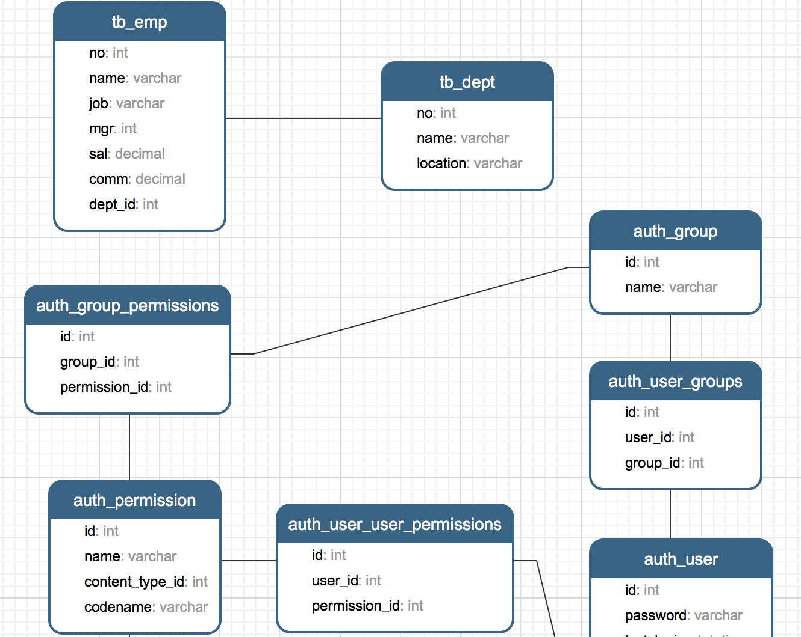

## 深入模型

在上一個章節中，我們提到了Django是基於MVC架構的Web框架，MVC架構追求的是“模型”和“視圖”的解耦合。所謂“模型”說得更直白一些就是數據（的表示），所以通常也被稱作“數據模型”。在實際的項目中，數據模型通常通過數據庫實現持久化操作，而關係型數據庫在過去和當下都是持久化的首選方案，下面我們以MySQL為例來說明如何使用關係型數據庫來實現持久化操作。

### 配置關係型數據庫MySQL 

我們繼續來完善上一個章節中的OA項目，首先從配置項目使用的數據庫開始。

1. 修改項目的settings.py文件，首先將我們之前創建的應用hrs添加已安裝的項目中，然後配置MySQL作為持久化方案。

   ```Shell
   (venv)$ vim oa/settings.py
   ```

   ```Python
   # 此處省略上面的代碼
   
   INSTALLED_APPS = [
       'django.contrib.admin',
       'django.contrib.auth',
       'django.contrib.contenttypes',
       'django.contrib.sessions',
       'django.contrib.messages',
       'django.contrib.staticfiles',
       'hrs',
   ]
   
   DATABASES = {
       'default': {
           'ENGINE': 'django.db.backends.mysql',
           'NAME': 'oa',
           'HOST': '127.0.0.1',
           'PORT': 3306,
           'USER': 'root',
           'PASSWORD': '123456',
       }
   }
   
   # 此處省略下面的代碼
   ```

   在配置ENGINE屬性時，常用的可選值包括：

   - `'django.db.backends.sqlite3'`：SQLite嵌入式數據庫。
   - `'django.db.backends.postgresql'`：BSD許可證下發行的開源關係型數據庫產品。
   - `'django.db.backends.mysql'`：轉手多次目前屬於甲骨文公司的經濟高效的數據庫產品。
   - `'django.db.backends.oracle'`：甲骨文公司的關係型數據庫旗艦產品。

   其他的配置可以參考官方文檔中[數據庫配置](https://docs.djangoproject.com/zh-hans/2.0/ref/databases/#third-party-notes)的部分。

   NAME屬性代表數據庫的名稱，如果使用SQLite它對應著一個文件，在這種情況下NAME的屬性值應該是一個絕對路徑；使用其他關係型數據庫，則要配置對應的HOST（主機）、PORT（端口）、USER（用戶名）、PASSWORD（口令）等屬性。

2. 安裝Python操作MySQL的依賴庫，Python 3中通常使用PyMySQL，Python 2中通常用MySQLdb。

   ```Shell
   (venv)$ pip install pymysql
   ```

   如果使用Python 3需要修改**項目目錄**下的`__init__.py`文件並加入如下所示的代碼，這段代碼的作用是將PyMySQL視為MySQLdb來使用，從而避免Django找不到連接MySQL的客戶端工具而詢問你：“Did you install mysqlclient? ”（你安裝了mysqlclient嗎？）。

   ```Python
   import pymysql
   
   pymysql.install_as_MySQLdb()
   ```

3. 如果之前沒有為應用程序創建數據庫，那麼現在是時候創建名為oa的數據庫了。在MySQL中創建數據庫的SQL語句如下所示：

   ```SQL
   create database oa default charset utf8;
   ```

4. Django框架本身有自帶的數據模型，我們稍後會用到這些模型，為此我們先做一次遷移操作。所謂遷移，就是根據模型自動生成關係數據庫中的二維表，命令如下所示：

   ```Shell
   (venv)$ python manage.py migrate
   Operations to perform:
     Apply all migrations: admin, auth, contenttypes, sessions
   Running migrations:
     Applying contenttypes.0001_initial... OK
     Applying auth.0001_initial... OK
     Applying admin.0001_initial... OK
     Applying admin.0002_logentry_remove_auto_add... OK
     Applying contenttypes.0002_remove_content_type_name... OK
     Applying auth.0002_alter_permission_name_max_length... OK
     Applying auth.0003_alter_user_email_max_length... OK
     Applying auth.0004_alter_user_username_opts... OK
     Applying auth.0005_alter_user_last_login_null... OK
     Applying auth.0006_require_contenttypes_0002... OK
     Applying auth.0007_alter_validators_add_error_messages... OK
     Applying auth.0008_alter_user_username_max_length... OK
     Applying auth.0009_alter_user_last_name_max_length... OK
     Applying sessions.0001_initial... OK
   ```

5. 接下來，我們為自己的應用創建數據模型。如果要在hrs應用中實現對部門和員工的管理，我們可以先創建部門和員工數據模型，代碼如下所示。

   ```Shell
   (venv)$ vim hrs/models.py
   ```

   ```Python
   from django.db import models
   
   
   class Dept(models.Model):
       """部門類"""
       
       no = models.IntegerField(primary_key=True, db_column='dno', verbose_name='部門編號')
       name = models.CharField(max_length=20, db_column='dname', verbose_name='部門名稱')
       location = models.CharField(max_length=10, db_column='dloc', verbose_name='部門所在地')
   
       class Meta:
           db_table = 'tb_dept'
   
   
   class Emp(models.Model):
       """員工類"""
       
       no = models.IntegerField(primary_key=True, db_column='eno', verbose_name='員工編號')
       name = models.CharField(max_length=20, db_column='ename', verbose_name='員工姓名')
       job = models.CharField(max_length=10, verbose_name='職位')
       # 多對一外鍵關聯(自參照)
       mgr = models.ForeignKey('self', on_delete=models.SET_NULL, null=True, blank=True, verbose_name='主管')
       sal = models.DecimalField(max_digits=7, decimal_places=2, verbose_name='月薪')
       comm = models.DecimalField(max_digits=7, decimal_places=2, null=True, blank=True, verbose_name='補貼')
       # 多對一外鍵關聯(參照部門模型)
       dept = models.ForeignKey(Dept, db_column='dno', on_delete=models.PROTECT, verbose_name='所在部門')
   
       class Meta:
           db_table = 'tb_emp'
   ```
   > 說明：上面定義模型時使用了字段類及其屬性，其中IntegerField對應數據庫中的integer類型，CharField對應數據庫的varchar類型，DecimalField對應數據庫的decimal類型，ForeignKey用來建立多對一外鍵關聯。字段屬性primary_key用於設置主鍵，max_length用來設置字段的最大長度，db_column用來設置數據庫中與字段對應的列，verbose_name則設置了Django後臺管理系統中該字段顯示的名稱。如果對這些東西感到很困惑也不要緊，文末提供了字段類、字段屬性、元數據選項等設置的相關說明，不清楚的讀者可以稍後查看對應的參考指南。

6. 再次執行遷移操作，先通過模型生成遷移文件，再執行遷移創建二維表。

   ```Shell
   (venv)$ python manage.py makemigrations hrs
   Migrations for 'hrs':
     hrs/migrations/0001_initial.py
       - Create model Dept
       - Create model Emp
   (venv)$ python manage.py migrate
   Operations to perform:
     Apply all migrations: admin, auth, contenttypes, hrs, sessions
   Running migrations:
     Applying hrs.0001_initial... OK
   ```

   執行完數據模型遷移操作之後，可以在通過圖形化的MySQL客戶端工具查看到E-R圖（實體關係圖）。

   

### 利用Django後臺管理模型

Django框架有自帶的後臺管理系統來實現對模型的管理。雖然實際應用中，這個後臺可能並不能滿足我們的需求，但是在學習Django框架時，我們暫時可以利用Django自帶的後臺管理系統來管理我們的模型，同時也可以瞭解一個項目的後臺管理系統到底需要哪些功能。

1. 創建超級管理員賬號。

   ```Shell
   (venv)$ python manage.py createsuperuser
   Username (leave blank to use 'hao'): jackfrued
   Email address: jackfrued@126.com
   Password: 
   Password (again): 
   Superuser created successfully.
   ```

2. 啟動Web服務器，登錄後臺管理系統。

   ```Shell
   (venv)$ python manage.py runserver
   ```

   訪問<http://127.0.0.1:8000/admin>，會來到如下圖所示的登錄界面。

   

   登錄後進入管理員操作平臺。

   

   至此我們還沒有看到之前創建的模型類，需要在應用的admin.py文件中模型進行註冊。

3. 註冊模型類。

   ```Shell
   (venv)$ vim hrs/admin.py
   ```

   ```Python
   from django.contrib import admin
   
   from hrs.models import Emp, Dept
   
   admin.site.register(Dept)
   admin.site.register(Emp)
   ```

   註冊模型類後，就可以在後臺管理系統中看到它們。

   

4. 對模型進行CRUD操作。

   可以在管理員平臺對模型進行C（新增）、R（查看）、U（更新）、D（刪除）操作，如下圖所示。

   - 添加新的部門。

   

   - 查看所有部門。

   

   - 更新和刪除部門。

   

5. 註冊模型管理類。

   可能大家已經注意到了，剛才在後臺查看部門信息的時候，顯示的部門信息並不直觀，為此我們再修改admin.py文件，通過註冊模型管理類，可以在後臺管理系統中更好的管理模型。

   ```Python
   from django.contrib import admin
   
   from hrs.models import Emp, Dept
   
   
   class DeptAdmin(admin.ModelAdmin):
   
       list_display = ('no', 'name', 'location')
       ordering = ('no', )
   
   
   class EmpAdmin(admin.ModelAdmin):
   
       list_display = ('no', 'name', 'job', 'mgr', 'sal', 'comm', 'dept')
       search_fields = ('name', 'job')
   
   
   admin.site.register(Dept, DeptAdmin)
   admin.site.register(Emp, EmpAdmin)
   ```

   

   

   為了更好的查看模型數據，可以為Dept和Emp兩個模型類添加`__str__`魔法方法。

   ```Python
   from django.db import models
   
   
   class Dept(models.Model):
       """部門類"""
       
       # 此處省略上面的代碼
       
       def __str__(self):
           return self.name
   
       # 此處省略下面的代碼
   
   
   class Emp(models.Model):
       """員工類"""
       
       # 此處省略上面的代碼
   
       def __str__(self):
           return self.name
   
       # 此處省略下面的代碼
   ```

   修改代碼後刷新查看Emp模型的頁面，效果如下圖所示。

   

### 使用ORM完成模型的CRUD操作

在瞭解了Django提供的模型管理平臺之後，我們來看看如何從代碼層面完成對模型的CRUD（Create / Read / Update / Delete）操作。我們可以通過manage.py開啟Shell交互式環境，然後使用Django內置的ORM框架對模型進行CRUD操作。

```Shell
(venv)$ python manage.py shell
Python 3.6.4 (v3.6.4:d48ecebad5, Dec 18 2017, 21:07:28) 
[GCC 4.2.1 (Apple Inc. build 5666) (dot 3)] on darwin
Type "help", "copyright", "credits" or "license" for more information.
(InteractiveConsole)
>>> 
```

#### 新增

```Shell
>>> from hrs.models import Dept, Emp
>>>
>>> dept = Dept(40, '研發2部', '深圳')
>>> dept.save()
```

#### 更新

```Shell
>>> dept.name = '研發3部'
>>> dept.save()
```

#### 查詢

1. 查詢所有對象。

```Shell
>>> Dept.objects.all()
<QuerySet [<Dept: 研發1部>, <Dept: 銷售1部>, <Dept: 運維1部>, <Dept: 研發3部>]>
```

2. 過濾數據。

```Shell
>>> Dept.objects.filter(name='研發3部') # 查詢部門名稱為“研發3部”的部門
<QuerySet [<Dept: 研發3部>]>
>>>
>>> Dept.objects.filter(name__contains='研發') # 查詢部門名稱包含“研發”的部門(模糊查詢)
<QuerySet [<Dept: 研發1部>, <Dept: 研發3部>]>
>>>
>>> Dept.objects.filter(no__gt=10).filter(no__lt=40) # 查詢部門編號大於10小於40的部門
<QuerySet [<Dept: 銷售1部>, <Dept: 運維1部>]>
>>>
>>> Dept.objects.filter(no__range=(10, 30)) # 查詢部門編號在10到30之間的部門
<QuerySet [<Dept: 研發1部>, <Dept: 銷售1部>, <Dept: 運維1部>]>
```

3. 查詢單個對象。

```Shell
>>> Dept.objects.get(pk=10)
<Dept: 研發1部>
>>>
>>> Dept.objects.get(no=20)
<Dept: 銷售1部>
>>>
>>> Dept.objects.get(no__exact=30)
<Dept: 運維1部>
>>>
>>> Dept.objects.filter(no=10).first()
<Dept: 研發1部>
```

4. 排序數據。

```Shell
>>> Dept.objects.order_by('no') # 查詢所有部門按部門編號升序排列
<QuerySet [<Dept: 研發1部>, <Dept: 銷售1部>, <Dept: 運維1部>, <Dept: 研發3部>]>
>>>
>>> Dept.objects.order_by('-no') # 查詢所有部門按部門編號降序排列
<QuerySet [<Dept: 研發3部>, <Dept: 運維1部>, <Dept: 銷售1部>, <Dept: 研發1部>]>
```

5. 數據切片（分頁查詢）。

```Shell
>>> Dept.objects.order_by('no')[0:2] # 按部門編號排序查詢1~2部門
<QuerySet [<Dept: 研發1部>, <Dept: 銷售1部>]>
>>>
>>> Dept.objects.order_by('no')[2:4] # 按部門編號排序查詢3~4部門
<QuerySet [<Dept: 運維1部>, <Dept: 研發3部>]>
```

6. 高級查詢。

```Shell
>>> Emp.objects.filter(dept__no=10) # 根據部門編號查詢該部門的員工
<QuerySet [<Emp: 喬峰>, <Emp: 張無忌>, <Emp: 張三丰>]>
>>>
>>> Emp.objects.filter(dept__name__contains='銷售') # 查詢名字包含“銷售”的部門的員工
<QuerySet [<Emp: 黃蓉>]>
>>>
>>> Dept.objects.get(pk=10).emp_set.all() # 通過部門反查部門所有的員工
<QuerySet [<Emp: 喬峰>, <Emp: 張無忌>, <Emp: 張三丰>]>
```

> 說明1：由於員工與部門之間存在多對一外鍵關聯，所以也能通過部門反向查詢該部門的員工（從一對多關係中“一”的一方查詢“多”的一方），反向查詢屬性默認的名字是`類名小寫_set`（如上面例子中的`emp_set`），當然也可以在創建模型時通過`ForeingKey`的`related_name`屬性指定反向查詢屬性的名字。如果不希望執行反向查詢可以將`related_name`屬性設置為`'+'`或以`'+'`開頭的字符串。

> 說明2：查詢多個對象的時候返回的是QuerySet對象，QuerySet使用了惰性查詢，即在創建QuerySet對象的過程中不涉及任何數據庫活動，等真正用到對象時（求值QuerySet）才向數據庫發送SQL語句並獲取對應的結果，這一點在實際開發中需要引起注意！

> 說明3：可以在QuerySet上使用`update()`方法一次更新多個對象。

#### 刪除

```Shell
>>> Dept.objects.get(pk=40).delete()
(1, {'hrs.Dept': 1})
```

### Django模型最佳實踐

1. 正確的為模型和關係字段命名。
2. 設置適當的`related_name`屬性。
3. 用`OneToOneField`代替`ForeignKeyField(unique=True)`。
4. 通過“遷移操作”（migrate）來添加模型。
5. 用NoSQL來應對需要降低範式級別的場景。
6. 如果布爾類型可以為空要使用`NullBooleanField`。
7. 在模型中放置業務邏輯。
8. 用`<ModelName>.DoesNotExists`取代`ObjectDoesNotExists`。
9. 在數據庫中不要出現無效數據。
10. 不要對`QuerySet`調用`len()`函數。
11. 將`QuerySet`的`exists()`方法的返回值用於`if`條件。
12. 用`DecimalField`來存儲貨幣相關數據而不是`FloatField`。
13. 定義`__str__`方法。
14. 不要將數據文件放在同一個目錄中。

> 說明：以上內容來自於STEELKIWI網站的[*Best Practice working with Django models in Python*](https://steelkiwi.com/blog/best-practices-working-django-models-python/)，有興趣的小夥伴可以閱讀原文。

### 模型定義參考

#### 字段

對字段名稱的限制

- 字段名不能是Python的保留字，否則會導致語法錯誤
- 字段名不能有多個連續下劃線，否則影響ORM查詢操作

Django模型字段類

| 字段類                |  說明                                                         |
| --------------------- | ------------------------------------------------------------ |
| AutoField             |自增ID字段                                                   |
| BigIntegerField       |64位有符號整數                                               |
| BinaryField           | 存儲二進制數據的字段，對應Python的bytes類型                  |
| BooleanField          | 存儲True或False                                              |
| CharField             | 長度較小的字符串                                             |
| DateField             | 存儲日期，有auto_now和auto_now_add屬性                       |
| DateTimeField         | 存儲日期和日期，兩個附加屬性同上                             |
| DecimalField          |存儲固定精度小數，有max_digits（有效位數）和decimal_places（小數點後面）兩個必要的參數 |
| DurationField         |存儲時間跨度                                                 |
| EmailField            | 與CharField相同，可以用EmailValidator驗證                    |
| FileField             | 文件上傳字段                                                 |
| FloatField            | 存儲浮點數                                                   |
| ImageField            | 其他同FileFiled，要驗證上傳的是不是有效圖像                  |
| IntegerField          | 存儲32位有符號整數。                                         |
| GenericIPAddressField | 存儲IPv4或IPv6地址                                           |
| NullBooleanField      | 存儲True、False或null值                                      |
| PositiveIntegerField  | 存儲無符號整數（只能存儲正數）                               |
| SlugField             | 存儲slug（簡短標註）                                         |
| SmallIntegerField     | 存儲16位有符號整數                                           |
| TextField             | 存儲數據量較大的文本                                         |
| TimeField             | 存儲時間                                                     |
| URLField              | 存儲URL的CharField                                           |
| UUIDField             | 存儲全局唯一標識符                                           |

#### 字段屬性

通用字段屬性

| 選項           | 說明                                                         |
| -------------- | ------------------------------------------------------------ |
| null           | 數據庫中對應的字段是否允許為NULL，默認為False                |
| blank          | 後臺模型管理驗證數據時，是否允許為NULL，默認為False          |
| choices        | 設定字段的選項，各元組中的第一個值是設置在模型上的值，第二值是人類可讀的值 |
| db_column      | 字段對應到數據庫表中的列名，未指定時直接使用字段的名稱       |
| db_index       | 設置為True時將在該字段創建索引                               |
| db_tablespace  | 為有索引的字段設置使用的表空間，默認為DEFAULT_INDEX_TABLESPACE |
| default        | 字段的默認值                                                 |
| editable       | 字段在後臺模型管理或ModelForm中是否顯示，默認為True          |
| error_messages | 設定字段拋出異常時的默認消息的字典，其中的鍵包括null、blank、invalid、invalid_choice、unique和unique_for_date |
| help_text      | 表單小組件旁邊顯示的額外的幫助文本。                         |
| primary_key    | 將字段指定為模型的主鍵，未指定時會自動添加AutoField用於主鍵，只讀。 |
| unique         | 設置為True時，表中字段的值必須是唯一的                       |
| verbose_name   | 字段在後臺模型管理顯示的名稱，未指定時使用字段的名稱         |

ForeignKey屬性

1. limit_choices_to：值是一個Q對象或返回一個Q對象，用於限制後臺顯示哪些對象。
2. related_name：用於獲取關聯對象的關聯管理器對象（反向查詢），如果不允許反向，該屬性應該被設置為`'+'`，或者以`'+'`結尾。
3. to_field：指定關聯的字段，默認關聯對象的主鍵字段。
4. db_constraint：是否為外鍵創建約束，默認值為True。
5. on_delete：外鍵關聯的對象被刪除時對應的動作，可取的值包括django.db.models中定義的：
   - CASCADE：級聯刪除。
   - PROTECT：拋出ProtectedError異常，阻止刪除引用的對象。
   - SET_NULL：把外鍵設置為null，當null屬性被設置為True時才能這麼做。
   - SET_DEFAULT：把外鍵設置為默認值，提供了默認值才能這麼做。

ManyToManyField屬性

1. symmetrical：是否建立對稱的多對多關係。
2. through：指定維持多對多關係的中間表的Django模型。
3. throughfields：定義了中間模型時可以指定建立多對多關係的字段。
4. db_table：指定維持多對多關係的中間表的表名。

#### 模型元數據選項

| 選項                  | 說明                                                         |
| --------------------- | ------------------------------------------------------------ |
| abstract              | 設置為True時模型是抽象父類                                   |
| app_label             | 如果定義模型的應用不在INSTALLED_APPS中可以用該屬性指定       |
| db_table              | 模型使用的數據表名稱                                         |
| db_tablespace         | 模型使用的數據表空間                                         |
| default_related_name  | 關聯對象回指這個模型時默認使用的名稱，默認為<model_name>_set |
| get_latest_by         | 模型中可排序字段的名稱。                                     |
| managed               | 設置為True時，Django在遷移中創建數據表並在執行flush管理命令時把表移除 |
| order_with_respect_to | 標記對象為可排序的                                           |
| ordering              | 對象的默認排序                                               |
| permissions           | 創建對象時寫入權限表的額外權限                               |
| default_permissions   | 默認為`('add', 'change', 'delete')`                          |
| unique_together       | 設定組合在一起時必須獨一無二的字段名                         |
| index_together        | 設定一起建立索引的多個字段名                                 |
| verbose_name          | 為對象設定人類可讀的名稱                                     |
| verbose_name_plural   | 設定對象的複數名稱                                           |

### 查詢參考

按字段查找可以用的條件：

1. exact / iexact：精確匹配/忽略大小寫的精確匹配查詢
2. contains / icontains / startswith / istartswith / endswith / iendswith：基於`like`的模糊查詢
3. in：集合運算
4. gt / gte / lt / lte：大於/大於等於/小於/小於等於關係運算
5. range：指定範圍查詢（SQL中的`between…and…`）
6. year / month / day / week_day / hour / minute / second：查詢時間日期
7. isnull：查詢空值（True）或非空值（False）
8. search：基於全文索引的全文檢索
9. regex / iregex：基於正則表達式的模糊匹配查詢

Q對象（用於執行復雜查詢）的使用：

```Shell
>>> from django.db.models import Q
>>> Emp.objects.filter(
...     Q(name__startswith='張'),
...     Q(sal__gte=5000) | Q(comm__gte=1000)
... ) # 查詢名字以“張”開頭且工資大於等於5000或補貼大於等於1000的員工
<QuerySet [<Emp: 張三丰>]>
```


