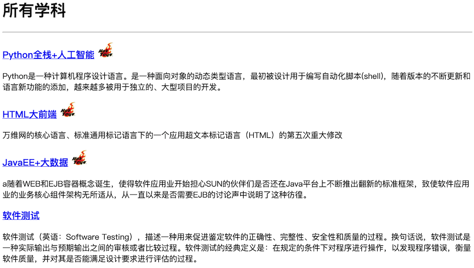

## 靜態資源和Ajax請求

基於前面兩個章節講解的知識，我們已經可以使用Django框架來完成Web應用的開發了。接下來我們就嘗試實現一個投票應用，具體的需求是用戶進入應用首先查看到“學科介紹”頁面，該頁面顯示了一個學校所開設的所有學科；通過點擊某個學科，可以進入“老師介紹”頁面，該頁面展示了該學科所有老師的詳細情況，可以在該頁面上給老師點擊“好評”或“差評”；如果用戶沒有登錄，在投票時會先跳轉到“登錄頁”要求用戶登錄，登錄成功才能投票；對於未註冊的用戶，可以在“登錄頁”點擊“新用戶註冊”進入“註冊頁”完成用戶註冊操作，註冊成功後會跳轉到“登錄頁”，註冊失敗會獲得相應的提示信息。

### 準備工作

由於之前已經詳細的講解了如何創建Django項目以及項目的相關配置，因此我們略過這部分內容，唯一需要說明的是，從上面對投票應用需求的描述中我們可以分析出三個業務實體：學科、老師和用戶。學科和老師之間通常是一對多關聯關係（一個學科有多個老師，一個老師通常只屬於一個學科），用戶因為要給老師投票，所以跟老師之間是多對多關聯關係（一個用戶可以給多個老師投票，一個老師也可以收到多個用戶的投票）。首先修改應用下的models.py文件來定義數據模型，先給出學科和老師的模型。

```Python
from django.db import models


class Subject(models.Model):
    """學科"""
    no = models.IntegerField(primary_key=True, verbose_name='編號')
    name = models.CharField(max_length=20, verbose_name='名稱')
    intro = models.CharField(max_length=511, default='', verbose_name='介紹')
    create_date = models.DateField(null=True, verbose_name='成立日期')
    is_hot = models.BooleanField(default=False, verbose_name='是否熱門')

    def __str__(self):
        return self.name

    class Meta:
        db_table = 'tb_subject'
        verbose_name = '學科'
        verbose_name_plural = '學科'


class Teacher(models.Model):
    """老師"""
    no = models.AutoField(primary_key=True, verbose_name='編號')
    name = models.CharField(max_length=20, verbose_name='姓名')
    detail = models.CharField(max_length=1023, default='', blank=True, verbose_name='詳情')
    photo = models.CharField(max_length=1023, default='', verbose_name='照片')
    good_count = models.IntegerField(default=0, verbose_name='好評數')
    bad_count = models.IntegerField(default=0, verbose_name='差評數')
    subject = models.ForeignKey(to=Subject, on_delete=models.PROTECT, db_column='sno', verbose_name='所屬學科')

    class Meta:
        db_table = 'tb_teacher'
        verbose_name = '老師'
        verbose_name_plural = '老師'
```

模型定義完成後，可以通過“生成遷移”和“執行遷移”來完成關係型數據庫中二維表的創建，當然這需要提前啟動數據庫服務器並創建好對應的數據庫，同時我們在項目中已經安裝了PyMySQL而且完成了相應的配置，這些內容此處不再贅述。

```Shell
(venv)$ python manage.py makemigrations vote
...
(venv)$ python manage.py migrate
...
```

> 注意：為了給vote應用生成遷移文件，需要修改Django項目settings.py文件，在INSTALLED_APPS中添加vote應用。

完成模型遷移之後，我們可以直接使用Django提供的後臺管理來添加學科和老師信息，這需要先註冊模型類和模型管理類。

```SQL
from django.contrib import admin

from poll2.forms import UserForm
from poll2.models import Subject, Teacher


class SubjectAdmin(admin.ModelAdmin):
    list_display = ('no', 'name', 'create_date', 'is_hot')
    ordering = ('no', )


class TeacherAdmin(admin.ModelAdmin):
    list_display = ('no', 'name', 'detail', 'good_count', 'bad_count', 'subject')
    ordering = ('subject', 'no')


admin.site.register(Subject, SubjectAdmin)
admin.site.register(Teacher, TeacherAdmin)
```

接下來，我們就可以修改views.py文件，通過編寫視圖函數先實現“學科介紹”頁面。

```Python
def show_subjects(request):
    """查看所有學科"""
    subjects = Subject.objects.all()
    return render(request, 'subject.html', {'subjects': subjects})
```

至此，我們還需要一個模板頁，模板的配置以及模板頁中模板語言的用法在之前已經進行過簡要的介紹，如果不熟悉可以看看下面的代碼，相信這並不是一件困難的事情。

```HTML
<!DOCTYPE html>
<html lang="en">
<head>
    <meta charset="UTF-8">
    <title>所有學科信息</title>
    <style>/* 此處略去了層疊樣式表的選擇器 */</style>
</head>
<body>
    <h1>所有學科</h1>
    <hr>
    
    <div>
        <h3>
            <a href="/teachers/?sno={{ subject.no }}">{{ subject.name }}</a>
            
            
            
        </h3>
        <p>{{ subject.intro }}</p>
    </div>
    
</body>
</html>
```

在上面的模板中，我們為每個學科添加了一個超鏈接，點擊超鏈接可以查看該學科的講師信息，為此需要再編寫一個視圖函數來處理查看指定學科老師信息。

```Python
def show_teachers(request):
    """顯示指定學科的老師"""
    try:
        sno = int(request.GET['sno'])
        subject = Subject.objects.get(no=sno)
        teachers = subject.teacher_set.all()
        return render(request, 'teachers.html', {'subject': subject, 'teachers': teachers})
    except (KeyError, ValueError, Subject.DoesNotExist):
        return redirect('/')
```

顯示老師信息的模板頁。

```HTML
<!DOCTYPE html>

<html lang="en">
<head>
    <meta charset="UTF-8">
    <title>老師</title>
    <style>/* 此處略去了層疊樣式表的選擇器 */</style>
</head>
<body>
    <h1>{{ subject.name }}學科老師信息</h1>
    <hr>
    
    
    <div>
        <div>
            
        </div>
        <div>
            <h3>{{ teacher.name }}</h3>
            <p>{{ teacher.detail }}</p>
            <p class="comment">
                <a href="">好評</a>
                (<span>{{ teacher.good_count }}</span>)
                <a href="">差評</a>
                (<span>{{ teacher.bad_count }}</span>)
            </p>
        </div>
    </div>
    
    
    <h3>暫時沒有該學科的老師信息</h3>
    
    <p>
        <a href="/">返回首頁</a>
    </p>
</body>
</html>
```

### 加載靜態資源

在上面的模板頁面中，我們使用了``標籤來加載老師的照片，其中使用了引用靜態資源的模板指令``，要使用該指令，首先要使用``指令來加載靜態資源，我們將這段代碼放在了頁碼開始的位置。在上面的項目中，我們將靜態資源置於名為static的文件夾中，在該文件夾下又創建了三個文件夾：css、js和images，分別用來保存外部層疊樣式表、外部JavaScript文件和圖片資源。為了能夠找到保存靜態資源的文件夾，我們還需要修改Django項目的配置文件settings.py，如下所示：

```Python
# 此處省略上面的代碼

STATICFILES_DIRS = [os.path.join(BASE_DIR, 'static'), ]
STATIC_URL = '/static/'

# 此處省略下面的代碼
```

接下來修改urls.py文件，配置用戶請求的URL和視圖函數的對應關係。

```Python
from django.contrib import admin
from django.urls import path

from vote import views

urlpatterns = [
    path('', views.show_subjects),
    path('teachers/', views.show_teachers),
    path('admin/', admin.site.urls),
]
```

啟動服務器運行項目，進入首頁查看學科信息。



點擊學科查看老師信息。


### Ajax請求

接下來就可以實現“好評”和“差評”的功能了，很明顯如果能夠在不刷新頁面的情況下實現這兩個功能會帶來更好的用戶體驗，因此我們考慮使用[Ajax](https://zh.wikipedia.org/wiki/AJAX)技術來實現“好評”和“差評”，Ajax技術我們在Web前端部分已經介紹過了，此處不再贅述。

首先修改項目的urls.py文件，為“好評”和“差評”功能映射對應的URL。

```Python
from django.contrib import admin
from django.urls import path

from vote import views

urlpatterns = [
    path('', views.show_subjects),
    path('teachers/', views.show_teachers),
    path('praise/', views.prise_or_criticize),
    path('criticize/', views.prise_or_criticize),
    path('admin/', admin.site.urls),
]
```

設計視圖函數`praise_or_criticize`來支持“好評”和“差評”功能，該視圖函數通過Django封裝的JsonResponse類將字典序列化成JSON字符串作為返回給瀏覽器的響應內容。

```Python
def praise_or_criticize(request):
    """好評"""
    try:
        tno = int(request.GET['tno'])
        teacher = Teacher.objects.get(no=tno)
        if request.path.startswith('/praise'):
            teacher.good_count += 1
        else:
            teacher.bad_count += 1
        teacher.save()
        data = {'code': 200, 'hint': '操作成功'}
    except (KeyError, ValueError, Teacher.DoseNotExist):
        data = {'code': 404, 'hint': '操作失敗'}
    return JsonResponse(data)
```

修改顯示老師信息的模板頁，引入jQuery庫來實現事件處理、Ajax請求和DOM操作。

```HTML
<!DOCTYPE html>

<html lang="en">
<head>
    <meta charset="UTF-8">
    <title>老師</title>
    <style>/* 此處略去了層疊樣式表的選擇器 */</style>
</head>
<body>
    <h1>{{ subject.name }}學科老師信息</h1>
    <hr>
    
    
    <div class="teacher">
        <div class="photo">
            
        </div>
        <div class="info">
            <h3>{{ teacher.name }}</h3>
            <p>{{ teacher.detail }}</p>
            <p class="comment">
                <a href="/praise/?tno={{ teacher.no }}">好評</a>
                (<span>{{ teacher.good_count }}</span>)
                &nbsp;&nbsp;
                <a href="/criticize/?tno={{ teacher.no }}">差評</a>
                (<span>{{ teacher.bad_count }}</span>)
            </p>
        </div>
    </div>
    
    
    <h3>暫時沒有該學科的老師信息</h3>
    
    <p>
        <a href="/">返回首頁</a>
    </p>
    <script src="https://cdn.bootcss.com/jquery/3.4.1/jquery.min.js"></script>
    <script>
        $(() => {
            $('.comment>a').on('click', (evt) => {
                evt.preventDefault()
                let anchor = $(evt.target)
                let url = anchor.attr('href')
                $.getJSON(url, (json) => {
                    if (json.code == 10001) {
                        let span = anchor.next()
                        span.text(parseInt(span.text()) + 1)
                    } else {
                        alert(json.hint)
                    }
                })
            })
        })
    </script>
</body>
</html>
```

### 小結

到此為止，這個投票項目的核心功能已然完成，在下面的章節中我們會要求用戶必須登錄才能投票，沒有賬號的用戶可以通過註冊功能註冊一個賬號。