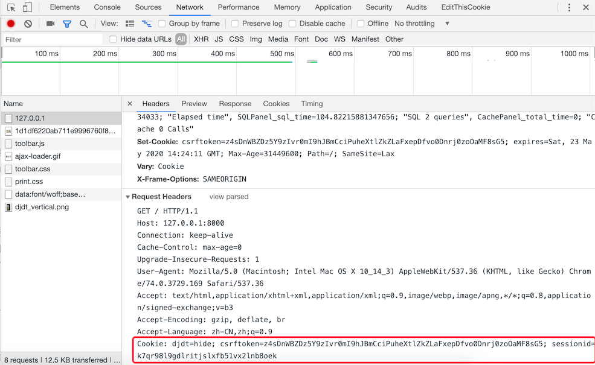

## Cookie和Session

### 實現用戶跟蹤

如今，一個網站如果不通過某種方式記住你是誰以及你之前在網站的活動情況，失去的就是網站的可用性和便利性，繼而很有可能導致網站用戶的流式，所以記住一個用戶（更專業的說法叫**用戶跟蹤**）對絕大多數Web應用來說都是必需的功能。

在服務器端，我們想記住一個用戶最簡單的辦法就是創建一個對象，通過這個對象就可以把用戶相關的信息都保存起來，這個對象就是我們常說的session（用戶會話對象）。那麼問題來了，HTTP本身是一個無連接（每次請求和響應的過程中，服務器一旦完成對客戶端請求的響應之後就斷開連接）、無狀態（客戶端再次發起對服務器的請求時，服務器無法得知這個客戶端之前的任何信息）的協議，即便服務器通過session對象保留了用戶數據，還得通過某種方式來確定當前的請求與之前保存過的哪一個session是有關聯的。相信很多人都能想到，我們可以給每個session對象分配一個全局唯一的標識符來識別session對象，我們姑且稱之為sessionid，每次客戶端發起請求時，只要攜帶上這個sessionid，就有辦法找到與之對應的session對象，從而實現在兩次請求之間記住該用戶的信息，也就是我們之前說的用戶跟蹤。

要讓客戶端記住並在每次請求時帶上sessionid又有以下幾種做法：

1. URL重寫。所謂URL重寫就是在URL中攜帶sessionid，例如：`http://www.example.com/index.html?sessionid=123456`，服務器通過獲取sessionid參數的值來取到與之對應的session對象。

2. 隱藏域（隱式表單域）。在提交表單的時候，可以通過在表單中設置隱藏域向服務器發送額外的數據。例如：`<input type="hidden" name="sessionid" value="123456">`。

3. 本地存儲。現在的瀏覽器都支持多種本地存儲方案，包括：cookie、localStorage、sessionStorage、IndexedDB等。在這些方案中，cookie是歷史最為悠久也是被詬病得最多的一種方案，也是我們接下來首先為大家講解的一種方案。簡單的說，cookie是一種以鍵值對方式保存在瀏覽器臨時文件中的數據，每次請求時，請求頭中會攜帶本站點的cookie到服務器，那麼只要將sessionid寫入cookie，下次請求時服務器只要讀取請求頭中的cookie就能夠獲得這個sessionid，如下圖所示。

   

   在HTML5時代要，除了cookie，還可以使用新的本地存儲API來保存數據，就是剛才提到的localStorage、sessionStorage、IndexedDB等技術，如下圖所示。

   

### Django框架對session的支持

在創建Django項目時，默認的配置文件`settings.py`文件中已經激活了一個名為`SessionMiddleware`的中間件（關於中間件的知識我們在下一個章節做詳細的講解，這裡只需要知道它的存在即可），因為這個中間件的存在，我們可以直接通過請求對象的`session`屬性來操作會話對象。`session`屬性是一個像字典一樣可以讀寫數據的容器對象，因此我們可以使用“鍵值對”的方式來保留用戶數據。與此同時，`SessionMiddleware`中間件還封裝了對cookie的操作，在cookie中保存了sessionid，就如同我們之前描述的那樣。

在默認情況下，Django將session的數據序列化後保存在關係型數據庫中，在Django 1.6以後的版本中，默認的序列化數據的方式是JSON序列化，而在此之前一直使用Pickle序列化。JSON序列化和Pickle序列化的差別在於前者將對象序列化為字符串（字符形式），而後者將對象序列化為字節串（二進制形式），因為安全方面的原因，JSON序列化成為了目前Django框架默認序列化數據的方式，這就要求在我們保存在session中的數據必須是能夠JSON序列化的，否則就會引發異常。還有一點需要說明的是，使用關係型數據庫保存session中的數據在大多數時候並不是最好的選擇，因為數據庫可能會承受巨大的壓力而成為系統性能的瓶頸，在後面的章節中我們會告訴大家如何將session的數據保存到緩存服務中。

我們繼續完善之前的投票應用，前一個章節中我們實現了用戶的登錄和註冊，下面我們首先完善登錄時對驗證碼的檢查。

```Python
def get_captcha(request):
    """驗證碼"""
    captcha_text = random_captcha_text()
    request.session['captcha'] = captcha_text
    image_data = Captcha.instance().generate(captcha_text)
    return HttpResponse(image_data, content_type='image/png')
```

注意上面代碼中的第4行，我們將隨機生成的驗證碼字符串保存到session中，稍後用戶登錄時，我們要將保存在session中的驗證碼字符串和用戶輸入的驗證碼字符串進行比對，如果用戶輸入了正確的驗證碼才能夠執行後續的登錄流程，代碼如下所示。

```Python
def login(request: HttpRequest):
    """登錄"""
    hint = ''
    if request.method == 'POST':
        form = LoginForm(request.POST)
        if form.is_valid():
            # 對驗證碼的正確性進行驗證
            captcha_from_user = form.cleaned_data['captcha']
            captcha_from_sess = request.session.get('captcha', '')
            if captcha_from_sess.lower() != captcha_from_user.lower():
                hint = '請輸入正確的驗證碼'
            else:
                username = form.cleaned_data['username']
                password = form.cleaned_data['password']
                user = User.objects.filter(username=username, password=password).first()
                if user:
                    # 登錄成功後將用戶編號和用戶名保存在session中
                    request.session['userid'] = user.no
                    request.session['username'] = user.username
                    return redirect('/')
                else:
                    hint = '用戶名或密碼錯誤'
        else:
            hint = '請輸入有效的登錄信息'
    return render(request, 'login.html', {'hint': hint})
```

上面的代碼中，我們設定了登錄成功後會在session中保存用戶的編號（`userid`）和用戶名（`username`），頁面會重定向到首頁。接下來我們可以稍微對首頁的代碼進行調整，在頁面的右上角顯示出登錄用戶的用戶名。我們將這段代碼單獨寫成了一個名為header.html的HTML文件，首頁中可以通過在`<body>`標籤中添加``來包含這個頁面，代碼如下所示。

```HTML
<div class="user">
    
    <span>{{ request.session.username }}</span>
    <a href="/logout">註銷</a>
    
    <a href="/login">登錄</a>&nbsp;&nbsp;
    
    <a href="/register">註冊</a>
</div>
```

如果用戶沒有登錄，頁面會顯示登錄和註冊的超鏈接；而用戶登錄成功後，頁面上會顯示用戶名和註銷的鏈接，註銷鏈接對應的視圖函數如下所示，URL的映射與之前講過的類似，不再贅述。

```Python
def logout(request):
    """註銷"""
    request.session.flush()
    return redirect('/')
```

上面的代碼通過session對象`flush`方法來銷燬session，一方面清除了服務器上session對象保存的用戶數據，一方面將保存在瀏覽器cookie中的sessionid刪除掉，稍後我們會對如何讀寫cookie的操作加以說明。

我們可以通過項目使用的數據庫中名為`django_session` 的表來找到所有的session，該表的結構如下所示：

| session_key                      | session_data                    | expire_date                |
| -------------------------------- | ------------------------------- | -------------------------- |
| c9g2gt5cxo0k2evykgpejhic5ae7bfpl | MmI4YzViYjJhOGMyMDJkY2M5Yzg3... | 2019-05-25 23:16:13.898522 |

其中，第1列就是瀏覽器cookie中保存的sessionid；第2列是經過BASE64編碼後的session中的數據，如果使用Python的`base64`對其進行解碼，解碼的過程和結果如下所示。

```Python
>>> import base64
>>> base64.b64decode('MmI4YzViYjJhOGMyMDJkY2M5Yzg3ZWIyZGViZmUzYmYxNzdlNDdmZjp7ImNhcHRjaGEiOiJzS3d0Iiwibm8iOjEsInVzZXJuYW1lIjoiamFja2ZydWVkIn0=')    
'2b8c5bb2a8c202dcc9c87eb2debfe3bf177e47ff:{"captcha":"sKwt","no":1,"username":"jackfrued"}'
```

第3列是session的過期時間，session過期後瀏覽器保存的cookie中的sessionid就會失效，但是數據庫中的這條對應的記錄仍然會存在，如果想清除過期的數據，可以使用下面的命令。

```Shell
python manage.py clearsessions
```

Django框架默認的session過期時間為兩週（1209600秒），如果想修改這個時間，可以在項目的配置文件中添加如下所示的代碼。

```Python
# 配置會話的超時時間為1天（86400秒）
SESSION_COOKIE_AGE = 86400
```

有很多對安全性要求較高的應用都必須在關閉瀏覽器窗口時讓會話過期，不再保留用戶的任何信息，如果希望在關閉瀏覽器窗口時就讓會話過期（cookie中的sessionid失效），可以加入如下所示的配置。

```Python
# 設置為True在關閉瀏覽器窗口時session就過期
SESSION_EXPIRE_AT_BROWSER_CLOSE = True
```

如果不希望將session的數據保存在數據庫中，可以將其放入緩存中，對應的配置如下所示，緩存的配置和使用我們在後面講解。

```Python
# 配置將會話對象放到緩存中存儲
SESSION_ENGINE = 'django.contrib.sessions.backends.cache'
# 配置使用哪一組緩存來保存會話
SESSION_CACHE_ALIAS = 'default'
```

如果要修改session數據默認的序列化方式，可以將默認的`JSONSerializer`修改為`PickleSerializer`。

```Python
SESSION_SERIALIZER = 'django.contrib.sessions.serializers.PickleSerializer'
```

### 在視圖函數中讀寫cookie

Django封裝的`HttpRequest`和`HttpResponse`對象分別提供了讀寫cookie的操作。

HttpRequest封裝的屬性和方法：

1. `COOKIES`屬性 - 該屬性包含了HTTP請求攜帶的所有cookie。
2. `get_signed_cookie`方法 - 獲取帶簽名的cookie，如果簽名驗證失敗，會產生`BadSignature`異常。

HttpResponse封裝的方法：

1. `set_cookie`方法 - 該方法可以設置一組鍵值對並將其最終將寫入瀏覽器。
2. `set_signed_cookie`方法 - 跟上面的方法作用相似，但是會對cookie進行簽名來達到防篡改的作用。因為如果篡改了cookie中的數據，在不知道[密鑰](<https://zh.wikipedia.org/wiki/%E5%AF%86%E9%92%A5>)和[鹽](<https://zh.wikipedia.org/wiki/%E7%9B%90_(%E5%AF%86%E7%A0%81%E5%AD%A6)>)的情況下是無法生成有效的簽名，這樣服務器在讀取cookie時會發現數據與簽名不一致從而產生`BadSignature`異常。需要說明的是，這裡所說的密鑰就是我們在Django項目配置文件中指定的`SECRET_KEY`，而鹽是程序中設定的一個字符串，你願意設定為什麼都可以，只要是一個有效的字符串。

上面提到的方法，如果不清楚它們的具體用法，可以自己查閱一下Django的[官方文檔](<https://docs.djangoproject.com/en/2.1/ref/request-response/>)，沒有什麼資料比官方文檔能夠更清楚的告訴你這些方法到底如何使用。

剛才我們說過了，激活`SessionMiddleware`之後，每個`HttpRequest`對象都會綁定一個session屬性，它是一個類似字典的對象，除了保存用戶數據之外還提供了檢測瀏覽器是否支持cookie的方法，包括：

1. `set_test_cookie`方法 - 設置用於測試的cookie。
2. `test_cookie_worked`方法 - 檢測測試cookie是否工作。
3. `delete_test_cookie`方法 - 刪除用於測試的cookie。
4. `set_expiry`方法 - 設置會話的過期時間。
5. `get_expire_age`/`get_expire_date`方法 - 獲取會話的過期時間。
6. `clear_expired`方法 - 清理過期的會話。

下面是在執行登錄之前檢查瀏覽器是否支持cookie的代碼。

```Python
def login(request):
    if request.method == 'POST':
        if request.session.test_cookie_worked():
            request.session.delete_test_cookie()
            # Add your code to perform login process here
        else:
            return HttpResponse("Please enable cookies and try again.")
    request.session.set_test_cookie()
    return render_to_response('login.html')
```

### Cookie的替代品

之前我們說過了，cookie的名聲一直都不怎麼好，當然我們在實際開發中是不會在cookie中保存用戶的敏感信息（如用戶的密碼、信用卡的賬號等）的，而且保存在cookie中的數據一般也會做好編碼和簽名的工作。即便如此，HTML5中還是給出了用於替代cookie的技術方案，其中使用得最為廣泛的就是localStorage和sessionStorage，相信從名字上你就能聽出二者的差別，存儲在`localStorage`的數據可以長期保留；而存儲在`sessionStorage`的數據會在瀏覽器關閉時會被清除 。關於這些cookie替代品的用法，建議大家查閱[MDN](<https://developer.mozilla.org/zh-CN/docs/Web>)來進行了解。