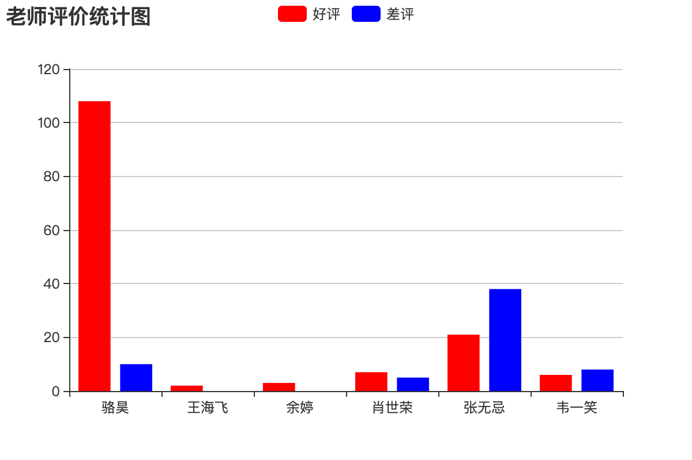

## 報表和日誌

### 導出Excel報表

報表就是用表格、圖表等格式來動態顯示數據，所以有人用這樣的公式來描述報表：

```
報表 = 多樣的格式 + 動態的數據
```

有很多的三方庫支持在Python程序中寫Excel文件，包括[xlwt](<https://xlwt.readthedocs.io/en/latest/>)、[xlwings](<https://docs.xlwings.org/en/latest/quickstart.html>)、[openpyxl](<https://openpyxl.readthedocs.io/en/latest/>)、[xlswriter](<https://xlsxwriter.readthedocs.io/>)、[pandas](<http://pandas.pydata.org/>)等，其中的xlwt雖然只支持寫xls格式的Excel文件，但在性能方面的表現還是不錯的。下面我們就以xlwt為例，來演示如何在Django項目中導出Excel報表，例如導出一個包含所有老師信息的Excel表格。

```Python
def export_teachers_excel(request):
    # 創建工作簿
    wb = xlwt.Workbook()
    # 添加工作表
    sheet = wb.add_sheet('老師信息表')
    # 查詢所有老師的信息(注意：這個地方稍後需要優化)
    queryset = Teacher.objects.all()
    # 向Excel表單中寫入表頭
    colnames = ('姓名', '介紹', '好評數', '差評數', '學科')
    for index, name in enumerate(colnames):
        sheet.write(0, index, name)
    # 向單元格中寫入老師的數據
    props = ('name', 'detail', 'good_count', 'bad_count', 'subject')
    for row, teacher in enumerate(queryset):
        for col, prop in enumerate(props):
            value = getattr(teacher, prop, '')
            if isinstance(value, Subject):
                value = value.name
            sheet.write(row + 1, col, value)
    # 保存Excel
    buffer = BytesIO()
    wb.save(buffer)
    # 將二進制數據寫入響應的消息體中並設置MIME類型
    resp = HttpResponse(buffer.getvalue(), content_type='application/vnd.ms-excel')
    # 中文文件名需要處理成百分號編碼
    filename = quote('老師.xls')
    # 通過響應頭告知瀏覽器下載該文件以及對應的文件名
    resp['content-disposition'] = f'attachment; filename="{filename}"'
    return resp
```

映射URL。

```Python
urlpatterns = [
    # 此處省略上面的代碼
    path('excel/', views.export_teachers_excel),
    # 此處省略下面的代碼
]
```

### 生成前端統計圖表

如果項目中需要生成前端統計圖表，可以使用百度的[ECharts](<https://echarts.baidu.com/>)。具體的做法是後端通過提供數據接口返回統計圖表所需的數據，前端使用ECharts來渲染出柱狀圖、折線圖、餅圖、散點圖等圖表。例如我們要生成一個統計所有老師好評數和差評數的報表，可以按照下面的方式來做。

```Python
def get_teachers_data(request):
    # 查詢所有老師的信息(注意：這個地方稍後也需要優化)
    queryset = Teacher.objects.all()
    # 用生成式將老師的名字放在一個列表中
    names = [teacher.name for teacher in queryset]
    # 用生成式將老師的好評數放在一個列表中
    good = [teacher.good_count for teacher in queryset]
    # 用生成式將老師的差評數放在一個列表中
    bad = [teacher.bad_count for teacher in queryset]
    # 返回JSON格式的數據
    return JsonResponse({'names': names, 'good': good, 'bad': bad})
```

映射URL。

```Python
urlpatterns = [
    # 此處省略上面的代碼
    path('teachers_data/', views.export_teachers_excel),
    # 此處省略下面的代碼
]
```

使用ECharts生成柱狀圖。

```HTML
<!DOCTYPE html>
<html lang="en">
<head>
    <meta charset="UTF-8">
    <title>老師評價統計</title>
</head>
<body>
    <div id="main" style="width: 600px; height: 400px"></div>
    <p>
        <a href="/">返回首頁</a>
    </p>
    <script src="https://cdn.bootcss.com/echarts/4.2.1-rc1/echarts.min.js"></script>
    <script>
        var myChart = echarts.init(document.querySelector('#main'))
        fetch('/teachers_data/')
            .then(resp => resp.json())
            .then(json => {
                var option = {
                    color: ['#f00', '#00f'],
                    title: {
                        text: '老師評價統計圖'
                    },
                    tooltip: {},
                    legend: {
                        data:['好評', '差評']
                    },
                    xAxis: {
                        data: json.names
                    },
                    yAxis: {},
                    series: [
                        {
                            name: '好評',
                            type: 'bar',
                            data: json.good
                        },
                        {
                            name: '差評',
                            type: 'bar',
                            data: json.bad
                        }
                    ]
                }
                myChart.setOption(option)
            })
    </script>
</body>
</html>
```

運行效果如下圖所示。



### 配置日誌

項目開發階段，顯示足夠的調試信息以輔助開發人員調試代碼還是非常必要的；項目上線以後，將系統運行時出現的警告、錯誤等信息記錄下來以備相關人員瞭解系統運行狀況並維護代碼也是很有必要的。要做好這兩件事件，我們需要為Django項目配置日誌。

Django的日誌配置基本可以參照官方文檔再結合項目實際需求來進行，這些內容基本上可以從官方文檔上覆制下來，然後進行局部的調整即可，下面給出一些參考配置。

```Python
LOGGING = {
    'version': 1,
    # 是否禁用已經存在的日誌器
    'disable_existing_loggers': False,
    # 日誌格式化器
    'formatters': {
        'simple': {
            'format': '%(asctime)s %(module)s.%(funcName)s: %(message)s',
            'datefmt': '%Y-%m-%d %H:%M:%S',
        },
        'verbose': {
            'format': '%(asctime)s %(levelname)s [%(process)d-%(threadName)s] '
                      '%(module)s.%(funcName)s line %(lineno)d: %(message)s',
            'datefmt': '%Y-%m-%d %H:%M:%S',
        }
    },
    # 日誌過濾器
    'filters': {
        # 只有在Django配置文件中DEBUG值為True時才起作用
        'require_debug_true': {
            '()': 'django.utils.log.RequireDebugTrue',
        },
    },
    # 日誌處理器
    'handlers': {
        # 輸出到控制檯
        'console': {
            'class': 'logging.StreamHandler',
            'level': 'DEBUG',
            'filters': ['require_debug_true'],
            'formatter': 'simple',
        },
        # 輸出到文件(每週切割一次)
        'file1': {
            'class': 'logging.handlers.TimedRotatingFileHandler',
            'filename': 'access.log',
            'when': 'W0',
            'backupCount': 12,
            'formatter': 'simple',
            'level': 'INFO',
        },
        # 輸出到文件(每天切割一次)
        'file2': {
            'class': 'logging.handlers.TimedRotatingFileHandler',
            'filename': 'error.log',
            'when': 'D',
            'backupCount': 31,
            'formatter': 'verbose',
            'level': 'WARNING',
        },
    },
    # 日誌器記錄器
    'loggers': {
        'django': {
            # 需要使用的日誌處理器
            'handlers': ['console', 'file1', 'file2'],
            # 是否向上傳播日誌信息
            'propagate': True,
            # 日誌級別(不一定是最終的日誌級別)
            'level': 'DEBUG',
        },
    }
}
```

大家可能已經注意到了，上面日誌配置中的formatters是**日誌格式化器**，它代表瞭如何格式化輸出日誌，其中格式佔位符分別表示：

1. %(name)s - 記錄器的名稱
2. %(levelno)s - 數字形式的日誌記錄級別
3. %(levelname)s - 日誌記錄級別的文本名稱
4. %(filename)s - 執行日誌記錄調用的源文件的文件名稱
5. %(pathname)s - 執行日誌記錄調用的源文件的路徑名稱
6. %(funcName)s - 執行日誌記錄調用的函數名稱
7. %(module)s - 執行日誌記錄調用的模塊名稱
8. %(lineno)s - 執行日誌記錄調用的行號
9. %(created)s - 執行日誌記錄的時間
10. %(asctime)s - 日期和時間
11. %(msecs)s - 毫秒部分
12. %(thread)d - 線程ID（整數）
13. %(threadName)s - 線程名稱
14. %(process)d - 進程ID （整數）

日誌配置中的handlers用來指定**日誌處理器**，簡單的說就是指定將日誌輸出到控制檯還是文件又或者是網絡上的服務器，可用的處理器包括：

1. logging.StreamHandler(stream=None) - 可以向類似與sys.stdout或者sys.stderr的任何文件對象輸出信息
2. logging.FileHandler(filename, mode='a', encoding=None, delay=False) - 將日誌消息寫入文件
3. logging.handlers.DatagramHandler(host, port) - 使用UDP協議，將日誌信息發送到指定主機和端口的網絡主機上
4. logging.handlers.HTTPHandler(host, url) - 使用HTTP的GET或POST方法將日誌消息上傳到一臺HTTP 服務器
5. logging.handlers.RotatingFileHandler(filename, mode='a', maxBytes=0, backupCount=0, encoding=None, delay=False) - 將日誌消息寫入文件，如果文件的大小超出maxBytes指定的值，那麼將重新生成一個文件來記錄日誌
6. logging.handlers.SocketHandler(host, port) - 使用TCP協議，將日誌信息發送到指定主機和端口的網絡主機上 
7. logging.handlers.SMTPHandler(mailhost, fromaddr, toaddrs, subject, credentials=None, secure=None, timeout=1.0) - 將日誌輸出到指定的郵件地址
8. logging.MemoryHandler(capacity, flushLevel=ERROR, target=None, flushOnClose=True) - 將日誌輸出到內存指定的緩衝區中

上面每個日誌處理器都指定了一個名為“level”的屬性，它代表了日誌的級別，不同的日誌級別反映出日誌中記錄信息的嚴重性。Python中定義了六個級別的日誌，按照從低到高的順序依次是：NOTSET、DEBUG、INFO、WARNING、ERROR、CRITICAL。

最後配置的**日誌記錄器**是用來真正輸出日誌的，Django框架提供瞭如下所示的內置記錄器：

1. django - 在Django層次結構中的所有消息記錄器
2. django.request - 與請求處理相關的日誌消息。5xx響應被視為錯誤消息；4xx響應被視為為警告消息
3. django.server - 與通過runserver調用的服務器所接收的請求相關的日誌消息。5xx響應被視為錯誤消息；4xx響應被記錄為警告消息；其他一切都被記錄為INFO
4. django.template - 與模板渲染相關的日誌消息
5. django.db.backends - 有與數據庫交互產生的日誌消息，如果希望顯示ORM框架執行的SQL語句，就可以使用該日誌記錄器。

日誌記錄器中配置的日誌級別有可能不是最終的日誌級別，因為還要參考日誌處理器中配置的日誌級別，取二者中級別較高者作為最終的日誌級別。

### 配置Django-Debug-Toolbar

Django-Debug-Toolbar是項目開發階段輔助調試和優化的神器，只要配置了它，就可以很方便的查看到如下表所示的項目運行信息，這些信息對調試項目和優化Web應用性能都是至關重要的。

| 項目        | 說明                              |
| ----------- | --------------------------------- |
| Versions    | Django的版本                      |
| Time        | 顯示視圖耗費的時間                |
| Settings    | 配置文件中設置的值                |
| Headers     | HTTP請求頭和響應頭的信息          |
| Request     | 和請求相關的各種變量及其信息      |
| StaticFiles | 靜態文件加載情況                  |
| Templates   | 模板的相關信息                    |
| Cache       | 緩存的使用情況                    |
| Signals     | Django內置的信號信息              |
| Logging     | 被記錄的日誌信息                  |
| SQL         | 向數據庫發送的SQL語句及其執行時間 |

1. 安裝Django-Debug-Toolbar。

   ```Shell
   pip install django-debug-toolbar
   ```

2. 配置 - 修改settings.py。

   ```Python
   INSTALLED_APPS = [
       'debug_toolbar',
   ]
   
   MIDDLEWARE = [
       'debug_toolbar.middleware.DebugToolbarMiddleware',
   ]
   
   DEBUG_TOOLBAR_CONFIG = {
       # 引入jQuery庫
       'JQUERY_URL': 'https://cdn.bootcss.com/jquery/3.3.1/jquery.min.js',
       # 工具欄是否摺疊
       'SHOW_COLLAPSED': True,
       # 是否顯示工具欄
       'SHOW_TOOLBAR_CALLBACK': lambda x: True,
   }
   ```

3. 配置 - 修改urls.py。

   ```Python
   if settings.DEBUG:
   
       import debug_toolbar
   
       urlpatterns.insert(0, path('__debug__/', include(debug_toolbar.urls)))
   ```

4. 使用 - 如下圖所示，在配置好Django-Debug-Toolbar之後，頁面右側會看到一個調試工具欄，上面包括瞭如前所述的各種調試信息，包括執行時間、項目設置、請求頭、SQL、靜態資源、模板、緩存、信號等，查看起來非常的方便。

### 優化ORM代碼

在配置了日誌或Django-Debug-Toolbar之後，我們可以查看一下之前將老師數據導出成Excel報表的視圖函數執行情況，這裡我們關注的是ORM框架生成的SQL查詢到底是什麼樣子的，相信這裡的結果會讓你感到有一些意外。執行`Teacher.objects.all()`之後我們可以注意到，在控制檯看到的或者通過Django-Debug-Toolbar輸出的SQL是下面這樣的：

```SQL
SELECT `tb_teacher`.`no`, `tb_teacher`.`name`, `tb_teacher`.`detail`, `tb_teacher`.`photo`, `tb_teacher`.`good_count`, `tb_teacher`.`bad_count`, `tb_teacher`.`sno` FROM `tb_teacher`; args=()
SELECT `tb_subject`.`no`, `tb_subject`.`name`, `tb_subject`.`intro`, `tb_subject`.`create_date`, `tb_subject`.`is_hot` FROM `tb_subject` WHERE `tb_subject`.`no` = 101; args=(101,)
SELECT `tb_subject`.`no`, `tb_subject`.`name`, `tb_subject`.`intro`, `tb_subject`.`create_date`, `tb_subject`.`is_hot` FROM `tb_subject` WHERE `tb_subject`.`no` = 101; args=(101,)
SELECT `tb_subject`.`no`, `tb_subject`.`name`, `tb_subject`.`intro`, `tb_subject`.`create_date`, `tb_subject`.`is_hot` FROM `tb_subject` WHERE `tb_subject`.`no` = 101; args=(101,)
SELECT `tb_subject`.`no`, `tb_subject`.`name`, `tb_subject`.`intro`, `tb_subject`.`create_date`, `tb_subject`.`is_hot` FROM `tb_subject` WHERE `tb_subject`.`no` = 101; args=(101,)
SELECT `tb_subject`.`no`, `tb_subject`.`name`, `tb_subject`.`intro`, `tb_subject`.`create_date`, `tb_subject`.`is_hot` FROM `tb_subject` WHERE `tb_subject`.`no` = 103; args=(103,)
SELECT `tb_subject`.`no`, `tb_subject`.`name`, `tb_subject`.`intro`, `tb_subject`.`create_date`, `tb_subject`.`is_hot` FROM `tb_subject` WHERE `tb_subject`.`no` = 103; args=(103,)
```

這裡的問題通常被稱為“1+N查詢”（或“N+1查詢”），原本獲取老師的數據只需要一條SQL，但是由於老師關聯了學科，當我們查詢到N條老師的數據時，Django的ORM框架又向數據庫發出了N條SQL去查詢老師所屬學科的信息。每條SQL執行都會有較大的開銷而且會給數據庫服務器帶來壓力，如果能夠在一條SQL中完成老師和學科的查詢肯定是更好的做法，這一點也很容易做到，相信大家已經想到怎麼做了。是的，我們可以使用連接查詢，但是在使用Django的ORM框架時如何做到這一點呢？對於多對一關聯（如投票應用中的老師和學科），我們可以使用`QuerySet`的用`select_related()`方法來加載關聯對象；而對於多對多關聯（如電商網站中的訂單和商品），我們可以使用`prefetch_related()`方法來加載關聯對象。

在導出老師Excel報表的視圖函數中，我們可以按照下面的方式優化代碼。

```Python
queryset = Teacher.objects.all().select_related('subject')
```

事實上，用ECharts生成前端報表的視圖函數中，查詢老師好評和差評數據的操作也能夠優化，因為在這個例子中，我們只需要獲取老師的姓名、好評數和差評數這三項數據，但是在默認的情況生成的SQL會查詢老師表的所有字段。可以用`QuerySet`的`only()`方法來指定需要查詢的屬性，也可以用`QuerySet`的`defer()`方法來指定暫時不需要查詢的屬性，這樣生成的SQL會通過投影操作來指定需要查詢的列，從而改善查詢性能，代碼如下所示：

```Python
queryset = Teacher.objects.all().only('name', 'good_count', 'bad_count')
```

當然，如果要統計出每個學科的老師好評和差評的平均數，利用Django的ORM框架也能夠做到，代碼如下所示：

```Python
queryset = Teacher.objects.values('subject').annotate(
        good=Avg('good_count'), bad=Avg('bad_count'))
```

這裡獲得的`QuerySet`中的元素是字典對象，每個字典中有三組鍵值對，分別是代表學科編號的`subject`、代表好評數的`good`和代表差評數的`bad`。如果想要獲得學科的名稱而不是編號，可以按照如下所示的方式調整代碼：

```Python
queryset = Teacher.objects.values('subject__name').annotate(
        good=Avg('good_count'), bad=Avg('bad_count'))
```

可見，Django的ORM框架允許我們用面向對象的方式完成關係數據庫中的分組和聚合查詢。