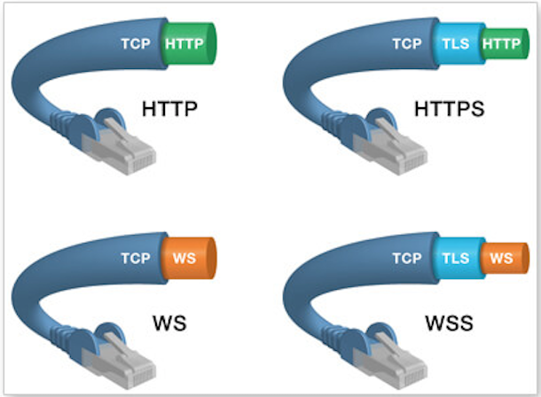

## WebSocket的應用

Tornado的異步特性使其非常適合處理高併發的業務，同時也適合那些需要在客戶端和服務器之間維持長連接的業務。傳統的基於HTTP協議的Web應用，服務器和客戶端（瀏覽器）的通信只能由客戶端發起，這種單向請求註定瞭如果服務器有連續的狀態變化，客戶端（瀏覽器）是很難得知的。事實上，今天的很多Web應用都需要服務器主動向客戶端（瀏覽器）發送數據，我們將這種通信方式稱之為“推送”。過去很長一段時間，程序員都是用定時輪詢（Polling）或長輪詢（Long Polling）等方式來實現“推送”，但是這些都不是真正意義上的“推送”，而且浪費資源且效率低下。在HTML5時代，可以通過一種名為WebSocket的技術在服務器和客戶端（瀏覽器）之間維持傳輸數據的長連接，這種方式可以實現真正的“推送”服務。

### WebSocket簡介

WebSocket 協議在2008年誕生，2011年成為國際標準（[RFC 6455](https://tools.ietf.org/html/rfc6455)），現在的瀏覽器都能夠支持它，它可以實現瀏覽器和服務器之間的全雙工通信。我們之前學習或瞭解過Python的Socket編程，通過Socket編程，可以基於TCP或UDP進行數據傳輸；而WebSocket與之類似，只不過它是基於HTTP來實現通信握手，使用TCP來進行數據傳輸。WebSocket的出現打破了HTTP請求和響應只能一對一通信的模式，也改變了服務器只能被動接受客戶端請求的狀況。目前有很多Web應用是需要服務器主動向客戶端發送信息的，例如股票信息的網站可能需要向瀏覽器發送股票漲停通知，社交網站可能需要向用戶發送好友上線提醒或聊天信息。


WebSocket的特點如下所示：

1. 建立在TCP協議之上，服務器端的實現比較容易。
2. 與HTTP協議有著良好的兼容性，默認端口是80（WS）和443（WSS），通信握手階段採用HTTP協議，能通過各種 HTTP 代理服務器（不容易被防火牆阻攔）。
3. 數據格式比較輕量，性能開銷小，通信高效。
4. 可以發送文本，也可以發送二進制數據。
5. 沒有同源策略的限制，客戶端（瀏覽器）可以與任意服務器通信。



### WebSocket服務器端編程

Tornado框架中有一個`tornado.websocket.WebSocketHandler`類專門用於處理來自WebSocket的請求，通過繼承該類並重寫`open`、`on_message`、`on_close` 等方法來處理WebSocket通信，下面我們對`WebSocketHandler`的核心方法做一個簡單的介紹。

1. `open(*args, **kwargs)`方法：建立新的WebSocket連接後，Tornado框架會調用該方法，該方法的參數與`RequestHandler`的`get`方法的參數類似，這也就意味著在`open`方法中可以執行獲取請求參數、讀取Cookie信息這樣的操作。

2. `on_message(message)`方法：建立WebSocket之後，當收到來自客戶端的消息時，Tornado框架會調用該方法，這樣就可以對收到的消息進行對應的處理，必須重寫這個方法。

3. `on_close()`方法：當WebSocket被關閉時，Tornado框架會調用該方法，在該方法中可以通過`close_code`和`close_reason`瞭解關閉的原因。

4. `write_message(message, binary=False)`方法：將指定的消息通過WebSocket發送給客戶端，可以傳遞utf-8字符序列或者字節序列，如果message是一個字典，將會執行JSON序列化。正常情況下，該方法會返回一個`Future`對象；如果WebSocket被關閉了，將引發`WebSocketClosedError`。

5. `set_nodelay(value)`方法：默認情況下，因為TCP的Nagle算法會導致短小的消息被延遲發送，在考慮到交互性的情況下就要通過將該方法的參數設置為`True`來避免延遲。

6. `close(code=None, reason=None)`方法：主動關閉WebSocket，可以指定狀態碼（詳見[RFC 6455 7.4.1節](https://tools.ietf.org/html/rfc6455#section-7.4.1)）和原因。

### WebSocket客戶端編程

1. 創建WebSocket對象。

   ```JavaScript
   var webSocket = new WebSocket('ws://localhost:8000/ws');
   ```

   >說明：webSocket對象的readyState屬性表示該對象當前狀態，取值為CONNECTING-正在連接，OPEN-連接成功可以通信，CLOSING-正在關閉，CLOSED-已經關閉。

2. 編寫回調函數。

   ```JavaScript
   webSocket.onopen = function(evt) { webSocket.send('...'); };
   webSocket.onmessage = function(evt) { console.log(evt.data); };
   webSocket.onclose = function(evt) {};
   webSocket.onerror = function(evt) {};
   ```

   > 說明：如果要綁定多個事件回調函數，可以用addEventListener方法。另外，通過事件對象的data屬性獲得的數據可能是字符串，也有可能是二進制數據，可以通過webSocket對象的binaryType屬性（blob、arraybuffer）或者通過typeof、instanceof運算符檢查類型進行判定。

### 項目：Web聊天室

```Python
"""
handlers.py - 用戶登錄和聊天的處理器
"""
import tornado.web
import tornado.websocket

nicknames = set()
connections = {}


class LoginHandler(tornado.web.RequestHandler):

    def get(self):
        self.render('login.html', hint='')

    def post(self):
        nickname = self.get_argument('nickname')
        if nickname in nicknames:
            self.render('login.html', hint='暱稱已被使用，請更換暱稱')
        self.set_secure_cookie('nickname', nickname)
        self.render('chat.html')


class ChatHandler(tornado.websocket.WebSocketHandler):

    def open(self):
        nickname = self.get_secure_cookie('nickname').decode()
        nicknames.add(nickname)
        for conn in connections.values():
            conn.write_message(f'~~~{nickname}進入了聊天室~~~')
        connections[nickname] = self

    def on_message(self, message):
        nickname = self.get_secure_cookie('nickname').decode()
        for conn in connections.values():
            if conn is not self:
                conn.write_message(f'{nickname}說：{message}')

    def on_close(self):
        nickname = self.get_secure_cookie('nickname').decode()
        del connections[nickname]
        nicknames.remove(nickname)
        for conn in connections.values():
            conn.write_message(f'~~~{nickname}離開了聊天室~~~')

```

```Python
"""
run_chat_server.py - 聊天服務器
"""
import os

import tornado.web
import tornado.ioloop

from handlers import LoginHandler, ChatHandler


if __name__ == '__main__':
    app = tornado.web.Application(
        handlers=[(r'/login', LoginHandler), (r'/chat', ChatHandler)],
        template_path=os.path.join(os.path.dirname(__file__), 'templates'),
        static_path=os.path.join(os.path.dirname(__file__), 'static'),
        cookie_secret='MWM2MzEyOWFlOWRiOWM2MGMzZThhYTk0ZDNlMDA0OTU=',
    )
    app.listen(8888)
    tornado.ioloop.IOLoop.current().start()
```

```HTML
<!-- login.html -->
<!DOCTYPE html>
<html lang="en">
<head>
    <meta charset="utf-8">
    <title>Tornado聊天室</title>
    <style>
        .hint { color: red; font-size: 0.8em; }
    </style>
</head>
<body>
    <div>
        <div id="container">
            <h1>進入聊天室</h1>
            <hr>
            <p class="hint">{{hint}}</p>
            <form method="post" action="/login">
                <label>暱稱：</label>
                <input type="text" placeholder="請輸入你的暱稱" name="nickname">
                <button type="submit">登錄</button>
            </form>
        </div>
    </div>
</body>
</html>
```

```HTML
<!-- chat.html -->
<!DOCTYPE html>
<html lang="en">
<head>
    <meta charset="UTF-8">
    <title>Tornado聊天室</title>
</head>
<body>
    <h1>聊天室</h1>
    <hr>
    <div>
        <textarea id="contents" rows="20" cols="120" readonly></textarea>
    </div>
    <div class="send">
        <input type="text" id="content" size="50">
        <input type="button" id="send" value="發送">
    </div>
    <p>
        <a id="quit" href="javascript:void(0);">退出聊天室</a>
    </p>
    <script src="https://cdn.bootcss.com/jquery/3.3.1/jquery.min.js"></script>
    <script>
        $(function() {
            // 將內容追加到指定的文本區
            function appendContent($ta, message) {
                var contents = $ta.val();
                contents += '\n' + message;
                $ta.val(contents);
                $ta[0].scrollTop = $ta[0].scrollHeight;
            }
            // 通過WebSocket發送消息
            function sendMessage() {
                message = $('#content').val().trim();
                if (message.length > 0) {
                    ws.send(message);
                    appendContent($('#contents'), '我說：' + message);
                    $('#content').val('');
                }
            }
            // 創建WebSocket對象
            var ws= new WebSocket('ws://localhost:8888/chat');
            // 連接建立後執行的回調函數
            ws.onopen = function(evt) {
                $('#contents').val('~~~歡迎您進入聊天室~~~');
            };
            // 收到消息後執行的回調函數
            ws.onmessage = function(evt) {
                appendContent($('#contents'), evt.data);
            };
            // 為發送按鈕綁定點擊事件回調函數
            $('#send').on('click', sendMessage);
            // 為文本框綁定按下回車事件回調函數
            $('#content').on('keypress', function(evt) {
                keycode = evt.keyCode || evt.which;
                if (keycode == 13) {
                    sendMessage();
                }
            });
            // 為退出聊天室超鏈接綁定點擊事件回調函數
            $('#quit').on('click', function(evt) {
                ws.close();
                location.href = '/login';
            });
        });
    </script>
</body>
</html>
```

