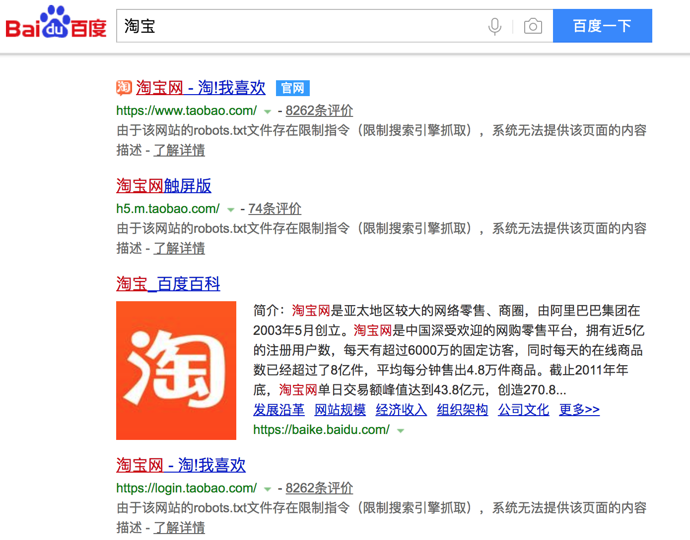
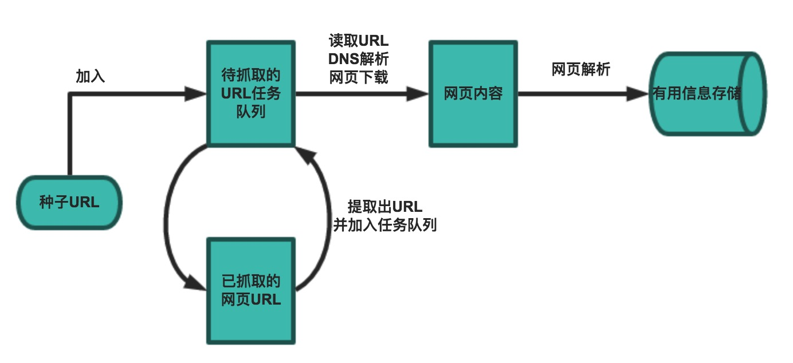

## 網絡爬蟲和相關工具

### 網絡爬蟲的概念

網絡爬蟲（web crawler），以前經常稱之為網絡蜘蛛（spider），是按照一定的規則自動瀏覽萬維網並獲取信息的機器人程序（或腳本），曾經被廣泛的應用於互聯網搜索引擎。使用過互聯網和瀏覽器的人都知道，網頁中除了供用戶閱讀的文字信息之外，還包含一些超鏈接。網絡爬蟲系統正是通過網頁中的超鏈接信息不斷獲得網絡上的其它頁面。正因如此，網絡數據採集的過程就像一個爬蟲或者蜘蛛在網絡上漫遊，所以才被形象的稱為網絡爬蟲或者網絡蜘蛛。

#### 爬蟲的應用領域

在理想的狀態下，所有ICP（Internet Content Provider）都應該為自己的網站提供API接口來共享它們允許其他程序獲取的數據，在這種情況下爬蟲就不是必需品，國內比較有名的電商平臺（如淘寶、京東等）、社交平臺（如騰訊微博等）等網站都提供了自己的Open API，但是這類Open API通常會對可以抓取的數據以及抓取數據的頻率進行限制。對於大多數的公司而言，及時的獲取行業相關數據是企業生存的重要環節之一，然而大部分企業在行業數據方面的匱乏是其與生俱來的短板，合理的利用爬蟲來獲取數據並從中提取出有商業價值的信息是至關重要的。當然爬蟲還有很多重要的應用領域，下面列舉了其中的一部分：

1. 搜索引擎
2. 新聞聚合
3. 社交應用
4. 輿情監控
5. 行業數據

### 合法性和背景調研

#### 爬蟲合法性探討

1. 網絡爬蟲領域目前還屬於拓荒階段，雖然互聯網世界已經通過自己的遊戲規則建立起一定的道德規範(Robots協議，全稱是“網絡爬蟲排除標準”)，但法律部分還在建立和完善中，也就是說，現在這個領域暫時還是灰色地帶。
2. “法不禁止即為許可”，如果爬蟲就像瀏覽器一樣獲取的是前端顯示的數據（網頁上的公開信息）而不是網站後臺的私密敏感信息，就不太擔心法律法規的約束，因為目前大數據產業鏈的發展速度遠遠超過了法律的完善程度。
3. 在爬取網站的時候，需要限制自己的爬蟲遵守Robots協議，同時控制網絡爬蟲程序的抓取數據的速度；在使用數據的時候，必須要尊重網站的知識產權（從Web 2.0時代開始，雖然Web上的數據很多都是由用戶提供的，但是網站平臺是投入了運營成本的，當用戶在註冊和發佈內容時，平臺通常就已經獲得了對數據的所有權、使用權和分發權）。如果違反了這些規定，在打官司的時候敗訴機率相當高。

#### Robots.txt文件

大多數網站都會定義robots.txt文件，下面以淘寶的[robots.txt](http://www.taobao.com/robots.txt)文件為例，看看該網站對爬蟲有哪些限制。

```

User-agent:  Baiduspider
Allow:  /article
Allow:  /oshtml
Disallow:  /product/
Disallow:  /

User-Agent:  Googlebot
Allow:  /article
Allow:  /oshtml
Allow:  /product
Allow:  /spu
Allow:  /dianpu
Allow:  /oversea
Allow:  /list
Disallow:  /

User-agent:  Bingbot
Allow:  /article
Allow:  /oshtml
Allow:  /product
Allow:  /spu
Allow:  /dianpu
Allow:  /oversea
Allow:  /list
Disallow:  /

User-Agent:  360Spider
Allow:  /article
Allow:  /oshtml
Disallow:  /

User-Agent:  Yisouspider
Allow:  /article
Allow:  /oshtml
Disallow:  /

User-Agent:  Sogouspider
Allow:  /article
Allow:  /oshtml
Allow:  /product
Disallow:  /

User-Agent:  Yahoo!  Slurp
Allow:  /product
Allow:  /spu
Allow:  /dianpu
Allow:  /oversea
Allow:  /list
Disallow:  /

User-Agent:  *
Disallow:  /
```

注意上面robots.txt第一段的最後一行，通過設置“Disallow: /”禁止百度爬蟲訪問除了“Allow”規定頁面外的其他所有頁面。因此當你在百度搜索“淘寶”的時候，搜索結果下方會出現：“由於該網站的robots.txt文件存在限制指令（限制搜索引擎抓取），系統無法提供該頁面的內容描述”。百度作為一個搜索引擎，至少在表面上遵守了淘寶網的robots.txt協議，所以用戶不能從百度上搜索到淘寶內部的產品信息。

 

### 相關工具介紹

#### HTTP協議

在開始講解爬蟲之前，我們稍微對HTTP（超文本傳輸協議）做一些回顧，因為我們在網頁上看到的內容通常是瀏覽器執行HTML語言得到的結果，而HTTP就是傳輸HTML數據的協議。HTTP和其他很多應用級協議一樣是構建在TCP（傳輸控制協議）之上的，它利用了TCP提供的可靠的傳輸服務實現了Web應用中的數據交換。按照維基百科上的介紹，設計HTTP最初的目的是為了提供一種發佈和接收[HTML](https://zh.wikipedia.org/wiki/HTML)頁面的方法，也就是說這個協議是瀏覽器和Web服務器之間傳輸的數據的載體。關於這個協議的詳細信息以及目前的發展狀況，大家可以閱讀阮一峰老師的[《HTTP 協議入門》](http://www.ruanyifeng.com/blog/2016/08/http.html)、[《互聯網協議入門》](http://www.ruanyifeng.com/blog/2012/05/internet_protocol_suite_part_i.html)系列以及[《圖解HTTPS協議》](http://www.ruanyifeng.com/blog/2014/09/illustration-ssl.html)進行了解，下圖是我在四川省網絡通信技術重點實驗室工作期間用開源協議分析工具Ethereal（抓包工具WireShark的前身）截取的訪問百度首頁時的HTTP請求和響應的報文（協議數據），由於Ethereal截取的是經過網絡適配器的數據，因此可以清晰的看到從物理鏈路層到應用層的協議數據。

HTTP請求（請求行+請求頭+空行+[消息體]）：


HTTP響應（響應行+響應頭+空行+消息體）：


> 說明：但願這兩張如同泛黃照片般的截圖幫助你大概的瞭解到HTTP是一個怎樣的協議。 

#### 相關工具

1. Chrome Developer Tools：谷歌瀏覽器內置的開發者工具。

   

2. POSTMAN：功能強大的網頁調試與RESTful請求工具。

   

3. HTTPie：命令行HTTP客戶端。

   ```Shell
   pip3 install httpie
   ```

   ```Shell
   http --header http://www.scu.edu.cn
   HTTP/1.1 200 OK
   Accept-Ranges: bytes
   Cache-Control: private, max-age=600
   Connection: Keep-Alive
   Content-Encoding: gzip
   Content-Language: zh-CN
   Content-Length: 14403
   Content-Type: text/html
   Date: Sun, 27 May 2018 15:38:25 GMT
   ETag: "e6ec-56d3032d70a32-gzip"
   Expires: Sun, 27 May 2018 15:48:25 GMT
   Keep-Alive: timeout=5, max=100
   Last-Modified: Sun, 27 May 2018 13:44:22 GMT
   Server: VWebServer
   Vary: User-Agent,Accept-Encoding
   X-Frame-Options: SAMEORIGIN
   ```

4. BuiltWith：識別網站所用技術的工具。

   ```Shell
   pip3 install builtwith
   ```

   ```Python
   >>> import builtwith
   >>> builtwith.parse('http://www.bootcss.com/')
   {'web-servers': ['Nginx'], 'font-scripts': ['Font Awesome'], 'javascript-frameworks': ['Lo-dash', 'Underscore.js', 'Vue.js', 'Zepto', 'jQuery'], 'web-frameworks': ['Twitter Bootstrap']}
   >>>
   >>> import ssl
   >>> ssl._create_default_https_context = ssl._create_unverified_context
   >>> builtwith.parse('https://www.jianshu.com/')
   {'web-servers': ['Tengine'], 'web-frameworks': ['Twitter Bootstrap', 'Ruby on Rails'], 'programming-languages': ['Ruby']}
   ```

5. python-whois：查詢網站所有者的工具。

   ```Shell
   pip3 install python-whois
   ```

   ```Python
   >>> import whois
   >>> whois.whois('baidu.com')
   {'domain_name': ['BAIDU.COM', 'baidu.com'], 'registrar': 'MarkMonitor, Inc.', 'whois_server': 'whois.markmonitor.com', 'referral_url': None, 'updated_date': [datetime.datetime(2017, 7, 28, 2, 36, 28), datetime.datetime(2017, 7, 27, 19, 36, 28)], 'creation_date': [datetime.datetime(1999, 10, 11, 11, 5, 17), datetime.datetime(1999, 10, 11, 4, 5, 17)], 'expiration_date': [datetime.datetime(2026, 10, 11, 11, 5, 17), datetime.datetime(2026, 10, 11, 0, 0)], 'name_servers': ['DNS.BAIDU.COM', 'NS2.BAIDU.COM', 'NS3.BAIDU.COM', 'NS4.BAIDU.COM', 'NS7.BAIDU.COM', 'dns.baidu.com', 'ns4.baidu.com', 'ns3.baidu.com', 'ns7.baidu.com', 'ns2.baidu.com'], 'status': ['clientDeleteProhibited https://icann.org/epp#clientDeleteProhibited', 'clientTransferProhibited https://icann.org/epp#clientTransferProhibited', 'clientUpdateProhibited https://icann.org/epp#clientUpdateProhibited', 'serverDeleteProhibited https://icann.org/epp#serverDeleteProhibited', 'serverTransferProhibited https://icann.org/epp#serverTransferProhibited', 'serverUpdateProhibited https://icann.org/epp#serverUpdateProhibited', 'clientUpdateProhibited (https://www.icann.org/epp#clientUpdateProhibited)', 'clientTransferProhibited (https://www.icann.org/epp#clientTransferProhibited)', 'clientDeleteProhibited (https://www.icann.org/epp#clientDeleteProhibited)', 'serverUpdateProhibited (https://www.icann.org/epp#serverUpdateProhibited)', 'serverTransferProhibited (https://www.icann.org/epp#serverTransferProhibited)', 'serverDeleteProhibited (https://www.icann.org/epp#serverDeleteProhibited)'], 'emails': ['abusecomplaints@markmonitor.com', 'whoisrelay@markmonitor.com'], 'dnssec': 'unsigned', 'name': None, 'org': 'Beijing Baidu Netcom Science Technology Co., Ltd.', 'address': None, 'city': None, 'state': 'Beijing', 'zipcode': None, 'country': 'CN'}
   ```

6. robotparser：解析robots.txt的工具。

   ```Python
   >>> from urllib import robotparser
   >>> parser = robotparser.RobotFileParser()
   >>> parser.set_url('https://www.taobao.com/robots.txt')
   >>> parser.read()
   >>> parser.can_fetch('Baiduspider', 'http://www.taobao.com/article')
   True
   >>> parser.can_fetch('Baiduspider', 'http://www.taobao.com/product')
   False
   ```

### 一個簡單的爬蟲

一個基本的爬蟲通常分為數據採集（網頁下載）、數據處理（網頁解析）和數據存儲（將有用的信息持久化）三個部分的內容，當然更為高級的爬蟲在數據採集和處理時會使用併發編程或分佈式技術，這就需要有調度器（安排線程或進程執行對應的任務）、後臺管理程序（監控爬蟲的工作狀態以及檢查數據抓取的結果）等的參與。



一般來說，爬蟲的工作流程包括以下幾個步驟：

1. 設定抓取目標（種子頁面/起始頁面）並獲取網頁。
2. 當服務器無法訪問時，按照指定的重試次數嘗試重新下載頁面。
3. 在需要的時候設置用戶代理或隱藏真實IP，否則可能無法訪問頁面。
4. 對獲取的頁面進行必要的解碼操作然後抓取出需要的信息。
5. 在獲取的頁面中通過某種方式（如正則表達式）抽取出頁面中的鏈接信息。
6. 對鏈接進行進一步的處理（獲取頁面並重覆上面的動作）。
7. 將有用的信息進行持久化以備後續的處理。

下面的例子給出了一個從“搜狐體育”上獲取NBA新聞標題和鏈接的爬蟲。

```Python
from urllib.error import URLError
from urllib.request import urlopen

import re
import pymysql
import ssl

from pymysql import Error


def decode_page(page_bytes, charsets=('utf-8',)):
    """通過指定的字符集對頁面進行解碼(不是每個網站都將字符集設置為utf-8)"""
    page_html = None
    for charset in charsets:
        try:
            page_html = page_bytes.decode(charset)
            break
        except UnicodeDecodeError:
            pass
            # logging.error('Decode:', error)
    return page_html


def get_page_html(seed_url, *, retry_times=3, charsets=('utf-8',)):
    """獲取頁面的HTML代碼(通過遞歸實現指定次數的重試操作)"""
    page_html = None
    try:
        page_html = decode_page(urlopen(seed_url).read(), charsets)
    except URLError:
        # logging.error('URL:', error)
        if retry_times > 0:
            return get_page_html(seed_url, retry_times=retry_times - 1,
                                 charsets=charsets)
    return page_html


def get_matched_parts(page_html, pattern_str, pattern_ignore_case=re.I):
    """從頁面中提取需要的部分(通常是鏈接也可以通過正則表達式進行指定)"""
    pattern_regex = re.compile(pattern_str, pattern_ignore_case)
    return pattern_regex.findall(page_html) if page_html else []


def start_crawl(seed_url, match_pattern, *, max_depth=-1):
    """開始執行爬蟲程序並對指定的數據進行持久化操作"""
    conn = pymysql.connect(host='localhost', port=3306,
                           database='crawler', user='root',
                           password='123456', charset='utf8')
    try:
        with conn.cursor() as cursor:
            url_list = [seed_url]
            # 通過下面的字典避免重複抓取並控制抓取深度
            visited_url_list = {seed_url: 0}
            while url_list:
                current_url = url_list.pop(0)
                depth = visited_url_list[current_url]
                if depth != max_depth:
                    # 嘗試用utf-8/gbk/gb2312三種字符集進行頁面解碼
                    page_html = get_page_html(current_url, charsets=('utf-8', 'gbk', 'gb2312'))
                    links_list = get_matched_parts(page_html, match_pattern)
                    param_list = []
                    for link in links_list:
                        if link not in visited_url_list:
                            visited_url_list[link] = depth + 1
                            page_html = get_page_html(link, charsets=('utf-8', 'gbk', 'gb2312'))
                            headings = get_matched_parts(page_html, r'<h1>(.*)<span')
                            if headings:
                                param_list.append((headings[0], link))
                    cursor.executemany('insert into tb_result values (default, %s, %s)',
                                       param_list)
                    conn.commit()
    except Error:
        pass
        # logging.error('SQL:', error)
    finally:
        conn.close()


def main():
    """主函數"""
    ssl._create_default_https_context = ssl._create_unverified_context
    start_crawl('http://sports.sohu.com/nba_a.shtml',
                r'<a[^>]+test=a\s[^>]*href=["\'](.*?)["\']',
                max_depth=2)


if __name__ == '__main__':
    main()
```

由於使用了MySQL實現持久化操作，所以要先啟動MySQL服務器並創建名為`crawler`的數據庫和名為`tb_result`的二維表才能運行該程序。

### 爬蟲注意事項

通過上面的例子，我們對爬蟲已經有了一個感性的認識，在編寫爬蟲時有以下一些注意事項：

1. 處理相對鏈接。有的時候我們從頁面中獲取的鏈接不是一個完整的絕對鏈接而是一個相對鏈接，這種情況下需要將其與URL前綴進行拼接（`urllib.parse`中的`urljoin()`函數可以完成此項操作）。

2. 設置代理服務。有些網站會限制訪問的區域（例如美國的Netflix屏蔽了很多國家的訪問），有些爬蟲需要隱藏自己的身份，在這種情況下可以設置使用代理服務器，代理服務器有免費的服務器和付費的商業服務器，但後者穩定性和可用性都更好，強烈建議在商業項目中使用付費的代理服務器。可以通過修改`urllib.request`中的`ProxyHandler`來為請求設置代理服務器。

3. 限制下載速度。如果我們的爬蟲獲取網頁的速度過快，可能就會面臨被封禁或者產生“損害動產”的風險（這個可能會導致吃官司且敗訴），可以在兩次下載之間添加延時從而對爬蟲進行限速。

4. 避免爬蟲陷阱。有些網站會動態生成頁面內容，這會導致產生無限多的頁面（例如在線萬年曆通常會有無窮無盡的鏈接）。可以通過記錄到達當前頁面經過了多少個鏈接（鏈接深度）來解決該問題，當達到事先設定的最大深度時爬蟲就不再像隊列中添加該網頁中的鏈接了。

5. SSL相關問題。在使用`urlopen`打開一個HTTPS鏈接時會驗證一次SSL證書，如果不做出處理會產生錯誤提示“SSL: CERTIFICATE_VERIFY_FAILED”，可以通過以下兩種方式加以解決：

   - 使用未經驗證的上下文

     ```Python
     import ssl
     
     request = urllib.request.Request(url='...', headers={...}) 
     context = ssl._create_unverified_context()
     web_page = urllib.request.urlopen(request, context=context)
     ```

   - 設置全局性取消證書驗證

     ```Python
     import ssl
     
     ssl._create_default_https_context = ssl._create_unverified_context
     ```

