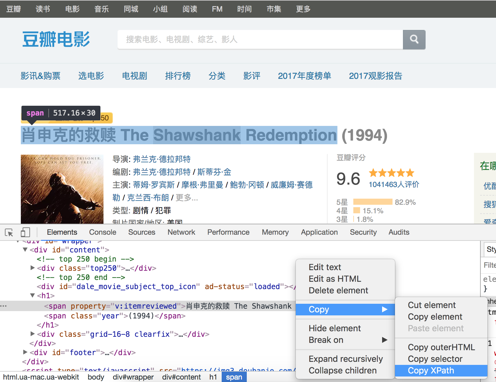

## 數據採集和解析

通過上一個章節的講解，我們已經瞭解到了開發一個爬蟲需要做的工作以及一些常見的問題，下面我們給出一個爬蟲開發相關技術的清單以及這些技術涉及到的標準庫和第三方庫，稍後我們會一一介紹這些內容。

1. 下載數據 - **urllib** / **requests** / **aiohttp**。
2. 解析數據 - **re** / **lxml** / **beautifulsoup4** / **pyquery**。
3. 緩存和持久化 - **pymysql** / **sqlalchemy** / **peewee**/ **redis** / **pymongo**。
4. 生成數字簽名 - **hashlib**。
5. 序列化和壓縮 - **pickle** / **json** / **zlib**。
6. 調度器 - 多進程（**multiprocessing**） / 多線程（**threading**）。

### HTML頁面

```HTML
<!DOCTYPE html>
<html>
	<head>
		<title>Home</title>
		<style type="text/css">
			/* 此處省略層疊樣式表代碼 */
		</style>
	</head>
	<body>
		<div class="wrapper">
			<header>
				<h1>Yoko's Kitchen</h1>
				<nav>
					<ul>
						<li><a href="" class="current">Home</a></li>
						<li><a href="">Classes</a></li>
						<li><a href="">Catering</a></li>
						<li><a href="">About</a></li>
						<li><a href="">Contact</a></li>
					</ul>
				</nav>
			</header>
			<section class="courses">
				<article>
					<figure>
						
						<figcaption>Bok Choi</figcaption>
					</figure>
					<hgroup>
						<h2>Japanese Vegetarian</h2>
						<h3>Five week course in London</h3>
					</hgroup>
					<p>A five week introduction to traditional Japanese vegetarian meals, teaching you a selection of rice and noodle dishes.</p>
				</article>    
				<article>
					<figure>
						
						<figcaption>Teriyaki Sauce</figcaption>
					</figure>
					<hgroup>
						<h2>Sauces Masterclass</h2>
						<h3>One day workshop</h3>
					</hgroup>
					<p>An intensive one-day course looking at how to create the most delicious sauces for use in a range of Japanese cookery.</p>
				</article>    
			</section>
			<aside>
				<section class="popular-recipes">
					<h2>Popular Recipes</h2>
					<a href="">Yakitori (grilled chicken)</a>
					<a href="">Tsukune (minced chicken patties)</a>
					<a href="">Okonomiyaki (savory pancakes)</a>
					<a href="">Mizutaki (chicken stew)</a>
				</section>
				<section class="contact-details">
					<h2>Contact</h2>
					<p>Yoko's Kitchen<br>
						27 Redchurch Street<br>
						Shoreditch<br>
						London E2 7DP</p>
				</section>
			</aside>
			<footer>
				&copy; 2011 Yoko's Kitchen
			</footer>
		</div>
        <script>
        	// 此處省略JavaScript代碼
        </script>
	</body>
</html>
```

如果你對上面的代碼並不感到陌生，那麼你一定知道HTML頁面通常由三部分構成，分別是用來承載內容的Tag（標籤）、負責渲染頁面的CSS（層疊樣式表）以及控制交互式行為的JavaScript。通常，我們可以在瀏覽器的右鍵菜單中通過“查看網頁源代碼”的方式獲取網頁的代碼並瞭解頁面的結構；當然，我們也可以通過瀏覽器提供的開發人員工具來了解更多的信息。

#### 使用requests獲取頁面

1. GET請求和POST請求。

   ```Python
   
   ```

2. URL參數和請求頭。

   ```Python
   
   ```

3. 複雜的POST請求（文件上傳）。

   ```Python
   
   ```

4. 操作Cookie。

   ```Python
   
   ```

5. 設置代理服務器。

   ```Python
   
   ```

> 說明：關於requests的詳細用法可以參考它的[官方文檔](http://docs.python-requests.org/zh_CN/latest/user/quickstart.html)。

### 頁面解析

#### 幾種解析方式的比較

| 解析方式       | 對應的模塊    | 速度   | 使用難度 | 備註                                        |
| -------------- | ------------- | ------ | -------- | ------------------------------------------- |
| 正則表達式解析 | re            | 快     | 困難     | 常用正則表達式<br/>在線正則表達式測試       |
| XPath解析      | lxml          | 快     | 一般     | 需要安裝C語言依賴庫<br/>唯一支持XML的解析器 |
| CSS選擇器解析  | bs4 / pyquery | 不確定 | 簡單     |                                             |

> 說明：BeautifulSoup可選的解析器包括：Python標準庫（html.parser）、lxml的HTML解析器、lxml的XML解析器和html5lib。

#### 使用正則表達式解析頁面

如果你對正則表達式沒有任何的概念，那麼推薦先閱讀[《正則表達式30分鐘入門教程》]()，然後再閱讀我們之前講解在Python中如何使用正則表達式一文。


#### XPath解析和lxml

XPath是在XML文檔中查找信息的一種語法，它使用路徑表達式來選取XML文檔中的節點或者節點集。這裡所說的XPath節點包括元素、屬性、文本、命名空間、處理指令、註釋、根節點等。

```XML
<?xml version="1.0" encoding="UTF-8"?>
<bookstore>
    <book>
      <title lang="eng">Harry Potter</title>
      <price>29.99</price>
    </book>
    <book>
      <title lang="eng">Learning XML</title>
      <price>39.95</price>
    </book>
</bookstore>
```
對於上面的XML文件，我們可以用如下所示的XPath語法獲取文檔中的節點。

| 路徑表達式      | 結果                                                         |
| --------------- | ------------------------------------------------------------ |
| bookstore       | 選取 bookstore 元素的所有子節點。                            |
| /bookstore      | 選取根元素 bookstore。註釋：假如路徑起始於正斜槓( / )，則此路徑始終代表到某元素的絕對路徑！ |
| bookstore/book  | 選取屬於 bookstore 的子元素的所有 book 元素。                |
| //book          | 選取所有 book 子元素，而不管它們在文檔中的位置。             |
| bookstore//book | 選擇屬於 bookstore 元素的後代的所有 book 元素，而不管它們位於 bookstore 之下的什麼位置。 |
| //@lang         | 選取名為 lang 的所有屬性。                                   |

在使用XPath語法時，還可以使用XPath中的謂詞。

| 路徑表達式                         | 結果                                                         |
| ---------------------------------- | ------------------------------------------------------------ |
| /bookstore/book[1]                 | 選取屬於 bookstore 子元素的第一個 book 元素。                |
| /bookstore/book[last()]            | 選取屬於 bookstore 子元素的最後一個 book 元素。              |
| /bookstore/book[last()-1]          | 選取屬於 bookstore 子元素的倒數第二個 book 元素。            |
| /bookstore/book[position()<3]      | 選取最前面的兩個屬於 bookstore 元素的子元素的 book 元素。    |
| //title[@lang]                     | 選取所有擁有名為 lang 的屬性的 title 元素。                  |
| //title[@lang='eng']               | 選取所有 title 元素，且這些元素擁有值為 eng 的 lang 屬性。   |
| /bookstore/book[price>35.00]       | 選取 bookstore 元素的所有 book 元素，且其中的 price 元素的值須大於 35.00。 |
| /bookstore/book[price>35.00]/title | 選取 bookstore 元素中的 book 元素的所有 title 元素，且其中的 price 元素的值須大於 35.00。 |

XPath還支持通配符用法，如下所示。

| 路徑表達式   | 結果                              |
| ------------ | --------------------------------- |
| /bookstore/* | 選取 bookstore 元素的所有子元素。 |
| //*          | 選取文檔中的所有元素。            |
| //title[@*]  | 選取所有帶有屬性的 title 元素。   |

如果要選取多個節點，可以使用如下所示的方法。

| 路徑表達式                       | 結果                                                         |
| -------------------------------- | ------------------------------------------------------------ |
| //book/title \| //book/price     | 選取 book 元素的所有 title 和 price 元素。                   |
| //title \| //price               | 選取文檔中的所有 title 和 price 元素。                       |
| /bookstore/book/title \| //price | 選取屬於 bookstore 元素的 book 元素的所有 title 元素，以及文檔中所有的 price 元素。 |

> 說明：上面的例子來自於菜鳥教程網站上[XPath教程](<https://www.runoob.com/xpath/xpath-tutorial.html>)，有興趣的讀者可以自行閱讀原文。

當然，如果不理解或者不太熟悉XPath語法，可以在Chrome瀏覽器中按照如下所示的方法查看元素的XPath語法。




### BeautifulSoup的使用

BeautifulSoup是一個可以從HTML或XML文件中提取數據的Python庫。它能夠通過你喜歡的轉換器實現慣用的文檔導航、查找、修改文檔的方式。

1. 遍歷文檔樹
   - 獲取標籤
   - 獲取標籤屬性
   - 獲取標籤內容
   - 獲取子（孫）節點
   - 獲取父節點/祖先節點
   - 獲取兄弟節點
2. 搜索樹節點
   - find / find_all
   - select_one / select

> 說明：更多內容可以參考BeautifulSoup的[官方文檔](https://www.crummy.com/software/BeautifulSoup/bs4/doc/index.zh.html)。

### PyQuery的使用

pyquery相當於jQuery的Python實現，可以用於解析HTML網頁。

### 實例 - 獲取知乎發現上的問題鏈接

```Python
from urllib.parse import urljoin

import re
import requests

from bs4 import BeautifulSoup


def main():
    headers = {'user-agent': 'Baiduspider'}
    proxies = {
        'http': 'http://122.114.31.177:808'
    }
    base_url = 'https://www.zhihu.com/'
    seed_url = urljoin(base_url, 'explore')
    resp = requests.get(seed_url,
                        headers=headers,
                        proxies=proxies)
    soup = BeautifulSoup(resp.text, 'lxml')
    href_regex = re.compile(r'^/question')
    link_set = set()
    for a_tag in soup.find_all('a', {'href': href_regex}):
        if 'href' in a_tag.attrs:
            href = a_tag.attrs['href']
            full_url = urljoin(base_url, href)
            link_set.add(full_url)
    print('Total %d question pages found.' % len(link_set))


if __name__ == '__main__':
    main()
```

