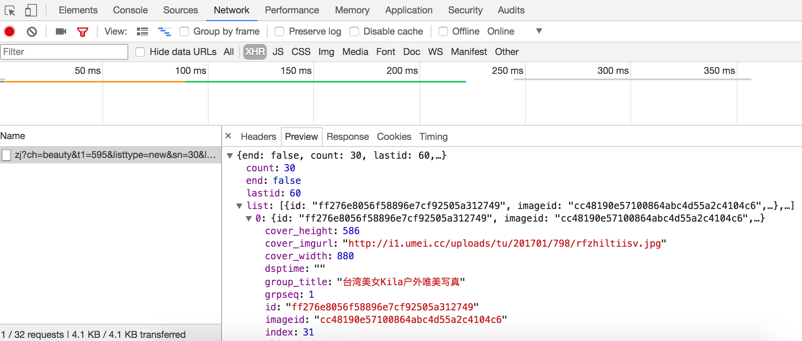

## 解析動態內容

根據權威機構發佈的全球互聯網可訪問性審計報告，全球約有四分之三的網站其內容或部分內容是通過JavaScript動態生成的，這就意味著在瀏覽器窗口中“查看網頁源代碼”時無法在HTML代碼中找到這些內容，也就是說我們之前用的抓取數據的方式無法正常運轉了。解決這樣的問題基本上有兩種方案，一是JavaScript逆向工程；另一種是渲染JavaScript獲得渲染後的內容。

### JavaScript逆向工程

下面我們以“360圖片”網站為例，說明什麼是JavaScript逆向工程。其實所謂的JavaScript逆向工程就是找到通過Ajax技術動態獲取數據的接口。在瀏覽器中輸入<http://image.so.com/z?ch=beauty>就可以打開“360圖片”的“美女”版塊，如下圖所示。


但是當我們在瀏覽器中通過右鍵菜單“顯示網頁源代碼”的時候，居然驚奇的發現頁面的HTML代碼中連一個``標籤都沒有，那麼我們看到的圖片是怎麼顯示出來的呢？原來所有的圖片都是通過JavaScript動態加載的，而在瀏覽器的“開發人員工具”的“網絡”中可以找到獲取這些圖片數據的網絡API接口，如下圖所示。



那麼結論就很簡單了，只要我們找到了這些網絡API接口，那麼就能通過這些接口獲取到數據，當然實際開發的時候可能還要對這些接口的參數以及接口返回的數據進行分析，瞭解每個參數的意義以及返回的JSON數據的格式，這樣才能在我們的爬蟲中使用這些數據。

關於如何從網絡API中獲取JSON格式的數據並提取出我們需要的內容，在之前的[《文件和異常》](../Day01-15/Day11/文件和異常.md)一文中已經講解過了，這裡不再進行贅述。

### 使用Selenium

儘管很多網站對自己的網絡API接口進行了保護，增加了獲取數據的難度，但是隻要經過足夠的努力，絕大多數還是可以被逆向工程的，但是在實際開發中，我們可以通過瀏覽器渲染引擎來避免這些繁瑣的工作，WebKit就是一個利用的渲染引擎。

WebKit的代碼始於1998年的KHTML項目，當時它是Konqueror瀏覽器的渲染引擎。2001年，蘋果公司從這個項目的代碼中衍生出了WebKit並應用於Safari瀏覽器，早期的Chrome瀏覽器也使用了該內核。在Python中，我們可以通過Qt框架獲得WebKit引擎並使用它來渲染頁面獲得動態內容，關於這個內容請大家自行閱讀[《爬蟲技術:動態頁面抓取超級指南》](http://python.jobbole.com/84600/)一文。

如果沒有打算用上面所說的方式來渲染頁面並獲得動態內容，其實還有一種替代方案就是使用自動化測試工具Selenium，它提供了瀏覽器自動化的API接口，這樣就可以通過操控瀏覽器來獲取動態內容。首先可以使用pip來安裝Selenium。

```Shell
pip3 install selenium
```

下面以“阿里V任務”的“直播服務”為例，來演示如何使用Selenium獲取到動態內容並抓取主播圖片。

```Python
import requests

from bs4 import BeautifulSoup


def main():
    resp = requests.get('https://v.taobao.com/v/content/live?catetype=704&from=taonvlang')
    soup = BeautifulSoup(resp.text, 'lxml')
    for img_tag in soup.select('img[src]'):
        print(img_tag.attrs['src'])


if __name__ == '__main__':
    main()
```

運行上面的程序會發現沒有任何的輸出，因為頁面的HTML代碼上根本找不到``標籤。接下來我們使用Selenium來獲取到頁面上的動態內容，再提取主播圖片。

```Python
from bs4 import BeautifulSoup
from selenium import webdriver
from selenium.webdriver.common.keys import Keys


def main():
    driver = webdriver.Chrome()
    driver.get('https://v.taobao.com/v/content/live?catetype=704&from=taonvlang')
    soup = BeautifulSoup(driver.page_source, 'lxml')
    for img_tag in soup.body.select('img[src]'):
        print(img_tag.attrs['src'])


if __name__ == '__main__':
    main()
```

在上面的程序中，我們通過Selenium實現對Chrome瀏覽器的操控，如果要操控其他的瀏覽器，可以創對應的瀏覽器對象，例如Firefox、IE等。運行上面的程序，如果看到如下所示的錯誤提示，那是說明我們還沒有將Chrome瀏覽器的驅動添加到PATH環境變量中，也沒有在程序中指定Chrome瀏覽器驅動所在的位置。

```Shell
selenium.common.exceptions.WebDriverException: Message: 'chromedriver' executable needs to be in PATH. Please see https://sites.google.com/a/chromium.org/chromedriver/home
```

為了解決上面的問題，可以到Selenium的[官方網站](https://www.seleniumhq.org)找到瀏覽器驅動的下載鏈接並下載需要的驅動，在Linux或macOS系統下可以通過下面的命令來設置PATH環境變量，Windows下配置環境變量也非常簡單，不清楚的可以自行了解。

```Shell
export PATH=$PATH:/Users/Hao/Downloads/Tools/chromedriver/
```

其中`/Users/Hao/Downloads/Tools/chromedriver/ `就是chromedriver所在的路徑。
