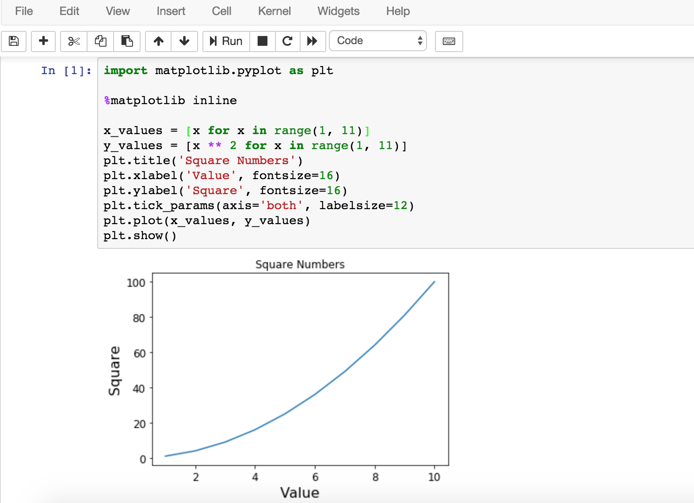
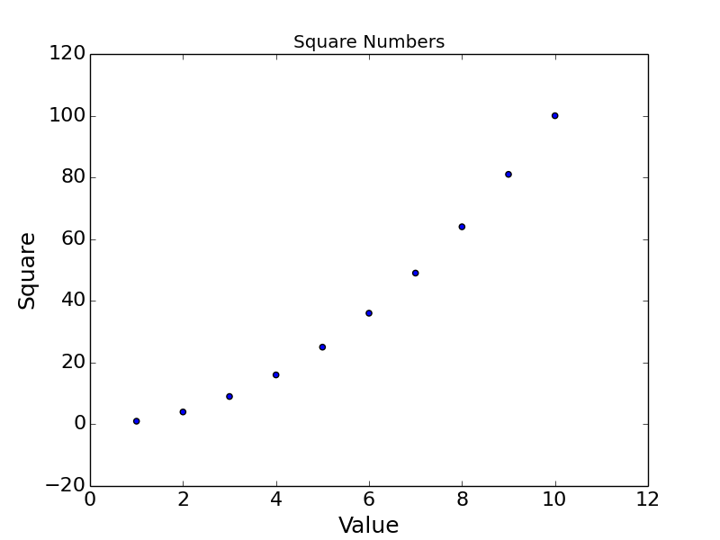
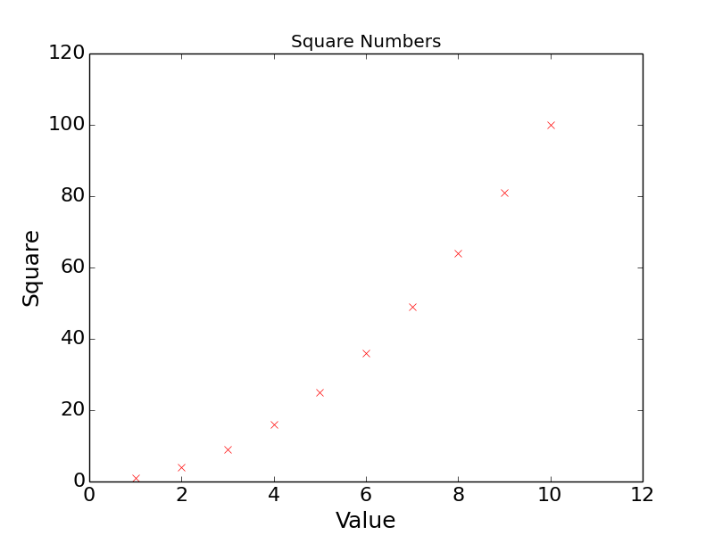
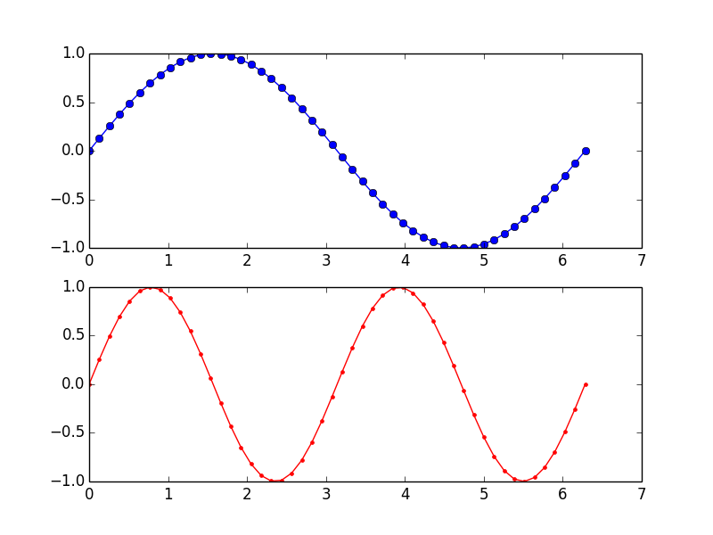

## Matplotlib和數據可視化

數據的處理、分析和可視化已經成為Python近年來最為重要的應用領域之一，其中數據的可視化指的是將數據呈現為漂亮的統計圖表，然後進一步發現數據中包含的規律以及隱藏的信息。數據可視化又跟數據挖掘和大數據分析緊密相關，而這些領域以及當下被熱議的“深度學習”其最終的目標都是為了實現從過去的數據去對未來的狀況進行預測。Python在實現數據可視化方面是非常棒的，即便是使用個人電腦也能夠實現對百萬級甚至更大體量的數據進行探索的工作，而這些工作都可以在現有的第三方庫的基礎上來完成（無需“重複的發明輪子”）。[Matplotlib](https://matplotlib.org/)就是Python繪圖庫中的佼佼者，它包含了大量的工具，你可以使用這些工具創建各種圖形（包括散點圖、折線圖、直方圖、餅圖、雷達圖等），Python科學計算社區也經常使用它來完成數據可視化的工作。

### 安裝matplotlib

可以使用pip來安裝matplotlib，命令如下所示。

```Shell
pip install matplotlib
```

### 繪製折線圖

```Python
# coding: utf-8
import matplotlib.pyplot as plt


def main():
    # 保存x軸數據的列表
    x_values = [x for x in range(1, 11)]
    # 保存y軸數據的列表
    y_values = [x ** 2 for x in range(1, 11)]
    # 設置圖表的標題以及x和y軸的說明
    plt.title('Square Numbers')
    plt.xlabel('Value', fontsize=18)
    plt.ylabel('Square', fontsize=18)
    # 設置刻度標記的文字大小
    plt.tick_params(axis='both', labelsize=16)
    # 繪製折線圖
    plt.plot(x_values, y_values)
    plt.show()


if __name__ == '__main__':
    main()

```

運行程序，效果如下圖所示。


如果使用jupyter的notebook，需要使用魔法指令`%matplotlib inresline`來設置在頁面中顯示圖表，效果如下所示。



### 繪製散點圖

可以將上面代碼中的的`plot`函數換成`scatter`函數來繪製散點圖，效果如下圖所示。



當然，也可以直接通過`plot`函數設置繪圖的顏色和線條的形狀將折線圖改造為散點圖，對應的代碼如下所示，其中參數'xr'表示每個點的記號是‘x’圖形，顏色是紅色（<u>r</u>ed）。

```Python
plt.plot(x_values, y_values, 'xr')
```

重新運行程序，效果如下圖所示。


可能大家已經注意到了，1和10對應的‘x’記號在圖形邊角的位置不太明顯，要解決這個問題可以通過添加下面的代碼調整x軸和y軸的座標範圍。

```Python
plt.axis([0, 12, 0, 120])
```

調整後的效果如下圖所示。



### 繪製正弦曲線

在下面的程序中，我們使用了名為[NumPy](http://www.numpy.org/)的第三方庫來產生樣本並計算正弦值。NumPy是一個運行速度非常快的數學庫，主要用於數組計算。它可以讓你在Python中使用向量和數學矩陣，以及許多用C語言實現的底層函數。如果想通過Python學習數據科學或者機器學習相關的內容，那麼就得先學會使用NumPy。

```Python
# coding: utf-8
import matplotlib.pyplot as plt
import numpy as np


def main():
    # 指定採樣的範圍以及樣本的數量
    x_values = np.linspace(0, 2 * np.pi, 1000)
    # 計算每個樣本對應的正弦值
    y_values = np.sin(x_values)
    # 繪製折線圖(線條形狀為--, 顏色為藍色)
    plt.plot(x_values, y_values, '--b')
    plt.show()


if __name__ == '__main__':
    main()

```

運行程序，效果如下圖所示。


如果要在一個座標系上繪製多個圖像，可以按照如下的方式修改代碼。

```Python
# coding: utf-8
import matplotlib.pyplot as plt
import numpy as np


def main():
    x_values = np.linspace(0, 2 * np.pi, 1000)
    plt.plot(x_values, np.sin(x_values), '--b')
    plt.plot(x_values, np.sin(2 * x_values), '--r')
    plt.show()


if __name__ == '__main__':
    main()

```

修改後的代碼運行效果如下圖所示。


如果需要分別在兩個座標系上繪製出兩條曲線，可以按照如下的方式操作。

```Python
# coding: utf-8
import matplotlib.pyplot as plt
import numpy as np


def main():
    # 將樣本數量減少為50個
    x_values = np.linspace(0, 2 * np.pi, 50)
    # 設置繪圖為2行1列活躍區為1區(第一個圖)
    plt.subplot(2, 1, 1)
    plt.plot(x_values, np.sin(x_values), 'o-b')
    # 設置繪圖為2行1列活躍區為2區(第二個圖)
    plt.subplot(2, 1, 2)
    plt.plot(x_values, np.sin(2 * x_values), '.-r')
    plt.show()


if __name__ == '__main__':
    main()

```

效果如下圖所示。



### 繪製直方圖

我們可以通過NumPy的random模塊的normal函數來生成[正態分佈](https://zh.wikipedia.org/wiki/%E6%AD%A3%E6%80%81%E5%88%86%E5%B8%83)的採樣數據，其中的三個參數分別表示期望、標準差和樣本數量，然後繪製成直方圖，代碼如下所示。

```Python
# coding: utf-8
import matplotlib.pyplot as plt
import numpy as np


def main():
    # 通過random模塊的normal函數產生1000個正態分佈的樣本
    data = np.random.normal(10.0, 5.0, 1000)
    # 繪製直方圖(直方的數量為10個)
    plt.hist(data, 10)
    plt.show()


if __name__ == '__main__':
    main()

```

運行效果如下圖所示。


### 使用Pygal繪製矢量圖

矢量圖（SVG）是[計算機圖形學](https://zh.wikipedia.org/wiki/%E8%AE%A1%E7%AE%97%E6%9C%BA%E5%9B%BE%E5%BD%A2%E5%AD%A6)中用點、直線或者多邊形等基於數學方程的幾何圖元表示的圖像，也是目前應用得非常多的一種圖像文件格式，全稱是“Scalable Vector Graphics”。和使用像素表示圖像的位圖不同，SVG基於XML存儲圖像數據，它是W3C定義的一種開放標準的矢量圖形語言，可以用來設計更為清晰的Web圖像，因為SVG與分辨率無關，在任意放大時不會丟失細節或影響清晰度。SVG可以直接用代碼來描繪圖像，也可以用任何文字處理工具來打開它，通過改變SVG的代碼我們可以讓圖像具備交互功能。

Python中可以使用Pygal來生成SVG，可以通過pip來安裝它。

```Python
from random import randint
import pygal


def roll_dice(n=1):
	total = 0
	for _ in range(n):
		total += randint(1, 6)
	return total


def main():
    results = []
    # 將兩顆色子搖10000次記錄點數
    for _ in range(10000):
        face = roll_dice(2)
        results.append(face)
    freqs = []
    # 統計2~12點各出現了多少次
    for value in range(2, 13):
        freq = results.count(value)
        freqs.append(freq)
    # 繪製柱狀圖
    hist = pygal.Bar()
    hist.title = 'Result of rolling two dice'
    hist.x_labels = [x for x in range(2, 13)]
    hist.add('Frequency', freqs)
    # 保存矢量圖
    hist.render_to_file('result.svg')


if __name__ == '__main__':
    main()
    

```

運行上面的程序，效果如下圖所示。


### 後記

Matplotlib和NumPy的強大我們在這裡也只是窺視了其冰山一角，我們在後續的內容裡面還會使用到這兩個第三方庫，到時候我們再續點為大家介紹其他的功能。