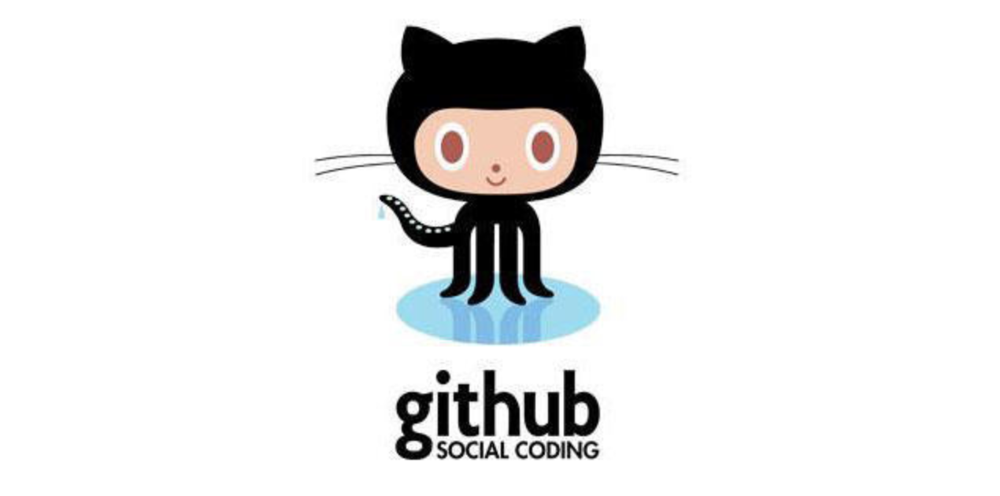
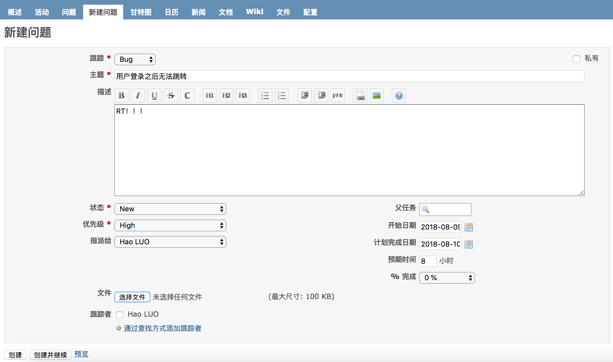

## 團隊項目開發準備

我們經常聽到個人開發和團隊開發這兩個詞，所謂個人開發就是一個人把控產品的所有內容；而團隊開發則是由多個人組成團隊並完成產品的開發。要實施團隊開發以下幾點是必不可少的：

1. 必須對開發過程中的各種事件（例如：誰到什麼時間完成了什麼事情）進行管理和共享。
2. 各類工作成果以及新的知識技巧等必須在團隊內部共享。
3. 管理工作成果的變更，既要防止成果被破壞，又要保證各個成員利用現有成果並行作業。
4. 能夠證明團隊開發出的軟件在任何時候都是可以正常運行的。
5. 儘可能的使用自動化的工作流程，讓團隊成員能夠正確的實施開發、測試和部署。

### 團隊項目開發常見問題

#### 問題1：傳統的溝通方式無法確定處理的優先級

例如：使用郵件進行溝通可能出現郵件數量太多導致重要的郵件被埋沒，無法管理狀態，不知道哪些問題已經解決，哪些問題尚未處理，如果用全文檢索郵件的方式來查詢相關問題效率過於低下。

解決方案：使用缺陷管理工具。

#### 問題2：沒有能夠用於驗證的環境

例如：收到項目正式環境中發生的故障報告後，需要還原正式環境需要花費很長的時間。

解決方法：實施持續交付。

#### 問題3：用別名目錄管理項目分支

解決方法：實施版本控制。

#### 問題4：重新制作數據庫非常困難

例如：正式環境和開發環境中數據庫表結構不一致或者某個表列的順序不一致。

解決方法：實施版本控制。

#### 問題5：不運行系統就無法察覺問題

例如：解決一個bug可能引入其他的bug或者造成系統退化，不正確的使用版本系統覆蓋了其他人的修改，修改的內容相互發生了干擾，如果問題不能儘早發現，那麼等過去幾個月後再想追溯問題就非常麻煩了。

解決方法：實施持續集成，將團隊成員的工作成果經常、持續的進行構建和測試。

#### 問題6：覆蓋了其他成員修正的代碼

解決方法：實施版本控制。

#### 問題7：無法實施代碼重構

重構：在不影響代碼產生的結果的前提下對代碼內部的構造進行調整。

例如：在實施代碼重構時可能引發退化。

解決方法：大量的可重用的測試並實施持續集成。

#### 問題8：不知道bug的修正日期無法追蹤退化

解決方法：版本控制系統、缺陷管理系統和持續集成之間需要交互，最好能夠和自動化部署工具集成到一起來使用。

#### 問題9：發佈過程太複雜

解決方法：實施持續交付。

基於對上述問題的闡述和分析，我們基本上可以得到以下的結論，在團隊開發中版本控制、缺陷管理和持續集成都是非常重要且不可或缺的。

### 版本控制

針對上面提到的一些問題，在團隊開發的首要前提就是實施版本控制，對必要的信息進行管理，需要管理的內容包括：

1. 代碼。
2. 需求和設計的相關文檔。
3. 數據庫模式和初始數據。
4. 配置文件。
5. 庫的依賴關係定義。

#### Git簡介


Git是誕生於2005年的一個開源分佈式版本控制系統，最初是Linus Torvalds（Linux之父） 為了幫助管理Linux內核開發而開發的一個版本控制軟件。Git與常用的版本控制工具Subversion等不同，它採用了分佈式版本控制的方式，在沒有中央服務器支持的環境下也能夠實施版本控制。

對於有使用Subversion（以下簡稱為SVN）經驗的人來說，Git和SVN一樣摒棄了基於鎖定模式的版本控制方案（早期的CVS和VSS使用的就是鎖定模式）採用了合併模式，而二者的區別在於：
    1. Git是分佈式的，SVN是集中式的，SVN需要中央服務器才能工作。
    2. Git把內容按元數據方式存儲，而SVN是按文件，即把文件的元信息隱藏在一個.svn文件夾裡。
    3. Git分支和SVN的分支不同。
    4. Git沒有一個全局版本號而SVN有。
    5. Git的內容完整性要優於SVN，Git的內容存儲使用的是SHA-1哈希算法。這能確保代碼內容的完整性，確保在遇到磁盤故障和網絡問題時降低對版本庫的破壞。  

#### 安裝Git

可以在[Git官方網站](http://git-scm.com/)找到適合自己系統的Git下載鏈接並進行安裝，安裝成功後可以在終端中鍵入下面的命令檢查自己的Git版本。

```Shell
git --version
```

如果之前完全沒有接觸過Git，可以先閱讀[《git - 簡易指南》](http://www.bootcss.com/p/git-guide/)來對Git有一個大致的瞭解。

#### 本地實施版本控制

可以使用下面的命令將目錄創建為Git倉庫。
```Shell
git init 
```

當你完成了上述操作後，本地目錄就變成了下面的樣子，左邊是你正在操作的工作目錄，而右邊是你的本地倉庫，中間是工作目錄和本地倉庫之間的一個暫存區（也稱為緩存區）。


通過`git add`可以將文件添加到暫存區。

```Shell
git add <file> ...
```

可以用下面的方式將暫存區的指定文件恢復到工作區。

```Shell
git checkout -- <file>
```

通過下面的命令可以將暫存區的內容納入本地倉庫。

```Shell
git commit -m '本次提交的說明'
```

可以使用下面的命令查看文件狀態和進行版本比較。

```Shell
git status -s
git diff
```

可以通過`git log`查看提交日誌。

```Shell
git log
git log --graph --pretty=oneline --abbrev-commit
```

如果要回到歷史版本，可以使用下面的命令。

```Shell
git reset --hard <commit-id>
git reset --hard HEAD^
```

其他的一些命令可以參考阮一峰老師的[《常用Git命令清單》](http://www.ruanyifeng.com/blog/2015/12/git-cheat-sheet.html)或者是碼雲上的[《Git大全》](https://gitee.com/all-about-git)。

#### Git服務器概述

對於Git來說不像SVN那樣一定需要一箇中心服務器，剛才我們的操作都是在本地執行的，如果你想通過Git分享你的代碼或者與其他人協作，那麼就需要服務器的支持。Github為Git提供了遠程倉庫，它是一個基於Git的代碼託管平臺，企業用戶（付費用戶）可以創建倉庫，普通用戶只能創建公開倉庫（代碼是可以是他人可見的）。Github是在2008年4月創辦的，它上面代碼庫驚人的增長速度已經證明了它是非常成功的，在2018年6月，微軟以75億美元的天價收購了Github。國內也有類似的代碼託管平臺，最有名的當屬[碼雲](https://gitee.com/)和[CODING](https://coding.net/)，目前碼雲和CODING對註冊用戶都提供了受限的使用私有倉庫的功能，同時還提供了對Pull Request的支持（後面會講到），而且目前提供代碼託管服務的平臺都集成了“缺陷管理”、“WebHook”等一系列的功能，讓我們能做的事情不僅僅是版本控制。當然，如果公司需要也可以搭建自己的Git服務器，具體的方式我們就不在這裡進行介紹了，有興趣的可以自行了解。



我們可以在碼雲或者CODING上註冊賬號，也可以使用第三方登錄（github賬號、微信賬號、新浪微博賬號、CSDN賬號等）的方式。登錄成功後就可以創建項目，創建項目幾乎是“傻瓜式”的，我們只說幾個值得注意的地方。

1. 添加項目成員。創建項目後，可以在項目的“設置”或“管理”中找到“成員管理”功能，這樣就可以將其他開發者設置為項目團隊的成員，項目成員通常分為“所有者”、“管理者”、“普通成員”和“受限成員”幾種角色。

2. 設置公鑰實現免密操作。在項目的“設置”或“管理”中我們還可以找到“部署公鑰管理”的選項，通過添加部署公鑰，可以通過SSH（安全遠程連接）的形式訪問服務器而不用每次輸入用戶名和口令。可以使用`ssh-keygen`命令來創建密鑰對。

   ```Shell
   ssh-keygen -t rsa -C "your_email@example.com"
   ```

#### 使用Git進行開發

克隆服務器上的代碼到本地機器。

```Shell
git clone <url>
```

在自己的分支上進行開發。

```Shell
git branch <branch-name>
git checkout <branch-name>
```

或者

```Shell
git checkout -b <branch-name>
```

接下來可以先在本地實施版本控制（操作的方式與前面相同不再贅述），然後再將自己的分支Push到服務器。

```Shell
git push origin <branch-name>
```

最後，當工作完成時，可以發起一個Pull Request，請求將代碼合併到master分支。

#### 分支策略的模式

上面講解的方式，其實是一種稱為github-flow的分支策略模式，這種模式的操作步驟包括：

1. master的內容都是可以進行發佈的內容。
2. 開發時應該以master為基礎建立新分支。
3. 分支先在本地實施版本控制，然後以同名分支定期向服務器進行Push。
4. 開發結束後向master發送Pull Request。
5. Pull Request通過代碼審查之後合併到master，並從master向正式環境發佈。

在使用github-flow時的注意事項有以下三點：

1. master是用於發佈的，不能直接在master上進行修改。
2. 開始日常開發工作時要首先建立分支。
3. 工作完成後向master發送Pull Request。

除了上述的github-flow工作方式外，還有一種名為git-flow的分支策略模式，它借鑑了中央集權型版本控制系統的長處，為團隊內部統一管理建立分支的方法、合併操作和關閉分支的方法。在這種模式下，項目有兩個長線分支，分別是master和develop，其他的都是臨時的、短暫的輔助分支，包括feature（開發特定功能的分支，開發結束後合併到develop）、release（從develop分離出來的為發佈做準備的分支，發佈結束後合併到master和develop）和hotfix（產品發佈後出現問題時緊急建立的分支，直接從master分離，問題修復後合併到master並打上標籤，同時還要合併到develop來避免將來的版本遺漏了這個修復工作，如果此時有正在發佈中的release分支，還要合併到release分支）。這套方式分支策略簡單清晰且容易理解，但是在運用上會稍微有些複雜，需要一些腳本來輔助版本控制的實施。

### 缺陷管理

沒有好的團隊管理工具必然導致項目進展不順利，任務管理困難，而引入缺陷管理系統正好可以解決這些問題，通常一個缺陷管理系統都包含了以下的功能：

1. 任務管理（包括必須做什麼、誰來做、什麼時候完成、現在處於什麼狀態等）。
2. 直觀而且可以檢索過去發生的各種問題。
3. 能夠對信息進行統一的管理和共享。
4. 能夠生成各類報表。
5. 能夠關聯到其他系統，具有可擴展性。

Redmine是基於Ruby on Rails框架的開源缺陷管理系統，提供了問題管理、代碼管理、Wiki等必要的功能，而且支持插件系統，擴展起來也非常容易。



如果希望瞭解和使用Redmine，可以關注[Redmine中文網](http://www.redmine.org.cn/)，上面提供了視頻教程、經驗分享以及其他的安裝和使用上的指導。

### 持續集成

為了快速的產生高品質的軟件，在團隊開發中，持續集成（CI）也是一個非常重要的基礎。按照經典的軟件過程模型（瀑布模型），集成的工作一般要等到所有的開發工作都結束後才能開始，但這個時候如果發現了問題，修復問題的代價是非常具體的。基本上，集成實施得越晚，代碼量越大，解決問題就越困難。持續集成將版本控制、自動化構建、代碼測試融入到一起，讓這些工作變得自動化和可協作。由於其頻繁重複整個開發流程（在指定時間內多次pull源代碼並運行測試代碼），所以能幫助開發者提早發現問題。

在所有的CI工具中，Jenkins和TravisCI是最具有代表性的。

Jenkins 是基 Java的開源CI工具，其安裝和操作都很簡單。另外，Jenkins不僅能在面板上輕鬆看出任務成功或失敗，還可以藉助通知功能將結果以郵件或RSS訂閱的形式發給用戶。與此同時，Jenkins也允許通過插件進行功能擴展，所需功能可以隨用隨添加，而且還支持主從式集群，能夠輕鬆的進行水平擴展。