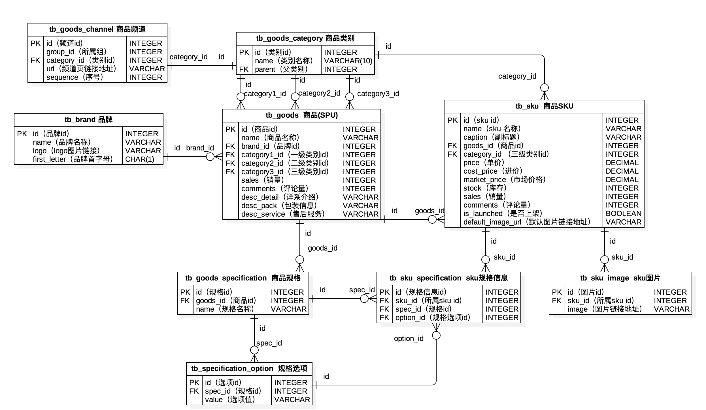
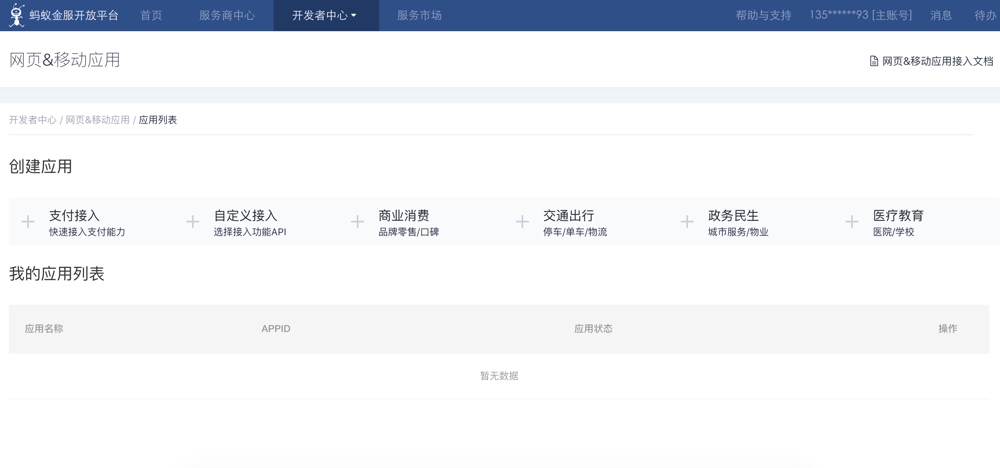

## 電商網站技術要點剖析

### 商業模式

1. B2B - 商家對商家，交易雙方都是企業（商家），最典型的案例就是阿里巴巴。
2. C2C - 個人對個人，例如：淘寶、人人車。
3. B2C - 商家對個人，例如：唯品會，聚美優品。
4. C2B - 個人對商家，先有消費者提出需求，後有商家按需求組織生產，例如： 尚品宅配。
5. O2O - 線上到線下，將線下的商務機會與互聯網結合，讓互聯網成為線下交易的平臺，例如：美團外賣、餓了麼。
6. B2B2C - 商家對商家對個人，例如：天貓、京東。

### 需求要點

1. 用戶端
   - 首頁（商品分類、廣告輪播、滾動快訊、瀑布加載、推薦、折扣、熱銷、……）

   - 用戶（登錄（第三方登錄）、註冊、註銷、自服務（個人信息、瀏覽歷史、收貨地址、……））

   - 商品（分類、列表、詳情、搜索、熱門搜索、搜索歷史、添加到購物車、收藏、關注、……）
   - 購物車（查看、編輯（修改數量、刪除商品、清空））
   - 訂單（提交訂單（支付）、歷史訂單、訂單詳情、訂單評價、……）
2. 管理端
   - 核心業務實體的CRUD
   - 定時任務（週期性和非週期性）
   - 報表功能（Excel、PDF、ECharts）
   - 權限控制（RBAC）
   - 業務流轉（Activity、Airflow、Spiff、自定義）
   - 三方服務（地圖、短信、物流、支付、實名認證、天氣、監控、……）

> 提示：可以通過思維導圖來進行需求的整理，思維導圖上的每個葉子節點都是不可再拆分的功能，而且都是動詞。

### 物理模型設計

兩個概念：SPU（Standard Product Unit）和SKU（Stock Keeping Unit）。

- SPU：iPhone 6s
- SKU：iPhone 6s 64G 土豪金



### 第三方登錄

第三方登錄是指利用第三方網站（通常是知名社交網站）的賬號進行登錄驗證，比如國內的 QQ、微博，國外的Google、Facebook等，第三方登錄大部分都是使用[OAuth]()，它是一個關於授權的開放網絡標準，得到了廣泛的應用，目前通常使用的是2.0版本。關於OAuth的基礎知識，可以閱讀阮一峰老師的[《理解OAuth 2.0》](http://www.ruanyifeng.com/blog/2014/05/oauth_2_0.html)。

#### OAuth 2.0授權流程

1. 用戶打開客戶端以後，客戶端要求用戶（資源所有者）給予授權。
2. 用戶（資源所有者）同意給予客戶端授權。
3. 客戶端使用上一步獲得的授權，向認證服務器申請訪問令牌。
4. 認證服務器對客戶端進行認證以後，發放訪問令牌。
5. 客戶端使用訪問令牌向資源服務器申請獲取資源。
6. 資源服務器確認訪問令牌無誤，同意向客戶端開放資源。


如果使用微博登錄進行接入，其具體步驟可以參考微博開放平臺上的[“微博登錄接入”](http://open.weibo.com/wiki/Connect/login)文檔。使用QQ登錄進行接入，需要首先註冊成為QQ互聯開發者並通過審核，具體的步驟可以參考QQ互聯上的[“接入指南”](http://wiki.connect.qq.com/)，具體的步驟可以參考[“網站開發流程”](http://wiki.connect.qq.com/%E5%87%86%E5%A4%87%E5%B7%A5%E4%BD%9C_oauth2-0)。

> 提示：在Gitbook上面有一本名為[《Django博客入門》](https://shenxgan.gitbooks.io/django/content/publish/2015-08-10-django-oauth-login.html)的書以Github為例介紹了第三方賬號登錄，有興趣的可以自行閱讀。

通常電商網站在使用第三方登錄時，會要求與網站賬號進行綁定或者根據獲取到的第三方賬號信息（如：手機號）自動完成賬號綁定。

### 緩存預熱和查詢緩存

#### 緩存預熱

所謂緩存預熱，是指在啟動服務器時將數據提前加載到緩存中，為此可以在Django應用的`apps.py`模塊中編寫`AppConfig`的子類並重寫`ready()`方法，代碼如下所示。

```Python
import pymysql

from django.apps import AppConfig
from django.core.cache import cache

SELECT_PROVINCE_SQL = 'select distid, name from tb_district where pid is null'


class CommonConfig(AppConfig):
    name = 'common'

    def ready(self):
        conn = pymysql.connect(host='1.2.3.4', port=3306,
                               user='root', password='pass',
                               database='db', charset='utf8',
                               cursorclass=pymysql.cursors.DictCursor)
        try:
            with conn.cursor() as cursor:
                cursor.execute(SELECT_PROVINCE_SQL)
                provinces = cursor.fetchall()
                cache.set('provinces', provinces)
        finally:
            conn.close()
```

接下來，還需要在應用的`__init__.py`中編寫下面的代碼。

```Python
default_app_config = 'common.apps.CommonConfig'
```

或者在項目的`settings.py`文件中註冊應用。

```Python
INSTALLED_APPS = [
    ...
    'common.apps.CommonConfig',
    ...
]
```

#### 查詢緩存

自定義裝飾器實現查詢結果的緩存。

```Python
from pickle import dumps
from pickle import loads

from django.core.cache import caches

MODEL_CACHE_KEY = 'project:modelcache:%s'


def my_model_cache(key, section='default', timeout=None):
    """實現模型緩存的裝飾器"""

    def wrapper1(func):

        def wrapper2(*args, **kwargs):
            real_key = '%s:%s' % (MODEL_CACHE_KEY % key, ':'.join(map(str, args)))
            serialized_data = caches[section].get(real_key)
            if serialized_data:
                data = loads(serialized_data)
            else:
                data = func(*args, **kwargs)
                cache.set(real_key, dumps(data), timeout=timeout)
            return data

        return wrapper2

    return wrapper1
```

```Python
@my_model_cache(key='provinces')
def get_all_provinces():
    return list(Province.objects.all())
```

### 購物車實現

問題一：已登錄用戶的購物車放在哪裡？未登錄用戶的購物車放在哪裡？

```Python
class CartItem(object):
    """購物車中的商品項"""

    def __init__(self, sku, amount=1, selected=False):
        self.sku = sku
        self.amount = amount
        self.selected = selected

    @property
    def total(self):
        return self.sku.price * self.amount


class ShoppingCart(object):
    """購物車"""

    def __init__(self):
        self.items = {}
        self.index = 0

    def add_item(self, item):
        if item.sku.id in self.items:
            self.items[item.sku.id].amount += item.amount
        else:
            self.items[item.sku.id] = item

    def remove_item(self, sku_id):
        if sku_id in self.items:
            self.items.remove(sku_id)

    def clear_all_items(self):
        self.items.clear()

    @property
    def cart_items(self):
        return self.items.values()

    @property
    def cart_total(self):
        total = 0
        for item in self.items.values():
            total += item.total
        return total
```

已登錄用戶的購物車可以放在數據庫中（可以先在Redis中緩存）；未登錄用戶的購物車可以保存在Cookie、localStorage或sessionStorage中（減少服務器端內存開銷）。

```JSON
{
    '1001': {sku: {...}, 'amount': 1, 'selected': True}, 
    '1002': {sku: {...}, 'amount': 2, 'selected': False},
    '1003': {sku: {...}, 'amount': 3, 'selected': True},
}
```

```Python
request.get_signed_cookie('cart')

cart_base64 = base64.base64encode(pickle.dumps(cart))
response.set_signed_cookie('cart', cart_base64)
```

問題二：用戶登錄之後，如何合併購物車？（目前電商應用的購物車幾乎都做了持久化處理，主要是方便在多個終端之間共享數據）

### 集成支付功能

問題一：支付信息如何持久化？（必須保證每筆交易都有記錄）

問題二：如何接入支付寶？（接入其他平臺基本類似）

1. [螞蟻金服開放平臺](https://open.alipay.com/platform/home.htm)。
2. [入駐平臺](https://open.alipay.com/platform/homeRoleSelection.htm)。
3. [開發者中心](https://openhome.alipay.com/platform/appManage.htm#/apps)。
4. [文檔中心](https://docs.open.alipay.com/270/105899/)。
5. [SDK集成](https://docs.open.alipay.com/54/103419) - [PYPI鏈接](https://pypi.org/project/alipay-sdk-python/)。
6. [API列表](https://docs.open.alipay.com/270/105900/)。



配置文件：

```Python
ALIPAY_APPID = '......'
ALIPAY_URL = 'https://openapi.alipaydev.com/gateway.do'
ALIPAY_DEBUG = False
```

獲得支付鏈接（發起支付）：

```Python
# 創建調用支付寶的對象
alipay = AliPay(
    # 在線創建應用時分配的ID
    appid=settings.ALIPAY_APPID,
    app_notify_url=None,
    # 自己應用的私鑰
    app_private_key_path=os.path.join(
        os.path.dirname(os.path.abspath(__file__)), 
        'keys/app_private_key.pem'),
    # 支付寶的公鑰
    alipay_public_key_path=os.path.join(
        os.path.dirname(os.path.abspath(__file__)), 
        'keys/alipay_public_key.pem'),
    sign_type='RSA2',
    debug=settings.ALIPAY_DEBUG
)
# 調用獲取支付頁面操作
order_info = alipay.api_alipay_trade_page_pay(
    out_trade_no='...',
    total_amount='...',
    subject='...',
    return_url='http://...'
)
# 生成完整的支付頁面URL
alipay_url = settings.ALIPAY_URL + '?' + order_info
return JsonResponse({'alipay_url': alipay_url})
```

通過上面返回的鏈接可以進入支付頁面，支付完成後會自動跳轉回上面代碼中設定好的項目頁面，在該頁面中可以獲得訂單號（out_trade_no）、支付流水號（trade_no）、交易金額（total_amount）和對應的簽名（sign）並請求後端驗證和保存交易結果，代碼如下所示：

```Python
# 創建調用支付寶的對象
alipay = AliPay(
    # 在線創建應用時分配的ID
    appid=settings.ALIPAY_APPID,
    app_notify_url=None,
    # 自己應用的私鑰
    app_private_key_path=os.path.join(
        os.path.dirname(os.path.abspath(__file__)), 
        'keys/app_private_key.pem'),
    # 支付寶的公鑰
    alipay_public_key_path=os.path.join(
        os.path.dirname(os.path.abspath(__file__)), 
        'keys/alipay_public_key.pem'),
    sign_type='RSA2',
    debug=settings.ALIPAY_DEBUG
)
# 請求參數（假設是POST請求）中包括訂單號、支付流水號、交易金額和簽名
params = request.POST.dict()
# 調用驗證操作
if alipay.verify(params, params.pop('sign')):
    # 對交易進行持久化操作
```

支付寶的支付API還提供了交易查詢、交易結算、退款、退款查詢等一系列的接口，可以根據業務需要進行調用，此處不再進行贅述。

### 秒殺和超賣

1. 秒殺：秒殺是通常意味著要在很短的時間處理極高的併發，系統在短時間需要承受平時百倍以上的流量，因此秒殺架構是一個比較複雜的問題，其核心思路是流量控制和性能優化，需要從前端（通過JavaScript實現倒計時、避免重複提交和限制頻繁刷新）到後臺各個環節的配合。流量控制主要是限制只有少部分流量進入服務後端（畢竟最終只有少部分用戶能夠秒殺成功），同時在物理架構上使用緩存（一方面是因為讀操作多寫操作少；另外可以將庫存放在Redis中，利用DECR原語實現減庫存；同時也可以利用Redis來進行限流，道理跟限制頻繁發送手機驗證碼是一樣的）和消息隊列（消息隊列最為重要的作用就是“削峰”和“上下游節點解耦合”）來進行優化；此外還要採用無狀態服務設計，這樣才便於進行水平擴展（通過增加設備來為系統擴容）。
2. 超賣現象：比如某商品的庫存為1，此時用戶1和用戶2併發購買該商品，用戶1提交訂單後該商品的庫存被修改為0，而此時用戶2並不知道的情況下提交訂單，該商品的庫存再次被修改為-1這就是超賣現象。解決超賣現象有三種常見的思路：
   - 悲觀鎖控制：查詢商品數量的時候就用`select ... for update`對數據加鎖，這樣的話用戶1查詢庫存時，用戶2因無法讀取庫存數量被阻塞，直到用戶1提交或者回滾了更新庫存的操作後才能繼續，從而解決了超賣問題。但是這種做法對併發訪問量很高的商品來說性能太過糟糕，實際開發中可以在庫存小於某個值時才考慮加鎖，但是總的來說這種做法不太可取。
   - 樂觀鎖控制：查詢商品數量不用加鎖，更新庫存的時候設定商品數量必須與之前查詢數量相同才能更新，否則說明其他事務已經更新了庫存，必須重新發出請求。這種做法要求事務隔離級別為可重複讀，否則仍然會產生問題。
   - 嘗試減庫存：將上面的查詢（`select`）和更新（`update`）操作合併為一條SQL操作，更新庫存的時候，在`where`篩選條件中加上`庫存>=購買數量`或`庫存-購買數量>=0`的條件。

> 提示：有興趣的可以自己在知乎上看看關於這類問題的討論。

### 靜態資源管理

靜態資源的管理可以自己架設文件服務器或者分佈式文件服務器（FastDFS），但是一般的項目中沒有必要這樣做而且效果未必是最好的，我們建議使用雲存儲服務來管理網站的靜態資源，國內外的雲服務提供商如亞馬遜、阿里雲、騰訊雲、七牛、LeanCloud、Bmob等都提供了非常優質的雲存儲服務，而且價格也是一般公司可以接受的。可以參考《在阿里雲OSS上託管靜態網站》一文來完成對網站靜態資源的管理，代碼相關的內容可以參考阿里雲的[對象存儲 OSS開發人員指南](https://www.alibabacloud.com/zh/support/developer-resources)。

### 全文檢索

####  方案選擇

1. 使用數據庫的模糊查詢功能 - 效率低，每次需要全表掃描，不支持分詞。
2. 使用數據庫的全文檢索功能 - MySQL 5.6以前只適用於MyISAM引擎，檢索操作和其他的DML操作耦合在數據庫中，可能導致檢索操作非常緩慢，數據量達到百萬級性能顯著下降，查詢時間很長。
3. 使用開源搜索引擎 - 索引數據和原始數據分離，可以使用ElasticSearch或Solr來提供外置索引服務，如果不考慮高併發的全文檢索需求，純Python的Whoosh也可以考慮。

#### ElasticSearch

ElasticSearch既是一個分佈式文檔數據庫又是一個高可擴展的開源全文搜索和分析引擎，它允許存儲、搜索和分析大量的數據，並且這個過程是近實時的。它通常被用作底層引擎和技術，為複雜的搜索功能和要求提供動力，大家熟知的維基百科、Stack-Overflow、Github都使用了ElasticSearch。

ElasticSearch的底層是開源搜索引擎[Lucene](https://lucene.apache.org/)，但是直接用Lucene會非常麻煩，必須自己編寫代碼去調用它的接口而且只支持Java語言。ElasticSearch相當於對Lucene進行了一次全面的封裝，提供了REST風格的API接口，通過基於HTTP協議的訪問方式屏蔽了編程語言的差異。ElasticSearch會為數據構建[倒排索引](https://zh.wikipedia.org/zh-hans/%E5%80%92%E6%8E%92%E7%B4%A2%E5%BC%95)，但是ElasticSearch內置的分詞器對中文分詞的支持幾乎為零，因此需要通過安裝elasticsearch-analysis-ik插件來提供中文分詞服務。

ElasticSearch的安裝和配置可以參考[《ElasticSearch之Docker安裝》](https://blog.csdn.net/jinyidong/article/details/80475320)。除了ElasticSearch之外，也可以使用Solr、Whoosh等來提供搜索引擎服務，基本上Django項目中可以考慮如下兩套方案：

- haystack（django-haystack / drf-haystack） + whoosh + Jieba
- haystack （django-haystack / drf-haystack）+ elasticsearch

####安裝和使用ElasticSearch

1. 使用Docker安裝ElasticSearch。

   ```Shell
   docker pull elasticsearch:6.5.3
   docker run -d -p 9200:9200 -p 9300:9300 -e "discovery.type=single-node" -e ES_JAVA_OPTS="-Xms512m -Xmx512m" --name es elasticsearch:6.5.3
   ```

   > 說明：上面創建容器時通過`-e`參數指定了使用單機模式和Java虛擬機最小最大可用堆空間的大小，堆空間大小可以根據服務器實際能夠提供給ElasticSearch的內存大小來決定，默認為2G。

2. 創建數據庫。

   請求：PUT - `http://1.2.3.4:9200/demo`

   響應：

    ```JSON
   {
       "acknowledged": true,
       "shards_acknowledged": true,
       "index": "demo"
   }
    ```

3. 查看創建的數據庫。

   請求：GET - `http://1.2.3.4:9200/demo`

   響應：

   ```JSON
   {
       "demo": {
           "aliases": {},
           "mappings": {},
           "settings": {
               "index": {
                   "creation_date": "1552213970199",
                   "number_of_shards": "5",
                   "number_of_replicas": "1",
                   "uuid": "ny3rCn10SAmCsqW6xPP1gw",
                   "version": {
                       "created": "6050399"
                   },
                   "provided_name": "demo"
               }
           }
       }
   }
   ```

4. 插入數據。

   請求：POST - `http://1.2.3.4:9200/demo/goods/1/`

   請求頭：Content-Type: application/json

   參數：

   ```JSON
   {
       "no": "5089253",
       "title": "Apple iPhone X (A1865) 64GB 深空灰色 移動聯通電信4G手機",
       "brand": "Apple",
       "name": "Apple iPhone X",
       "product": "中國大陸",
       "resolution": "2436 x 1125",
       "intro": "一直以來，Apple都心存一個設想，期待能夠打造出這樣一部iPhone：它有整面屏幕，能讓你在使用時，完全沉浸其中，彷彿忘了它的存在。它是如此智能，哪怕輕輕一瞥，都能得到它心有靈犀的迴應。而這個設想，終於隨著iPhone X的到來成為了現實。現在，就跟未來見個面吧。"
   }
   ```

   響應：

   ```JSON
   {
       "_index": "demo",
       "_type": "goods",
       "_id": "1",
       "_version": 4,
       "result": "created",
       "_shards": {
           "total": 2,
           "successful": 1,
           "failed": 0
       },
       "_seq_no": 3,
       "_primary_term": 1
   }
   ```

5. 刪除數據。

   請求：DELETE -  `http://1.2.3.4:9200/demo/goods/1/`

   響應：

   ```JSON
   {
       "_index": "demo",
       "_type": "goods",
       "_id": "1",
       "_version": 2,
       "result": "deleted",
       "_shards": {
           "total": 2,
           "successful": 1,
           "failed": 0
       },
       "_seq_no": 1,
       "_primary_term": 1
   }
   ```

6. 更新數據。

   請求：PUT - `http://1.2.3.4:9200/demo/goods/1/_update`

   請求頭：Content-Type: application/json

   參數：

   ```JSON
   {
   	"doc": {
   		"no": "5089253",
       	"title": "Apple iPhone X (A1865) 64GB 深空灰色 移動聯通電信4G手機",
       	"brand": "Apple(蘋果)",
       	"name": "Apple iPhone X",
       	"product": "美國",
       	"resolution": "2436 x 1125",
       	"intro": "一直以來，Apple都心存一個設想，期待能夠打造出這樣一部iPhone：它有整面屏幕，能讓你在使用時，完全沉浸其中，彷彿忘了它的存在。它是如此智能，哪怕輕輕一瞥，都能得到它心有靈犀的迴應。而這個設想，終於隨著iPhone X的到來成為了現實。現在，就跟未來見個面吧。"
       }
   }
   ```

   響應：

   ```JSON
   {
       "_index": "demo",
       "_type": "goods",
       "_id": "1",
       "_version": 10,
       "result": "updated",
       "_shards": {
           "total": 2,
           "successful": 1,
           "failed": 0
       },
       "_seq_no": 9,
       "_primary_term": 1
   }
   ```

7. 查詢數據。

   請求：GET - `http://1.2.3.4:9200/demo/goods/1/`

   響應：

   ```JSON
   {
       "_index": "demo",
       "_type": "goods",
       "_id": "1",
       "_version": 10,
       "found": true,
       "_source": {
           "doc": {
               "no": "5089253",
               "title": "Apple iPhone X (A1865) 64GB 深空灰色 移動聯通電信4G手機",
               "brand": "Apple(蘋果)",
               "name": "Apple iPhone X",
               "product": "美國",
               "resolution": "2436 x 1125",
               "intro": "一直以來，Apple都心存一個設想，期待能夠打造出這樣一部iPhone：它有整面屏幕，能讓你在使用時，完全沉浸其中，彷彿忘了它的存在。它是如此智能，哪怕輕輕一瞥，都能得到它心有靈犀的迴應。而這個設想，終於隨著iPhone X的到來成為了現實。現在，就跟未來見個面吧。"
           }
       }
   }
   ```

#### 配置中文分詞和拼音插件

1. 進入Docker容器的plugins目錄。

   ```Shell
   docker exec -it es /bin/bash
   ```

2. 下載和ElasticSearch版本對應的[ik](https://github.com/medcl/elasticsearch-analysis-ik)和[pinyin](https://github.com/medcl/elasticsearch-analysis-pinyin)插件。

   ```Shell
   cd plugins/
   mkdir ik
   cd ik
   wget https://github.com/medcl/elasticsearch-analysis-ik/releases/download/v6.5.3/elasticsearch-analysis-ik-6.5.3.zip
   unzip elasticsearch-analysis-ik-6.5.3.zip
   rm -f elasticsearch-analysis-ik-6.5.3.zip
   cd ..
   mkdir pinyin
   cd pinyin
   wget https://github.com/medcl/elasticsearch-analysis-pinyin/releases/download/v6.5.3/elasticsearch-analysis-pinyin-6.5.3.zip
   unzip elasticsearch-analysis-pinyin-6.5.3.zip
   rm -f elasticsearch-analysis-pinyin-6.5.3.zip
   ```

3. 退出容器，重啟ElasticSearch。

   ```Shell
   docker restart es
   ```

4. 測試中文分詞效果。

   請求：POST - `http://1.2.3.4:9200/_analyze`

   請求頭：Content-Type: application/json

   參數：

   ```JSON
   {
     "analyzer": "ik_smart",
     "text": "中國男足在2022年卡塔爾世界盃預選賽中勇奪小組最後一名"
   }
   ```

   響應：

   ```JSON
   {
       "tokens": [
           {
               "token": "中國",
               "start_offset": 0,
               "end_offset": 2,
               "type": "CN_WORD",
               "position": 0
           },
           {
               "token": "男足",
               "start_offset": 2,
               "end_offset": 4,
               "type": "CN_WORD",
               "position": 1
           },
           {
               "token": "在",
               "start_offset": 4,
               "end_offset": 5,
               "type": "CN_CHAR",
               "position": 2
           },
           {
               "token": "2022年",
               "start_offset": 5,
               "end_offset": 10,
               "type": "TYPE_CQUAN",
               "position": 3
           },
           {
               "token": "卡塔爾",
               "start_offset": 10,
               "end_offset": 13,
               "type": "CN_WORD",
               "position": 4
           },
           {
               "token": "世界盃",
               "start_offset": 13,
               "end_offset": 16,
               "type": "CN_WORD",
               "position": 5
           },
           {
               "token": "預選賽",
               "start_offset": 16,
               "end_offset": 19,
               "type": "CN_WORD",
               "position": 6
           },
           {
               "token": "中",
               "start_offset": 19,
               "end_offset": 20,
               "type": "CN_CHAR",
               "position": 7
           },
           {
               "token": "勇奪",
               "start_offset": 20,
               "end_offset": 22,
               "type": "CN_WORD",
               "position": 8
           },
           {
               "token": "小組",
               "start_offset": 22,
               "end_offset": 24,
               "type": "CN_WORD",
               "position": 9
           },
           {
               "token": "最後",
               "start_offset": 24,
               "end_offset": 26,
               "type": "CN_WORD",
               "position": 10
           },
           {
               "token": "一名",
               "start_offset": 26,
               "end_offset": 28,
               "type": "CN_WORD",
               "position": 11
           }
       ]
   }
   ```

5. 測試拼音分詞效果。

   請求：POST - `http://1.2.3.4:9200/_analyze`

   請求頭：Content-Type: application/json

   參數：

   ```JSON
   
   ```

   響應：

   ```JSON
   {
       "tokens": [
           {
               "token": "zhang",
               "start_offset": 0,
               "end_offset": 0,
               "type": "word",
               "position": 0
           },
           {
               "token": "zxy",
               "start_offset": 0,
               "end_offset": 0,
               "type": "word",
               "position": 0
           },
           {
               "token": "xue",
               "start_offset": 0,
               "end_offset": 0,
               "type": "word",
               "position": 1
           },
           {
               "token": "you",
               "start_offset": 0,
               "end_offset": 0,
               "type": "word",
               "position": 2
           }
       ]
   }
   ```

#### 全文檢索功能

可以通過GET或者POST請求進行搜索，下面演示了搜索有“未來”關鍵詞商品。

1. GET - `http://120.77.222.217:9200/demo/goods/_search?q=未來`

   > 注意：URL中的中文應該要處理成百分號編碼。

   ```JSON
   {
       "took": 19,
       "timed_out": false,
       "_shards": {
           "total": 5,
           "successful": 5,
           "skipped": 0,
           "failed": 0
       },
       "hits": {
           "total": 2,
           "max_score": 0.73975396,
           "hits": [
               {
                   "_index": "demo",
                   "_type": "goods",
                   "_id": "1",
                   "_score": 0.73975396,
                   "_source": {
                       "doc": {
                           "no": "5089253",
                           "title": "Apple iPhone X (A1865) 64GB 深空灰色 移動聯通電信4G手機",
                           "brand": "Apple(蘋果)",
                           "name": "Apple iPhone X",
                           "product": "美國",
                           "resolution": "2436*1125",
                           "intro": "一直以來，Apple都心存一個設想，期待能夠打造出這樣一部iPhone：它有整面屏幕，能讓你在使用時，完全沉浸其中，彷彿忘了它的存在。它是如此智能，哪怕輕輕一瞥，都能得到它心有靈犀的迴應。而這個設想，終於隨著iPhone X的到來成為了現實。現在，就跟未來見個面吧。"
                       }
                   }
               },
               {
                   "_index": "demo",
                   "_type": "goods",
                   "_id": "3",
                   "_score": 0.68324494,
                   "_source": {
                       "no": "42417956432",
                       "title": "小米9 透明尊享版 手機 透明尊享 全網通(12GB + 256GB)",
                       "brand": "小米（MI）",
                       "name": "小米（MI）小米9透明",
                       "product": "中國大陸",
                       "resolution": "2340*1080",
                       "intro": "全面透明機身，獨特科幻機甲風，來自未來的設計。"
                   }
               }
           ]
       }
   }
   ```

   URL中可用的搜索參數如下表所示：

   | 參數             | 說明                                              |
   | ---------------- | ------------------------------------------------- |
   | q                | 查詢字符串                                        |
   | analyzer         | 分析查詢字符串使用的分詞器                        |
   | analyze_wildcard | 通配符或者前綴查詢是否被分析，默認為false         |
   | default_operator | 多個條件之間的關係，默認為OR，可以修改為AND       |
   | explain          | 在返回的結果中包含評分機制的解釋                  |
   | fields           | 只返回索引中指定的列，多個列中間用逗號隔開        |
   | sort             | 排序參考的字段，可以用:asc和:desc來指定升序和降序 |
   | timeout          | 超時時間                                          |
   | from             | 匹配結果的開始值，默認為0                         |
   | size             | 匹配結果的條數，默認為10                          |

2. POST - `http://120.77.222.217:9200/demo/goods/_search`

   請求頭：Content-Type: application/json

   參數：

   ```JSON
   
   ```

   響應：

   ```JSON
   
   ```

#### Django對接ElasticSearch

Python對接ElasticSearch的第三方庫是HayStack，在Django項目中可以使用django-haystack，通過HayStack可以在不修改代碼對接多種搜索引擎服務。

```shell
pip install django-haystack elasticsearch
```

配置文件：

```Python
INSTALLED_APPS = [
    ...
    'haystack',
    ...
]

HAYSTACK_CONNECTIONS = {
    'default': {
        # 引擎配置
        'ENGINE': 'haystack.backends.elasticsearch_backend.ElasticsearchSearchEngine',
        # 搜索引擎服務的URL
        'URL': 'http://1.2.3.4:9200',
        # 索引庫的名稱
        'INDEX_NAME': 'goods',
    },
}

# 添加/刪除/更新數據時自動生成索引
HAYSTACK_SIGNAL_PROCESSOR = 'haystack.signals.RealtimeSignalProcessor'
```

索引類：

```Python
from haystack import indexes


class GoodsIndex(indexes.SearchIndex, indexes.Indexable):
    text = indexes.CharField(document=True, use_template=True)

    def get_model(self):
        return Goods

    def index_queryset(self, using=None):
        return self.get_model().objects.all()
```

編輯text字段的模板（需要放在templates/search/indexes/demo/goods_text.txt）：

```
{{object.title}}
{{object.intro}}
```

配置URL：

```Python
urlpatterns = [
    # ...
    url('search/', include('haystack.urls')),
]
```

生成初始索引：

```Shell
python manage.py rebuild_index
```

>  說明：可以參考[《Django Haystack 全文檢索與關鍵詞高亮》](https://www.zmrenwu.com/post/45/)一文來更深入的瞭解基於Haystack的全文檢索操作。

