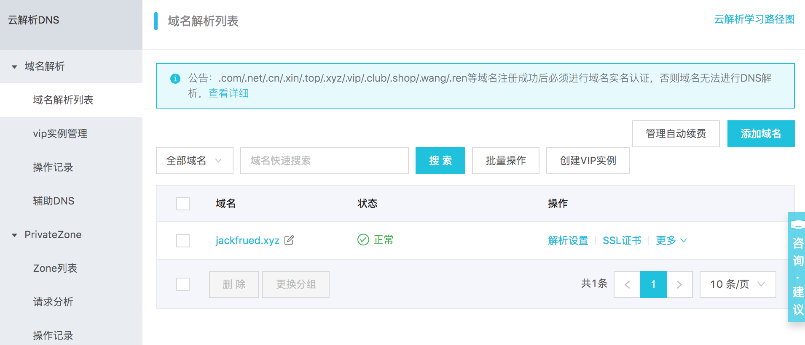

## 項目部署上線指南

### 準備上線

1. 上線前的檢查工作。

   ```Shell
   python manage.py check --deploy
   ```

2. 將DEBUG設置為False並配置ALLOWED_HOSTS。

   ```Python
   DEBUG = False
   ALLOWED_HOSTS = ['*']
   ```

3. 安全相關的配置。

   ```Python
   # 保持HTTPS連接的時間
   SECURE_HSTS_SECONDS = 3600
   SECURE_HSTS_INCLUDE_SUBDOMAINS = True
   SECURE_HSTS_PRELOAD = True
   
   # 自動重定向到安全連接
   SECURE_SSL_REDIRECT = True
   
   # 避免瀏覽器自作聰明推斷內容類型
   SECURE_CONTENT_TYPE_NOSNIFF = True
   
   # 避免跨站腳本攻擊
   SECURE_BROWSER_XSS_FILTER = True
   
   # COOKIE只能通過HTTPS進行傳輸
   SESSION_COOKIE_SECURE = True
   CSRF_COOKIE_SECURE = True
   
   # 防止點擊劫持攻擊手段 - 修改HTTP協議響應頭
   # 當前網站是不允許使用<iframe>標籤進行加載的
   X_FRAME_OPTIONS = 'DENY'
   ```

4. 敏感信息放到環境變量或文件中。

   ```Python
   SECRET_KEY = os.environ['SECRET_KEY']
   
   DB_USER = os.environ['DB_USER']
   DB_PASS = os.environ['DB_PASS']
   
   REDIS_AUTH = os.environ['REDIS_AUTH']
   ```

### 更新服務器Python環境到3.x

> 說明：如果需要清除之前的安裝，就刪除對應的文件和文件夾即可

1. 安裝底層依賴庫。

   ```Shell
   yum -y install zlib-devel bzip2-devel openssl-devel ncurses-devel sqlite-devel readline-devel tk-devel gdbm-devel libdb4-devel libpcap-devel xz-devel libffi-devel
   ```

2. 下載Python源代碼。

   ```Shell
   wget https://www.python.org/ftp/python/3.7.1/Python-3.7.1.tar.xz
   ```

3. 解壓縮和解歸檔。

   ```Shell
   xz -d Python-3.7.1.tar.xz
   tar -xvf Python-3.7.1.tar
   ```

4. 執行配置生成Makefile（構建文件）。

   ```Shell
   cd Python-3.7.1
   ./configure --prefix=/usr/local/python37 --enable-optimizations
   ```

5. 構建和安裝。

   ```Shell
   make && make install
   ```

6. 配置PATH環境變量（用戶或系統環境變量）並激活。

   ```Shell
   vim ~/.bash_profile
   vim /etc/profile
   ```

   ```INI
   ... 此處省略上面的代碼...
   
   export PATH=$PATH:/usr/local/python37/bin
   
   ... 此處省略下面的代碼...
   ```

    ```Shell
   source ~/.bash_profile
   source /etc/profile
    ```

7. 註冊軟鏈接（符號鏈接）- 這一步不是必須的，但通常會比較有用。

   ```Shell
   ln -s /usr/local/python37/bin/python3 /usr/bin/python3
   ```

8. 測試Python環境是否更新成功（安裝Python 3一定不能破壞原來的Python 2）。

   ```Shell
   python3 --version
   python --version
   ```

### 項目目錄結構

假設項目文件夾為`project`，下面的五個子目錄分別是：`code`、`conf`、`logs`、`stat`和`venv`分別用來保存項目的代碼、配置文件、日誌文件、靜態資源和虛擬環境。其中，`conf`目錄下的子目錄`cert`中保存了配置HTTPS需要使用的證書和密鑰；`code`目錄下的項目代碼可以通過版本控制工具從代碼倉庫中檢出；虛擬環境可以通過工具（如：venv、virtualenv、pyenv等）進行創建。

```
project
├── code
│   └── fangtx
│       ├── api
│       ├── common
│       ├── fangtx
│       ├── forum
│       ├── rent
│       ├── user
│       ├── manage.py
│       ├── README.md
│       ├── static
│       └── templates
├── conf
│   ├── cert
│   │   ├── 214915882850706.key
│   │   └── 214915882850706.pem
│   ├── nginx.conf
│   └── uwsgi.ini
├── logs
│   ├── access.log
│   ├── error.log
│   └── uwsgi.log
├── stat
│   └── css
│   └── images
│   └── js
└── venv
    ├── bin
    │   ├── activate
    │   ├── activate.csh
    │   ├── activate.fish
    │   ├── celery
    │   ├── celerybeat
    │   ├── celeryd
    │   ├── celeryd-multi
    │   ├── coverage
    │   ├── coverage3
    │   ├── coverage-3.7
    │   ├── django-admin
    │   ├── django-admin.py
    │   ├── easy_install
    │   ├── easy_install-3.7
    │   ├── pip
    │   ├── pip3
    │   ├── pip3.7
    │   ├── __pycache__
    │   ├── pyrsa-decrypt
    │   ├── pyrsa-decrypt-bigfile
    │   ├── pyrsa-encrypt
    │   ├── pyrsa-encrypt-bigfile
    │   ├── pyrsa-keygen
    │   ├── pyrsa-priv2pub
    │   ├── pyrsa-sign
    │   ├── pyrsa-verify
    │   ├── python -> python3
    │   ├── python3 -> /usr/bin/python3
    │   └── uwsgi
    ├── include
    ├── lib
    │   └── python3.7
    ├── lib64 -> lib
    ├── pip-selfcheck.json
    └── pyvenv.cfg
```

下面以阿里云為例，簡單說明如何為項目註冊域名、解析域名以及購買權威機構頒發的證書。

1. [註冊域名](https://wanwang.aliyun.com/domain/)。

   

2. [域名備案](https://beian.aliyun.com/)。

   

3. [域名解析](https://dns.console.aliyun.com/#/dns/domainList)。

   

   

4. [購買證書](https://www.aliyun.com/product/cas)。

   

可以使用類似於sftp的工具將證書上傳到`conf/cert`目錄，然後使用git克隆項目代碼到`code`目錄。

```Shell
cd code
git clone <url>
```

回到項目目錄，創建並激活虛擬環境。

```Shell
python3 -m venv venv
source venv/bin/activate
```

重建項目依賴項。

```Shell
pip install -r code/teamproject/requirements.txt
```

### uWSGI的配置

1. 安裝uWSGI。

   ```Shell
   pip install uwsgi
   ```

2. 修改uWSGI的配置文件（`/root/project/conf/uwsgi.ini`）。

   ```INI
   [uwsgi]
   # 配置前導路徑
   base=/root/project
   # 配置項目名稱
   name=teamproject
   # 守護進程
   master=true
   # 進程個數
   processes=4
   # 虛擬環境
   pythonhome=%(base)/venv
   # 項目地址
   chdir=%(base)/code/%(name)
   # 指定python解釋器
   pythonpath=%(pythonhome)/bin/python
   # 指定uwsgi文件
   module=%(name).wsgi
   # 通信的地址和端口(自己服務器的IP地址和端口)
   socket=172.18.61.250:8000
   # 日誌文件地址
   logto=%(base)/logs/uwsgi.log
   ```

   > 說明：可以先將“通信的地址和端口”項等號前面改為http來進行測試，如果沒有問題再改回    成socket，然後通過Nginx來實現項目的“動靜分離”（靜態資源交給Nginx處理，動態內容交給    uWSGI處理）。按照下面的方式可以啟動uWSGI服務器。

5. 啟動服務器。

   ```Shell
   uwsgi --ini conf/uwsgi.ini
   ```

### Nginx的配置

1. 安裝Nginx。

    ```Shell
    yum -y install nginx
    ```

2. 修改全局配置文件（`/etc/nginx/nginx.conf`）。

    ```Nginx
    # 配置用戶
    user root;
    # 工作進程數(建議跟CPU的核數量一致)
    worker_processes auto;
    # 錯誤日誌
    error_log /var/log/nginx/error.log;
    # 進程文件
    pid /run/nginx.pid;
    # 包含其他的配置
    include /usr/share/nginx/modules/*.conf;
    # 工作模式(多路IO複用方式)和連接上限
    events {
        use epoll;
        worker_connections 1024;
    }
    # HTTP服務器相關配置
    http {
        # 日誌格式
        log_format  main  '$remote_addr - $remote_user [$time_local] "$request" '
                          '$status $body_bytes_sent "$http_referer" '
                          '"$http_user_agent" "$http_x_forwarded_for"';
        # 訪問日誌
        access_log  /var/log/nginx/access.log  main;
        # 開啟高效文件傳輸模式
        sendfile            on;
        # 用sendfile傳輸文件時有利於改善性能
        tcp_nopush          on;
        # 禁用Nagle來解決交互性問題
        tcp_nodelay         on;
        # 客戶端保持連接時間
        keepalive_timeout   30;
        types_hash_max_size 2048;
        # 包含MIME類型的配置
        include             /etc/nginx/mime.types;
        # 默認使用二進制流格式
        default_type        application/octet-stream;
        # 包含其他配置文件
        include /etc/nginx/conf.d/*.conf;
        # 包含項目的Nginx配置文件
        include /root/project/conf/*.conf;
    }
    ```

3. 編輯局部配置文件（`/root/project/conf/nginx.conf`）。

    ```Nginx
    server {
        listen      80;
        server_name _;
        access_log /root/project/logs/access.log;
        error_log /root/project/logs/error.log;
        location / {
            include uwsgi_params;
            uwsgi_pass 172.18.61.250:8000;
        }
        location /static/ {
            alias /root/project/stat/;
            expires 30d;
        }
    }
    server {
        listen      443;
        server_name _;
        ssl         on;
        access_log /root/project/logs/access.log;
        error_log /root/project/logs/error.log;
        ssl_certificate     /root/project/conf/cert/214915882850706.pem;
        ssl_certificate_key /root/project/conf/cert/214915882850706.key;
        ssl_session_timeout 5m;
        ssl_ciphers ECDHE-RSA-AES128-GCM-SHA256:ECDHE:ECDH:AES:HIGH:!NULL:!aNULL:!MD5:!ADH:!RC4;
        ssl_protocols TLSv1 TLSv1.1 TLSv1.2;
        ssl_prefer_server_ciphers on;
        location / {
            include uwsgi_params;
            uwsgi_pass 172.18.61.250:8000;
        }
        location /static/ {
            alias /root/project/static/;
            expires 30d;
        }
    }
    ```

    到此為止，我們可以啟動Nginx來訪問我們的應用程序，HTTP和HTTPS都是沒有問題的，如果Nginx已經運行，在修改配置文件後，我們可以用下面的命令重新啟動Nginx。

4. 重啟Nginx服務器。

    ```Shell
    nginx -s reload
    ```

    或

    ```Shell
    systemctl restart nginx
    ```

> 說明：可以對Django項目使用`python manage.py collectstatic`命令將靜態資源收集到指定目錄下，要做到這點只需要在項目的配置文件`settings.py`中添加`STATIC_ROOT`配置即可。

#### 負載均衡配置

下面的配置中我們使用Nginx實現負載均衡，為另外的三個Nginx服務器（通過Docker創建）提供反向代理服務。

```Shell
docker run -d -p 801:80 --name nginx1 nginx:latest
docker run -d -p 802:80 --name nginx2 nginx:latest
docker run -d -p 803:80 --name nginx3 nginx:latest
```

```Nginx
user root;
worker_processes auto;
error_log /var/log/nginx/error.log;
pid /run/nginx.pid;

include /usr/share/nginx/modules/*.conf;

events {
    worker_connections 1024;
}

# 為HTTP服務配置負載均衡
http {   
	upstream fangtx {
		server 172.18.61.250:801 weight=4;
		server 172.18.61.250:802 weight=2;
		server 172.18.61.250:803 weight=2;
    }

	server {
		listen       80 default_server;
		listen       [::]:80 default_server;
		listen       443 ssl;
		listen       [::]:443 ssl;

        ssl on;
		access_log /root/project/logs/access.log;
		error_log /root/project/logs/error.log;
		ssl_certificate /root/project/conf/cert/214915882850706.pem;
		ssl_certificate_key /root/project/conf/cert/214915882850706.key;
		ssl_session_timeout 5m;
		ssl_ciphers ECDHE-RSA-AES128-GCM-SHA256:ECDHE:ECDH:AES:HIGH:!NULL:!aNULL:!MD5:!ADH:!RC4;
		ssl_protocols TLSv1 TLSv1.1 TLSv1.2;
		ssl_prefer_server_ciphers on;

		location / {
			proxy_set_header Host $host;
			proxy_set_header X-Real-IP $remote_addr;
			proxy_set_header X-Forwarded-For $proxy_add_x_forwarded_for;
			proxy_buffering off;
			proxy_pass http://fangtx;
		}
	}
}
```

> 說明：Nginx在配置負載均衡時，默認使用WRR（加權輪詢算法），除此之外還支持ip_hash、fair（需要安裝upstream_fair模塊）和url_hash算法。此外，在配置upstream模塊時可以指定服務器的狀態值，包括：backup（備份機器，其他服務器不可用時才將請求分配到該機器）、down、fail_timeout（請求失敗達到max_fails後的暫停服務時間）、max_fails（允許請求失敗的次數）和weight（輪詢的權重）。

### Keepalived

當使用Nginx進行負載均衡配置時，要考慮負載均衡服務器宕機的情況。為此可以使用Keepalived來實現負載均衡主機和備機的熱切換，從而保證系統的高可用性。Keepalived的配置還是比較複雜，通常由專門做運維的人進行配置，一個基本的配置可以參照[《Keepalived的配置和使用》](https://www.jianshu.com/p/dd93bc6d45f5)。

### MySQL主從複製

下面還是基於Docker來演示如何配置MySQL主從複製。我們事先準備好MySQL的配置文件以及保存MySQL數據和運行日誌的目錄，然後通過Docker的數據卷映射來指定容器的配置、數據和日誌文件的位置。

```Shell
root
└── mysql
    ├── master
    │   ├── conf
    |	└── data
    └── slave-1
    |	├── conf
    |	└── data
    └── slave-2
    |	├── conf
    |	└── data
    └── slave-3
    	├── conf
    	└── data
```

1. MySQL的配置文件（master和slave的配置文件需要不同的server-id）。
   ```
   [mysqld]
   pid-file=/var/run/mysqld/mysqld.pid
   socket=/var/run/mysqld/mysqld.sock
   datadir=/var/lib/mysql
   log-error=/var/log/mysql/error.log
   server-id=1
   log-bin=/var/log/mysql/mysql-bin.log
   expire_logs_days=30
   max_binlog_size=256M
   symbolic-links=0
   # slow_query_log=ON
   # slow_query_log_file=/var/log/mysql/slow.log
   # long_query_time=1
   ```

2. 創建和配置master。

   ```Shell
   docker run -d -p 3306:3306 --name mysql-master \
   -v /root/mysql/master/conf:/etc/mysql/mysql.conf.d \
   -v /root/mysql/master/data:/var/lib/mysql \
   -e MYSQL_ROOT_PASSWORD=123456 mysql:5.7
   
   docker exec -it mysql-master /bin/bash
   ```

   ```Shell
   mysql -u root -p
   Enter password:
   Welcome to the MySQL monitor.  Commands end with ; or \g.
   Your MySQL connection id is 1
   Server version: 5.7.23-log MySQL Community Server (GPL)
   Copyright (c) 2000, 2018, Oracle and/or its affiliates. All rights reserved.
   Oracle is a registered trademark of Oracle Corporation and/or its
   affiliates. Other names may be trademarks of their respective
   owners.
   Type 'help;' or '\h' for help. Type '\c' to clear the current input statement.
   
   mysql> grant replication slave on *.* to 'slave'@'%' identified by 'iamslave';
   Query OK, 0 rows affected, 1 warning (0.00 sec)
   
   mysql> flush privileges;
   Query OK, 0 rows affected (0.00 sec)
   
   mysql> show master status;
   +------------------+----------+--------------+------------------+-------------------+
   | File             | Position | Binlog_Do_DB | Binlog_Ignore_DB | Executed_Gtid_Set |
   +------------------+----------+--------------+------------------+-------------------+
   | mysql-bin.000003 |      590 |              |                  |                   |
   +------------------+----------+--------------+------------------+-------------------+
   1 row in set (0.00 sec)
   
   mysql> quit
   Bye
   exit
   ```

   上面創建Docker容器時使用的`-v`參數（`--volume`）表示映射數據卷，冒號前是宿主機的目錄，冒號後是容器中的目錄，這樣相當於將宿主機中的目錄掛載到了容器中。

3. 創建和配置slave。

   ```Shell
   docker run -d -p 3308:3306 --name mysql-slave-1 \
   -v /root/mysql/slave-1/conf:/etc/mysql/mysql.conf.d \
   -v /root/mysql/slave-1/data:/var/lib/mysql \
   -e MYSQL_ROOT_PASSWORD=123456 \
   --link mysql-master:mysql-master mysql:5.7
   
   docker run -d -p 3309:3306 --name mysql-slave-2 \
   -v /root/mysql/slave-2/conf:/etc/mysql/mysql.conf.d \
   -v /root/mysql/slave-2/data:/var/lib/mysql \
   -e MYSQL_ROOT_PASSWORD=123456 \
   --link mysql-master:mysql-master mysql:5.7
   
   docker run -d -p 3310:3306 --name mysql-slave-3 \
   -v /root/mysql/slave-3/conf:/etc/mysql/mysql.conf.d \
   -v /root/mysql/slave-3/data:/var/lib/mysql \
   -e MYSQL_ROOT_PASSWORD=123456 \
   --link mysql-master:mysql-master mysql:5.7
   
   docker exec -it mysql-slave-1 /bin/bash
   ```

   ```Shell
   mysql -u root -p
   Enter password:
   Welcome to the MySQL monitor.  Commands end with ; or \g.
   Your MySQL connection id is 2
   Server version: 5.7.23-log MySQL Community Server (GPL)
   Copyright (c) 2000, 2018, Oracle and/or its affiliates. All rights reserved.
   Oracle is a registered trademark of Oracle Corporation and/or its
   affiliates. Other names may be trademarks of their respective
   owners.
   Type 'help;' or '\h' for help. Type '\c' to clear the current input statement.
   
   mysql> reset slave;
   Query OK, 0 rows affected (0.02 sec)
   
   mysql> change master to master_host='mysql-master', master_user='slave', master_password='iamslave', master_log_file='mysql-bin.000003', master_log_pos=590;
   Query OK, 0 rows affected, 2 warnings (0.03 sec)
   
   mysql> start slave;
   Query OK, 0 rows affected (0.01 sec)
   
   mysql> show slave status\G
   *************************** 1. row ***************************
                  Slave_IO_State: Waiting for master to send event
                     Master_Host: mysql57
                     Master_User: slave
                     Master_Port: 3306
                   Connect_Retry: 60
                 Master_Log_File: mysql-bin.000001
             Read_Master_Log_Pos: 590
                  Relay_Log_File: f352f05eb9d0-relay-bin.000002
                   Relay_Log_Pos: 320
           Relay_Master_Log_File: mysql-bin.000001
                Slave_IO_Running: Yes
               Slave_SQL_Running: Yes
                Replicate_Do_DB:
             Replicate_Ignore_DB:
              Replicate_Do_Table:
          Replicate_Ignore_Table:
         Replicate_Wild_Do_Table:
     Replicate_Wild_Ignore_Table:
                      Last_Errno: 0
                      Last_Error:
                    Skip_Counter: 0
             Exec_Master_Log_Pos: 590
                 Relay_Log_Space: 534
                 Until_Condition: None
                  Until_Log_File:
                   Until_Log_Pos: 0
              Master_SSL_Allowed: No
              Master_SSL_CA_File:
              Master_SSL_CA_Path:
                 Master_SSL_Cert:
               Master_SSL_Cipher:
                  Master_SSL_Key:
           Seconds_Behind_Master: 0
   Master_SSL_Verify_Server_Cert: No
                   Last_IO_Errno: 0
                   Last_IO_Error:
                  Last_SQL_Errno: 0
                  Last_SQL_Error:
     Replicate_Ignore_Server_Ids:
                Master_Server_Id: 1
                     Master_UUID: 30c38043-ada1-11e8-8fa1-0242ac110002
                Master_Info_File: /var/lib/mysql/master.info
                       SQL_Delay: 0
             SQL_Remaining_Delay: NULL
         Slave_SQL_Running_State: Slave has read all relay log; waiting for more updates
              Master_Retry_Count: 86400
                     Master_Bind:
         Last_IO_Error_Timestamp:
        Last_SQL_Error_Timestamp:
                  Master_SSL_Crl:
              Master_SSL_Crlpath:
              Retrieved_Gtid_Set:
               Executed_Gtid_Set:
                   Auto_Position: 0
            Replicate_Rewrite_DB:
                    Channel_Name:
              Master_TLS_Version:
   1 row in set (0.00 sec)
   
   mysql> quit
   Bye
   exit
   ```

   接下來可以如法炮製配置出slave2和slave3，這樣就可以搭建起一個“一主帶三從”的主從複製環境。上面創建創建容器時使用的`--link`參數用來配置容器在網絡上的主機名（網絡地址別名）。

配置好主從複製後，寫數據的操作應該master上執行，而讀數據的操作應該在slave上完成。為此，在Django項目中需要配置DATABASE_ROUTERS並通過自定義的主從複製路由類來實現讀寫分離操作，如下所示：

```Python
DATABASE_ROUTERS = [
    # 此處省略其他配置
    'common.routers.MasterSlaveRouter',
]
```

```Python
class MasterSlaveRouter(object):
    """主從複製路由"""

    @staticmethod
    def db_for_read(model, **hints):
        """
        Attempts to read auth models go to auth_db.
        """
        return random.choice(('slave1', 'slave2', 'slave3'))

    @staticmethod
    def db_for_write(model, **hints):
        """
        Attempts to write auth models go to auth_db.
        """
        return 'default'

    @staticmethod
    def allow_relation(obj1, obj2, **hints):
        """
        Allow relations if a model in the auth app is involved.
        """
        return None

    @staticmethod
    def allow_migrate(db, app_label, model_name=None, **hints):
        """
        Make sure the auth app only appears in the 'auth_db'
        database.
        """
        return True
```

上面的內容參考了Django官方文檔的[DATABASE_ROUTERS配置](https://docs.djangoproject.com/en/2.1/topics/db/multi-db/#topics-db-multi-db-routing)，對代碼進行了適當的調整。

### Docker

事實上，項目上線中最為麻煩的事情就是配置軟件運行環境，環境的差異會給軟件的安裝和部署帶來諸多的麻煩，而Docker正好可以解決這個問題。關於Docker在之前的文檔中我們已經介紹過了，接下來我們對Docker的知識做一些必要的補充。

1. 創建鏡像文件。

   將容器保存成鏡像：

   ```Shell
   docker commit -m "..." -a "jackfrued" <container-name> jackfrued/<image-name>
   ```

   使用Dockerfile構建鏡像：

   ```Dockerfile
   # 指定基礎鏡像文件
   FROM centos:latest
   
   # 指定維護者信息
   MAINTAINER jackfrued
   
   # 執行命令
   RUN yum -y install gcc
   RUN cd ~
   RUN mkdir -p project/code
   RUN mkdir -p project/logs
   
   # 拷貝文件
   COPY ...
   
   # 暴露端口
   EXPOSE ...
   
   # 在容器啟動時執行命令
   CMD ~/init.sh
   ```

   ```Shell
   docker build -t jackfrued/<image-name> .
   ```

2. 鏡像的導入和導出。

   ```Shell
   docker save -o <file-name>.tar <image-name>:<version>
   docker load -i <file-name>.tar
   ```

3. 推送到DockerHub服務器。

   ```Shell
   docker tag <image-name>:<version> jackfrued/<name>
   docker login
   docker push jackfrued/<name>
   ```

4. 容器之間的通信。

   ```Shell
   docker run --link <container-name>:<alias-name>
   ```


如果我們能夠在Docker中完成項目的部署，並且將整個部署好的容器打包成鏡像文件進行分發和安裝，這樣就可以解決項目在多個節點上進行部署時可能遇到的麻煩，而且整個部署可以在很短的時間內完成。

### Supervisor

[Supervisor](https://github.com/Supervisor/supervisor)是一個用Python寫的進程管理工具，可以很方便的用來在類Unix系統下啟動、重啟（自動重啟程序）和關閉進程，目前Supervisor暫時還沒有提供對Python 3的支持，可以通過Python 2來安裝和運行Supervisor，再通過Supervisor來管理Python 3的程序。

1. 安裝Supervisor。

   ```Shell
   pip install virtualenv
   virtualenv -p /usr/bin/python venv
   source venv/bin/activate
   pip install supervisor
   ```

2. 查看Supervisor的配置文件。

    ```Shell
    vim /etc/supervisord.conf
    ```

    ```INI
    ; 此處省略上面的代碼
    ; The [include] section can just contain the "files" setting.  This
    ; setting can list multiple files (separated by whitespace or
    ; newlines).  It can also contain wildcards.  The filenames are
    ; interpreted as relative to this file.  Included files *cannot*
    ; include files themselves.
    [include]
    files = supervisord.d/*.ini
    ```

    可以看出自定義的管理配置代碼可以放在`/etc/supervisord.d`目錄中，並且文件名以`ini`作為後綴即可。

3. 編寫自己的配置文件`fangtx.ini`並放在`/etc/supervisord.d`目錄中。

   ```INI
   [program:project]
   command=uwsgi --ini /root/project/conf/uwsgi.ini
   stopsignal=QUIT
   autostart=true
   autorestart=true
   redirect_stderr=true
   
   [program:celery]
   ; Set full path to celery program if using virtualenv
   command=/root/project/venv/bin/python manage.py celery -A fangtx worker
   user=root
   numprocs=1
   stdout_logfile=/var/log/supervisor/celery.log
   stderr_logfile=/var/log/supervisor/celery_error.log
   autostart=true
   autorestart=true
   startsecs=10
   
   ; Need to wait for currently executing tasks to finish at shutdown.
   ; Increase this if you have very long running tasks.
   ;stopwaitsecs = 600
   
   ; When resorting to send SIGKILL to the program to terminate it
   ; send SIGKILL to its whole process group instead,
   ; taking care of its children as well.
   killasgroup=true
   ; Set Celery priority higher than default (999)
   ; so, if rabbitmq is supervised, it will start first.
   priority=1000
   ```

4. 啟動Supervisor。

   ```Shell
   supervisorctl -c /etc/supervisord.conf
   ```


### 其他服務

1. 常用開源軟件。

   | 功能                | 開源方案                  |
   | ------------------- | ------------------------- |
   | 版本控制工具        | Git、Mercurial、SVN       |
   | 缺陷管理            | Redmine、Mantis           |
   | 負載均衡            | Nginx、LVS、HAProxy       |
   | 郵件服務            | Postfix、Sendmail         |
   | HTTP服務            | Nginx、Apache             |
   | 消息隊列            | RabbitMQ、ZeroMQ、Redis   |
   | 文件系統            | FastDFS                   |
   | 基於位置服務（LBS） | MongoDB、Redis            |
   | 監控服務            | Nagios、Zabbix            |
   | 關係型數據庫        | MySQL、PostgreSQL         |
   | 非關係型數據庫      | MongoDB、Redis、Cassandra |
   | 搜索引擎            | ElasticSearch、Solr       |
   | 緩存服務            | Mamcached、Redis          |

2. 常用雲服務。

   | 功能           | 可用的雲服務                            |
   | -------------- | --------------------------------------- |
   | 團隊協作工具   | Teambition、釘釘                        |
   | 代碼託管平臺   | Github、Gitee、CODING                   |
   | 郵件服務       | SendCloud                               |
   | 雲存儲（CDN）  | 七牛、OSS、LeanCloud、Bmob、又拍雲、AWS |
   | 移動端推送     | 極光、友盟、百度                        |
   | 即時通信       | 環信、融雲                              |
   | 短信服務       | 雲片、極光、Luosimao、又拍雲            |
   | 第三方登錄     | 友盟、ShareSDK                          |
   | 網站監控和統計 | 阿里雲監控、監控寶、百度雲觀測、小鳥雲  |

