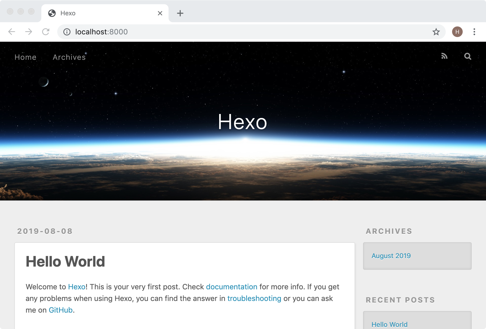
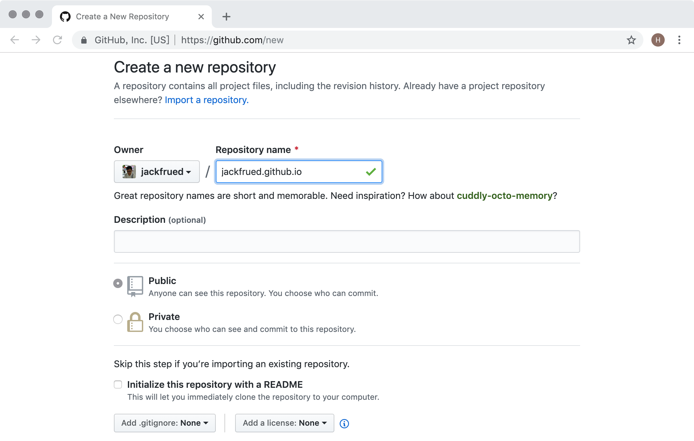
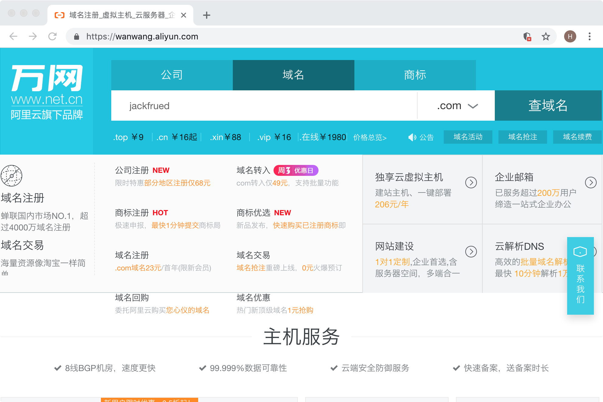
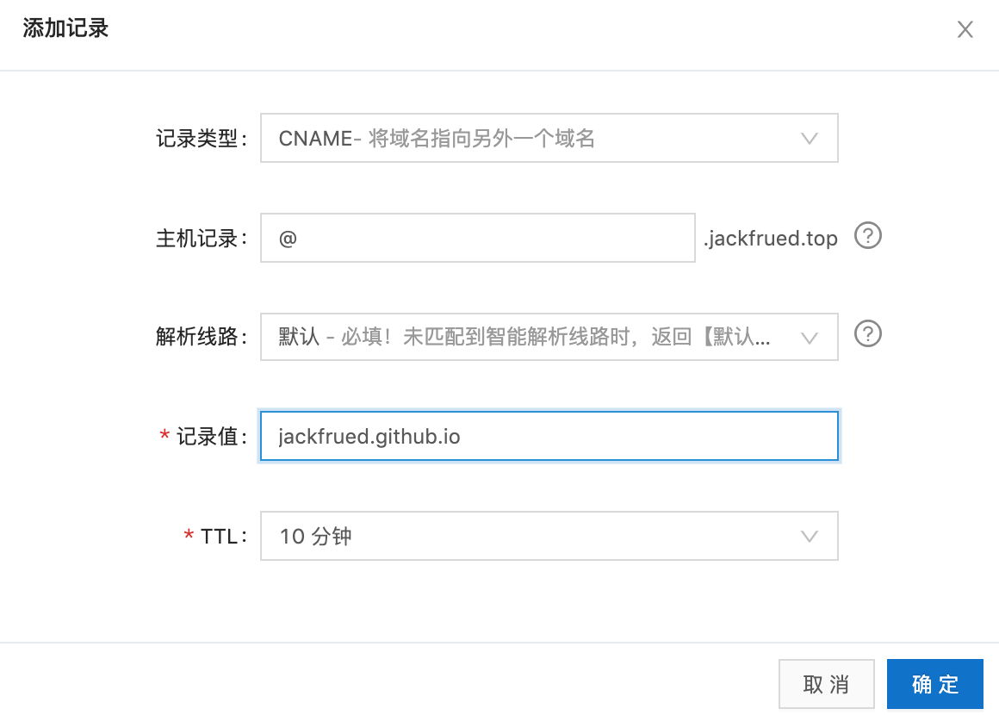

## 使用Hexo搭建自己的博客

對於一個程序員來說，搭建一個屬於自己的博客平臺是非常有意義的事情。首先，博客可以記錄自己的成長曆程，也是對自己一段時間學習和工作的總結和沉澱；其他，通過博客可以營銷自己，增強自己在互聯網或行業內的影響力，為將來更好的職業生涯打一個堅實的基礎。前幾年有一本名為《軟技能 - 代碼之外的生存指南》的暢銷書，我記得書中有這麼一段話：“流行樂隊的音樂才華可能並不比夜店駐場樂隊高多少，他們為什麼就可以在全世界巡迴演出，創造一個又一個白金記錄？……你的營銷做得越好，你的才華才能表現得淋漓盡致。”

這裡順便囉嗦兩句，在互聯網如此發達的今天，我們應該如何營銷自己呢？自我營銷首先要從打造個人品牌做起，對於程序員來說，最容易去做好的一件事情還是搭建自己的博客。博客相當於是你在互聯網上的一個基地，尤其是當你擁有了屬於自己的獨立博客後，你可以做很多自己想做的事情，既可以傳達自己的思想，又可以提升自己的影響力，當然如果你的博客經營得非常好，你可以從中獲利。當然，除了博客，直播、視頻網站、投稿、寫書、技術活動都是可選的自我營銷方式。當然，做自我營銷也需要持之以恆，三天打魚兩天晒網是很難有什麼收穫的。

### Hexo概述

Hexo是一個快速、簡潔且高效的博客框架，它能夠將[Markdown格式](<https://zh.wikipedia.org/zh-hans/Markdown>)的文檔渲染成漂亮的網頁，這樣我們就可以在很短的時間內迅速的創建出網站的靜態內容，而Markdown格式對程序員來說相信並不陌生。要想使用Hexo來搭建自己的博客，我實在想不出有什麼教程比[官方文檔](<https://hexo.io/zh-cn/>)更好，強烈建議大家閱讀官方文檔來了解Hexo，下面我只做一個簡要的使用說明。

> 說明：**Markdown**是一種輕量級標記語言，它允許人們使用易讀易寫的純文本格式編寫文檔，同時也對圖片、圖表、數學公式提供了支持，可以用來書寫電子書、軟件文檔等，同時也可以非常方便的轉換為HTML頁面或者是PDF文檔。

要使用Hexo，首先得確保計算機上已經安裝了[node.js](<https://nodejs.org/en/>)環境和[git](<https://git-scm.com/>)環境，前者是一個能夠在服務器端運行JavaScript代碼的環境，後者是版本控制工具。如果沒有安裝node.js和git的經驗，建議參考官方文檔上的講解或者是我寫的[《Git上手指南》](./Git上手指南.md)，安裝完成後，我們可以通過下面的命令來確認node.js環境以及它的包管理工具是否安裝成功。

```Shell
node --version
npm --version
```

可以通過下面的命令來檢查是否安裝了git環境。

```Shell
git --version
```

我們可以使用npm來安裝Hexo，npm是node.js的包管理工具，跟Python的pip工具作用一樣，可以用它來安裝依賴庫和三方工具。在第一次使用npm的時候，我們可以先將npm的下載源更換為國內的淘寶鏡像，這樣下載的速度會有非常顯著的提升。

```Shell
npm config set registry https://registry.npm.taobao.org
```

接下來我們就通過npm來安裝Hexo，命令如下所示。

```Shell
npm install -g hexo-cli
```

安裝成功後，就可以使用Hexo來創建屬於自己的博客啦。

### 搭建博客

> 說明：以下內容基本上來自於Hexo的官方文檔，推薦大家閱讀官方文檔。

我們先通過下面的命令來創建一個專門保存博客項目的文件夾，該命令會從github上克隆博客項目和默認的主題。

```Shell
hexo init blog
```

接下來我們進入這個文件夾並查看目錄結構。

```Shell
cd blog
ls -lR
```

```
total 232
-rw-r--r--    1 Hao  staff    1768  8  8 01:15 _config.yml
drwxr-xr-x  274 Hao  staff    8768  8  8 01:19 node_modules
-rw-r--r--    1 Hao  staff  109972  8  8 01:19 package-lock.json
-rw-r--r--    1 Hao  staff     443  8  8 01:15 package.json
drwxr-xr-x    5 Hao  staff     160  8  8 01:15 scaffolds
drwxr-xr-x    3 Hao  staff      96  8  8 01:15 source
drwxr-xr-x    3 Hao  staff      96  8  8 01:15 themes
```

> 說明：Windows環境命令行提示符中可以使用dir命令查看目錄結構。需要說明的是：`_config.yml`是博客項目的配置文件；`package.json`是項目的依賴項文件；`scaffolds`保存了Markdown文件的模板，也就是向新添加的Markdown文件中默認填充的內容；`source`目錄下有一個名為`_post`的目錄，我們稍後可以將編寫好的Markdown文件放到該目錄，這樣就可以利用Hexo將Markdown文件處理成博客的靜態頁面，生成的靜態頁面將置於`public`目錄下；`themes`文件夾保存了博客使用的主題。

然後我們通過下面的命令來安裝項目所需的依賴項（`package.json`文件指明瞭這些依賴項）。

```Shell
npm install
```

做完上述的操作以後，我們已經可以直接通過下面的命令來生成博客。

```Shell
hexo generate
```

該命令也可以縮寫為：

```Shell
hexo g
```

之前我們在安裝依賴項的時候包括了一個名為`hexo-server`的依賴項，該依賴項可以幫助我們啟動一個基於node.js的服務器來運行我們的博客項目，使用下面的命令即可啟動服務器。

```Shell
hexo server
```

該命令也可以縮寫為：

```Shell
hexo s
```

```
INFO  Start processing
INFO  Hexo is running at http://localhost:4000 . Press Ctrl+C to stop.
```

從運行命令的提示信息可以看到，服務器已經運轉起並使用了4000端口，可以通過`Ctrl+C`來終止服務器的運行。如果要修改服務器使用的端口，可以在啟動服務器的時候加上`-p`參數；如果希望服務器啟動後，自動打開默認的瀏覽器訪問服務器，可以使用`-o`參數，如下所示。

```Shell
hexo s -p 8000 -o
```

至此，我們已經可以看到Hexo在沒有配置也沒有加入自己的Markdown文件下生成的首頁，如下圖所示。



接下來我們修改博客的配置文件。

```Shell
vim _config.yml
```

```YAML
# Hexo Configuration
## Docs: https://hexo.io/docs/configuration.html
## Source: https://github.com/hexojs/hexo/

# Site
title: 駱昊的技術專欄
subtitle: 傳道、授業、解惑，分享知識帶來的快樂
description:
keywords:
author: 駱昊
language: zh
timezone:

# URL
## If your site is put in a subdirectory, set url as 'http://yoursite.com/child' and root as '/child/'
url: http://jackfrued.top
root: /
permalink: :year/:month/:day/:title/
permalink_defaults:

# Directory
source_dir: source
public_dir: public
tag_dir: tags
archive_dir: archives
category_dir: categories
code_dir: downloads/code
i18n_dir: :lang
skip_render:

# Writing
new_post_name: :title.md # File name of new posts
default_layout: post
titlecase: false # Transform title into titlecase
external_link: true # Open external links in new tab
filename_case: 0
render_drafts: false
post_asset_folder: false
relative_link: false
future: true
highlight:
  enable: true
  line_number: true
  auto_detect: false
  tab_replace:
  
# Home page setting
# path: Root path for your blogs index page. (default = '')
# per_page: Posts displayed per page. (0 = disable pagination)
# order_by: Posts order. (Order by date descending by default)
index_generator:
  path: ''
  per_page: 10
  order_by: -date
  
# Category & Tag
default_category: uncategorized
category_map:
tag_map:

# Date / Time format
## Hexo uses Moment.js to parse and display date
## You can customize the date format as defined in
## http://momentjs.com/docs/#/displaying/format/
date_format: YYYY-MM-DD
time_format: HH:mm:ss

# Pagination
## Set per_page to 0 to disable pagination
per_page: 10
pagination_dir: page

# Extensions
## Plugins: https://hexo.io/plugins/
## Themes: https://hexo.io/themes/
theme: landscape

# Deployment
## Docs: https://hexo.io/docs/deployment.html
deploy:
  type:
```

下面是YAML文件中相關選項的說明。

| 參數               | 描述                                                         |
| ------------------ | ------------------------------------------------------------ |
| `title`            | 網站的標題                                                   |
| `subtitle`         | 網站的副標題                                                 |
| `description`      | 網站的描述                                                   |
| `keywords`         | 網站的關鍵詞，可以用逗號分隔多個關鍵詞                       |
| `author`           | 自己的名字                                                   |
| `language`         | 網站使用的語言                                               |
| `timezone`         | 網站使用時區，默認使用電腦上設置的時區                       |
| `url`              | 網址                                                         |
| `root`             | 網站根目錄                                                   |
| `source_dir`       | 資源文件夾，這個文件夾用來存放內容，默認source目錄           |
| `public_dir`       | 公共文件夾，這個文件夾用於存放生成的站點文件，默認public目錄 |
| `tag_dir`          | 標籤文件夾，默認tags目錄                                     |
| `archive_dir`      | 歸檔文件夾，默認archives目錄                                 |
| `category_dir`     | 分類文件夾，默認categories目錄                               |
| `auto_spacing`     | 在中文和英文之間加入空格，默認false                          |
| `titlecase`        | 把標題轉換為首字母大寫，默認false                            |
| `external_link`    | 在新標籤中打開鏈接，默認true                                 |
| `relative_link`    | 把鏈接改為與根目錄的相對位址，默認false                      |
| `default_category` | 默認分類                                                     |
| `date_format`      | 日期格式，默認YYYY-MM-DD                                     |
| `time_format`      | 時間格式，默認HH:mm:ss                                       |
| `per_page`         | 每頁顯示的文章數量 ，默認值10，0表示不使用分頁               |
| `pagination_dir`   | 分頁目錄，默認為page目錄                                     |
| `theme`            | 當前主題名稱                                                 |
| `deploy`           | 部署部分的設置                                               |

我們將編寫好的Markdown文件可以拷貝到`source/_posts`目錄，我們可以在每個Markdown文件的上方添加Front-matter來對文件的佈局、標題、分類、標籤、發佈日期等信息加以說明。所謂Front-matter，就是每個Markdown文件最上方以`---`分隔的區域，可以在Front-matter中設置以下內容。

| 參數         | 描述                 | 默認值       |
| ------------ | -------------------- | ------------ |
| `layout`     | 佈局                 |              |
| `title`      | 標題                 |              |
| `date`       | 建立日期             | 文件建立日期 |
| `updated`    | 更新日期             | 文件更新日期 |
| `comments`   | 開啟文章的評論功能   | true         |
| `tags`       | 標籤（不適用於分頁） |              |
| `categories` | 分類（不適用於分頁） |              |
| `permalink`  | 覆蓋文章網址         |              |

例如：

```Markdown
---
title: Python編程慣例
category: Python基礎
date: 2019-8-1
---
## Python慣例

“慣例”這個詞指的是“習慣的做法，常規的辦法，一貫的做法”，與這個詞對應的英文單詞叫“idiom”。由於Python跟其他很多編程語言在語法和使用上還是有比較顯著的差別，因此作為一個Python開發者如果不能掌握這些慣例，就無法寫出“Pythonic”的代碼。下面我們總結了一些在Python開發中的慣用的代碼。

1. 讓代碼既可以被導入又可以被執行。

   ```Python
   if __name__ == '__main__':
   ```


2. 用下面的方式判斷邏輯“真”或“假”。

   ```Python
   if x:
   if not x:
   ```
```

在完成上述工作後，我們可以通過下面的命令先清理之前生成的內容。

```Shell
hexo clean
```

接下來我們就可以用之前講過的命令重新生成並運行博客項目。

```Shell
hexo generate
hexo server -p 8000 -o
```

### 將博客託管到GitHub

我們可以利用GitHub網站提供的[Pages服務](<https://pages.github.com/>)來託管我們的博客。在GitHub Pages的首頁上就有一個教程指導我們如何託管自己的網站，當然第一步得在GitHub上註冊一個屬於自己的賬號，登錄成功之後才能進行後續的操作。

1. 根據自己的用戶名創建一個倉庫，倉庫**一定**要取名為“用戶名.github.io”。例如：我在GitHub上的用戶名是jackfrued，那麼我的託管博客項目的倉庫一定要命名為jackfrued.github.io。

   

2. 修改博客項目的配置文件`_config.yml`，配置使用GitHub來部署該博客項目。

   ```Shell
   vim _config.yml
   ```

   ```YAML
   # 省略上面的內容
   # Deployment
   ## Docs: https://hexo.io/docs/deployment.html
   deploy:
     type: git
     repo: https://github.com/jackfrued/jackfrued.github.io.git
     branch: master
   ```

   上面的配置中，type指定了使用git進行項目部署，repo指定了部署項目的git倉庫的URL，我們這裡使用的是HTTPS的地址，如果之前配置過密鑰對也可以使用SSH的地址，branch指定了將代碼同步到倉庫中的哪一個分支，通常master分支就是發佈項目最終工作成果的分支，也稱為項目的主分支。

3. 安裝名為`hexo-deployer-git`的部署器插件，通過該插件就能實現一鍵部署。

   ```Shell
   npm install hexo-deployer-git --save
   ```

4. 可以使用下面的命令來實現一鍵部署到GitHub。

   ```Shell
   hexo deploy -g
   ```

   或者

   ```Shell
   hexo generate -d
   ```

5. 接下來在瀏覽器中輸入[jackfrued.github.io](https://jackfrued.github.io)就能夠看到自己的博客，現在全世界的人都可以通過這個URL來訪問你的博客。大家是否注意到，訪問你博客的這個URL就是剛才我們給倉庫起的名字，因為你在GitHub上註冊的用戶名是獨一無二的，所以這個域名也是全世界獨一無二的。

### 將博客綁定到自己的域名

雖然我們已經通過GitHub提供的域名訪問到了自己的博客，但是如果我們不願意“寄人籬下”，我們在利用GitHub Pages提供的託管服務同時，也可以將博客綁定到自己專屬的域名。如果暫時還沒有購買域名，我們可以在提供域名購買服務的網站（如：[萬網](<https://www.hichina.com/>)、[GoDaddy](<https://www.godaddy.com/>)）上進行購買。



> 說明：目前國內對域名的管理日趨嚴格，在購買域名時需要填寫一大堆的個人信息，進行實名認證後才能獲得域名，這一點相信大家能夠理解。

比如說，我現在已經購買了一個名為“jackfrued.top”的域名，如何讓它跟“jackfrued.github.io”這個域名做一個綁定呢，我們可以利用[阿里雲控制檯](<https://dns.console.aliyun.com/>)或者[DNSPod](<https://www.dnspod.cn/>)來做一個域名解析服務。在域名解析平臺登錄成功後，可以添加或選擇自己的域名來配置域名解析。點擊“添加記錄”按鈕，創建一個類型為CNAME的域名解析，CNAME類型的解析代表將一個域名解析到另一個域名，如下圖所示。



完成這一步後，還不能馬上通過自己的域名訪問到博客項目，最後需要在博客項目的`source`目錄下添加一個名為CNAME的文件（注意大小寫喲），其內容如下所示。

```Shell
vim CNAME
```

```
jackfrued.top
```

可以清理一下之前生成的內容，然後將項目重新生成併發布到GitHub，就大功告成了！希望大家在擁有自己的博客後可以利用它做些有意義的事情，加油吧！