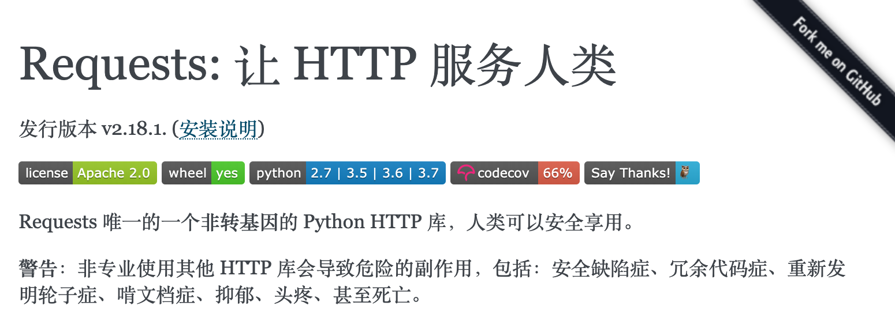

## 好玩的Python

因為下面的代碼都非常簡單，簡單到直接使用Python的交互式環境就能完成。當然，官方Python自帶的交互式環境比較難用，推薦大家使用ipython，可以使用下面的命令來安裝ipython，安裝成功後鍵入ipython命令就能進入交互式環境。

```Shell
pip install ipython
```

或

```Shell
pip3 install ipython
```

ipython最直觀的優點：

1. 可以用?或者??來獲取幫助。
2. 可以用!調用系統命令。
3. 可以使用Tab鍵自動補全。
4. 可以使用魔法指令，如：%timeit。

### 沒有工具用代碼也能P圖

1. 安裝pillow三方庫。

   PIL（Python Imaging Library）是Python平臺事實上的圖像處理標準庫了。PIL功能非常強大，而API卻非常簡單易用。但是PIL僅支持到Python 2.7，而且很多年都沒有人維護了，於是一群志願者在PIL的基礎上創建了兼容的版本，名字叫[Pillow](https://github.com/python-pillow/Pillow)，除了支持Python 3.x還加入了很多有用且有趣的新特性。

   ```Shell
   pip install pillow
   ```

   或

   ```Shell
   pip3 install pillow
   ```

2. 加載圖片。

   ```Python
   from PIL import Image
   
   chiling = Image.open('chiling.jpg')
   chiling.show()
   ```

3. 使用濾鏡。

   ```Shell
   from PIL import ImageFilter
   
   chiling.filter(ImageFilter.EMBOSS).show()
   chiling.filter(ImageFilter.CONTOUR).show()
   ```

4. 圖像剪裁和粘貼。

   ```Python
   rect = 220, 690, 265, 740 
   watch = chiling.crop(rect)
   watch.show()
   blured_watch = watch.filter(ImageFilter.GaussianBlur(4))
   chiling.paste(blured_watch, (220, 690))
   chiling.show()
   ```

5. 生成鏡像。

   ```Python
   chiling2 = chiling.transpose(Image.FLIP_LEFT_RIGHT)
   chiling2.show()
   ```

6. 生成縮略圖。

   ```Python
   width, height = chiling.size
   width, height = int(width * 0.4), int(height * 0.4)
   chiling.thumbnail((width, height))
   ```

7. 合成圖片。

   ```Python
   frame = Image.open('frame.jpg')
   frame.show()
   frame.paste(chiling, (210, 150))
   frame.paste(chiling2, (522, 150))
   frame.show()
   ```

上面的知識在[Python-100-Days](https://github.com/jackfrued/Python-100-Days)項目的[第15天](<https://github.com/jackfrued/Python-100-Days/blob/master/Day01-15/15.%E5%9B%BE%E5%83%8F%E5%92%8C%E5%8A%9E%E5%85%AC%E6%96%87%E6%A1%A3%E5%A4%84%E7%90%86.md>)中也有對應的內容。

### 向微信好友群發祝福視頻

1. 安裝itchat三方庫。

   [itchat](<https://itchat.readthedocs.io/zh/latest/>)是一個開源的微信個人號接口，使用Python調用微信從未如此簡單。

   ```Shell
   pip install itchat
   ```

   或

   ```Shell
   pip3 install itchat
   ```

2. 登錄微信。

   ```Python
   import itchat
   
   itchat.auto_login()
   ```

   > 說明：用自己的微信掃描屏幕上出現的二維碼就完成了登錄操作，登錄之後才能獲取自己的好友信息以及發送消息給自己的好友。

3. 查找自己的朋友。

   ```Python
   friends_list = itchat.get_friends(update=True)
   print(len(friends_list))
   luohao = friends_list[0]
   props = ['NickName', 'Signature', 'Sex']
   for prop in props:
       print(luohao[prop])
   ```

   > 說明：friends_list相當於是一個列表，列表中的第一個元素是自己。

4. 隨機選出5個朋友，獲得他們的用戶名、暱稱、簽名。

   ```Python
   lucky_friends = random.sample(friends_list[1:], 5) 
   props = ['NickName', 'Signature', 'City']
   for friend in lucky_friends:
       for prop in props:
           print(friend[prop] or '沒有此項信息')    
       print('-' * 80)
   ```

5. 給朋友發送文字消息。

   ```Python
   itchat.send_msg('急需一個紅包來拯救墮落的靈魂！！！', toUserName='@8e06606db03f0e28d0ff884083f727e6')
   ```

6. 群發視頻給幸運的朋友們。

   ```Python
   lucky_friends = random.sample(friends_list[1:], 5) 
   for friend in lucky_friends:
       username = friend['UserName']
       itchat.send_video('/Users/Hao/Desktop/my_test_video.mp4', toUserName=username)
   ```

利用itchat還能做很多事情，比如有好友給自己發了消息又撤回了，如果想查看這些被撤回的消息，itchat就可以做到（註冊一個接收消息的鉤子函數，請參考[CSDN上的一篇文章](<https://blog.csdn.net/enweitech/article/details/79585043>)）；再比如，有時候我們想知道某個好友有沒有把我們刪除或者拉入黑名單，也可以利用itchat封裝的群聊功能，非好友和黑名單用戶不會被拉入群聊，通過創建群聊函數的返回值就可以判定你和指定的人之間的關係。

### 不用客戶端查看熱點新聞

1. 安裝requests庫。（點擊常看[官方文檔](<https://2.python-requests.org/zh_CN/latest/>)）

   

   ```Shell
   pip install requests
   ```

   或

   ```Shell
   pip3 install requests
   ```

2. 爬取新聞數據或者通過API接口獲取新聞數據。

   ```Python
   import requests
   
   resp = requests.get('http://api.tianapi.com/allnews/?key=請使用自己申請的Key&col=7&num=50')
   ```

   > 說明：上面使用了天行數據提供的數據接口，需要的話可以自行去[天行數據](<https://www.tianapi.com/>)的網站註冊開通，調用接口的時候要填寫註冊成功後系統分配給你的key。

3. 使用反序列化將JSON字符串解析為字典並獲取新聞列表。

   ```Python
   import json
   
   newslist = json.loads(resp.text)['newslist']
   ```

4. 對新聞列表進行循環遍歷，找到感興趣的新聞，例如：華為。

   ```Python
   for news in newslist:
       title = news['title']
       url = news['url']
       if '華為' in title:
           print(title)
           print(url)
   ```

5. 調用短信網關發送短信到手機上，告知關注的新聞標題並給出鏈接。

   ```Python
   import re
   
   pattern = re.compile(r'https*:\/\/[^\/]*\/(?P<url>.*)') 
   matcher = pattern.match(url)
   
   if matcher:
       url = matcher.group('url')
       resp = requests.post(
           url='http://sms-api.luosimao.com/v1/send.json',
           auth=('api', 'key-請使用你自己申請的Key'),
           data={
               'mobile': '13548041193',
               'message': f'發現一條您可能感興趣的新聞 - {title}，詳情點擊https://news.china.com/{url} 查看。【Python小課】'
           },
           timeout=10,
           verify=False
       )
   ```

   > 說明：上面的代碼使用了[螺絲帽](<https://luosimao.com/>)提供的短信網關服務，利用短信網關發送短信是需要支付費用的，但是一般的平臺都會提供若干條免費的測試短信。發送短信必須遵守平臺的規則，違規的短信是無法發送的。上面發短信時使用的短信模板（“發現一條您可能感興趣的新聞 - ###，詳情點擊https://news.china.com/### 查看。”）和短信簽名（“【Python小課】”）需要登錄螺絲帽管理平臺進行配置，如果不清楚如何配置，可以聯繫平臺的客服人員進行諮詢。

