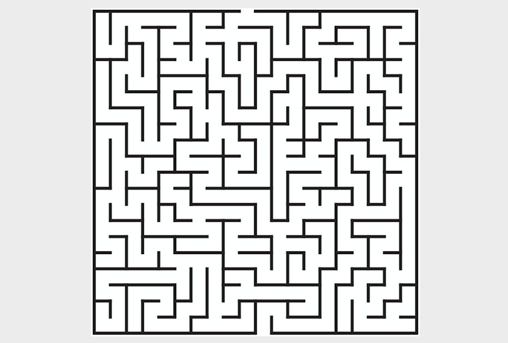
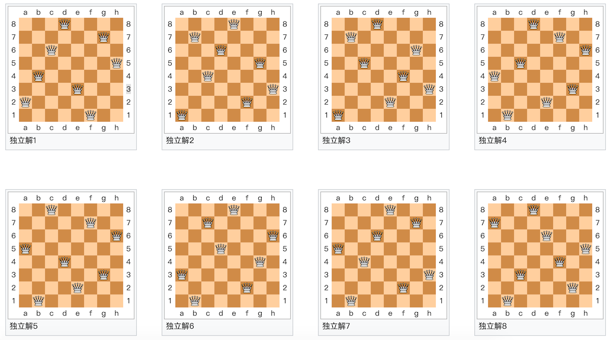

## 算法入門系列2 - 在水一方

在第一次的公開課中，我們講到了窮舉法。窮舉法也被稱為暴力搜索法，今天我們要講的回溯法就是暴力搜索法的一種。接下來我們講到的很多算法跟“遞歸”這個概念有或多或少的關係，所以我們先說說“遞歸”。

### 現實中的遞歸

從前有座山，山裡有座廟，廟裡有個老和尚，正在給小和尚講故事呢！故事是什麼呢？從前有座山，山裡有座廟，廟裡有個老和尚，正在給小和尚講故事呢！故事是什麼呢？從前有座山，山裡有座廟，廟裡有個老和尚，正在給小和尚講故事呢！故事是什麼呢？……

野比大雄在房間裡，用時光電視看著未來的情況。電視畫面中，野比大雄在房間裡，用時光電視看著未來的情況。電視畫面中，野比大雄在房間裡，用時光電視看著未來的情況……

階乘的遞歸定義：$$0! = 1$$，$$n!=n*(n-1)!$$ ，使用被定義對象的自身來為其下定義稱為遞歸定義。

[德羅斯特效應](https://zh.wikipedia.org/wiki/%E5%BE%B7%E7%BD%97%E6%96%AF%E7%89%B9%E6%95%88%E5%BA%94)是遞歸的一種視覺形式。圖中女性手持的物體中有一幅她本人手持同一物體的小圖片，進而小圖片中還有更小的一幅她手持同一物體的圖片……


### 遞歸的應用

在程序中，一個函數如果直接或者間接的調用了自身，我們就稱之為遞歸函數。

寫遞歸函數有兩個要點：

1. 收斂條件 - 什麼時候結束遞歸。
2. 遞歸公式 - 每一項與前一項（前*N*項）的關係。

例子1：求階乘。

```Python
def fac(num):
    if num == 0:
        return 1
    return num * fac(num - 1)
```

Python對遞歸的深度加以了限制（默認1000層函數調用），如果想突破這個限制，可以使用下面的方法。

```Python
import sys

sys.setrecursionlimit(10000)
```

例子2：爬樓梯 - 樓梯有*n*個臺階，一步可以走1階、2階或3階，走完*n*個臺階共有多少種不同的走法。

```Python
def climb(num):
    if num == 0:
        return 1
    elif num < 0:
        return 0
    return climb(num - 1) + climb(num - 2) + climb(num - 3)
```

**注意**：上面的遞歸函數性能會非常的差，因為時間複雜度是幾何級數級的。

優化後的代碼。

```Python
from functools import lru_cache


@lru_cache()
def climb(num):
    if num == 0:
        return 1
    elif num < 0:
        return 0
    return climb(num - 1) + climb(num - 2) + climb(num - 3)
```

不使用的遞歸的代碼。

```Python
def climb(num):
    a, b, c = 1, 2, 4
    for _ in range(num - 1):
        a, b, c = b, c, a + b + c
    return a
```

**重點**：有更好的辦法的時候，請不要考慮遞歸。

### 回溯法

**回溯法**是[暴力搜索法](https://zh.wikipedia.org/wiki/%E6%9A%B4%E5%8A%9B%E6%90%9C%E5%B0%8B%E6%B3%95)中的一種。對於某些計算問題而言，回溯法是一種可以找出所有（或一部分）解的一般性算法，尤其適用於約束滿足問題（在解決約束滿足問題時，我們逐步構造更多的候選解，並且在確定某一部分候選解不可能補全成正確解之後放棄繼續搜索這個部分候選解本身及其可以拓展出的子候選解，轉而測試其他的部分候選解）。

### 經典案例

例子1：**迷宮尋路**。



```Python
"""
迷宮尋路
"""
import random
import sys

WALL = -1
ROAD = 0

ROWS = 10
COLS = 10


def find_way(maze, i=0, j=0, step=1):
    """走迷宮"""
    if 0 <= i < ROWS and 0 <= j < COLS and maze[i][j] == 0:
        maze[i][j] = step
        if i == ROWS - 1 and j == COLS - 1:
            print('=' * 20)
            display(maze)
            sys.exit(0)
        find_way(maze, i + 1, j, step + 1)
        find_way(maze, i, j + 1, step + 1)
        find_way(maze, i - 1, j, step + 1)
        find_way(maze, i, j - 1, step + 1)
        maze[i][j] = ROAD


def reset(maze):
    """重置迷宮"""
    for i in range(ROWS):
        for j in range(COLS):
            num = random.randint(1, 10)
            maze[i][j] = WALL if num > 7 else ROAD
    maze[0][0] = maze[ROWS - 1][COLS - 1] = ROAD


def display(maze):
    """顯示迷宮"""
    for row in maze:
        for col in row:
            if col == -1:
                print('■', end=' ')
            elif col == 0:
                print('□', end=' ')
            else:
                print(f'{col}'.ljust(2), end='')
        print()


def main():
    """主函數"""
    maze = [[0] * COLS for _ in range(ROWS)]
    reset(maze)
    display(maze)
    find_way(maze)
    print('沒有出路!!!')


if __name__ == '__main__':
    main()
```

**說明：**上面的代碼用隨機放置圍牆的方式來生成迷宮，更好的生成迷宮的方式請參考[《簡單的使用回溯法生成 Tile Based 迷宮》](<https://indienova.com/indie-game-development/generate-tile-based-maze-with-backtracking/>)一文。

例子2：**騎士巡邏** - 國際象棋中的騎士（馬），按照騎士的移動規則走遍整個棋盤的每一個方格，而且每個方格只能夠經過一次。


```Python
"""
騎士巡邏
"""
import sys

SIZE = 8


def display(board):
    """顯示棋盤"""
    for row in board:
        for col in row:
            print(f'{col}'.rjust(2, '0'), end=' ')
        print()


def patrol(board, i=0, j=0, step=1):
    """巡邏"""
    if 0 <= i < SIZE and 0 <= j < SIZE and board[i][j] == 0:
        board[i][j] = step
        if step == SIZE * SIZE:
            display(board)
            sys.exit(0)
        patrol(board, i + 1, j + 2, step + 1)
        patrol(board, i + 2, j + 1, step + 1)
        patrol(board, i + 2, j - 1, step + 1)
        patrol(board, i + 1, j - 2, step + 1)
        patrol(board, i - 1, j - 2, step + 1)
        patrol(board, i - 2, j - 1, step + 1)
        patrol(board, i - 2, j + 1, step + 1)
        patrol(board, i - 1, j + 2, step + 1)
        board[i][j] = 0


def main():
    """主函數"""
    board = [[0] * SIZE for _ in range(SIZE)]
    patrol(board)


if __name__ == '__main__':
    main()
```

例子3：**八皇后** - 如何能夠在8×8的國際象棋棋盤上放置八個皇后，使得任何一個皇后都無法直接吃掉其他的皇后？為了達到此目的，任兩個皇后都不能處於同一條橫行、縱行或斜線上。



**說明**：這個問題太經典了，網上有大把的答案，留給大家自己搞定。