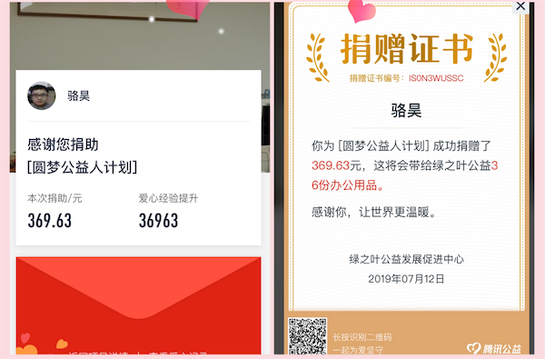

## 更新日誌

### 2019年8月8日

1. 最近公司給安排了很多任務，所以好久都沒有更新這個項目，今天終於把一直計劃更新的《關係型數據庫MySQL》更新完了。
2. 那天微信收款提示我已經連續有48收到了打賞，非常感謝大家持續的支持。
3. 最近一直在計劃為這個項目錄制一個配套的視頻，當然這個工作量的巨大是可想而知的，但是我還是決定要在年底之前開始做這件事情，這樣才能不辜負那麼多希望通過這個項目學習和了解Python的人。

### 2019年7月11日

1. 今天終於結束了出差的日子，回來先把最近收到的打賞全部捐贈給了綠之葉，總共捐出了111筆打賞。

   

### 2019年7月9日

1. 最近出差，項目一直處於停更狀態。交流群的很多初學者反饋從第8天開始內容就有一定難度，最近本來也打算把語言基礎部分和爬蟲的部門重新整理一次，這次爭取將文字和案例做得更加通俗易懂，而且更具實用性，這個事情從今天已然開始了，最終的目標是要將這部分的內容整理成一本書，希望大家到時候能夠一如既往的支持。
2. 最近1周多的時間一共收到60筆以上的打賞，最多的一天收到了14筆打賞，還是要再次謝謝大家為知識付費的行為，當然加交流群是不用付費的，您支付的費用會用於支持山區兒童教育。
3. 今天重新翻譯了*Zen of Python*，這次的版本我自己都比較喜歡，所以也分享給大家。

### 2019年6月30日

1. 最近2天一共收到11筆打賞。
2. 終於將第48天《前後端分離開發》一文更新完，但是自己都感覺有點湊數的嫌疑，文字描述沒怎麼花心思去寫，大家可以參考項目的代碼來了解前後端分離開發。項目中使用了Vue.js，但是沒有使用腳手架工具，也沒有配置前端路由，僅僅使用了Vue.js來渲染頁面，畢竟我自己也不是專業的前端。

### 2019年6月27日

1. 最近3天一共收到35筆打賞，感謝大家持續關注。
2. 近期事情較多，更新速度可能會放緩，請大家諒解。
3. 今晚公開課相關的資料已經更新到公開課目錄中。

### 2019年6月23日

1. 最近幾天一共收到25筆打賞，感謝大家的支持。
2. 更新了QQ交流群，重新創建了一個2000人群。

### 2019年6月18日

1. 在朋友的建議下，給首頁加了一個打賞的二維碼，看看有多少願意為知識付費。今天一共收到了7位小夥伴的打賞，在此表示感謝。打賞獲得的收入將全部捐贈給**綠之葉公益**（[點擊瞭解](<https://baike.baidu.com/item/%E7%BB%BF%E4%B9%8B%E5%8F%B6%E5%85%AC%E7%9B%8A>)）。之前每年都會試著為這個公益組織做一些自己能做的事情，這次當然也不能例外。
2. Django部分（第41天到第55天）更新到第47天，最新上線的部分包括報表、日誌、ORM查詢優化以及中間件相關的內容，並將投票應用的完成代碼同步到github。

