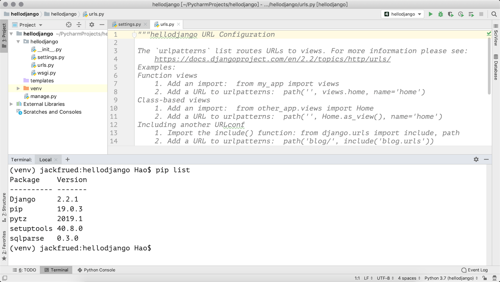
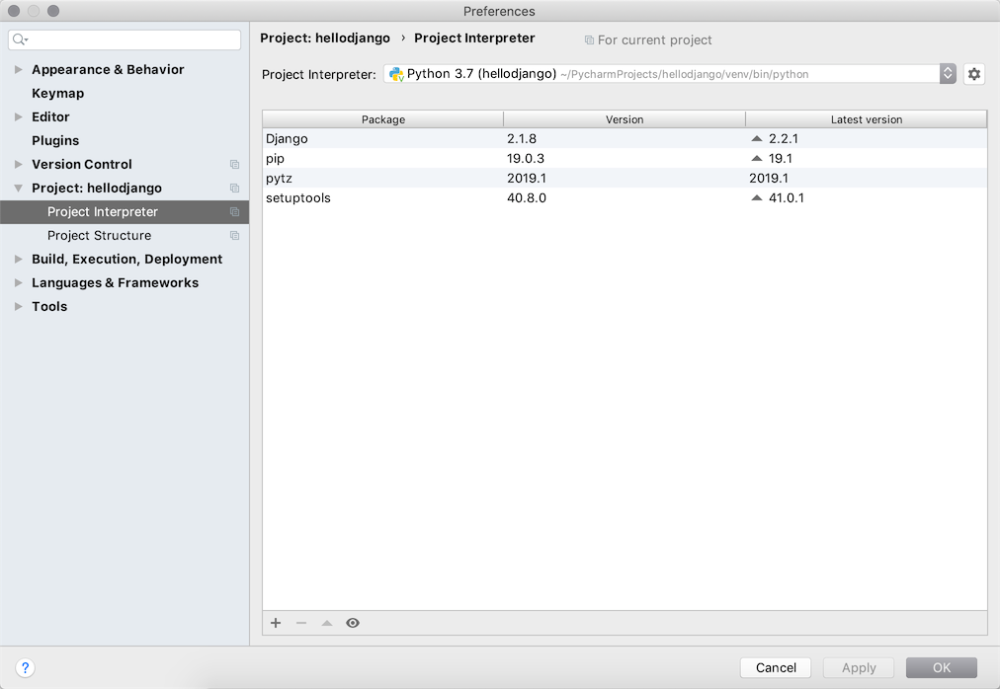
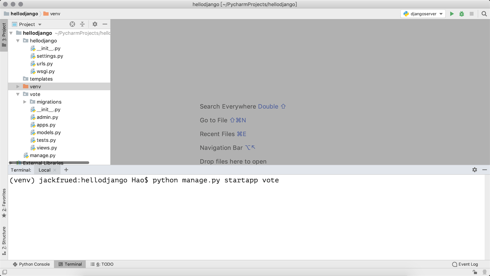

## 玩轉PyCharm

PyCharm是由JetBrains公司開發的提供給Python專業的開發者的一個集成開發環境，它最大的優點是能夠大大提升Python開發者的工作效率，為開發者集成了很多用起來非常順手的功能，包括代碼調試、高亮語法、代碼跳轉、智能提示、自動補全、單元測試、版本控制等等。此外，PyCharm還提供了對一些高級功能的支持，包括支持基於Django框架的Web開發。

### PyCharm的安裝

可以在[JetBrains公司的官方網站]()找到PyCharm的[下載鏈接](https://www.jetbrains.com/pycharm/download/)，有兩個可供下載的版本一個是社區版一個是專業版，社區版在[Apache許可證](https://zh.wikipedia.org/wiki/Apache%E8%AE%B8%E5%8F%AF%E8%AF%81)下發布，專業版在專用許可證下發布（需要購買授權下載後可試用30天），其擁有許多額外功能。安裝PyCharm需要有JRE（Java運行時環境）的支持，如果沒有可以在安裝過程中選擇在線下載安裝。

> 說明：如果你是一名學生，希望購買PyCharm來使用，可以看看[教育優惠官方申請指南](https://sales.jetbrains.com/hc/zh-cn/articles/207154369)。

### 首次使用的設置

第一次使用PyCharm時，會有一個導入設置的嚮導，如果之前沒有使用PyCharm或者沒有保存過設置的就直接選擇“Do not import settings”進入下一步即可。

專業版的PyCharm是需要激活的，**強烈建議為優秀的軟件支付費用**，如果不用做商業用途，我們可以暫時選擇試用30天或者使用社區版的PyCharm。

 接下來是選擇UI主題，這個可以根據個人喜好進行選擇。

 再接下來是創建可以在終端（命令行）中使用PyCharm項目的啟動腳本，當然也可以直接跳過這一步。

然後可以選擇需要安裝哪些插件，我們可以暫時什麼都不安裝等需要的時候再來決定。

### 用PyCharm創建項目

點擊上圖中的“Start using PyCharm”按鈕就可以開始使用PyCharm啦，首先來到的是一個歡迎頁，在歡迎頁上我們可以選擇“創建新項目”、“打開已有項目”和“從版本控制系統中檢出項目”。

如果選擇了“Create New Project”來創建新項目就會打一個創建項目的嚮導頁。

在如上圖所示的界面中，我們可以選擇創建項目的模板，包括了純Python項目、基於各種不同框架的Web項目、Web前端項目、跨平臺項目等各種不同的項目模板。如果選擇Python的項目，那麼有一個非常重要的設定是選擇“New environment…”（創建新的虛擬環境）還是使用“Existing Interpreter”（已經存在的解釋器）。前者肯定是更好的選擇，因為新的虛擬環境不會對系統環境變量中配置的Python環境造成影響，簡單舉個例子就是你在虛擬環境下安裝或者更新了任何三方庫，它並不會對系統原有的Python解釋器造成任何的影響，但代價是需要額外的存儲空間來建立這個虛擬環境。

項目創建完成後就可以開始新建各種文件來書寫Python代碼了。

在工作窗口的右鍵菜單中可以找到“Run ...”和“Debug ...”菜單項，通過這兩個菜單項我們就可以運行和調試我們的代碼啦。建議關注一下菜單欄中的“Code”、“Refactor”和“Tools”菜單，這裡面為編寫Python代碼提供了很多有用的幫助。

### 創建Django項目

#### 專業版

PyCharm專業版提供了對Django、Flask、Google App Engine、web2py等Python Web框架以及SQL、UML、前端語言和框架、遠程調試、虛擬化部署等功能的支持，如果使用PyCharm專業版，在創建項目時可以直接選擇創建Django項目並設置模板語言以及放置模板頁的文件夾。

創建好項目之後，打開終端輸入`pip list`命令，可以看到項目所需的依賴項已經安裝好了，而且可以直接點擊屏幕右上方的運行或調試按鈕來直接運行Django項目。

#### 社區版

PyCharm社區版只能創建Python項目，如果項目中需要Django的支持，可以自行安裝依賴庫並創建Django項目。

創建好Python項目之後，可以打開屏幕下方的終端（Terminal），並通過`pip install`安裝Django項目的依賴項，可以通過`-i https://pypi.doubanio.com/simple`來指定下載依賴庫的鏡像倉庫。

當然也可以在項目的設置菜單中找到解釋器配置，並選擇要添加的依賴項。

下面是搜索依賴項的界面，可以通過點擊“Install Package”按鈕來安裝指定的依賴項；也可以通過點擊“Manage Repositories”按鈕來指定下載依賴項的倉庫，國內用戶推薦使用豆瓣鏡像<http://pypi.doubanio.com/simple>。

接下來可以在終端中輸入`django-amdin startproject`指令來創建項目。

如果要運行項目，可以在終端中輸入`python manage.py runserver`啟動測試服務器。當然，也可以點擊屏幕右上方的“Add Configuration”按鈕，進入如下所示的配置界面，並點擊窗口左上角的“+”來添加一個運行配置。

在配置窗口的右側，指定要執行的腳本路徑（Django項目的manage.py文件的位置）和運行參數（runserver），運行參數的後面還可以跟IP地址和端口。

注意到窗口的右上角了嗎？現在可以點擊運行或調試按鈕來啟動測試服務器運行項目了。

