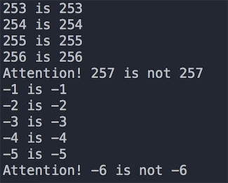
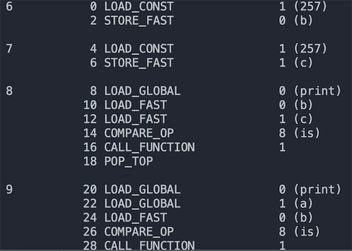
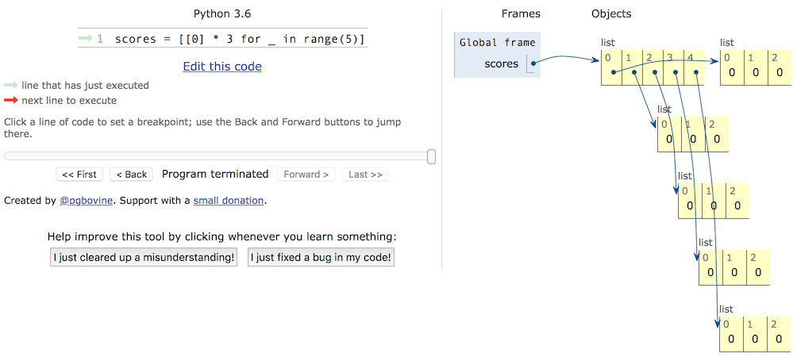

## 那些年我們踩過的那些坑

### 坑1 - 整數比較的坑

在 Python 中一切都是對象，整數也是對象，在比較兩個整數時有兩個運算符`==`和`is`，它們的區別是：

- `is`比較的是兩個整數對象的id值是否相等，也就是比較兩個引用是否代表了內存中同一個地址。
- `==`比較的是兩個整數對象的內容是否相等，使用`==`時其實是調用了對象的`__eq__()`方法。

知道了`is`和`==`的區別之後，我們可以來看看下面的代碼，瞭解Python中整數比較有哪些坑：

```Python
def main():
	x = y = -1
	while True:
		x += 1
		y += 1
		if x is y:
			print('%d is %d' % (x, y))
		else:
			print('Attention! %d is not %d' % (x, y))
			break
			
	x = y = 0
	while True:
		x -= 1
		y -= 1
		if x is y:
			print('%d is %d' % (x, y))
		else:
			print('Attention! %d is not %d' % (x, y))
			break


if __name__ == '__main__':
	main()
```

上面代碼的部分運行結果如下圖所示，出現這個結果的原因是Python出於對性能的考慮所做的一項優化。對於整數對象，Python把一些頻繁使用的整數對象緩存起來，保存到一個叫`small_ints`的鏈表中，在Python的整個生命週期內，任何需要引用這些整數對象的地方，都不再重新創建新的對象，而是直接引用緩存中的對象。Python把頻繁使用的整數對象的值定在[-5, 256]這個區間，如果需要這個範圍的整數，就直接從`small_ints`中獲取引用而不是臨時創建新的對象。因為大於256或小於-5的整數不在該範圍之內，所以就算兩個整數的值是一樣，但它們是不同的對象。



當然僅僅如此這個坑就不值一提了，如果你理解了上面的規則，我們就再看看下面的代碼。

```Python
a = 257


def main():
	b = 257  # 第6行
	c = 257  # 第7行
	print(b is c)  # True
	print(a is b)  # False
	print(a is c)  # False


if __name__ == "__main__":
	main()
```

程序的執行結果已經用註釋寫在代碼上了。夠坑吧！看上去`a`、`b`和`c`的值都是一樣的，但是`is`運算的結果卻不一樣。為什麼會出現這樣的結果，首先我們來說說Python程序中的代碼塊。所謂代碼塊是程序的一個最小的基本執行單位，一個模塊文件、一個函數體、一個類、交互式命令中的單行代碼都叫做一個代碼塊。上面的代碼由兩個代碼塊構成，`a = 257`是一個代碼塊，`main`函數是另外一個代碼塊。Python內部為了進一步提高性能，凡是在一個代碼塊中創建的整數對象，如果值不在`small_ints`緩存範圍之內，但在同一個代碼塊中已經存在一個值與其相同的整數對象了，那麼就直接引用該對象，否則創建一個新的對象出來，這條規則對不在`small_ints`範圍的負數並不適用，對負數值浮點數也不適用，但對非負浮點數和字符串都是適用的，這一點讀者可以自行證明。所以 `b is c`返回了`True`，而`a`和`b`不在同一個代碼塊中，雖然值都是257，但卻是兩個不同的對象，`is`運算的結果自然是`False`了。
為了驗證剛剛的結論，我們可以借用`dis`模塊（聽名字就知道是進行反彙編的模塊）從字節碼的角度來看看這段代碼。如果不理解什麼是字節碼，可以先看看[《談談 Python 程序的運行原理》]((http://www.cnblogs.com/restran/p/4903056.html))這篇文章。可以先用`import dis`導入`dis`模塊並按照如下所示的方式修改代碼。

```Python
import dis

dis.dis(main)
```

代碼的執行結果如下圖所示。可以看出代碼第6行和第7行，也就是`main`函數中的257是從同一個位置加載的，因此是同一個對象；而代碼第9行的`a`明顯是從不同的地方加載的，因此引用的是不同的對象。



如果還想對這個問題進行進一步深挖，推薦大家閱讀[《Python整數對象實現原理》](https://foofish.net/python_int_implement.html)這篇文章。

### 坑2 - 嵌套列表的坑

Python中有一種內置的數據類型叫列表，它是一種容器，可以用來承載其他的對象（準確的說是其他對象的引用），列表中的對象可以稱為列表的元素，很明顯我們可以把列表作為列表中的元素，這就是所謂的嵌套列表。嵌套列表可以模擬出現實中的表格、矩陣、2D遊戲的地圖（如植物大戰殭屍的花園）、棋盤（如國際象棋、黑白棋）等。但是在使用嵌套的列表時要小心，否則很可能遭遇非常尷尬的情況，下面是一個小例子。

```Python
names = ['關羽', '張飛', '趙雲', '馬超', '黃忠']
subjs = ['語文', '數學', '英語']
scores = [[0] * 3] * 5
for row, name in enumerate(names):
    print('請輸入%s的成績' % name)
    for col, subj in enumerate(subjs):
        scores[row][col] = float(input(subj + ': '))
        print(scores)
```

我們希望錄入5個學生3門課程的成績，於是定義了一個有5個元素的列表，而列表中的每個元素又是一個由3個元素構成的列表，這樣一個列表的列表剛好跟一個表格是一致的，相當於有5行3列，接下來我們通過嵌套的for-in循環輸入每個學生3門課程的成績。程序執行完成後我們發現，每個學生3門課程的成績是一模一樣的，而且就是最後錄入的那個學生的成績。

要想把這個坑填平，我們首先要區分對象和對象的引用這兩個概念，而要區分這兩個概念，還得先說說內存中的棧和堆。我們經常會聽人說起“堆棧”這個詞，但實際上“堆”和“棧”是兩個不同的概念。眾所周知，一個程序運行時需要佔用一些內存空間來存儲數據和代碼，那麼這些內存從邏輯上又可以做進一步的劃分。對底層語言（如C語言）有所瞭解的程序員大都知道，程序中可以使用的內存從邏輯上可以為五個部分，按照地址從高到低依次是：棧（stack）、堆（heap）、數據段（data segment）、只讀數據段（static area）和代碼段（code segment）。其中，棧用來存儲局部、臨時變量，以及函數調用時保存現場和恢復現場需要用到的數據，這部分內存在代碼塊開始執行時自動分配，代碼塊執行結束時自動釋放，通常由編譯器自動管理；堆的大小不固定，可以動態的分配和回收，因此如果程序中有大量的數據需要處理，這些數據通常都放在堆上，如果堆空間沒有正確的被釋放會引發內存洩露的問題，而像Python、Java等編程語言都使用了垃圾回收機制來實現自動化的內存管理（自動回收不再使用的堆空間）。所以下面的代碼中，變量`a`並不是真正的對象，它是對象的引用，相當於記錄了對象在堆空間的地址，通過這個地址我們可以訪問到對應的對象；同理，變量`b`是列表容器的引用，它引用了堆空間上的列表容器，而列表容器中並沒有保存真正的對象，它保存的也僅僅是對象的引用。

 ```Python
a = object()
b = ['apple', 'pitaya', 'grape']
 ```

知道了這一點，我們可以回過頭看看剛才的程序，我們對列表進行`[[0] * 3] * 5`操作時，僅僅是將`[0, 0, 0]`這個列表的地址進行了複製，並沒有創建新的列表對象，所以容器中雖然有5個元素，但是這5個元素引用了同一個列表對象，這一點可以通過`id`函數檢查`scores[0]`和`scores[1]`的地址得到證實。所以正確的代碼應該按照如下的方式進行修改。

```Python
names = ['關羽', '張飛', '趙雲', '馬超', '黃忠']
subjs = ['語文', '數學', '英語']
scores = [[]] * 5
for row, name in enumerate(names):
    print('請輸入%s的成績' % name)
    scores[row] = [0] * 3
    for col, subj in enumerate(subjs):
        scores[row][col] = float(input(subj + ': '))
        print(scores)
```

或者

```Python
names = ['關羽', '張飛', '趙雲', '馬超', '黃忠']
subjs = ['語文', '數學', '英語']
scores = [[0] * 3 for _ in range(5)]
for row, name in enumerate(names):
    print('請輸入%s的成績' % name)
    scores[row] = [0] * 3
    for col, subj in enumerate(subjs):
        scores[row][col] = float(input(subj + ': '))
        print(scores)
```

如果對內存的使用不是很理解，可以看看[PythonTutor網站](http://www.pythontutor.com/)上提供的代碼可視化執行功能，通過可視化執行，我們可以看到內存是如何分配的，從而避免在使用嵌套列表或者複製對象時可能遇到的坑。




### 坑3 - 訪問修飾符的坑

用Python做過面向對象編程的人都知道，Python的類提供了兩種訪問控制權限，一種是公開，一種是私有（在屬性或方法前加上雙下劃線）。而用慣了Java或C#這類編程語言的人都知道，類中的屬性（數據抽象）通常都是私有的，其目的是為了將數據保護起來；而類中的方法（行為抽象）通常都是公開的，因為方法是對象向外界提供的服務。但是Python並沒有從語法層面確保私有成員的私密性，因為它只是對類中所謂的私有成員進行了命名的變換，如果知道命名的規則照樣可以直接訪問私有成員，請看下面的代碼。

```Python
class Student(object):

    def __init__(self, name, age):
        self.__name = name
        self.__age = age

    def __str__(self):
        return self.__name + ': ' + str(self.__age)


stu = Student('駱昊', 38)
print(stu._Student__name)
print(stu._Student__age)
```

Python為什麼要做出這樣的設定呢？用一句廣為流傳的格言來解釋這個問題：“We are all consenting adults here”（我們都是成年人）。這句話表達了很多Python程序員的一個共同觀點，那就是開放比封閉要好，我們應該自己對自己的行為負責而不是從語言層面來限制對數據或方法的訪問。

所以在Python中我們實在沒有必要將類中的屬性或方法用雙下劃線開頭的命名處理成私有的成員，因為這並沒有任何實際的意義。如果想對屬性或方法進行保護，我們建議用單下劃線開頭的受保護成員，雖然它也不能真正保護這些屬性或方法，但是它相當於給調用者一個暗示，讓調用者知道這是不應該直接訪問的屬性或方法，而且這樣做並不影響子類去繼承這些東西。

需要提醒大家注意的是，Python類中的那些魔法方法，如`__str__`、`__repr__`等，這些方法並不是私有成員哦，雖然它們以雙下劃線開頭，但是他們也是以雙下劃線結尾的，這種命名並不是私有成員的命名，這一點對初學者來說真的很坑。

