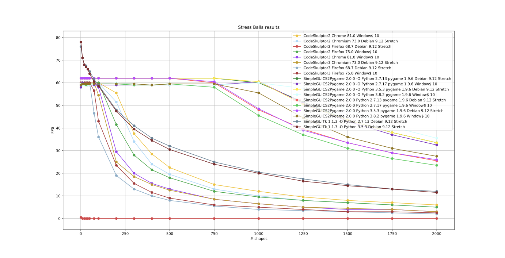

Compatibility
=============

Compatibility between SimpleGUI of CodeSkulptor and SimpleGUICS2Pygame
----------------------------------------------------------------------
* With SimpleGUI of CodeSkulptor2_ or CodeSkulptor3_,
  some things (like fonts, buttons…) are browser dependents.
  That is to say that there are some differences from one browser to another.
  Therefore it is normal that these elements are also slightly different with SimpleGUICS2Pygame.

* With SimpleGUI of CodeSkulptor2_ or CodeSkulptor3_,
  supported sound formats (WAV, OGG, MP3)
  are also browser dependents.

  With SimpleGUICS2Pygame WAV, OGG and MP3 (since version 2.0.0) are supported.

  I recommend to always use the OGG format.

* .. warning::
    With SimpleGUICS2Pygame,
    ``Frame.start()`` is blocking
    until ``Frame.stop()`` execution or closing window.
    So timers must be started *before*, and states must be initialized *before*.
    (Or maybe after by a handler function.)

* .. warning::
    With SimpleGUICS2Pygame,
    if your program is terminated,
    then windows opened by
    ``plot_bars()``, ``plot_lines()`` and ``plot_scatter()``
    will be closed automatically.
    You can use the specific function ``_block()``
    to block the program until closing all windows.

* See Tips_ to run specific code.

.. _Tips: Tips.html

Problems with SimpleGUICS2Pygame
~~~~~~~~~~~~~~~~~~~~~~~~~~~~~~~~
If MP3 sound failed on your system read `installation of audioread`_.

.. _`installation of audioread`: index.html#package-audioread-required

Compatibility between Python 2 and Python 3
-------------------------------------------

CodeSkulptor2_ implements a subset of Python 2.

CodeSkulptor3_ implements a subset of Python 3.

You can use SimpleGUICS2Pygame with Python 2 and Python 3.

* The division ``/`` don't have the same behavior in Python 2 and Python 3:
  https://docs.python.org/3/whatsnew/3.0.html#integers .

  * In Python 2 (and CodeSkulptor): ``3/2 == 1`` and ``3/2.0 == 1.5``
  * In Python 3: ``3/2 == 3/2.0 == 1.5``

  ``3//2 == 1`` and ``3//2.0 == 1.0`` **everywehre**.

  (You can add
  ``from __future__ import division``
  *on the top* of your program, and Python 2 mimic Python 3 division.
  But then *CodeSkulptor failed*!)

* Rounded behavior is also different:
  https://docs.python.org/3/whatsnew/3.0.html#builtins .

  * In Python 2 (and CodeSkulptor): ``round(1.5) == 2.0`` and ``round(2.5) == 3.0``
  * In Python 3: ``round(1.5) == round(2.5) == 2``

* ``print`` is a function in Python 3:
  https://docs.python.org/3/whatsnew/3.0.html#print-is-a-function .

  * In Python 2 (and CodeSkulptor): ``print 'Hello real world!', 42``
  * In Python 3: ``print('Hello real world!', 42)``

  With only one argument, ``print('Hello real world! ' + str(42))`` run **everywhere**.

  (You can add
  ``from __future__ import print_function``
  *on the top* of your program, and Python 2 mimic Python 3 print function.
  But then *CodeSkulptor failed*!)

.. _CodeSkulptor2: https://py2.codeskulptor.org/
.. _CodeSkulptor3: https://py3.codeskulptor.org/

Compatibility between CodeSkulptor and CodeSkulptor3
----------------------------------------------------

CodeSkulptor2_ implements a subset of Python 2.

CodeSkulptor3_ implements a subset of Python 3.

There are moreover some other differences.

* In ``simplegui module`` module of CodeSkulptor3 and SimpleGUICS2Pygame,
  there is a ``Canvas.draw_arc()`` method
  that doesn't exist in CodeSkulptor2.

* In ``simplegui module`` module of CodeSkulptor3 and SimpleGUICS2Pygame,
  there is a ``Frame.download_canvas_image()`` method
  that doesn't exist in CodeSkulptor2.

* In ``numeric`` module of CodeSkulptor2 and SimpleGUICS2Pygame,
  there is a ``Matric.scale()`` method
  to multiply the matrix by a scalar
  and the operator ``*`` multiply two matrices.

  In CodeSkulptor3,
  the ``Matric.scale()`` method doesn't exist,
  the operator ``*`` multiply a matrix by a scalar
  and the operator ``@`` multiply two matrices.

Problem with CodeSkulptor
~~~~~~~~~~~~~~~~~~~~~~~~~
If you have no sound with CodeSkulptor on Chrome/Chromium and GNU/Linux,
maybe you can fix that problem with ``pavucontrol``.
For example on Debian, install it and set the volume for the application:

.. code-block:: sh

   $ sudo apt install pavucontrol
   $ pavucontrol

Comparison of speeds
--------------------
Due to the execution in browser
CodeSkulptor is slower than directly execute Python on your computer.
Below a graph of speeds of the execution of the test program `example/Stress_Balls/Stress_Balls.py`_
in several environments (all on Intel Xeon W3530 Quad-Core 2.8 GHz 6 Gio),
where the canvas is *normally* displayed 60 times by second
(SimpleGUITk seems not very precise).
When there is a lot of shapes to draw the execution
can no longer finished all drawing during the given time.

``-O`` indicates that assertions was disabled during the test.
See `Python assertions option`_ section.

You can also execute this online program to plot results:
`example/Stress_Balls/Stress_Balls_results.py`_.

|Stress Balls results|

.. _`example/Stress_Balls/Stress_Balls.py`: https://py3.codeskulptor.org/#user305_tmjR8lBkaJjmXy7.py
.. _`example/Stress_Balls/Stress_Balls_results.py`: https://py3.codeskulptor.org/#user306_mGg4qTqILzZ4ZoZ.py
.. _`Python assertions option`: Tips.html#python-assertions-option

