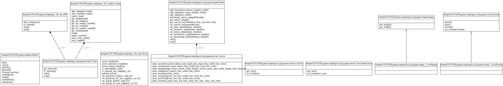

Developers
==========
This is a **free software**, so you can download it, **modify it** and **submit your modifications**.
You can also **redistribute** your own version (keeping the `GPL license`_).

Complete **sources** on Bitbucket: https://bitbucket.org/OPiMedia/simpleguics2pygame

.. _`GPL license`: License.html

Naming convention
-----------------
Usually in Python, prepending a name by underscore ``_`` is a convention_ for non-public items.
Here intention is to separate additional variables and functions in SimpleGUICS2Pygame
to the standard API of CodeSkulptor.
One goal of SimpleGUICS2Pygame is to mimic as much as possible the behavior of CodeSkulptor.
Additional functionalities are isolated with **prepending underscore** ``_``.

.. _convention: https://www.python.org/dev/peps/pep-0008/#method-names-and-instance-variables

Hierarchy of files on Bitbucket
-------------------------------
* `SimpleGUICS2Pygame/`__: **source** code

  * `example/`_: little example programs and games
  * `script/`_

    * `cs2both.py`_: Python program to modify automatically your CodeSkulptor programs to run with SimpleGUICS2Pygame
    * `pygame_check.py`_: Python program to check Pygame installation
    * `SimpleGUICS2Pygame_check.py`_: Python program to **check installation**

  * `simpleguics2pygame/`_: **main module** (splitted in several files) that reimplementing the ``simpleguics2pygame`` module of CodeSkulptor
  * `test/`_: **test files**, mainly to check compatibility with CodeSkulptor
  * `codeskulptor.py`_: module that reimplementing the ``codeskulptor`` module of CodeSkulptor
  * `numeric.py`_: module that reimplementing the ``numeric`` module of CodeSkulptor
  * `simpleplot.py`_: module that reimplementing the ``simpleplot`` module of CodeSkulptor
  * …

* `Sphinx/`_: source **documentation**

  * `_static/links/`_: links of programs, images and sounds
  * …

* `stuffs/`_: unimportant stuff
* `_dist/`_: last and previous versions of installation **archive files**
* `_img/`_: logos

* `Makefile`_: to build documentation, distributions, etc.
* `setup.py`_: Python installation file
* …

.. __: https://bitbucket.org/OPiMedia/simpleguics2pygame/src/master/SimpleGUICS2Pygame/
.. _`example/`: https://bitbucket.org/OPiMedia/simpleguics2pygame/src/master/SimpleGUICS2Pygame/example/
.. _`script/`: https://bitbucket.org/OPiMedia/simpleguics2pygame/src/master/SimpleGUICS2Pygame/script/
.. _`cs2both.py`: https://bitbucket.org/OPiMedia/simpleguics2pygame/src/master/SimpleGUICS2Pygame/script/cs2both.py
.. _`pygame_check.py`: https://bitbucket.org/OPiMedia/simpleguics2pygame/src/master/SimpleGUICS2Pygame/script/pygame_check.py
.. _`SimpleGUICS2Pygame_check.py`: https://bitbucket.org/OPiMedia/simpleguics2pygame/src/master/SimpleGUICS2Pygame/script/SimpleGUICS2Pygame_check.py
.. _`simpleguics2pygame/`: https://bitbucket.org/OPiMedia/simpleguics2pygame/src/master/SimpleGUICS2Pygame/simpleguics2pygame/
.. _`test/`: https://bitbucket.org/OPiMedia/simpleguics2pygame/src/master/SimpleGUICS2Pygame/test/
.. _`codeskulptor.py`: https://bitbucket.org/OPiMedia/simpleguics2pygame/src/master/SimpleGUICS2Pygame/codeskulptor.py
.. _`numeric.py`: https://bitbucket.org/OPiMedia/simpleguics2pygame/src/master/SimpleGUICS2Pygame/numeric.py
.. _`simpleplot.py`: https://bitbucket.org/OPiMedia/simpleguics2pygame/src/master/SimpleGUICS2Pygame/simpleplot.py
.. _`Sphinx/`: https://bitbucket.org/OPiMedia/simpleguics2pygame/src/master/Sphinx/
.. _`_static/links/`: https://bitbucket.org/OPiMedia/simpleguics2pygame/src/master/Sphinx/_static/links/
.. _`stuffs/`: https://bitbucket.org/OPiMedia/simpleguics2pygame/src/master/stuffs/
.. _`_dist/`: https://bitbucket.org/OPiMedia/simpleguics2pygame/src/master/_dist/
.. _`_img/`: https://bitbucket.org/OPiMedia/simpleguics2pygame/src/master/_img/
.. _`Makefile`: https://bitbucket.org/OPiMedia/simpleguics2pygame/src/master/Makefile
.. _`setup.py`: https://bitbucket.org/OPiMedia/simpleguics2pygame/src/master/setup.py

.. warning::
   Before the version 2.0.0, the main module ``simpleguics2pygame`` was one file. Now it is splitted in several files in ``simpleguics2pygame/`` subdirectory.

Diagrams of imports
-------------------
Auto-generated by pydeps_.

.. _pydeps: https://github.com/thebjorn/pydeps

Only files of SimpleGUICS2Pygame.simpleguics2pygame package
~~~~~~~~~~~~~~~~~~~~~~~~~~~~~~~~~~~~~~~~~~~~~~~~~~~~~~~~~~~
|import only|

All files
~~~~~~~~~
|import all|

Class diagrams
--------------
Auto-generated by Pyreverse_.

.. _Pyreverse: https://pypi.org/project/pyreverse/

Only public members
~~~~~~~~~~~~~~~~~~~
|classes|

With private members
~~~~~~~~~~~~~~~~~~~~
|classes all|

